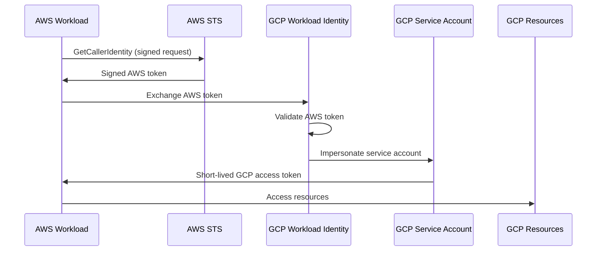

# How to Configure Workload Identity Federation with AWS for Cross-Cloud Authentication in GCP

Author: [nawazdhandala](https://www.github.com/nawazdhandala)

Tags: GCP, Workload Identity Federation, AWS, Cross-Cloud, IAM, Security

Description: Learn how to configure Workload Identity Federation in GCP to allow AWS workloads to authenticate and access GCP resources without managing service account keys.

---

If you run workloads across both AWS and GCP, you have probably dealt with the headache of managing credentials for cross-cloud access. The traditional approach - exporting a GCP service account key and storing it as an AWS secret - is fragile and risky. Keys need rotation, they can leak, and they are long-lived credentials that grant permanent access.

Workload Identity Federation solves this by letting AWS workloads use their existing IAM roles to authenticate directly to GCP. An EC2 instance or Lambda function that already has an AWS IAM role can exchange its AWS credentials for short-lived GCP access tokens. No exported keys anywhere.

## How It Works

The flow leverages AWS STS (Security Token Service) and GCP's Workload Identity Federation:



The key insight is that GCP uses the AWS `GetCallerIdentity` API response as proof of identity. The AWS workload creates a signed request to STS, and GCP validates it against AWS's public endpoints.

## Step 1: Create the Workload Identity Pool

```bash
# Create a pool for AWS identities
gcloud iam workload-identity-pools create "aws-pool" \
    --project="my-gcp-project" \
    --location="global" \
    --display-name="AWS Workloads Pool" \
    --description="Pool for authenticating AWS workloads"
```

## Step 2: Create the AWS Provider

This is where you tell GCP how to validate AWS tokens:

```bash
# Create an AWS-type provider
gcloud iam workload-identity-pools providers create-aws "aws-provider" \
    --project="my-gcp-project" \
    --location="global" \
    --workload-identity-pool="aws-pool" \
    --display-name="AWS Provider" \
    --account-id="123456789012" \
    --attribute-mapping="google.subject=assertion.arn,attribute.aws_role=assertion.arn.extract('assumed-role/{role}/')" \
    --attribute-condition="assertion.arn.startsWith('arn:aws:sts::123456789012:assumed-role/')"
```

Let me explain each parameter:

- `--account-id`: Your AWS account ID. Only tokens from this account will be accepted.
- `--attribute-mapping`: Maps AWS token claims to GCP attributes. The `assertion.arn` contains the full ARN of the AWS identity (e.g., `arn:aws:sts::123456789012:assumed-role/my-role/session-name`).
- `--attribute-condition`: A security filter. Here we restrict to assumed roles only from the specific AWS account.

## Step 3: Create a GCP Service Account

```bash
# Create the service account that AWS workloads will impersonate
gcloud iam service-accounts create aws-workload-sa \
    --project="my-gcp-project" \
    --display-name="AWS Workload Service Account"

# Grant the service account appropriate permissions
gcloud projects add-iam-policy-binding my-gcp-project \
    --member="serviceAccount:aws-workload-sa@my-gcp-project.iam.gserviceaccount.com" \
    --role="roles/storage.objectViewer"
```

## Step 4: Bind the AWS Identity to the Service Account

Allow specific AWS roles to impersonate the GCP service account:

```bash
# Get the project number
PROJECT_NUMBER=$(gcloud projects describe my-gcp-project --format="value(projectNumber)")

# Allow a specific AWS role to impersonate the service account
gcloud iam service-accounts add-iam-policy-binding \
    aws-workload-sa@my-gcp-project.iam.gserviceaccount.com \
    --project="my-gcp-project" \
    --role="roles/iam.workloadIdentityUser" \
    --member="principalSet://iam.googleapis.com/projects/${PROJECT_NUMBER}/locations/global/workloadIdentityPools/aws-pool/attribute.aws_role/my-aws-role"
```

Or allow any identity from the AWS pool:

```bash
# Allow all identities in the pool (less restrictive)
gcloud iam service-accounts add-iam-policy-binding \
    aws-workload-sa@my-gcp-project.iam.gserviceaccount.com \
    --project="my-gcp-project" \
    --role="roles/iam.workloadIdentityUser" \
    --member="principalSet://iam.googleapis.com/projects/${PROJECT_NUMBER}/locations/global/workloadIdentityPools/aws-pool/*"
```

I strongly recommend restricting to specific AWS roles rather than using the wildcard.

## Step 5: Configure the AWS Workload

On the AWS side, your workload needs to use the GCP client libraries configured for Workload Identity Federation.

### Create a Credential Configuration File

Generate the configuration file that tells GCP client libraries how to get AWS credentials:

```bash
# Generate the credential config file
gcloud iam workload-identity-pools create-cred-config \
    "projects/${PROJECT_NUMBER}/locations/global/workloadIdentityPools/aws-pool/providers/aws-provider" \
    --service-account="aws-workload-sa@my-gcp-project.iam.gserviceaccount.com" \
    --aws \
    --output-file="/path/to/gcp-credentials.json"
```

This generates a JSON file that does NOT contain any secrets. It just tells the client library where to find the identity pool and how to authenticate.

The generated file looks something like this:

```json
{
  "type": "external_account",
  "audience": "//iam.googleapis.com/projects/PROJECT_NUMBER/locations/global/workloadIdentityPools/aws-pool/providers/aws-provider",
  "subject_token_type": "urn:ietf:params:aws:token-type:aws4_request",
  "service_account_impersonation_url": "https://iamcredentials.googleapis.com/v1/projects/-/serviceAccounts/aws-workload-sa@my-gcp-project.iam.gserviceaccount.com:generateAccessToken",
  "token_url": "https://sts.googleapis.com/v1/token",
  "credential_source": {
    "environment_id": "aws1",
    "region_url": "http://169.254.169.254/latest/meta-data/placement/availability-zone",
    "url": "http://169.254.169.254/latest/meta-data/iam/security-credentials",
    "regional_cred_verification_url": "https://sts.{region}.amazonaws.com?Action=GetCallerIdentity&Version=2011-06-15"
  }
}
```

### Use from Python

```python
# access_gcp_from_aws.py - Access GCP Storage from an AWS EC2 instance
import os
from google.cloud import storage

# Point to the credential configuration file
os.environ["GOOGLE_APPLICATION_CREDENTIALS"] = "/path/to/gcp-credentials.json"

def list_gcp_buckets():
    """List GCP Storage buckets from an AWS workload."""
    # The client library handles the token exchange automatically
    client = storage.Client(project="my-gcp-project")

    buckets = list(client.list_buckets())
    for bucket in buckets:
        print(f"Bucket: {bucket.name}")

if __name__ == "__main__":
    list_gcp_buckets()
```

### Use from Node.js

```javascript
// accessGcp.js - Access GCP from AWS using Workload Identity Federation
const { Storage } = require('@google-cloud/storage');

// Set the credential config file path
process.env.GOOGLE_APPLICATION_CREDENTIALS = '/path/to/gcp-credentials.json';

async function listBuckets() {
  // The library handles AWS-to-GCP token exchange automatically
  const storage = new Storage({ projectId: 'my-gcp-project' });

  const [buckets] = await storage.getBuckets();
  buckets.forEach(bucket => {
    console.log(`Bucket: ${bucket.name}`);
  });
}

listBuckets().catch(console.error);
```

### Use from the Command Line

```bash
# Set the environment variable
export GOOGLE_APPLICATION_CREDENTIALS="/path/to/gcp-credentials.json"

# Use gcloud with the external credentials
gcloud auth login --cred-file=/path/to/gcp-credentials.json

# Now gcloud commands work with the AWS-federated identity
gcloud storage ls --project=my-gcp-project
```

## Step 6: Configure AWS IAM

On the AWS side, the EC2 instance or Lambda function needs an IAM role with permission to call `sts:GetCallerIdentity`. This is included in most AWS policies by default, but verify:

```json
{
  "Version": "2012-10-17",
  "Statement": [
    {
      "Effect": "Allow",
      "Action": "sts:GetCallerIdentity",
      "Resource": "*"
    }
  ]
}
```

For EC2 instances, attach this policy to the instance profile's role. For Lambda, attach it to the function's execution role.

## Security Considerations

### Restrict by AWS Role

The attribute condition should restrict which AWS roles can authenticate:

```bash
# Only allow specific AWS roles
--attribute-condition="assertion.arn == 'arn:aws:sts::123456789012:assumed-role/my-specific-role/'"
```

### Use Separate Pools per Environment

```bash
# Production pool with strict conditions
gcloud iam workload-identity-pools create "aws-prod-pool" \
    --location="global" \
    --project="my-gcp-project"

# Staging pool with looser conditions
gcloud iam workload-identity-pools create "aws-staging-pool" \
    --location="global" \
    --project="my-gcp-project"
```

### Audit Access

Enable Cloud Audit Logs to track when AWS workloads access GCP resources:

```bash
# Check recent authentication events
gcloud logging read 'protoPayload.methodName="google.iam.credentials.v1.IAMCredentials.GenerateAccessToken"' \
    --limit=20 \
    --format="table(timestamp, protoPayload.authenticationInfo.principalEmail)"
```

## Troubleshooting

**Error: "The caller does not have permission"**: Check the IAM binding on the service account. Make sure the principal set matches the AWS ARN.

**Error: "The token could not be validated"**: Verify the AWS account ID in the provider configuration matches the actual AWS account.

**Error: "The attribute condition was not met"**: Your condition is filtering out the AWS identity. Check the actual ARN format by running `aws sts get-caller-identity` and compare it with your condition.

```bash
# From the AWS workload, check the identity
aws sts get-caller-identity
# Output: {"Account": "123456789012", "Arn": "arn:aws:sts::123456789012:assumed-role/my-role/i-0123456789abcdef0"}
```

## Wrapping Up

Workload Identity Federation for AWS removes the need to manage GCP service account keys in your AWS environment. The setup involves creating a pool and provider in GCP, binding AWS identities to a GCP service account, and using a credential configuration file on the AWS side. The GCP client libraries handle the token exchange transparently. This is the recommended approach for any cross-cloud integration between AWS and GCP, and it takes about 20 minutes to set up.
