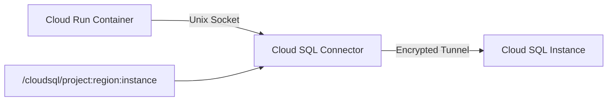

# How to Connect a Cloud Run Service to a Cloud SQL Instance

Author: [nawazdhandala](https://www.github.com/nawazdhandala)

Tags: GCP, Cloud Run, Cloud SQL, Serverless, Database Connectivity

Description: Learn how to securely connect a Cloud Run service to a Cloud SQL instance using the built-in Cloud SQL connector and the Cloud SQL Auth Proxy.

---

Cloud Run is Google Cloud's serverless container platform, and connecting it to Cloud SQL is one of the most common patterns for building web applications on GCP. Cloud Run has built-in support for Cloud SQL connections, which makes the setup straightforward once you understand the moving parts. This guide covers both the built-in connector and alternative approaches.

## How Cloud Run Connects to Cloud SQL

Cloud Run has a native Cloud SQL integration. When you configure a Cloud SQL connection on your Cloud Run service, Google injects a Unix socket into the container at `/cloudsql/INSTANCE_CONNECTION_NAME`. Your application connects through this socket instead of using a TCP connection.



This approach:

- Handles authentication automatically using the service's IAM identity
- Encrypts the connection without you managing SSL certificates
- Works with both public and private IP instances

## Step 1: Set Up IAM Permissions

Your Cloud Run service account needs the `roles/cloudsql.client` role:

```bash
# Get the default Compute Engine service account (used by Cloud Run by default)
PROJECT_NUMBER=$(gcloud projects describe $(gcloud config get-value project) --format='value(projectNumber)')
SA_EMAIL="${PROJECT_NUMBER}-compute@developer.gserviceaccount.com"

# Grant Cloud SQL Client role
gcloud projects add-iam-policy-binding $(gcloud config get-value project) \
    --member="serviceAccount:${SA_EMAIL}" \
    --role="roles/cloudsql.client"
```

For better security, create a dedicated service account for your Cloud Run service:

```bash
# Create a dedicated service account
gcloud iam service-accounts create my-cloudrun-sa \
    --display-name="Cloud Run Service Account"

# Grant Cloud SQL Client role
gcloud projects add-iam-policy-binding $(gcloud config get-value project) \
    --member="serviceAccount:my-cloudrun-sa@my-project.iam.gserviceaccount.com" \
    --role="roles/cloudsql.client"
```

## Step 2: Get Your Instance Connection Name

```bash
# Get the connection name for your Cloud SQL instance
gcloud sql instances describe my-instance \
    --format="value(connectionName)"
```

This returns something like `my-project:us-central1:my-instance`.

## Step 3: Deploy the Cloud Run Service

Deploy with the Cloud SQL connection configured:

```bash
# Deploy a Cloud Run service with Cloud SQL connection
gcloud run deploy my-service \
    --image=gcr.io/my-project/my-app:latest \
    --region=us-central1 \
    --add-cloudsql-instances=my-project:us-central1:my-instance \
    --service-account=my-cloudrun-sa@my-project.iam.gserviceaccount.com \
    --set-env-vars="DB_HOST=/cloudsql/my-project:us-central1:my-instance,DB_USER=myapp,DB_PASS=password,DB_NAME=mydb"
```

The `--add-cloudsql-instances` flag tells Cloud Run to set up the socket connection to your Cloud SQL instance.

## Step 4: Configure Your Application

Your application connects via the Unix socket. Here are examples for common languages.

### Python (Flask/SQLAlchemy)

```python
# app.py - Connect to Cloud SQL from Cloud Run using Unix socket
import os
from flask import Flask
from sqlalchemy import create_engine

app = Flask(__name__)

def get_db_connection():
    """Create a database connection using Unix socket for Cloud SQL."""
    db_user = os.environ.get("DB_USER")
    db_pass = os.environ.get("DB_PASS")
    db_name = os.environ.get("DB_NAME")
    db_host = os.environ.get("DB_HOST")  # Unix socket path

    # For PostgreSQL via Unix socket
    engine = create_engine(
        f"postgresql+psycopg2://{db_user}:{db_pass}@/{db_name}"
        f"?host={db_host}",
        pool_size=5,
        max_overflow=2,
        pool_timeout=30,
        pool_recycle=1800,
        pool_pre_ping=True,
    )
    return engine

engine = get_db_connection()

@app.route("/")
def index():
    with engine.connect() as conn:
        result = conn.execute("SELECT 1")
        return "Database connected!"
```

### Node.js (Express/Knex)

```javascript
// db.js - Connect to Cloud SQL from Cloud Run
const knex = require('knex');

// Cloud SQL Unix socket connection
const db = knex({
  client: 'pg',
  connection: {
    user: process.env.DB_USER,
    password: process.env.DB_PASS,
    database: process.env.DB_NAME,
    // Unix socket path for Cloud SQL
    host: process.env.DB_HOST,
  },
  pool: {
    min: 2,
    max: 10,
    // Test connections before using them
    afterCreate: (conn, done) => {
      conn.query('SELECT 1', (err) => done(err, conn));
    },
  },
});

module.exports = db;
```

### Go

```go
// main.go - Connect to Cloud SQL from Cloud Run
package main

import (
    "database/sql"
    "fmt"
    "log"
    "net/http"
    "os"

    _ "github.com/lib/pq"
)

func main() {
    // Build connection string using Unix socket
    dbHost := os.Getenv("DB_HOST")
    dbUser := os.Getenv("DB_USER")
    dbPass := os.Getenv("DB_PASS")
    dbName := os.Getenv("DB_NAME")

    connStr := fmt.Sprintf(
        "host=%s user=%s password=%s dbname=%s sslmode=disable",
        dbHost, dbUser, dbPass, dbName,
    )

    db, err := sql.Open("postgres", connStr)
    if err != nil {
        log.Fatal(err)
    }
    defer db.Close()

    // Configure connection pool
    db.SetMaxOpenConns(10)
    db.SetMaxIdleConns(5)

    http.HandleFunc("/", func(w http.ResponseWriter, r *http.Request) {
        err := db.Ping()
        if err != nil {
            http.Error(w, "Database error", 500)
            return
        }
        fmt.Fprint(w, "Connected to Cloud SQL!")
    })

    log.Fatal(http.ListenAndServe(":8080", nil))
}
```

## Using Cloud SQL Connectors (Recommended)

Google provides language-specific Cloud SQL connectors that are even easier to use than Unix sockets. They handle authentication and encryption programmatically.

### Python Cloud SQL Connector

```python
# Using the official Cloud SQL Python Connector
# pip install cloud-sql-python-connector[pg8000]
from google.cloud.sql.connector import Connector
import sqlalchemy

connector = Connector()

def getconn():
    """Create a connection using the Cloud SQL Python Connector."""
    conn = connector.connect(
        "my-project:us-central1:my-instance",
        "pg8000",
        user="myapp",
        password="password",
        db="mydb",
    )
    return conn

engine = sqlalchemy.create_engine(
    "postgresql+pg8000://",
    creator=getconn,
    pool_size=5,
    max_overflow=2,
    pool_pre_ping=True,
)
```

### Java Cloud SQL Connector

```java
// build.gradle: implementation 'com.google.cloud.sql:postgres-socket-factory:1.14.0'

// Application properties for Spring Boot
// spring.datasource.url=jdbc:postgresql:///mydb?cloudSqlInstance=my-project:us-central1:my-instance&socketFactory=com.google.cloud.sql.postgres.SocketFactory
// spring.datasource.username=myapp
// spring.datasource.password=password
```

## Connection Pooling Considerations

Cloud Run scales from zero to many instances. Each instance maintains its own connection pool. This means:

- With 100 Cloud Run instances, each with a pool of 5 connections, you need 500 Cloud SQL connections
- Cloud SQL has a max connections limit based on machine type
- Idle Cloud Run instances still hold connections

Manage this by:

1. Keeping pool sizes small (2-5 per instance)
2. Using connection timeouts aggressively
3. Considering a Cloud SQL instance with enough connection capacity

```bash
# Check max connections for your instance tier
gcloud sql instances describe my-instance \
    --format="json(settings.tier)"
```

You can also set the `max_connections` flag:

```bash
# Increase max connections if needed
gcloud sql instances patch my-instance \
    --database-flags=max_connections=500
```

## Using Private IP (VPC Connector)

For Cloud Run to connect to a Cloud SQL instance with private IP, you need a VPC connector:

```bash
# Create a Serverless VPC Access connector
gcloud compute networks vpc-access connectors create my-connector \
    --region=us-central1 \
    --subnet=my-subnet \
    --min-instances=2 \
    --max-instances=10

# Deploy Cloud Run service with VPC connector
gcloud run deploy my-service \
    --image=gcr.io/my-project/my-app:latest \
    --region=us-central1 \
    --add-cloudsql-instances=my-project:us-central1:my-instance \
    --vpc-connector=my-connector \
    --service-account=my-cloudrun-sa@my-project.iam.gserviceaccount.com \
    --set-env-vars="DB_HOST=/cloudsql/my-project:us-central1:my-instance,DB_USER=myapp,DB_PASS=password,DB_NAME=mydb"
```

## Storing Credentials Securely

Do not hardcode database passwords. Use Secret Manager:

```bash
# Store the database password in Secret Manager
echo -n "your-db-password" | gcloud secrets create db-password \
    --data-file=-

# Grant the Cloud Run service account access to the secret
gcloud secrets add-iam-policy-binding db-password \
    --member="serviceAccount:my-cloudrun-sa@my-project.iam.gserviceaccount.com" \
    --role="roles/secretmanager.secretAccessor"

# Deploy with the secret mounted as an environment variable
gcloud run deploy my-service \
    --image=gcr.io/my-project/my-app:latest \
    --region=us-central1 \
    --add-cloudsql-instances=my-project:us-central1:my-instance \
    --service-account=my-cloudrun-sa@my-project.iam.gserviceaccount.com \
    --set-env-vars="DB_HOST=/cloudsql/my-project:us-central1:my-instance,DB_USER=myapp,DB_NAME=mydb" \
    --set-secrets="DB_PASS=db-password:latest"
```

## Troubleshooting

### "Connection refused" Errors

Check that:
- The Cloud SQL instance connection name is correct in `--add-cloudsql-instances`
- The service account has `roles/cloudsql.client`
- The Cloud SQL Admin API is enabled

### Connection Timeouts

Cloud Run instances that scale to zero need time to establish connections when they start:
- Set reasonable connection timeouts (5-10 seconds)
- Use `pool_pre_ping` or equivalent to validate connections
- Configure startup probes if your application takes time to connect

### Too Many Connections

If you hit the Cloud SQL connection limit:
- Reduce pool size per Cloud Run instance
- Set `--max-instances` on Cloud Run to cap scaling
- Increase Cloud SQL's `max_connections` flag

## Summary

Connecting Cloud Run to Cloud SQL is well-supported through the built-in Unix socket integration. Use the `--add-cloudsql-instances` flag when deploying, configure your application to connect via the socket path, keep connection pool sizes small, and store credentials in Secret Manager. For private IP instances, add a VPC connector. The language-specific Cloud SQL connectors are worth using for their built-in authentication and encryption handling.
