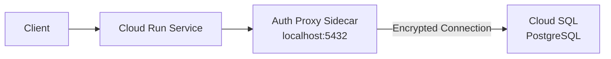

# How to Connect a Cloud Run Service to a Cloud SQL PostgreSQL Instance Using the Auth Proxy Sidecar

Author: [nawazdhandala](https://www.github.com/nawazdhandala)

Tags: GCP, Cloud Run, Cloud SQL, PostgreSQL, Auth Proxy

Description: Learn how to securely connect a Cloud Run service to a Cloud SQL PostgreSQL database using the Cloud SQL Auth Proxy as a sidecar container for encrypted, IAM-authenticated connections.

---

Connecting Cloud Run to Cloud SQL is one of the most common patterns in GCP, but doing it securely requires some thought. The Cloud SQL Auth Proxy handles encrypted connections and IAM-based authentication, so you do not need to expose your database to the public internet or manage SSL certificates manually.

With Cloud Run's multi-container support, you can now run the Auth Proxy as a sidecar container. This is cleaner than the older Unix socket approach and gives you more control over the proxy's configuration.

## Architecture

Here is how the pieces fit together:



Your application connects to `localhost:5432` (the Auth Proxy sidecar), and the proxy handles the secure connection to Cloud SQL. No database credentials leave the Cloud Run environment.

## Step 1: Set Up Cloud SQL

If you do not have a Cloud SQL instance yet:

```bash
# Create a Cloud SQL PostgreSQL instance
gcloud sql instances create my-postgres \
  --database-version=POSTGRES_15 \
  --tier=db-f1-micro \
  --region=us-central1 \
  --root-password=initial-password \
  --no-assign-ip \
  --network=default
```

The `--no-assign-ip` flag means the instance only has a private IP. Combined with the Auth Proxy, this keeps the database off the public internet entirely.

Create a database and user:

```bash
# Create a database
gcloud sql databases create myapp --instance=my-postgres

# Create a database user
gcloud sql users create appuser \
  --instance=my-postgres \
  --password=secure-password-here
```

Get the connection name - you will need this for the Auth Proxy configuration:

```bash
# Get the instance connection name
gcloud sql instances describe my-postgres \
  --format="value(connectionName)"
```

This returns something like `my-project:us-central1:my-postgres`.

## Step 2: Store Database Credentials in Secret Manager

Never hardcode database passwords. Use Secret Manager:

```bash
# Store the database password in Secret Manager
echo -n "secure-password-here" | gcloud secrets create db-password \
  --data-file=- \
  --replication-policy=automatic
```

Grant the Cloud Run service account access to the secret:

```bash
# Get the default Compute Engine service account
SA_EMAIL=$(gcloud iam service-accounts list \
  --filter="displayName:Compute Engine default" \
  --format="value(email)")

# Grant access to the secret
gcloud secrets add-iam-policy-binding db-password \
  --member="serviceAccount:${SA_EMAIL}" \
  --role="roles/secretmanager.secretAccessor"
```

## Step 3: Configure IAM Permissions

The Cloud Run service account needs permission to connect to Cloud SQL:

```bash
# Grant Cloud SQL Client role to the service account
gcloud projects add-iam-policy-binding my-project \
  --member="serviceAccount:${SA_EMAIL}" \
  --role="roles/cloudsql.client"
```

## Step 4: Build the Application Container

Here is a Python Flask application that connects to PostgreSQL through the Auth Proxy:

```python
# app.py - Flask application connecting to Cloud SQL via Auth Proxy
import os
import psycopg2
from flask import Flask, jsonify

app = Flask(__name__)

def get_db_connection():
    """Create a database connection through the Auth Proxy sidecar."""
    conn = psycopg2.connect(
        host='localhost',           # Auth Proxy runs on localhost
        port=5432,                  # Auth Proxy listens on this port
        dbname=os.environ['DB_NAME'],
        user=os.environ['DB_USER'],
        password=os.environ['DB_PASSWORD'],
        connect_timeout=10
    )
    return conn

@app.route('/')
def index():
    """Simple endpoint that queries the database."""
    try:
        conn = get_db_connection()
        cur = conn.cursor()
        cur.execute('SELECT version()')
        version = cur.fetchone()[0]
        cur.close()
        conn.close()
        return jsonify({
            'status': 'connected',
            'postgres_version': version
        })
    except Exception as e:
        return jsonify({
            'status': 'error',
            'message': str(e)
        }), 500

@app.route('/health')
def health():
    """Health check endpoint."""
    return jsonify({'status': 'ok'})

if __name__ == '__main__':
    port = int(os.environ.get('PORT', 8080))
    app.run(host='0.0.0.0', port=port)
```

The Dockerfile:

```dockerfile
# Dockerfile for the application
FROM python:3.12-slim
WORKDIR /app
COPY requirements.txt .
RUN pip install --no-cache-dir -r requirements.txt
COPY app.py .
EXPOSE 8080
CMD ["gunicorn", "--bind", "0.0.0.0:8080", "--workers", "2", "app:app"]
```

The requirements file:

```
flask==3.0.*
gunicorn==21.*
psycopg2-binary==2.9.*
```

Build and push the image:

```bash
# Build and push the application image
gcloud builds submit . \
  --tag=us-central1-docker.pkg.dev/my-project/my-repo/my-app:v1
```

## Step 5: Deploy with Auth Proxy Sidecar

Create a YAML service definition that includes the Auth Proxy as a sidecar:

```yaml
# service.yaml - Cloud Run service with Cloud SQL Auth Proxy sidecar
apiVersion: serving.knative.dev/v1
kind: Service
metadata:
  name: my-app
  annotations:
    run.googleapis.com/launch-stage: BETA
spec:
  template:
    metadata:
      annotations:
        run.googleapis.com/container-dependencies: '{"my-app":["cloud-sql-proxy"]}'
    spec:
      containers:
        # Main application container
        - name: my-app
          image: us-central1-docker.pkg.dev/my-project/my-repo/my-app:v1
          ports:
            - containerPort: 8080
          resources:
            limits:
              cpu: "1"
              memory: "512Mi"
          env:
            - name: DB_NAME
              value: myapp
            - name: DB_USER
              value: appuser
            - name: DB_PASSWORD
              valueFrom:
                secretKeyRef:
                  name: db-password
                  key: latest
          startupProbe:
            httpGet:
              path: /health
              port: 8080
            initialDelaySeconds: 5
            periodSeconds: 5

        # Cloud SQL Auth Proxy sidecar
        - name: cloud-sql-proxy
          image: gcr.io/cloud-sql-connectors/cloud-sql-proxy:2.8.0
          args:
            - "--port=5432"
            - "--auto-iam-authn"
            - "my-project:us-central1:my-postgres"
          resources:
            limits:
              cpu: "0.5"
              memory: "256Mi"
          startupProbe:
            tcpSocket:
              port: 5432
            initialDelaySeconds: 2
            periodSeconds: 5
```

Deploy the service:

```bash
# Deploy the service with the Auth Proxy sidecar
gcloud run services replace service.yaml --region=us-central1
```

## Step 6: Alternative - Using the Built-in Cloud SQL Connection

Cloud Run also has a built-in Cloud SQL connection feature that does not require a sidecar. This is simpler but uses Unix sockets:

```bash
# Deploy with built-in Cloud SQL connection (no sidecar needed)
gcloud run deploy my-app \
  --image=us-central1-docker.pkg.dev/my-project/my-repo/my-app:v1 \
  --region=us-central1 \
  --add-cloudsql-instances=my-project:us-central1:my-postgres \
  --set-env-vars="DB_NAME=myapp,DB_USER=appuser" \
  --set-secrets="DB_PASSWORD=db-password:latest"
```

With this approach, the application connects via Unix socket:

```python
# Connection using Unix socket (built-in Cloud SQL connection)
import os
import psycopg2

def get_db_connection():
    """Connect to Cloud SQL via Unix socket."""
    unix_socket = f'/cloudsql/{os.environ["INSTANCE_CONNECTION_NAME"]}'
    conn = psycopg2.connect(
        host=unix_socket,
        dbname=os.environ['DB_NAME'],
        user=os.environ['DB_USER'],
        password=os.environ['DB_PASSWORD']
    )
    return conn
```

## Step 7: Connection Pooling

For production workloads, add connection pooling to avoid overwhelming the database:

```python
# Connection pooling with psycopg2
from psycopg2 import pool
import os

# Create a connection pool at module level
connection_pool = pool.ThreadedConnectionPool(
    minconn=2,       # Minimum connections to keep open
    maxconn=10,      # Maximum connections allowed
    host='localhost',
    port=5432,
    dbname=os.environ['DB_NAME'],
    user=os.environ['DB_USER'],
    password=os.environ['DB_PASSWORD']
)

def get_db_connection():
    """Get a connection from the pool."""
    return connection_pool.getconn()

def return_db_connection(conn):
    """Return a connection to the pool."""
    connection_pool.putconn(conn)
```

## Troubleshooting

If the connection fails, check these common issues:

```bash
# Verify the Cloud SQL instance is running
gcloud sql instances describe my-postgres --format="value(state)"

# Check the Cloud Run service logs for connection errors
gcloud run services logs read my-app --region=us-central1 --limit=30

# Verify the service account has the Cloud SQL Client role
gcloud projects get-iam-policy my-project \
  --flatten="bindings[].members" \
  --filter="bindings.role:roles/cloudsql.client"
```

Common mistakes:
- Forgetting the `roles/cloudsql.client` IAM role
- Using the wrong instance connection name format
- Not granting Secret Manager access to the service account
- Setting the wrong port in the application configuration

The Auth Proxy sidecar pattern keeps your database connections secure and properly authenticated. It adds a tiny amount of latency (the proxy runs locally so it is minimal) but gives you encrypted connections and IAM integration without any code changes in your application.
