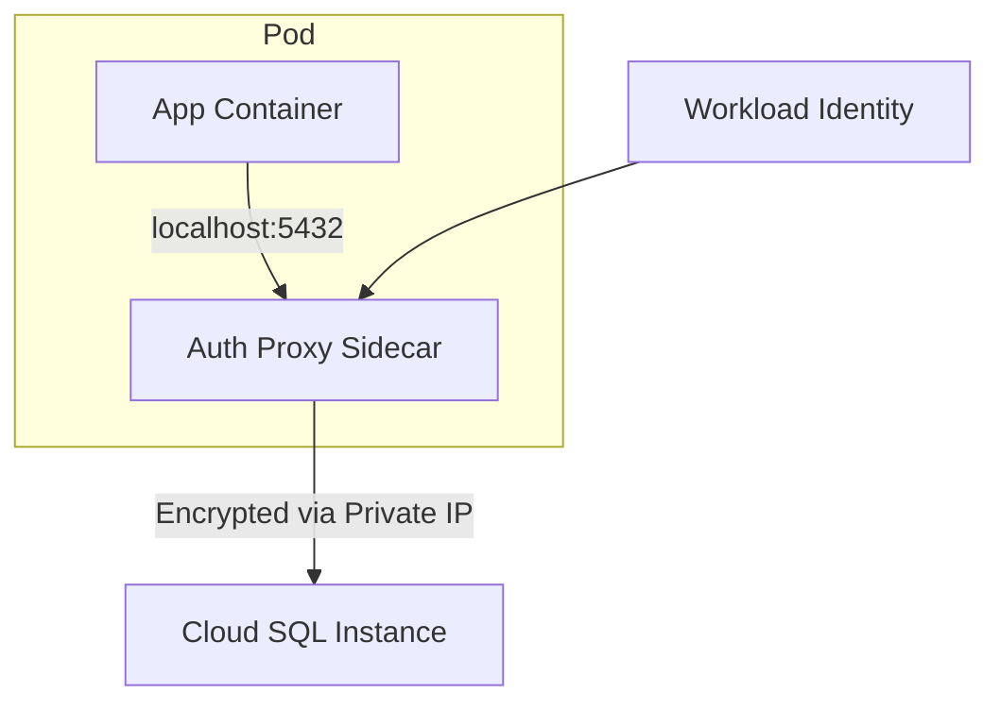

# How to Connect a GKE Pod to Cloud SQL Using the Cloud SQL Auth Proxy Sidecar

Author: [nawazdhandala](https://www.github.com/nawazdhandala)

Tags: GCP, GKE, Cloud SQL, Auth Proxy, Kubernetes, Sidecar

Description: A detailed guide to connecting GKE pods to Cloud SQL instances using the Cloud SQL Auth Proxy as a sidecar container with Workload Identity.

---

Running your application on GKE and your database on Cloud SQL is a common architecture on Google Cloud. The recommended way to connect them is using the Cloud SQL Auth Proxy as a sidecar container in your pod. This gives you encrypted connections, IAM-based authentication, and no need to manage SSL certificates. Let me walk through the full setup.

## Architecture Overview

The sidecar pattern means the Auth Proxy runs as a second container in the same pod as your application. Your app connects to `localhost` on the database port, and the proxy handles the secure connection to Cloud SQL.



This approach keeps the proxy lifecycle tied to your application - when the pod starts, both containers start; when it stops, both stop.

## Step 1: Set Up Workload Identity

Workload Identity is the recommended way to authenticate GKE workloads with Google Cloud APIs. It links a Kubernetes service account to a Google Cloud service account.

Create a Google Cloud service account:

```bash
# Create a service account for the application
gcloud iam service-accounts create my-app-sa \
    --display-name="My Application Service Account"

# Grant Cloud SQL Client role
gcloud projects add-iam-policy-binding my-project \
    --member="serviceAccount:my-app-sa@my-project.iam.gserviceaccount.com" \
    --role="roles/cloudsql.client"
```

Create a Kubernetes service account and bind it:

```bash
# Create the Kubernetes service account
kubectl create serviceaccount my-app-ksa --namespace=default

# Bind the Kubernetes SA to the Google Cloud SA
gcloud iam service-accounts add-iam-policy-binding \
    my-app-sa@my-project.iam.gserviceaccount.com \
    --role="roles/iam.workloadIdentityUser" \
    --member="serviceAccount:my-project.svc.id.goog[default/my-app-ksa]"

# Annotate the Kubernetes SA with the Google Cloud SA email
kubectl annotate serviceaccount my-app-ksa \
    --namespace=default \
    iam.gke.io/gcp-service-account=my-app-sa@my-project.iam.gserviceaccount.com
```

## Step 2: Get the Instance Connection Name

```bash
# Get your Cloud SQL instance connection name
gcloud sql instances describe my-instance \
    --format="value(connectionName)"
```

## Step 3: Create the Kubernetes Deployment

Here is a complete deployment manifest with the Auth Proxy sidecar:

```yaml
# deployment.yaml - Application with Cloud SQL Auth Proxy sidecar
apiVersion: apps/v1
kind: Deployment
metadata:
  name: my-app
  namespace: default
spec:
  replicas: 3
  selector:
    matchLabels:
      app: my-app
  template:
    metadata:
      labels:
        app: my-app
    spec:
      serviceAccountName: my-app-ksa  # Workload Identity SA
      containers:
        # Application container
        - name: my-app
          image: gcr.io/my-project/my-app:latest
          ports:
            - containerPort: 8080
          env:
            - name: DB_HOST
              value: "127.0.0.1"  # Connect to the proxy on localhost
            - name: DB_PORT
              value: "5432"
            - name: DB_NAME
              value: "mydb"
            - name: DB_USER
              valueFrom:
                secretKeyRef:
                  name: db-credentials
                  key: username
            - name: DB_PASS
              valueFrom:
                secretKeyRef:
                  name: db-credentials
                  key: password
          resources:
            requests:
              cpu: 250m
              memory: 256Mi
            limits:
              cpu: 500m
              memory: 512Mi

        # Cloud SQL Auth Proxy sidecar
        - name: cloud-sql-proxy
          image: gcr.io/cloud-sql-connectors/cloud-sql-proxy:2.8.0
          args:
            # Use private IP for the connection
            - "--private-ip"
            # Enable structured logging
            - "--structured-logs"
            # Health check endpoint
            - "--health-check"
            - "--http-port=9090"
            # Instance connection name
            - "my-project:us-central1:my-instance"
          ports:
            - containerPort: 5432
              protocol: TCP
          resources:
            requests:
              cpu: 100m
              memory: 128Mi
            limits:
              cpu: 200m
              memory: 256Mi
          # Readiness probe using the proxy's health check
          readinessProbe:
            httpGet:
              path: /readiness
              port: 9090
            initialDelaySeconds: 5
            periodSeconds: 10
          # Liveness probe
          livenessProbe:
            httpGet:
              path: /liveness
              port: 9090
            initialDelaySeconds: 10
            periodSeconds: 30
          securityContext:
            runAsNonRoot: true
            allowPrivilegeEscalation: false
```

## Step 4: Create the Database Credentials Secret

```bash
# Create a Kubernetes secret with database credentials
kubectl create secret generic db-credentials \
    --from-literal=username=myapp_user \
    --from-literal=password=your-strong-password
```

For production, consider using External Secrets Operator to sync secrets from Google Secret Manager:

```yaml
# external-secret.yaml - Sync from Google Secret Manager
apiVersion: external-secrets.io/v1beta1
kind: ExternalSecret
metadata:
  name: db-credentials
spec:
  refreshInterval: 1h
  secretStoreRef:
    name: gcp-secret-store
    kind: ClusterSecretStore
  target:
    name: db-credentials
  data:
    - secretKey: username
      remoteRef:
        key: db-username
    - secretKey: password
      remoteRef:
        key: db-password
```

## Step 5: Deploy

```bash
# Apply the deployment
kubectl apply -f deployment.yaml

# Check the pod status
kubectl get pods -l app=my-app

# Verify both containers are running
kubectl describe pod -l app=my-app
```

Both containers should show `Running` status. If the proxy container fails, check the logs:

```bash
# Check Auth Proxy logs
kubectl logs -l app=my-app -c cloud-sql-proxy
```

## Handling the Sidecar Lifecycle

One common issue is that the Auth Proxy container keeps running after the main application exits, which can cause job pods to hang. There are a few solutions.

### Using Kubernetes Native Sidecar (1.28+)

Kubernetes 1.28 introduced native sidecar support:

```yaml
# Using Kubernetes native sidecar containers (GKE 1.28+)
apiVersion: apps/v1
kind: Deployment
metadata:
  name: my-app
spec:
  template:
    spec:
      serviceAccountName: my-app-ksa
      initContainers:
        # Native sidecar - restartPolicy: Always makes it a true sidecar
        - name: cloud-sql-proxy
          image: gcr.io/cloud-sql-connectors/cloud-sql-proxy:2.8.0
          restartPolicy: Always  # This is what makes it a native sidecar
          args:
            - "--private-ip"
            - "--structured-logs"
            - "--health-check"
            - "--http-port=9090"
            - "my-project:us-central1:my-instance"
          resources:
            requests:
              cpu: 100m
              memory: 128Mi
      containers:
        - name: my-app
          image: gcr.io/my-project/my-app:latest
          # ... rest of app config
```

### Using the Proxy's Quit Endpoint

For older Kubernetes versions, use the proxy's quit endpoint:

```yaml
# Add a quit endpoint to the proxy
- name: cloud-sql-proxy
  args:
    - "--private-ip"
    - "--quitquitquit"
    - "--http-port=9090"
    - "my-project:us-central1:my-instance"
```

Then in your application, call the quit endpoint when shutting down:

```python
# Call the proxy quit endpoint on application shutdown
import requests
import atexit

def shutdown_proxy():
    """Tell the Auth Proxy sidecar to shut down."""
    try:
        requests.post("http://localhost:9090/quitquitquit")
    except Exception:
        pass  # Proxy may already be gone

atexit.register(shutdown_proxy)
```

## Multiple Cloud SQL Instances

If your application connects to multiple Cloud SQL instances:

```yaml
# Auth Proxy sidecar connecting to multiple instances
- name: cloud-sql-proxy
  image: gcr.io/cloud-sql-connectors/cloud-sql-proxy:2.8.0
  args:
    - "--private-ip"
    - "--structured-logs"
    - "--health-check"
    - "--http-port=9090"
    # Each instance gets its own port
    - "--port=5432"
    - "my-project:us-central1:postgres-instance"
    - "--port=3306"
    - "my-project:us-central1:mysql-instance"
  ports:
    - containerPort: 5432
      name: postgres
    - containerPort: 3306
      name: mysql
```

## Resource Sizing for the Proxy

The Auth Proxy is lightweight but needs adequate resources:

- **CPU**: 100m request, 200m limit for most workloads. Increase if you have very high connection throughput.
- **Memory**: 128Mi request, 256Mi limit. The proxy caches some data per connection.
- **Scale with connections**: If your app maintains many concurrent connections, increase the proxy resources proportionally.

## Network Policy

If you use Kubernetes Network Policies, allow the proxy to reach Cloud SQL:

```yaml
# network-policy.yaml - Allow proxy to reach Cloud SQL
apiVersion: networking.k8s.io/v1
kind: NetworkPolicy
metadata:
  name: allow-cloudsql
  namespace: default
spec:
  podSelector:
    matchLabels:
      app: my-app
  policyTypes:
    - Egress
  egress:
    # Allow connections to Cloud SQL private IP range
    - to:
        - ipBlock:
            cidr: 10.100.0.0/16  # Your Cloud SQL IP range
      ports:
        - port: 3307
          protocol: TCP
    # Allow DNS resolution
    - to:
        - namespaceSelector: {}
      ports:
        - port: 53
          protocol: UDP
        - port: 53
          protocol: TCP
```

## Monitoring the Proxy in GKE

Set up monitoring for the proxy sidecar:

```yaml
# Use Prometheus annotations for proxy metrics scraping
metadata:
  annotations:
    prometheus.io/scrape: "true"
    prometheus.io/port: "9090"
    prometheus.io/path: "/metrics"
```

Key metrics to watch:

- Connection count per instance
- Proxy restart count (should be zero)
- Health check failures

## Summary

The Cloud SQL Auth Proxy sidecar is the standard way to connect GKE pods to Cloud SQL. Use Workload Identity for authentication, set up health checks for proper pod lifecycle management, and keep the proxy resource allocation reasonable. For Kubernetes 1.28+, native sidecar containers solve the lifecycle issue. The setup involves a few moving pieces - service accounts, Workload Identity binding, and the deployment manifest - but once it is in place, it provides secure, reliable database connectivity without managing certificates or network allowlists.
