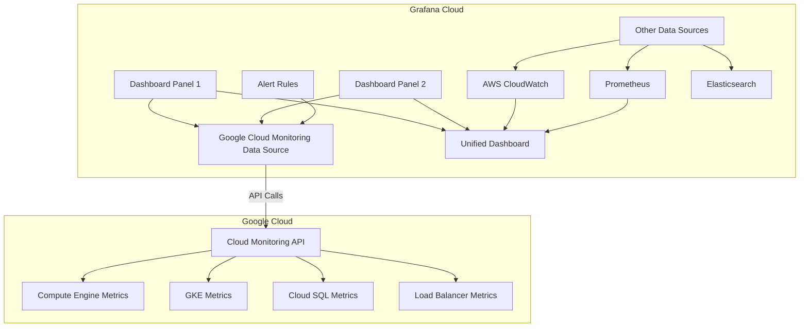

# How to Connect Grafana Cloud to Google Cloud Monitoring as a Data Source

Author: [nawazdhandala](https://www.github.com/nawazdhandala)

Tags: GCP, Grafana, Cloud Monitoring, Data Source, Dashboards, Observability, Google Cloud

Description: A step-by-step guide to connecting Grafana Cloud to Google Cloud Monitoring as a data source for building custom dashboards and alerts.

---

Google Cloud Monitoring has decent built-in dashboards, but if your organization has standardized on Grafana for visualization, you probably want to pull GCP metrics into Grafana rather than maintaining dashboards in two places. Grafana has a native Google Cloud Monitoring data source plugin that lets you query GCP metrics using MQL or the filter-based query builder and visualize them alongside metrics from other cloud providers and on-premises systems. In this post, I will walk through the setup and show you how to build effective dashboards.

## Why Grafana for GCP Monitoring?

There are several practical reasons. Your team already knows Grafana and has existing dashboards there. You need to view GCP metrics alongside AWS, Azure, or on-premises metrics in a single dashboard. You want more flexible visualization options than Cloud Monitoring provides. Or you want to use Grafana's alerting system which integrates with your existing notification channels.

## Prerequisites

- A Grafana Cloud instance (or self-hosted Grafana 9+)
- A GCP project with Cloud Monitoring enabled
- IAM permissions to create service accounts

## Step 1: Create a GCP Service Account

Grafana needs read-only access to Cloud Monitoring metrics.

```bash
# Create a service account for Grafana
gcloud iam service-accounts create grafana-monitoring \
    --display-name="Grafana Cloud Monitoring Reader" \
    --project=my-gcp-project

# Grant the monitoring viewer role
gcloud projects add-iam-policy-binding my-gcp-project \
    --member="serviceAccount:grafana-monitoring@my-gcp-project.iam.gserviceaccount.com" \
    --role="roles/monitoring.viewer"

# Also grant compute viewer for instance metadata in dashboards
gcloud projects add-iam-policy-binding my-gcp-project \
    --member="serviceAccount:grafana-monitoring@my-gcp-project.iam.gserviceaccount.com" \
    --role="roles/compute.viewer"
```

## Step 2: Generate the Service Account Key

```bash
# Create and download the JSON key
gcloud iam service-accounts keys create grafana-sa-key.json \
    --iam-account=grafana-monitoring@my-gcp-project.iam.gserviceaccount.com
```

## Step 3: Configure the Data Source in Grafana

In Grafana, go to Connections, then Data Sources, then click Add data source. Search for "Google Cloud Monitoring" and select it.

Configure the data source with these settings.

**Authentication Type:** Google JWT File

Upload the JSON key file you created in Step 2, or paste its contents into the JWT file field.

The data source will automatically detect the project ID from the key file. If you want to query metrics from multiple projects, you can add additional default projects.

Click "Save & Test" to verify the connection.

## Step 3 (Alternative): Configure via Grafana API

For automated provisioning, use the Grafana API.

```bash
# Read the service account key
SA_KEY=$(cat grafana-sa-key.json)

# Create the data source via API
curl -X POST "https://your-grafana-instance.grafana.net/api/datasources" \
    -H "Authorization: Bearer $GRAFANA_API_TOKEN" \
    -H "Content-Type: application/json" \
    -d "{
        \"name\": \"Google Cloud Monitoring\",
        \"type\": \"stackdriver\",
        \"access\": \"proxy\",
        \"jsonData\": {
            \"authenticationType\": \"jwt\",
            \"defaultProject\": \"my-gcp-project\",
            \"tokenUri\": \"https://oauth2.googleapis.com/token\"
        },
        \"secureJsonData\": {
            \"privateKey\": $(echo $SA_KEY | jq .private_key),
            \"clientEmail\": \"$(echo $SA_KEY | jq -r .client_email)\"
        }
    }"
```

## Step 4: Configure via Terraform

If you manage Grafana with Terraform, use the Grafana provider.

```hcl
provider "grafana" {
  url  = "https://your-instance.grafana.net/"
  auth = var.grafana_api_key
}

resource "grafana_data_source" "gcp_monitoring" {
  type = "stackdriver"
  name = "Google Cloud Monitoring"

  json_data_encoded = jsonencode({
    authenticationType = "jwt"
    defaultProject     = var.gcp_project_id
    tokenUri           = "https://oauth2.googleapis.com/token"
  })

  secure_json_data_encoded = jsonencode({
    privateKey  = var.gcp_sa_private_key
    clientEmail = var.gcp_sa_email
  })
}
```

## Step 5: Build Your First Dashboard

Here is a Grafana dashboard JSON for GCP golden signals that you can import.

```json
{
  "dashboard": {
    "title": "GCP Service Health",
    "panels": [
      {
        "title": "Request Rate",
        "type": "timeseries",
        "gridPos": { "h": 8, "w": 12, "x": 0, "y": 0 },
        "targets": [{
          "datasource": "Google Cloud Monitoring",
          "queryType": "metrics",
          "metricQuery": {
            "projectName": "my-gcp-project",
            "metricType": "loadbalancing.googleapis.com/https/request_count",
            "crossSeriesReducer": "REDUCE_SUM",
            "perSeriesAligner": "ALIGN_RATE",
            "alignmentPeriod": "60s",
            "groupBys": ["resource.label.url_map_name"]
          }
        }]
      },
      {
        "title": "Error Rate (%)",
        "type": "timeseries",
        "gridPos": { "h": 8, "w": 12, "x": 12, "y": 0 },
        "targets": [{
          "datasource": "Google Cloud Monitoring",
          "queryType": "metrics",
          "metricQuery": {
            "projectName": "my-gcp-project",
            "metricType": "loadbalancing.googleapis.com/https/request_count",
            "filters": ["metric.labels.response_code_class", "=", "500"],
            "crossSeriesReducer": "REDUCE_SUM",
            "perSeriesAligner": "ALIGN_RATE",
            "alignmentPeriod": "60s"
          }
        }]
      },
      {
        "title": "P95 Latency",
        "type": "timeseries",
        "gridPos": { "h": 8, "w": 12, "x": 0, "y": 8 },
        "targets": [{
          "datasource": "Google Cloud Monitoring",
          "queryType": "metrics",
          "metricQuery": {
            "projectName": "my-gcp-project",
            "metricType": "loadbalancing.googleapis.com/https/total_latencies",
            "crossSeriesReducer": "REDUCE_PERCENTILE_95",
            "perSeriesAligner": "ALIGN_DELTA",
            "alignmentPeriod": "60s",
            "groupBys": ["resource.label.url_map_name"]
          }
        }]
      },
      {
        "title": "GKE CPU Utilization",
        "type": "timeseries",
        "gridPos": { "h": 8, "w": 12, "x": 12, "y": 8 },
        "targets": [{
          "datasource": "Google Cloud Monitoring",
          "queryType": "metrics",
          "metricQuery": {
            "projectName": "my-gcp-project",
            "metricType": "kubernetes.io/container/cpu/limit_utilization",
            "crossSeriesReducer": "REDUCE_MEAN",
            "perSeriesAligner": "ALIGN_MEAN",
            "alignmentPeriod": "60s",
            "groupBys": ["resource.label.namespace_name"]
          }
        }]
      }
    ]
  }
}
```

## Step 6: Using MQL in Grafana

Grafana supports MQL queries against Google Cloud Monitoring. Switch to the MQL query editor for complex queries.

Example MQL queries you can use in Grafana panels.

```
# Request rate with error breakdown
fetch https_lb_rule::loadbalancing.googleapis.com/https/request_count
| group_by [metric.response_code_class], rate(val())
| every 1m
```

```
# Ratio of errors to total - error percentage
{
  fetch https_lb_rule::loadbalancing.googleapis.com/https/request_count
  | filter metric.response_code_class = 500
  | group_by [], sum(val())
  | every 1m
  ;
  fetch https_lb_rule::loadbalancing.googleapis.com/https/request_count
  | group_by [], sum(val())
  | every 1m
}
| ratio
| mul(100)
```

```
# Cloud SQL CPU utilization
fetch cloudsql_database::cloudsql.googleapis.com/database/cpu/utilization
| group_by [resource.database_id], mean(val())
| every 5m
```

## Step 7: Set Up Grafana Alerts on GCP Metrics

Grafana can alert on GCP metrics, routing notifications through your existing Grafana notification channels.

```json
{
  "alert": {
    "name": "GCP High Error Rate",
    "conditions": [{
      "evaluator": {
        "type": "gt",
        "params": [1]
      },
      "operator": {
        "type": "and"
      },
      "query": {
        "params": ["A", "5m", "now"]
      },
      "reducer": {
        "type": "avg"
      }
    }],
    "frequency": "60s",
    "handler": 1,
    "notifications": [
      {"uid": "slack-channel-uid"},
      {"uid": "pagerduty-uid"}
    ]
  }
}
```

## Data Source Architecture

Here is how Grafana queries GCP metrics.



## Multi-Project Dashboards

If you monitor multiple GCP projects, you can create template variables for project selection.

In Grafana, create a dashboard variable of type "Query" with the Google Cloud Monitoring data source. Set the query to list projects. Then reference the variable in your panel queries using `$project`.

This lets you switch between projects using a dropdown at the top of the dashboard without duplicating panels.

## Performance Tips

Cloud Monitoring API has rate limits. To avoid hitting them, align your dashboard panels to at least 60-second intervals for production dashboards. Use the alignment period setting to avoid requesting more data points than you need. For dashboards with many panels, consider increasing the auto-refresh interval from the default 5 seconds to 30 seconds or more.

Cache settings in Grafana help too. Enable query caching for the data source to reduce redundant API calls when multiple users view the same dashboard.

## Common Metrics to Monitor

Here are the most commonly queried GCP metrics in Grafana.

**Compute Engine:** `compute.googleapis.com/instance/cpu/utilization`, `compute.googleapis.com/instance/network/received_bytes_count`

**GKE:** `kubernetes.io/container/cpu/limit_utilization`, `kubernetes.io/container/memory/limit_utilization`, `kubernetes.io/pod/network/received_bytes_count`

**Cloud SQL:** `cloudsql.googleapis.com/database/cpu/utilization`, `cloudsql.googleapis.com/database/disk/utilization`, `cloudsql.googleapis.com/database/postgresql/num_backends`

**Load Balancing:** `loadbalancing.googleapis.com/https/request_count`, `loadbalancing.googleapis.com/https/total_latencies`, `loadbalancing.googleapis.com/https/backend_latencies`

## Wrapping Up

Connecting Grafana Cloud to Google Cloud Monitoring gives you the best of both worlds - GCP's comprehensive metric collection and Grafana's flexible visualization and alerting. The setup is quick: create a service account with viewer permissions, add the data source in Grafana, and start building dashboards. The biggest advantage is being able to put GCP metrics side by side with metrics from your other infrastructure on a single pane of glass. For teams that already use Grafana, this is much more practical than asking everyone to learn a second dashboarding tool.
