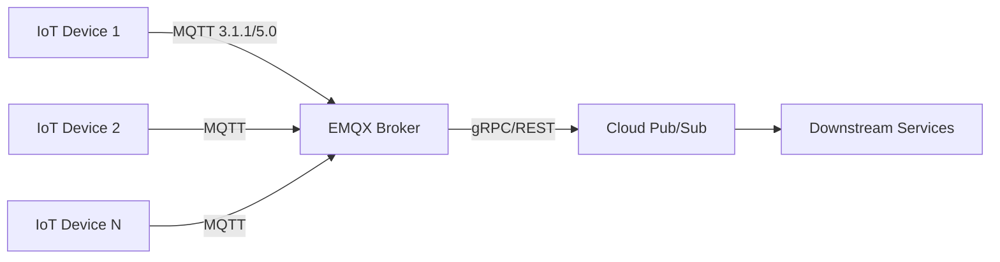

# How to Connect IoT Devices to Google Cloud Pub/Sub Using MQTT Bridge with Third-Party Brokers

Author: [nawazdhandala](https://www.github.com/nawazdhandala)

Tags: GCP, IoT, MQTT, Pub/Sub, Cloud Integration

Description: Connect your IoT devices to Google Cloud Pub/Sub using third-party MQTT brokers like EMQX and HiveMQ as a bridge layer.

---

Since Google Cloud IoT Core was retired, connecting IoT devices to GCP requires a third-party MQTT broker sitting between your devices and Pub/Sub. This is actually a better setup in many ways - you get a full-featured MQTT broker with more protocol options and flexibility, while still using Pub/Sub as your cloud-side message bus.

In this guide, I will show you how to set up EMQX (a popular open-source MQTT broker) on GCP and configure it to bridge device messages directly into Cloud Pub/Sub.

## Architecture Overview

The architecture is simple. Devices connect to the MQTT broker using standard MQTT protocol. The broker runs a rule or plugin that forwards matching messages to Pub/Sub.



This setup supports thousands to millions of device connections depending on your broker sizing, and Pub/Sub handles the fan-out to whatever downstream services you need.

## Prerequisites

- A GCP project with Pub/Sub API enabled
- A Compute Engine instance or GKE cluster to run the MQTT broker
- IoT devices that speak MQTT (version 3.1.1 or 5.0)
- `gcloud` CLI configured

## Step 1: Set Up Cloud Pub/Sub

Create the topics that will receive your device messages:

```bash
# Create the main topic for device telemetry data
gcloud pubsub topics create device-telemetry

# Create a topic for device state/status updates
gcloud pubsub topics create device-state

# Create a topic for device commands (cloud-to-device)
gcloud pubsub topics create device-commands

# Create subscriptions for downstream consumers
gcloud pubsub subscriptions create device-telemetry-sub \
  --topic=device-telemetry

gcloud pubsub subscriptions create device-state-sub \
  --topic=device-state
```

## Step 2: Create a Service Account for the Broker

The MQTT broker needs credentials to publish messages to Pub/Sub:

```bash
# Create a dedicated service account for the MQTT broker
gcloud iam service-accounts create mqtt-broker-sa \
  --display-name="MQTT Broker Service Account"

# Grant Pub/Sub publisher role so the broker can send messages
gcloud projects add-iam-policy-binding YOUR_PROJECT_ID \
  --member="serviceAccount:mqtt-broker-sa@YOUR_PROJECT_ID.iam.gserviceaccount.com" \
  --role="roles/pubsub.publisher"

# Generate credentials file for the broker to use
gcloud iam service-accounts keys create mqtt-broker-key.json \
  --iam-account=mqtt-broker-sa@YOUR_PROJECT_ID.iam.gserviceaccount.com
```

## Step 3: Deploy EMQX on Compute Engine

For a production-grade setup, you would run EMQX on GKE with multiple nodes. For this guide, a single Compute Engine instance works fine.

```bash
# Create a Compute Engine instance for the MQTT broker
gcloud compute instances create mqtt-broker \
  --zone=us-central1-a \
  --machine-type=e2-standard-4 \
  --image-family=ubuntu-2204-lts \
  --image-project=ubuntu-os-cloud \
  --boot-disk-size=50GB \
  --tags=mqtt-broker

# Allow MQTT traffic through the firewall
# Port 1883 is standard MQTT, 8883 is MQTT over TLS
gcloud compute firewall-rules create allow-mqtt \
  --allow=tcp:1883,tcp:8883 \
  --target-tags=mqtt-broker \
  --source-ranges=0.0.0.0/0
```

SSH into the instance and install EMQX:

```bash
# Install EMQX using the official package repository
curl -s https://assets.emqx.com/scripts/install-emqx-deb.sh | sudo bash
sudo apt-get install -y emqx
sudo systemctl start emqx
sudo systemctl enable emqx
```

## Step 4: Configure EMQX to Bridge to Pub/Sub

EMQX supports data bridges through its rule engine. You need to configure a Google Pub/Sub bridge. Create the configuration file:

```bash
# Add the GCP Pub/Sub bridge configuration to EMQX
# This goes in /etc/emqx/emqx.conf or can be configured via the dashboard
```

Using the EMQX Dashboard (available at http://your-broker-ip:18083 with default credentials admin/public), navigate to Data Integration and create a new GCP Pub/Sub bridge:

1. Go to Data Integration then Resources
2. Create a new GCP Pub/Sub resource
3. Upload your service account key JSON
4. Set the GCP project ID

Then create a rule that routes MQTT messages to Pub/Sub:

```sql
-- EMQX Rule Engine SQL
-- This rule matches all messages published to topics starting with "devices/"
-- and forwards them to the Pub/Sub bridge
SELECT
  payload,
  topic,
  clientid as device_id,
  timestamp
FROM
  "devices/#"
```

Map this rule to your Pub/Sub bridge, targeting the `device-telemetry` topic. You can use the `topic` field from the MQTT message to route to different Pub/Sub topics:

- `devices/+/telemetry` goes to `device-telemetry`
- `devices/+/state` goes to `device-state`

## Step 5: Configure Device Authentication

You do not want random devices connecting to your broker. EMQX supports multiple authentication backends. For IoT, username/password with a database backend or client certificate authentication work well.

For client certificate authentication (more secure):

```bash
# Generate a CA certificate for signing device certificates
openssl genrsa -out ca.key 2048
openssl req -x509 -new -nodes -key ca.key -sha256 -days 3650 \
  -out ca.crt -subj "/CN=IoT Device CA"

# Generate a device certificate signed by your CA
openssl genrsa -out device-001.key 2048
openssl req -new -key device-001.key -out device-001.csr \
  -subj "/CN=device-001"
openssl x509 -req -in device-001.csr -CA ca.crt -CAkey ca.key \
  -CAcreateserial -out device-001.crt -days 365 -sha256
```

Configure EMQX to use TLS with client certificate verification by updating the listener configuration:

```yaml
# EMQX TLS listener configuration
listeners:
  ssl:
    default:
      bind: "0.0.0.0:8883"
      ssl_options:
        certfile: "/etc/emqx/certs/server.crt"
        keyfile: "/etc/emqx/certs/server.key"
        cacertfile: "/etc/emqx/certs/ca.crt"
        verify: verify_peer
        fail_if_no_peer_cert: true
```

## Step 6: Connect a Device

Here is a Python example of a device connecting to the broker and sending telemetry:

```python
import paho.mqtt.client as mqtt
import json
import time
import ssl

# Device configuration
DEVICE_ID = "device-001"
BROKER_HOST = "your-broker-ip"
BROKER_PORT = 8883

def on_connect(client, userdata, flags, rc):
    """Callback when the device connects to the MQTT broker."""
    if rc == 0:
        print(f"Device {DEVICE_ID} connected successfully")
        # Subscribe to command topic for this device
        client.subscribe(f"devices/{DEVICE_ID}/commands")
    else:
        print(f"Connection failed with code {rc}")

def on_message(client, userdata, msg):
    """Handle incoming commands from the cloud."""
    print(f"Received command: {msg.payload.decode()}")

# Set up the MQTT client with TLS client certificates
client = mqtt.Client(client_id=DEVICE_ID)
client.tls_set(
    ca_certs="ca.crt",
    certfile="device-001.crt",
    keyfile="device-001.key",
    tls_version=ssl.PROTOCOL_TLSv1_2,
)
client.on_connect = on_connect
client.on_message = on_message
client.connect(BROKER_HOST, BROKER_PORT, 60)
client.loop_start()

# Send telemetry data every 10 seconds
while True:
    telemetry = {
        "device_id": DEVICE_ID,
        "timestamp": int(time.time() * 1000),
        "temperature": 23.5,
        "humidity": 55.2,
        "battery": 92.0,
    }
    # Publish to the telemetry topic for this device
    client.publish(
        f"devices/{DEVICE_ID}/telemetry",
        json.dumps(telemetry),
        qos=1,  # At least once delivery
    )
    print(f"Sent telemetry: {telemetry}")
    time.sleep(10)
```

## Step 7: Verify Messages in Pub/Sub

Pull a message from the subscription to confirm everything is flowing:

```bash
# Pull and acknowledge messages from the telemetry subscription
gcloud pubsub subscriptions pull device-telemetry-sub --auto-ack --limit=5
```

You should see your device telemetry messages appearing with the payload and any attributes you configured in the EMQX bridge.

## Production Considerations

For a production deployment:

- Run EMQX as a cluster of at least 3 nodes for high availability
- Use GKE with the EMQX Kubernetes Operator for automated scaling
- Set up monitoring on both the MQTT broker and the Pub/Sub side
- Implement rate limiting per device to prevent rogue devices from flooding the pipeline
- Use Pub/Sub message ordering if your application requires it
- Store the service account key in Secret Manager rather than on disk

## Wrapping Up

Using a third-party MQTT broker as a bridge to Pub/Sub gives you the best of both worlds - a proper MQTT implementation for your devices and the scalability of Pub/Sub for your cloud processing. EMQX, HiveMQ, and similar brokers offer features like session persistence, QoS handling, and MQTT 5.0 support that IoT Core never had. The extra operational overhead of managing the broker is a fair trade for the flexibility you gain.
