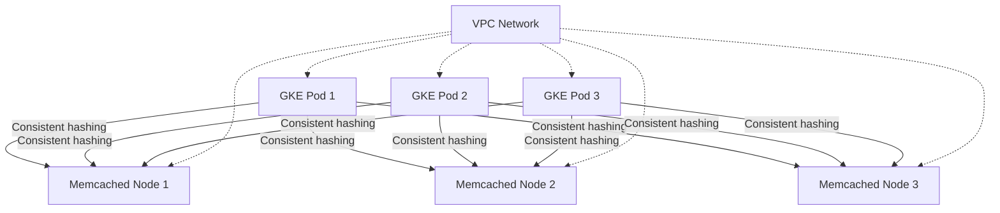

# How to Connect to Memorystore Memcached from a GKE Pod

Author: [nawazdhandala](https://www.github.com/nawazdhandala)

Tags: GCP, Memorystore, Memcached, GKE, Kubernetes

Description: Connect your GKE pods to a Memorystore for Memcached instance with proper networking, node discovery, and application-level consistent hashing for distributed caching.

---

Running Memcached on Memorystore alongside your GKE workloads is a solid caching architecture. Your application pods distribute cache keys across Memcached nodes using consistent hashing, and because everything runs inside the same VPC, latency between your pods and the cache is minimal.

The setup is a bit different from connecting to Memorystore Redis because Memcached uses a multi-node architecture where each node holds a portion of the cached data. Your application needs to know about all the nodes, not just a single endpoint. In this post, I will walk through the entire setup.

## Network Architecture



All GKE pods and Memcached nodes must be on the same VPC network. GKE must be running in VPC-native mode (using IP aliases) so that pod IPs are routable within the VPC.

## Prerequisites

Make sure you have:

1. A Memorystore Memcached instance running
2. A VPC-native GKE cluster on the same VPC network
3. `kubectl` configured to access your cluster

Verify your GKE cluster is VPC-native:

```bash
# Check that the GKE cluster uses IP aliases (VPC-native mode)
gcloud container clusters describe my-cluster \
  --zone=us-central1-a \
  --format="value(ipAllocationPolicy.useIpAliases)"
```

Get the Memcached node endpoints:

```bash
# List all Memcached node endpoints
gcloud memcache instances describe my-memcached \
  --region=us-central1 \
  --format="json(memcacheNodes)"
```

This returns the IP address and port of each node.

## Step 1: Store Node Endpoints in a ConfigMap

Create a ConfigMap with the Memcached node addresses. This makes it easy to update endpoints if nodes change:

```bash
# Get the node endpoints and create a ConfigMap
NODES=$(gcloud memcache instances describe my-memcached \
  --region=us-central1 \
  --format="value(memcacheNodes[].host)" | tr '\n' ',' | sed 's/,$//')

echo "Memcached nodes: ${NODES}"

# Create a ConfigMap with the node addresses
kubectl create configmap memcached-config \
  --from-literal=MEMCACHED_NODES="${NODES}" \
  --from-literal=MEMCACHED_PORT="11211"
```

Or use a YAML manifest for declarative management:

```yaml
# memcached-config.yaml - ConfigMap with Memcached node endpoints
apiVersion: v1
kind: ConfigMap
metadata:
  name: memcached-config
data:
  MEMCACHED_NODES: "10.0.0.2,10.0.0.3,10.0.0.4"
  MEMCACHED_PORT: "11211"
```

```bash
kubectl apply -f memcached-config.yaml
```

## Step 2: Build the Application

Here is a Python Flask application that connects to the Memcached nodes:

```python
# app.py - Flask application with Memcached caching
import os
import json
import time
from flask import Flask, jsonify, request
from pymemcache.client.hash import HashClient
from pymemcache import serde

app = Flask(__name__)

def create_memcached_client():
    """Create a Memcached client connected to all cluster nodes."""

    # Parse node addresses from the environment variable
    nodes_str = os.environ.get("MEMCACHED_NODES", "")
    port = int(os.environ.get("MEMCACHED_PORT", "11211"))

    # Build the server list as (host, port) tuples
    servers = []
    for node_ip in nodes_str.split(","):
        node_ip = node_ip.strip()
        if node_ip:
            servers.append((node_ip, port))

    if not servers:
        raise ValueError("No Memcached nodes configured")

    print(f"Connecting to Memcached nodes: {servers}")

    # Create a HashClient for consistent hashing across nodes
    client = HashClient(
        servers=servers,
        serializer=serde.python_memcache_serializer,
        deserializer=serde.python_memcache_deserializer,
        connect_timeout=3,
        timeout=2,
        retry_attempts=2,
        use_pooling=True,
        max_pool_size=20,
        ignore_exc=True  # Return None on errors instead of raising
    )

    return client

# Initialize the client at module level for connection reuse
cache = create_memcached_client()

@app.route("/health")
def health():
    """Health check endpoint that tests Memcached connectivity."""
    try:
        # Test write and read to verify connectivity
        test_key = "health_check"
        cache.set(test_key, "ok", expire=10)
        result = cache.get(test_key)

        if result == "ok":
            return jsonify({"status": "healthy", "memcached": "connected"})
        else:
            return jsonify({"status": "degraded", "memcached": "partial"}), 200
    except Exception as e:
        return jsonify({"status": "unhealthy", "error": str(e)}), 503

@app.route("/api/items/<item_id>")
def get_item(item_id):
    """Get an item with cache-aside pattern."""
    cache_key = f"item:{item_id}"

    # Try cache first
    cached = cache.get(cache_key)
    if cached is not None:
        return jsonify({"item": cached, "source": "cache"})

    # Cache miss - simulate database lookup
    item = {"id": item_id, "name": f"Item {item_id}", "price": 19.99}

    # Store in cache with 5-minute TTL
    cache.set(cache_key, item, expire=300)

    return jsonify({"item": item, "source": "database"})

@app.route("/api/cache/stats")
def cache_stats():
    """Get cache statistics from all nodes."""
    stats = {}
    nodes_str = os.environ.get("MEMCACHED_NODES", "")
    port = int(os.environ.get("MEMCACHED_PORT", "11211"))

    for node_ip in nodes_str.split(","):
        node_ip = node_ip.strip()
        if node_ip:
            try:
                from pymemcache.client.base import Client
                node_client = Client((node_ip, port), connect_timeout=2)
                node_stats = node_client.stats()

                stats[node_ip] = {
                    "curr_items": int(node_stats.get(b"curr_items", 0)),
                    "bytes": int(node_stats.get(b"bytes", 0)),
                    "get_hits": int(node_stats.get(b"get_hits", 0)),
                    "get_misses": int(node_stats.get(b"get_misses", 0)),
                }

                node_client.close()
            except Exception as e:
                stats[node_ip] = {"error": str(e)}

    return jsonify(stats)

if __name__ == "__main__":
    port = int(os.environ.get("PORT", "8080"))
    app.run(host="0.0.0.0", port=port)
```

## Step 3: Create the Kubernetes Deployment

```yaml
# deployment.yaml - GKE deployment with Memcached connection
apiVersion: apps/v1
kind: Deployment
metadata:
  name: cache-app
  labels:
    app: cache-app
spec:
  replicas: 3
  selector:
    matchLabels:
      app: cache-app
  template:
    metadata:
      labels:
        app: cache-app
    spec:
      containers:
        - name: cache-app
          image: gcr.io/my-project/cache-app:latest
          ports:
            - containerPort: 8080
          # Load Memcached configuration from ConfigMap
          envFrom:
            - configMapRef:
                name: memcached-config
          readinessProbe:
            httpGet:
              path: /health
              port: 8080
            initialDelaySeconds: 5
            periodSeconds: 10
          livenessProbe:
            httpGet:
              path: /health
              port: 8080
            initialDelaySeconds: 10
            periodSeconds: 30
          resources:
            requests:
              memory: "128Mi"
              cpu: "100m"
            limits:
              memory: "256Mi"
              cpu: "500m"
---
apiVersion: v1
kind: Service
metadata:
  name: cache-app-service
spec:
  selector:
    app: cache-app
  ports:
    - port: 80
      targetPort: 8080
  type: ClusterIP
```

Deploy the application:

```bash
# Build and push the container image
gcloud builds submit --tag gcr.io/my-project/cache-app

# Deploy to GKE
kubectl apply -f deployment.yaml

# Verify the pods are running
kubectl get pods -l app=cache-app
```

## Step 4: Test Connectivity

Verify the connection from inside a pod:

```bash
# Run a debug pod with telnet to test raw Memcached connectivity
kubectl run memcached-test --rm -it --image=busybox -- sh

# Inside the pod, test each Memcached node
telnet 10.0.0.2 11211
# Type: stats
# You should see Memcached statistics output
```

Or use a Python pod for a more complete test:

```bash
# Run a Python pod to test the Memcached connection
kubectl run py-test --rm -it --image=python:3.11-slim -- bash

# Inside the pod
pip install pymemcache
python3 -c "
from pymemcache.client.hash import HashClient
c = HashClient([('10.0.0.2', 11211), ('10.0.0.3', 11211), ('10.0.0.4', 11211)])
c.set('test', 'hello from gke')
print(c.get('test'))
"
```

## Handling Node Changes

When you scale the Memcached instance (add or remove nodes), you need to update the ConfigMap with the new node list:

```bash
# After scaling, get the updated node list
NEW_NODES=$(gcloud memcache instances describe my-memcached \
  --region=us-central1 \
  --format="value(memcacheNodes[].host)" | tr '\n' ',' | sed 's/,$//')

# Update the ConfigMap
kubectl create configmap memcached-config \
  --from-literal=MEMCACHED_NODES="${NEW_NODES}" \
  --from-literal=MEMCACHED_PORT="11211" \
  --dry-run=client -o yaml | kubectl apply -f -

# Restart the deployment to pick up the new config
kubectl rollout restart deployment/cache-app
```

## Auto-Discovery Alternative

Instead of manually managing node lists, you can implement auto-discovery. Memorystore Memcached provides a discovery endpoint:

```python
# auto_discover.py - Automatically discover Memcached nodes
import os
from pymemcache.client.base import Client as BaseClient
from pymemcache.client.hash import HashClient
from pymemcache import serde

def discover_memcached_nodes(discovery_host, discovery_port=11211):
    """Use the discovery endpoint to find all Memcached nodes."""
    client = BaseClient((discovery_host, discovery_port), connect_timeout=5)

    # The config get cluster command returns the node list
    result = client.get("config cluster")

    if result is None:
        raise Exception("Auto-discovery failed - no cluster config")

    # Parse the response to extract node IPs and ports
    # Format varies by implementation
    nodes = []
    lines = result.decode("utf-8").strip().split("\n")
    for line in lines:
        parts = line.split("|")
        if len(parts) >= 2:
            ip = parts[0].strip()
            port = int(parts[1].strip())
            nodes.append((ip, port))

    client.close()
    return nodes

# Use the discovery endpoint from the instance description
discovery_host = os.environ.get("MEMCACHED_DISCOVERY_HOST")
if discovery_host:
    nodes = discover_memcached_nodes(discovery_host)
    cache = HashClient(nodes, serde=serde.python_memcache_serializer)
```

## Troubleshooting

**Connection refused from pods.** Verify the GKE cluster is VPC-native and on the same VPC network as the Memcached instance.

**Intermittent timeouts.** Check if your connection pool is exhausted. Increase `max_pool_size` or reduce the timeout duration.

**Uneven distribution across nodes.** Make sure your client library uses consistent hashing. Without it, adding or removing nodes causes widespread cache misses.

**All data lost after pod restart.** This is expected behavior for Memcached. Data is not persisted. Make sure your application handles cache misses gracefully with a fallback to the database.

## Wrapping Up

Connecting GKE pods to Memorystore Memcached requires VPC-native networking and proper node discovery. Store the node endpoints in a Kubernetes ConfigMap, use consistent hashing in your client library, and implement a cache-aside pattern in your application code. When you scale the Memcached instance, update the ConfigMap and restart your pods. The result is a distributed caching layer that reduces database load and speeds up your application.
