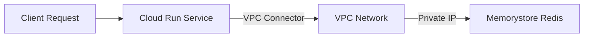

# How to Connect to Memorystore Redis from a Cloud Run Service

Author: [nawazdhandala](https://www.github.com/nawazdhandala)

Tags: GCP, Memorystore, Redis, Cloud Run, Serverless

Description: Configure a Cloud Run service to connect to Memorystore for Redis using a VPC connector, with working code examples and troubleshooting guidance.

---

Cloud Run is serverless, and Memorystore Redis lives inside a VPC. These two facts create a gap that you need to bridge. Cloud Run services do not run inside your VPC by default - they run on Google's infrastructure and access the internet directly. To reach a Memorystore Redis instance, which only has a private IP, you need a Serverless VPC Access connector.

I have set this up for multiple production services, and while the concept is simple, there are a few gotchas that can burn an hour of debugging. In this post, I will walk through the complete setup from creating the VPC connector to deploying a Cloud Run service that talks to Redis.

## Architecture Overview

Here is what the connection path looks like:



The VPC connector creates a bridge between the serverless Cloud Run environment and your VPC. Traffic from Cloud Run flows through the connector into the VPC, where it can reach the private IP of your Redis instance.

## Prerequisites

You will need:
- A Memorystore Redis instance (already created)
- The Serverless VPC Access API enabled
- A subnet with available IP space for the connector

Enable the required API:

```bash
# Enable the Serverless VPC Access API
gcloud services enable vpcaccess.googleapis.com
```

## Step 1: Create a Serverless VPC Access Connector

The connector needs its own IP range that does not overlap with existing subnets:

```bash
# Create a VPC connector with a /28 IP range
gcloud compute networks vpc-access connectors create redis-connector \
  --region=us-central1 \
  --network=default \
  --range=10.8.0.0/28 \
  --min-instances=2 \
  --max-instances=3 \
  --machine-type=e2-micro
```

Key parameters:
- `--range` - A /28 CIDR range that does not overlap with any existing subnets
- `--min-instances` and `--max-instances` - Control scaling of the connector itself
- `--machine-type` - The connector runs on small VMs. `e2-micro` is sufficient for most workloads

Verify the connector was created:

```bash
# Check the connector status
gcloud compute networks vpc-access connectors describe redis-connector \
  --region=us-central1
```

Wait for the state to show `READY` before proceeding.

## Step 2: Get Redis Connection Details

Retrieve the Redis instance IP and AUTH string:

```bash
# Get the Redis IP address
REDIS_HOST=$(gcloud redis instances describe my-redis \
  --region=us-central1 \
  --format="value(host)")
echo "Redis host: ${REDIS_HOST}"

# Get the AUTH string if AUTH is enabled
REDIS_AUTH=$(gcloud redis instances get-auth-string my-redis \
  --region=us-central1 \
  --format="value(authString)")
```

## Step 3: Build the Application

Here is a Python application using Flask that connects to Redis:

```python
# main.py - Cloud Run service that connects to Memorystore Redis
import os
import redis
from flask import Flask, jsonify, request

app = Flask(__name__)

def create_redis_pool():
    """Create a Redis connection pool with retry logic."""
    return redis.ConnectionPool(
        host=os.environ.get("REDIS_HOST", "10.0.0.3"),
        port=int(os.environ.get("REDIS_PORT", "6379")),
        password=os.environ.get("REDIS_AUTH"),
        decode_responses=True,
        max_connections=10,
        socket_timeout=5,
        socket_connect_timeout=5,
        retry_on_timeout=True,
        health_check_interval=30
    )

# Create the pool at module level so it persists across requests
# Cloud Run reuses container instances, so this avoids reconnecting every time
pool = create_redis_pool()

def get_redis():
    """Get a Redis client from the connection pool."""
    return redis.Redis(connection_pool=pool)

@app.route("/")
def index():
    return jsonify({"service": "cache-service", "status": "running"})

@app.route("/health")
def health():
    """Health check that verifies Redis connectivity."""
    try:
        r = get_redis()
        r.ping()
        return jsonify({"status": "healthy", "redis": "connected"})
    except redis.ConnectionError as e:
        return jsonify({"status": "unhealthy", "error": str(e)}), 503

@app.route("/api/cache", methods=["GET"])
def get_cache():
    """Get a value from the cache."""
    key = request.args.get("key")
    if not key:
        return jsonify({"error": "key parameter required"}), 400

    r = get_redis()
    value = r.get(key)

    if value is None:
        return jsonify({"key": key, "found": False}), 404

    return jsonify({"key": key, "value": value, "found": True})

@app.route("/api/cache", methods=["POST"])
def set_cache():
    """Set a value in the cache with optional TTL."""
    data = request.get_json()
    key = data.get("key")
    value = data.get("value")
    ttl = data.get("ttl", 3600)

    if not key or value is None:
        return jsonify({"error": "key and value required"}), 400

    r = get_redis()
    r.set(key, value, ex=ttl)

    return jsonify({"key": key, "value": value, "ttl": ttl})

if __name__ == "__main__":
    port = int(os.environ.get("PORT", 8080))
    app.run(host="0.0.0.0", port=port)
```

And the Dockerfile:

```dockerfile
# Dockerfile - Containerize the Flask application for Cloud Run
FROM python:3.11-slim

WORKDIR /app

# Install dependencies
COPY requirements.txt .
RUN pip install --no-cache-dir -r requirements.txt

# Copy application code
COPY main.py .

# Cloud Run expects the PORT environment variable
ENV PORT=8080

# Run with gunicorn for production performance
CMD exec gunicorn --bind :$PORT --workers 2 --threads 4 main:app
```

The `requirements.txt`:

```
flask==3.0.0
gunicorn==21.2.0
redis==5.0.1
```

## Step 4: Build and Deploy

Build the container image and deploy to Cloud Run with the VPC connector:

```bash
# Build the container image
gcloud builds submit --tag gcr.io/my-project/cache-service

# Deploy to Cloud Run with the VPC connector attached
gcloud run deploy cache-service \
  --image=gcr.io/my-project/cache-service \
  --region=us-central1 \
  --platform=managed \
  --vpc-connector=redis-connector \
  --vpc-egress=private-ranges-only \
  --set-env-vars="REDIS_HOST=${REDIS_HOST},REDIS_PORT=6379,REDIS_AUTH=${REDIS_AUTH}" \
  --min-instances=1 \
  --max-instances=10 \
  --allow-unauthenticated
```

The critical flags here:
- `--vpc-connector` - Attaches the VPC connector to route traffic into the VPC
- `--vpc-egress=private-ranges-only` - Only routes private IP traffic through the connector (more efficient than routing all traffic)
- `--min-instances=1` - Keeps at least one instance warm to avoid cold start latency

## Step 5: Test the Deployment

```bash
# Get the Cloud Run service URL
SERVICE_URL=$(gcloud run services describe cache-service \
  --region=us-central1 \
  --format="value(status.url)")

# Test health check (should show redis: connected)
curl "${SERVICE_URL}/health"

# Set a cache entry
curl -X POST "${SERVICE_URL}/api/cache" \
  -H "Content-Type: application/json" \
  -d '{"key": "test", "value": "hello from cloud run", "ttl": 600}'

# Get the cached value
curl "${SERVICE_URL}/api/cache?key=test"
```

## Handling Cold Starts

Cloud Run services can scale to zero, which means Redis connections are established on the first request after a cold start. This adds latency to the first request. Here are strategies to mitigate this:

**Set min-instances to 1 or more.** This keeps at least one container warm and connected to Redis.

**Use connection pooling.** The connection pool is created at module level, so it persists across requests within the same container instance.

**Add retry logic.** The first request after a cold start might be slightly slower. Client-side retries handle transient connection hiccups.

```python
# Retry wrapper for Redis operations that handles transient failures
import time

def redis_with_retry(operation, max_retries=3, delay=0.5):
    """Execute a Redis operation with retry logic for transient failures."""
    for attempt in range(max_retries):
        try:
            return operation()
        except (redis.ConnectionError, redis.TimeoutError) as e:
            if attempt == max_retries - 1:
                raise
            print(f"Redis retry {attempt + 1}/{max_retries}: {e}")
            time.sleep(delay * (attempt + 1))

# Usage
value = redis_with_retry(lambda: get_redis().get("my-key"))
```

## Troubleshooting

### Connection Refused or Timeout

This almost always means the VPC connector is not properly configured:

```bash
# Verify the VPC connector is in READY state
gcloud compute networks vpc-access connectors describe redis-connector \
  --region=us-central1

# Verify the connector's network matches the Redis instance's network
gcloud redis instances describe my-redis \
  --region=us-central1 \
  --format="value(authorizedNetwork)"

# Verify the connector is attached to the Cloud Run service
gcloud run services describe cache-service \
  --region=us-central1 \
  --format="value(spec.template.metadata.annotations)"
```

### VPC Connector IP Range Conflict

If the connector fails to create, the IP range likely overlaps with an existing subnet:

```bash
# List existing subnets to find non-overlapping ranges
gcloud compute networks subnets list --network=default
```

Choose a /28 range that does not overlap. Common choices: `10.8.0.0/28`, `10.9.0.0/28`.

### Slow Connections

If Redis operations are slower than expected (above 5ms):

- Check the VPC connector instances are not overloaded - scale up max-instances
- Ensure the Cloud Run service and Redis are in the same region
- Monitor the connector throughput in Cloud Monitoring

## Environment Variable Security

For production, use Secret Manager instead of plain environment variables for the Redis AUTH string:

```bash
# Store the Redis auth string in Secret Manager
echo -n "${REDIS_AUTH}" | gcloud secrets create redis-auth-string --data-file=-

# Deploy with Secret Manager reference
gcloud run deploy cache-service \
  --image=gcr.io/my-project/cache-service \
  --region=us-central1 \
  --vpc-connector=redis-connector \
  --set-env-vars="REDIS_HOST=${REDIS_HOST}" \
  --set-secrets="REDIS_AUTH=redis-auth-string:latest"
```

## Wrapping Up

Connecting Cloud Run to Memorystore Redis requires a VPC connector as the bridge between the serverless and VPC worlds. Create the connector, attach it to your Cloud Run service, and use connection pooling in your application. The setup takes a few extra steps compared to connecting from a VM, but once configured, your Cloud Run service gets the same sub-millisecond Redis performance as any other compute resource in the VPC.
