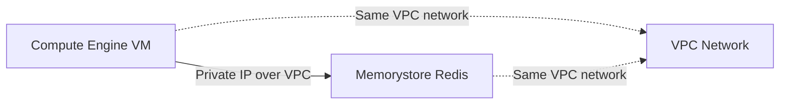

# How to Connect to Memorystore Redis from a Compute Engine VM

Author: [nawazdhandala](https://www.github.com/nawazdhandala)

Tags: GCP, Memorystore, Redis, Compute Engine, Networking

Description: Learn how to connect your Compute Engine VM instances to Memorystore for Redis, including network configuration, client setup, and connection testing.

---

Connecting a Compute Engine VM to Memorystore for Redis is one of the most common setups on Google Cloud. Your application runs on a VM, and you use Redis for caching, session storage, or as a message broker. The connection happens over a private IP within your VPC, so there is no internet traffic and latency is minimal.

That said, I have seen people struggle with this setup because of networking requirements that are not immediately obvious. In this post, I will walk through the complete process from creating the instances to establishing a working connection.

## Network Requirements

Before anything else, understand the networking model. Memorystore Redis instances are only accessible from resources within the same VPC network (or a peered network). They do not have public IP addresses. This means:

- Your VM must be in the same VPC network as the Redis instance
- Or your VM's network must be peered with the Redis instance's network
- Firewall rules must allow traffic on the Redis port (default 6379)

Here is the architecture:



## Step 1: Create the Redis Instance

If you have not created a Redis instance yet, do it now. Make note of the network you use:

```bash
# Create a Redis instance on the default network
gcloud redis instances create app-cache \
  --size=1 \
  --region=us-central1 \
  --tier=basic \
  --redis-version=redis_7_0 \
  --network=default
```

After creation, get the instance IP and port:

```bash
# Get the Redis instance host IP and port
gcloud redis instances describe app-cache \
  --region=us-central1 \
  --format="value(host,port)"
```

Save this output - you will need the IP address to connect.

## Step 2: Create a VM on the Same Network

Create your VM on the same VPC network as the Redis instance:

```bash
# Create a Compute Engine VM on the same network as Redis
gcloud compute instances create redis-client-vm \
  --zone=us-central1-a \
  --machine-type=e2-medium \
  --image-family=debian-12 \
  --image-project=debian-cloud \
  --network=default \
  --subnet=default
```

If you are using a custom VPC, specify it explicitly:

```bash
# Create a VM on a custom VPC network
gcloud compute instances create redis-client-vm \
  --zone=us-central1-a \
  --machine-type=e2-medium \
  --image-family=debian-12 \
  --image-project=debian-cloud \
  --network=my-vpc \
  --subnet=my-subnet
```

## Step 3: Install Redis Client Tools

SSH into the VM and install redis-cli for testing:

```bash
# SSH into the VM
gcloud compute ssh redis-client-vm --zone=us-central1-a

# Install redis-tools which includes redis-cli
sudo apt-get update
sudo apt-get install -y redis-tools
```

## Step 4: Test the Connection

Connect to Redis using the IP address from Step 1:

```bash
# Connect to Memorystore Redis using redis-cli
# Replace 10.0.0.3 with your actual Redis IP
redis-cli -h 10.0.0.3 -p 6379
```

If AUTH is enabled on the instance, authenticate:

```bash
# Connect with AUTH password
redis-cli -h 10.0.0.3 -p 6379 -a YOUR_AUTH_STRING
```

Once connected, test basic operations:

```bash
# Test basic Redis operations
127.0.0.1:6379> PING
PONG
127.0.0.1:6379> SET test-key "hello from compute engine"
OK
127.0.0.1:6379> GET test-key
"hello from compute engine"
127.0.0.1:6379> INFO server
```

## Connecting from Application Code

### Python

Install the Redis client library and connect:

```python
# connect_redis.py - Connect to Memorystore Redis from Python
import redis
import os

def get_redis_connection():
    """Create a connection pool to Memorystore Redis."""

    # Read connection details from environment variables
    redis_host = os.environ.get("REDIS_HOST", "10.0.0.3")
    redis_port = int(os.environ.get("REDIS_PORT", "6379"))
    redis_password = os.environ.get("REDIS_AUTH", None)

    # Create a connection pool for efficient connection reuse
    pool = redis.ConnectionPool(
        host=redis_host,
        port=redis_port,
        password=redis_password,
        decode_responses=True,  # Return strings instead of bytes
        max_connections=20,
        socket_timeout=5,
        socket_connect_timeout=5,
        retry_on_timeout=True
    )

    return redis.Redis(connection_pool=pool)

# Use the connection
r = get_redis_connection()

# Test connectivity
print(f"PING: {r.ping()}")

# Set and get a value
r.set("user:1001:name", "Alice", ex=3600)  # Expires in 1 hour
name = r.get("user:1001:name")
print(f"Name: {name}")

# Use hash maps for structured data
r.hset("user:1001", mapping={
    "name": "Alice",
    "email": "alice@example.com",
    "login_count": 42
})
user = r.hgetall("user:1001")
print(f"User: {user}")
```

### Node.js

```javascript
// connect_redis.js - Connect to Memorystore Redis from Node.js
const redis = require("redis");

async function connectToRedis() {
    // Create a Redis client with connection settings
    const client = redis.createClient({
        socket: {
            host: process.env.REDIS_HOST || "10.0.0.3",
            port: parseInt(process.env.REDIS_PORT || "6379"),
            connectTimeout: 5000,
            reconnectStrategy: (retries) => {
                // Exponential backoff with max 30 second delay
                return Math.min(retries * 100, 30000);
            }
        },
        password: process.env.REDIS_AUTH || undefined
    });

    // Handle connection events
    client.on("error", (err) => console.error("Redis error:", err));
    client.on("connect", () => console.log("Connected to Redis"));

    await client.connect();
    return client;
}

async function main() {
    const client = await connectToRedis();

    // Test basic operations
    await client.set("greeting", "Hello from Node.js", { EX: 3600 });
    const value = await client.get("greeting");
    console.log("Value:", value);

    await client.disconnect();
}

main().catch(console.error);
```

### Go

```go
// main.go - Connect to Memorystore Redis from Go
package main

import (
    "context"
    "fmt"
    "os"
    "time"

    "github.com/redis/go-redis/v9"
)

func main() {
    ctx := context.Background()

    // Configure the Redis client
    host := os.Getenv("REDIS_HOST")
    if host == "" {
        host = "10.0.0.3"
    }

    rdb := redis.NewClient(&redis.Options{
        Addr:         fmt.Sprintf("%s:6379", host),
        Password:     os.Getenv("REDIS_AUTH"),
        DB:           0,
        DialTimeout:  5 * time.Second,
        ReadTimeout:  3 * time.Second,
        WriteTimeout: 3 * time.Second,
        PoolSize:     20,
    })

    // Test connectivity
    pong, err := rdb.Ping(ctx).Result()
    if err != nil {
        panic(err)
    }
    fmt.Println("PING:", pong)

    // Set and get a value
    err = rdb.Set(ctx, "go-key", "Hello from Go", time.Hour).Err()
    if err != nil {
        panic(err)
    }

    val, err := rdb.Get(ctx, "go-key").Result()
    if err != nil {
        panic(err)
    }
    fmt.Println("Value:", val)
}
```

## Troubleshooting Connection Issues

### Cannot Connect - Connection Refused

The most common problem. Check these in order:

```bash
# 1. Verify the Redis instance is running and get its IP
gcloud redis instances describe app-cache --region=us-central1

# 2. Verify the VM is on the same network
gcloud compute instances describe redis-client-vm \
  --zone=us-central1-a \
  --format="value(networkInterfaces[0].network)"

# 3. Test network connectivity from the VM
telnet 10.0.0.3 6379
```

### Timeout Errors

If connections time out rather than being refused:

```bash
# Check if there is a firewall rule blocking Redis port
gcloud compute firewall-rules list --filter="network=default"

# Create a firewall rule to allow Redis traffic if needed
gcloud compute firewall-rules create allow-redis \
  --network=default \
  --allow=tcp:6379 \
  --source-ranges=10.0.0.0/8 \
  --description="Allow Redis traffic from internal IPs"
```

### AUTH Required Error

If you get `NOAUTH Authentication required`:

```bash
# Get the AUTH string from the Redis instance
gcloud redis instances get-auth-string app-cache --region=us-central1
```

Then pass the AUTH string when connecting.

## Performance Best Practices

**Use connection pooling.** Creating a new connection for every Redis operation adds significant latency. All the code examples above use connection pools.

**Deploy VMs in the same region as Redis.** Cross-region connections add network latency that defeats the purpose of an in-memory cache.

**Keep your VM and Redis in the same zone when possible.** Same-zone latency is typically under 0.5ms, while cross-zone can be 1-2ms.

**Monitor connection count.** Memorystore has a maximum connection limit based on instance size. Track active connections to avoid hitting it.

```bash
# Check current connection count via Redis INFO
redis-cli -h 10.0.0.3 INFO clients
```

## Wrapping Up

Connecting a Compute Engine VM to Memorystore Redis boils down to getting the networking right. Both resources need to be on the same VPC, firewall rules need to allow traffic on port 6379, and your application should use connection pooling for production workloads. Once the network path is established, Redis commands from your VM execute in sub-millisecond times, giving you the caching performance you need.
