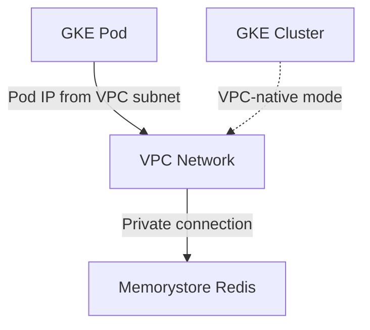

# How to Connect to Memorystore Redis from a GKE Cluster

Author: [nawazdhandala](https://www.github.com/nawazdhandala)

Tags: GCP, Memorystore, Redis, GKE, Kubernetes

Description: Connect your GKE pods to Memorystore for Redis with proper networking, Kubernetes secrets for credentials, and application-level connection pooling.

---

Running applications on GKE and caching data in Memorystore Redis is a pattern I use in almost every production deployment. Redis handles session state, API response caching, rate limiting, and feature flags while GKE runs the application workloads. The tricky part is getting the networking right between your Kubernetes cluster and the Redis instance.

In this post, I will cover the full setup - from network configuration to deploying applications that connect to Redis from GKE pods.

## Network Prerequisites

GKE pods can connect to Memorystore Redis only if the cluster's VPC network matches (or peers with) the Redis instance's network. There are two networking modes in GKE that affect this:

**VPC-native clusters (recommended):** Pods get IP addresses from a VPC subnet. They can connect directly to Memorystore.

**Routes-based clusters:** Pods use a separate IP range. You may need additional configuration for Memorystore connectivity.

Always use VPC-native clusters for new deployments. If you already have a routes-based cluster, you can still connect but it requires creating a custom route.



## Step 1: Create the Redis Instance

Create a Redis instance on the same network as your GKE cluster:

```bash
# Create a Memorystore Redis instance on the same VPC as GKE
gcloud redis instances create gke-redis-cache \
  --size=2 \
  --region=us-central1 \
  --tier=standard \
  --redis-version=redis_7_0 \
  --network=default \
  --enable-auth
```

Retrieve the connection details:

```bash
# Get the Redis host IP address
REDIS_HOST=$(gcloud redis instances describe gke-redis-cache \
  --region=us-central1 \
  --format="value(host)")
echo "Redis host: ${REDIS_HOST}"

# Get the AUTH string
REDIS_AUTH=$(gcloud redis instances get-auth-string gke-redis-cache \
  --region=us-central1 \
  --format="value(authString)")
echo "Redis auth string retrieved"
```

## Step 2: Verify GKE Cluster Configuration

Make sure your GKE cluster is VPC-native:

```bash
# Check if the cluster is VPC-native
gcloud container clusters describe my-gke-cluster \
  --zone=us-central1-a \
  --format="value(ipAllocationPolicy.useIpAliases)"
```

If the output is `True`, you are using a VPC-native cluster and Memorystore connectivity will work out of the box.

If you need to create a new cluster:

```bash
# Create a VPC-native GKE cluster on the same network as Redis
gcloud container clusters create my-gke-cluster \
  --zone=us-central1-a \
  --network=default \
  --subnetwork=default \
  --enable-ip-alias \
  --num-nodes=3
```

## Step 3: Store Redis Credentials in Kubernetes

Store the Redis connection details as a Kubernetes secret:

```bash
# Create a Kubernetes secret with Redis connection information
kubectl create secret generic redis-credentials \
  --from-literal=redis-host="${REDIS_HOST}" \
  --from-literal=redis-port="6379" \
  --from-literal=redis-auth="${REDIS_AUTH}"
```

Verify the secret was created:

```bash
# Verify the secret exists
kubectl get secret redis-credentials
kubectl describe secret redis-credentials
```

## Step 4: Deploy an Application That Uses Redis

Here is a complete Kubernetes deployment that connects to Redis. First, the application code:

```python
# app.py - Flask application that uses Memorystore Redis for caching
import os
import redis
from flask import Flask, jsonify

app = Flask(__name__)

def get_redis_client():
    """Create a Redis client using environment variables from Kubernetes secret."""
    return redis.Redis(
        host=os.environ["REDIS_HOST"],
        port=int(os.environ.get("REDIS_PORT", "6379")),
        password=os.environ.get("REDIS_AUTH"),
        decode_responses=True,
        socket_timeout=5,
        socket_connect_timeout=5,
        retry_on_timeout=True
    )

# Initialize the Redis connection at module level
redis_client = get_redis_client()

@app.route("/health")
def health():
    """Health check endpoint that verifies Redis connectivity."""
    try:
        redis_client.ping()
        return jsonify({"status": "healthy", "redis": "connected"}), 200
    except redis.ConnectionError:
        return jsonify({"status": "unhealthy", "redis": "disconnected"}), 503

@app.route("/cache/<key>")
def get_cached(key):
    """Get a cached value from Redis."""
    value = redis_client.get(key)
    if value is None:
        return jsonify({"key": key, "value": None, "cached": False}), 404
    return jsonify({"key": key, "value": value, "cached": True})

@app.route("/cache/<key>/<value>")
def set_cached(key, value):
    """Set a cached value in Redis with 1-hour TTL."""
    redis_client.set(key, value, ex=3600)
    return jsonify({"key": key, "value": value, "ttl": 3600})

if __name__ == "__main__":
    app.run(host="0.0.0.0", port=8080)
```

Now the Kubernetes deployment manifest:

```yaml
# deployment.yaml - Kubernetes deployment with Redis connection from secrets
apiVersion: apps/v1
kind: Deployment
metadata:
  name: cache-app
  labels:
    app: cache-app
spec:
  replicas: 3
  selector:
    matchLabels:
      app: cache-app
  template:
    metadata:
      labels:
        app: cache-app
    spec:
      containers:
        - name: cache-app
          image: gcr.io/my-project/cache-app:latest
          ports:
            - containerPort: 8080
          # Inject Redis credentials from Kubernetes secret
          env:
            - name: REDIS_HOST
              valueFrom:
                secretKeyRef:
                  name: redis-credentials
                  key: redis-host
            - name: REDIS_PORT
              valueFrom:
                secretKeyRef:
                  name: redis-credentials
                  key: redis-port
            - name: REDIS_AUTH
              valueFrom:
                secretKeyRef:
                  name: redis-credentials
                  key: redis-auth
          # Health checks using the /health endpoint
          readinessProbe:
            httpGet:
              path: /health
              port: 8080
            initialDelaySeconds: 5
            periodSeconds: 10
          livenessProbe:
            httpGet:
              path: /health
              port: 8080
            initialDelaySeconds: 15
            periodSeconds: 20
          resources:
            requests:
              memory: "128Mi"
              cpu: "100m"
            limits:
              memory: "256Mi"
              cpu: "500m"
---
apiVersion: v1
kind: Service
metadata:
  name: cache-app-service
spec:
  selector:
    app: cache-app
  ports:
    - port: 80
      targetPort: 8080
  type: ClusterIP
```

Deploy it:

```bash
# Apply the deployment and service
kubectl apply -f deployment.yaml

# Check the deployment status
kubectl get pods -l app=cache-app
kubectl logs -l app=cache-app --tail=20
```

## Step 5: Test Connectivity from a Pod

Verify the connection works from inside a pod:

```bash
# Run a temporary pod to test Redis connectivity
kubectl run redis-test --rm -it --image=redis:7 -- \
  redis-cli -h ${REDIS_HOST} -p 6379 -a ${REDIS_AUTH} PING
```

Or for more detailed testing:

```bash
# Run a debug pod with redis-cli available
kubectl run redis-debug --rm -it --image=redis:7 -- bash

# Inside the pod, connect to Redis
redis-cli -h 10.0.0.3 -p 6379 -a YOUR_AUTH_STRING
# > PING
# PONG
# > SET gke-test "connected from gke"
# OK
# > GET gke-test
# "connected from gke"
```

## Troubleshooting

### Pods Cannot Reach Redis

The most common issue is a networking mismatch. Work through this checklist:

```bash
# 1. Confirm the GKE cluster network matches the Redis network
gcloud container clusters describe my-gke-cluster \
  --zone=us-central1-a \
  --format="value(network)"

gcloud redis instances describe gke-redis-cache \
  --region=us-central1 \
  --format="value(authorizedNetwork)"

# 2. Verify the cluster uses IP aliases (VPC-native)
gcloud container clusters describe my-gke-cluster \
  --zone=us-central1-a \
  --format="value(ipAllocationPolicy.useIpAliases)"

# 3. Check if there are firewall rules blocking port 6379
gcloud compute firewall-rules list \
  --filter="network=default" \
  --format="table(name,direction,allowed)"
```

### Connection Timeouts

If connections time out instead of being refused, the issue is usually network-level:

- Verify the pod can reach the Redis IP: `kubectl exec -it <pod> -- nc -zv <redis-ip> 6379`
- Check if network policies in GKE are blocking egress traffic
- Ensure the Redis instance is in the same region as the GKE cluster

### AUTH Errors

If you see `NOAUTH Authentication required` or `ERR invalid password`:

```bash
# Verify the auth string matches what the instance expects
gcloud redis instances get-auth-string gke-redis-cache --region=us-central1

# Check if the secret value matches
kubectl get secret redis-credentials -o jsonpath='{.data.redis-auth}' | base64 -d
```

## Using ConfigMaps for Non-Sensitive Settings

For non-sensitive Redis configuration like host and port, you can use a ConfigMap instead of putting everything in a secret:

```yaml
# redis-config.yaml - ConfigMap for non-sensitive Redis settings
apiVersion: v1
kind: ConfigMap
metadata:
  name: redis-config
data:
  REDIS_HOST: "10.0.0.3"
  REDIS_PORT: "6379"
  REDIS_DB: "0"
  REDIS_MAX_CONNECTIONS: "20"
  REDIS_TIMEOUT: "5"
```

Then reference both the ConfigMap and Secret in your deployment:

```yaml
# In the container spec, reference both ConfigMap and Secret
envFrom:
  - configMapRef:
      name: redis-config
  - secretRef:
      name: redis-credentials
```

## Wrapping Up

Connecting GKE to Memorystore Redis requires matching VPC networks and using VPC-native clusters. Once the networking is configured, store your Redis credentials in Kubernetes secrets, inject them as environment variables, and use connection pooling in your application code. The combination gives you a production-grade caching layer that your GKE pods can access with sub-millisecond latency.
