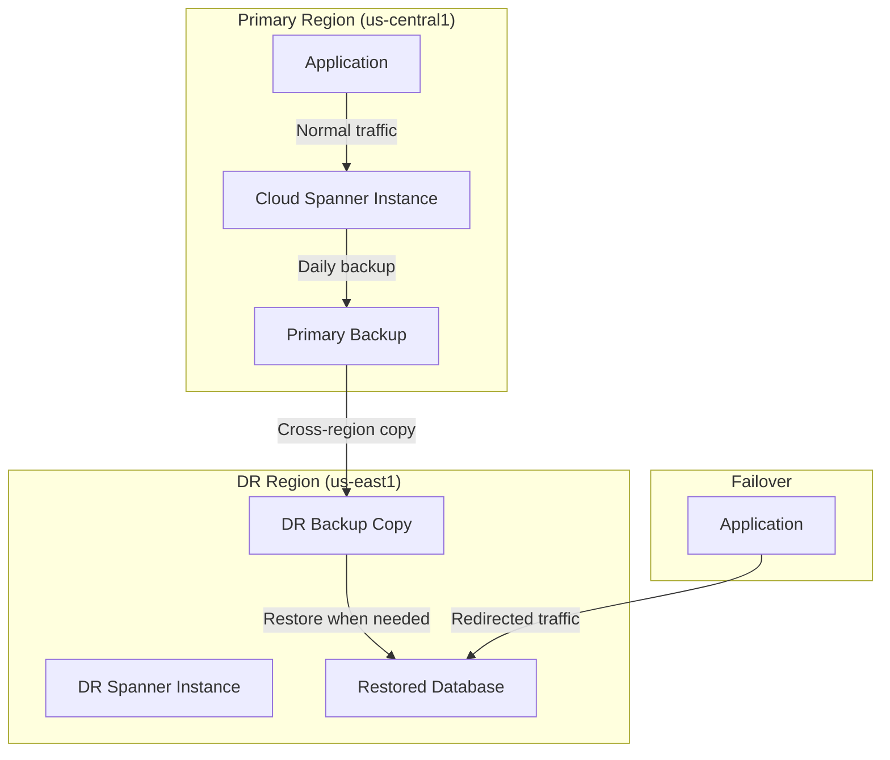

# How to Copy Cloud Spanner Backups Across Regions for Disaster Recovery

Author: [nawazdhandala](https://www.github.com/nawazdhandala)

Tags: GCP, Cloud Spanner, Backup, Disaster Recovery, Cross-Region

Description: Learn how to copy Cloud Spanner backups across regions to build a robust disaster recovery strategy with step-by-step instructions.

---

Having backups in the same region as your database is good. Having backups in a different region is much better. If your primary region has an outage, a co-located backup does not help you recover quickly. Cloud Spanner supports copying backups across regions, letting you build a disaster recovery strategy that can withstand regional failures. In this post, I will walk through how to set up cross-region backup copies and design a DR plan around them.

## Why Cross-Region Backups Matter

A regional Spanner instance stores data in a single region. If that region experiences an outage - whether from a natural disaster, network issue, or infrastructure failure - your database becomes unavailable. If your backups are in the same region, they are also unavailable.

Cross-region backup copies solve this by placing a copy of your backup in a different region. If your primary region goes down, you can restore from the backup in the secondary region and have your database running again.

Even for multi-region Spanner instances, cross-region backup copies can be useful. They give you an additional layer of protection and the ability to restore into a completely different instance configuration if needed.

## Creating a Cross-Region Backup Copy

First, you need a source backup. Let's assume you already have one:

```bash
# Check that the source backup exists and is ready
gcloud spanner backups describe daily-backup-20260217 \
    --instance=my-spanner-instance
```

Now copy it to an instance in a different region:

```bash
# Copy the backup to an instance in a different region
gcloud spanner backups copy \
    --source-backup=projects/my-project/instances/my-spanner-instance/backups/daily-backup-20260217 \
    --destination-backup=daily-backup-20260217-copy \
    --destination-instance=my-dr-instance \
    --expiration-date=2026-03-19T00:00:00Z \
    --async
```

A few things to note:

- The source backup must be in the READY state (not still being created)
- The destination instance must already exist in the target region
- The destination instance can have a different instance configuration than the source
- The expiration date for the copy is independent of the source backup's expiration

## Setting Up the DR Instance

Before you can copy backups cross-region, you need a destination instance. This instance does not need to be running a database - it just needs to exist so backups can be stored there:

```bash
# Create a minimal instance in the DR region for storing backup copies
gcloud spanner instances create my-dr-instance \
    --config=regional-us-east1 \
    --display-name="DR Instance (US East)" \
    --processing-units=100
```

You can use the smallest possible instance (100 processing units) since it is only holding backups, not serving traffic. This keeps costs low while giving you a target for cross-region copies.

## Monitoring Copy Progress

Cross-region copies can take a while, especially for large databases. Monitor the progress:

```bash
# Check the status of backup copy operations on the destination instance
gcloud spanner operations list \
    --instance=my-dr-instance \
    --type=BACKUP
```

The copy operation creates a complete, independent backup in the destination instance. Once the copy is complete, it has no dependency on the source backup. You can delete the source without affecting the copy.

## Automating Cross-Region Copies

Manual copies are fine for one-off situations, but you want this automated for production. Here is a Cloud Function that copies the latest backup to the DR region:

```python
import functions_framework
from google.cloud import spanner_admin_database_v1
from datetime import datetime, timedelta, timezone

@functions_framework.http
def copy_backup_to_dr(request):
    """Copy the latest backup to the DR instance in another region."""

    client = spanner_admin_database_v1.DatabaseAdminClient()

    # Source and destination instance paths
    source_instance = "projects/my-project/instances/my-spanner-instance"
    dest_instance = "projects/my-project/instances/my-dr-instance"

    # Find the latest completed backup
    backups = client.list_backups(
        parent=source_instance,
        filter="state:READY"
    )

    # Get the most recent backup by creation time
    latest_backup = None
    for backup in backups:
        if latest_backup is None or backup.create_time > latest_backup.create_time:
            latest_backup = backup

    if latest_backup is None:
        return "No ready backups found", 404

    # Generate a copy name based on the current date
    today = datetime.now(timezone.utc).strftime("%Y%m%d")
    copy_id = f"dr-copy-{today}"

    # Set expiration for the copy
    expire_time = datetime.now(timezone.utc) + timedelta(days=30)

    # Start the copy operation
    operation = client.copy_backup(
        parent=dest_instance,
        backup_id=copy_id,
        source_backup=latest_backup.name,
        expire_time=expire_time,
    )

    return f"Backup copy {copy_id} started from {latest_backup.name}", 200
```

Schedule this to run daily, a few hours after your primary backup completes:

```bash
# Run the DR copy 3 hours after the primary backup (at 5 AM UTC)
gcloud scheduler jobs create http daily-dr-copy \
    --schedule="0 5 * * *" \
    --uri="https://REGION-my-project.cloudfunctions.net/copy_backup_to_dr" \
    --http-method=POST \
    --time-zone="UTC"
```

## Restoring from a Cross-Region Copy

When disaster strikes, you need to restore from the DR backup. The process is the same as restoring any backup:

```bash
# Restore the DR backup to a new database on the DR instance
gcloud spanner databases restore \
    --destination-database=my-database-dr \
    --source-backup=dr-copy-20260217 \
    --source-instance=my-dr-instance \
    --destination-instance=my-dr-instance
```

Before this database can serve production traffic, you may need to scale up the DR instance:

```bash
# Scale up the DR instance to handle production workload
gcloud spanner instances update my-dr-instance \
    --processing-units=3000
```

Then point your application to the new database endpoint and you are back in business.

## DR Architecture Overview

Here is how the complete DR architecture looks:



## Recovery Time and Point Objectives

When planning your DR strategy, think about two key metrics:

**Recovery Point Objective (RPO)** - How much data can you afford to lose? If you copy backups daily, your RPO is up to 24 hours. For tighter RPO, copy more frequently.

**Recovery Time Objective (RTO)** - How quickly do you need to be back online? Restore time depends on database size. A 10 GB database might restore in minutes; a multi-terabyte database could take hours.

To minimize RPO, you can increase the frequency of backup copies. To minimize RTO, keep the DR instance ready with enough processing units to handle a restore quickly, and pre-stage any configuration needed.

## Cost Optimization

Cross-region DR does add cost, but you can minimize it:

- Use the minimum processing units (100) on the DR instance when it is not actively serving traffic
- Set reasonable expiration dates on backup copies - you probably do not need 90 days of daily copies in the DR region
- Keep only the most recent few copies in the DR region and let older ones expire
- Consider weekly copies to DR for less critical databases

## Testing Your DR Plan

A DR plan that has never been tested is not really a plan. Schedule regular DR drills:

1. Restore from the DR backup to a test database
2. Run your application's smoke tests against the restored database
3. Verify data consistency
4. Measure the actual restore time
5. Document the steps and any issues

```bash
# DR drill: restore from the latest DR backup
gcloud spanner databases restore \
    --destination-database=dr-drill-20260217 \
    --source-backup=dr-copy-20260217 \
    --source-instance=my-dr-instance \
    --destination-instance=my-dr-instance

# Clean up after the drill
gcloud spanner databases delete dr-drill-20260217 \
    --instance=my-dr-instance
```

## Wrapping Up

Cross-region backup copies are a critical component of a production-grade disaster recovery strategy for Cloud Spanner. The setup is not complicated - create a DR instance in another region, automate daily backup copies, and practice restoring regularly. The cost of maintaining cross-region copies is minimal compared to the cost of data loss or extended downtime. If your Spanner database holds data that matters to your business, cross-region backups should be non-negotiable.
