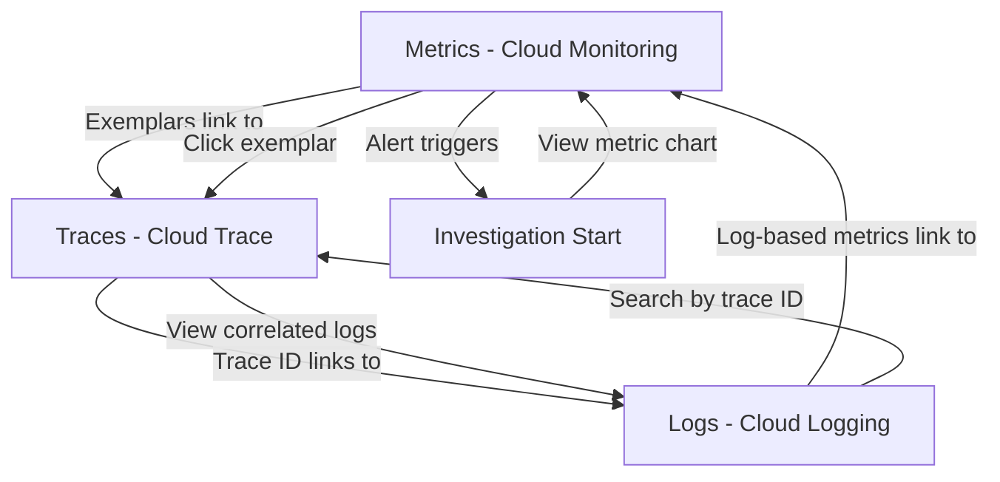
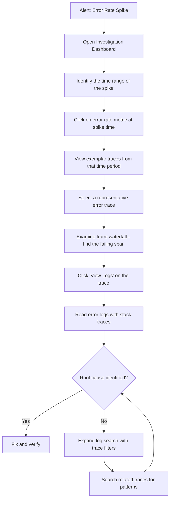

# How to Correlate Metrics Logs and Traces in a Unified Investigation Workflow on GCP

Author: [nawazdhandala](https://www.github.com/nawazdhandala)

Tags: GCP, Observability, Cloud Monitoring, Cloud Logging, Cloud Trace, Investigation, Google Cloud

Description: Learn how to build a unified investigation workflow on Google Cloud by correlating metrics, logs, and traces for faster incident resolution.

---

When an alert fires at 2 AM, the last thing you want is to bounce between three different tools trying to piece together what happened. Google Cloud actually has pretty good built-in correlation between Cloud Monitoring (metrics), Cloud Logging (logs), and Cloud Trace (traces) - but most teams do not take advantage of it because they do not know the connective tissue exists. In this post, I will show you how to build an investigation workflow that moves seamlessly between all three signals.

## The Investigation Problem

Here is what a typical incident investigation looks like without correlation: you get an alert about high error rates, switch to the logs console, search for errors, find a stack trace, wonder which request triggered it, switch to traces, search by time range, find a slow trace, wonder if it is related to the error, switch back to metrics to see if the pattern matches. It takes forever and you are never sure you are looking at the right data.

With proper correlation, the workflow becomes: alert fires, click through to the relevant traces from the metric chart, click through to the logs from the trace. Three clicks and you have the full picture.

## The Correlation Model

Here is how the three signals connect in Google Cloud.



## Step 1: Ensure Trace Context in Logs

The foundation of correlation is the trace context in your logs. When a log entry includes a trace ID, Cloud Logging automatically creates a clickable link to Cloud Trace.

For applications using the Google Cloud Logging client library, this happens automatically when you are within a traced request. For custom setups, you need to include the trace context explicitly.

```python
# logging_setup.py - Configure structured logging with trace context

import logging
import json
from opentelemetry import trace

class GCPStructuredFormatter(logging.Formatter):
    """Formatter that outputs JSON structured logs with trace context
    compatible with Google Cloud Logging."""

    def __init__(self, project_id):
        super().__init__()
        self.project_id = project_id

    def format(self, record):
        log_entry = {
            "severity": record.levelname,
            "message": record.getMessage(),
            "logger": record.name,
        }

        # Get the current span context and add trace correlation fields
        span = trace.get_current_span()
        if span and span.get_span_context().is_valid:
            ctx = span.get_span_context()
            trace_id = format(ctx.trace_id, '032x')
            span_id = format(ctx.span_id, '016x')

            # These specific field names are recognized by Cloud Logging
            log_entry["logging.googleapis.com/trace"] = (
                f"projects/{self.project_id}/traces/{trace_id}"
            )
            log_entry["logging.googleapis.com/spanId"] = span_id
            log_entry["logging.googleapis.com/trace_sampled"] = (
                ctx.trace_flags.sampled
            )

        # Add any extra fields from the log record
        if hasattr(record, 'extra_fields'):
            log_entry.update(record.extra_fields)

        return json.dumps(log_entry)

def setup_logging(project_id):
    handler = logging.StreamHandler()
    handler.setFormatter(GCPStructuredFormatter(project_id))

    root_logger = logging.getLogger()
    root_logger.handlers.clear()
    root_logger.addHandler(handler)
    root_logger.setLevel(logging.INFO)
```

## Step 2: Enable Metric Exemplars

Exemplars are the bridge from metrics to traces. When you record a metric data point, you can attach the trace ID of the request that generated it. This lets you click from a metric chart directly to a specific trace.

```python
# metrics_with_exemplars.py - Record metrics with trace exemplars

from opentelemetry import metrics, trace
from opentelemetry.sdk.metrics import MeterProvider
from opentelemetry.sdk.metrics.export import PeriodicExportingMetricReader

meter = metrics.get_meter("my-service")

# Create a histogram for request duration
request_duration = meter.create_histogram(
    name="http.server.request.duration",
    description="HTTP request duration",
    unit="ms",
)

def record_request_metrics(method, path, status_code, duration_ms):
    """Record request metrics. The current span context is automatically
    attached as an exemplar by the OpenTelemetry SDK."""
    request_duration.record(
        duration_ms,
        attributes={
            "http.method": method,
            "http.route": path,
            "http.status_code": status_code,
        },
    )
```

## Step 3: Build the Investigation Dashboard

Create a dashboard designed for the investigation workflow. The layout should guide you from high-level metrics to specific traces.

```bash
# Create an investigation-oriented dashboard
cat > investigation-dashboard.json << 'EOF'
{
  "displayName": "Incident Investigation Dashboard",
  "mosaicLayout": {
    "columns": 12,
    "tiles": [
      {
        "width": 6,
        "height": 4,
        "widget": {
          "title": "Error Rate (click for exemplar traces)",
          "xyChart": {
            "dataSets": [{
              "timeSeriesQuery": {
                "timeSeriesQueryLanguage": "{ fetch https_lb_rule::loadbalancing.googleapis.com/https/request_count | filter metric.response_code_class = 500 | group_by [], sum(val()) | every 1m ; fetch https_lb_rule::loadbalancing.googleapis.com/https/request_count | group_by [], sum(val()) | every 1m } | ratio | mul(100)"
              },
              "plotType": "LINE"
            }]
          }
        }
      },
      {
        "xPos": 6,
        "width": 6,
        "height": 4,
        "widget": {
          "title": "P95 Latency (click for slow traces)",
          "xyChart": {
            "dataSets": [{
              "timeSeriesQuery": {
                "timeSeriesQueryLanguage": "fetch https_lb_rule::loadbalancing.googleapis.com/https/total_latencies | group_by [resource.url_map_name], percentile(val(), 95) | every 1m"
              },
              "plotType": "LINE"
            }]
          }
        }
      },
      {
        "yPos": 4,
        "width": 12,
        "height": 4,
        "widget": {
          "title": "Error Logs (filtered to severity ERROR and above)",
          "logsPanel": {
            "filter": "severity>=ERROR",
            "resourceNames": ["projects/my-gcp-project"]
          }
        }
      },
      {
        "yPos": 8,
        "width": 12,
        "height": 4,
        "widget": {
          "title": "Recent Traces (sorted by latency)",
          "xyChart": {
            "dataSets": [{
              "timeSeriesQuery": {
                "timeSeriesQueryLanguage": "fetch https_lb_rule::loadbalancing.googleapis.com/https/total_latencies | group_by [resource.backend_target_name], percentile(val(), 99) | every 1m"
              },
              "plotType": "LINE"
            }]
          }
        }
      }
    ]
  }
}
EOF

gcloud monitoring dashboards create --config-from-file=investigation-dashboard.json
```

## Step 4: The Investigation Workflow

Here is the step-by-step workflow to follow when an incident occurs.



## Step 5: Using Log-Based Metrics for Deeper Correlation

Create log-based metrics to surface patterns that are not visible in standard metrics.

```bash
# Create a log-based metric for specific error types
gcloud logging metrics create database-connection-errors \
    --description="Count of database connection errors" \
    --log-filter='resource.type="k8s_container" AND severity>=ERROR AND textPayload=~"connection refused"' \
    --project=my-gcp-project

# Create a log-based metric for slow query warnings
gcloud logging metrics create slow-query-warnings \
    --description="Count of slow query log entries" \
    --log-filter='resource.type="cloudsql_database" AND textPayload=~"duration:.*ms"' \
    --project=my-gcp-project
```

These log-based metrics appear alongside your regular metrics in Cloud Monitoring, letting you correlate application-level errors with infrastructure-level patterns.

## Step 6: Querying Across Signals

Use Cloud Logging's trace filter to find all logs for a specific trace.

```
# In Cloud Logging, find all logs for a trace
trace="projects/my-gcp-project/traces/abc123def456789"

# Find all error logs with trace context during a time window
severity>=ERROR
timestamp>="2026-02-17T10:00:00Z"
timestamp<="2026-02-17T10:30:00Z"
labels."logging.googleapis.com/trace"!=""
```

Use MQL to query metrics that correlate with specific time periods identified in traces.

```
# Find the error rate during the time window of a specific trace
fetch https_lb_rule::loadbalancing.googleapis.com/https/request_count
| filter metric.response_code_class = 500
| group_by [resource.backend_target_name], rate(val())
| every 1m
| within 30m, d'2026/02/17 10:00'
```

## Practical Tips

**Always include service name in logs.** When filtering logs by trace ID, having the service name as a structured field makes it easy to see which service logged what.

**Use consistent resource labels.** If your GKE pods, Cloud Run services, and Cloud Functions all use the same `service.name` label, you can filter and correlate across all three compute platforms.

**Set up saved queries.** In Cloud Logging, save your common investigation queries so you can run them with one click during an incident.

**Time sync matters.** All three Google Cloud observability services use UTC timestamps. Make sure your dashboards are set to the same timezone to avoid confusion during investigations.

## Wrapping Up

The power of Google Cloud's observability suite is not in any single tool - it is in the connections between them. Metrics tell you something is wrong. Traces tell you where in the request path the problem is. Logs tell you why it happened. By ensuring trace context flows through your logs, enabling exemplars on your metrics, and building dashboards that guide the investigation workflow, you turn three separate tools into one integrated investigation experience. The setup effort is modest, but the time saved during incidents is significant.
