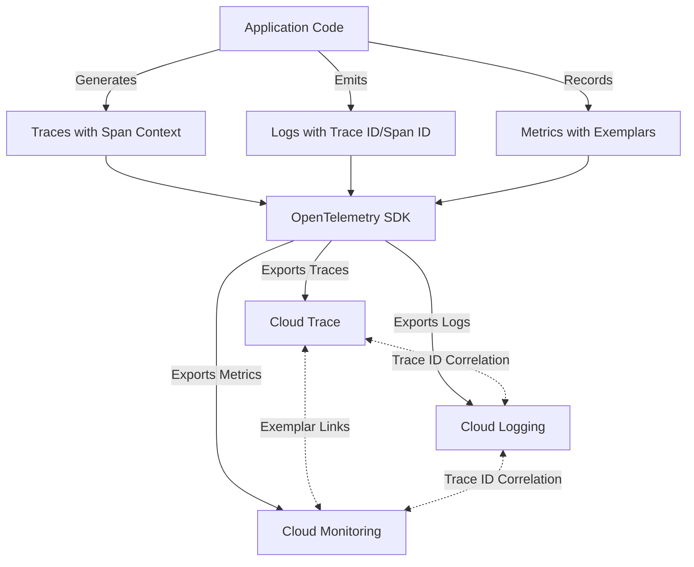
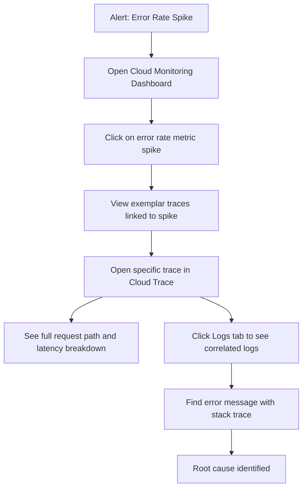

# How to Correlate Traces Logs and Metrics Using OpenTelemetry on GCP

Author: [nawazdhandala](https://www.github.com/nawazdhandala)

Tags: GCP, OpenTelemetry, Observability, Cloud Trace, Cloud Logging, Cloud Monitoring

Description: Learn how to correlate traces, logs, and metrics using OpenTelemetry on Google Cloud Platform for a unified observability experience.

---

One of the most frustrating things about debugging production issues is having traces in one tool, logs in another, and metrics in yet another, with no way to connect them. You see a latency spike in your metrics, but which traces are affected? You find an error log, but what was the full request path? On Google Cloud, OpenTelemetry makes it possible to link all three signals together so you can jump from a metric anomaly to the relevant traces and their associated logs. Here is how to set it up properly.

## The Three Pillars Problem

Traces, logs, and metrics are often called the three pillars of observability. But pillars standing alone are not very useful. The real value comes when you can correlate them. When a metric shows elevated error rates, you want to click through to the traces that contain errors, and from those traces, see the exact log lines that explain what went wrong.

OpenTelemetry solves this by using a shared context - the trace ID and span ID - across all three signals. When you emit a log line during a traced request, the trace ID gets attached to that log. When you record a metric, exemplars link it back to specific traces.

## Architecture

Here is how the correlation works end to end.



## Step 1: Set Up the OpenTelemetry SDK with All Three Signals

Here is a Python example that configures traces, logs, and metrics together with proper correlation.

```python
# setup_otel.py - Initialize OpenTelemetry with all three signals correlated

import logging
from opentelemetry import trace, metrics
from opentelemetry.sdk.trace import TracerProvider
from opentelemetry.sdk.trace.export import BatchSpanProcessor
from opentelemetry.sdk.metrics import MeterProvider
from opentelemetry.sdk.metrics.export import PeriodicExportingMetricReader
from opentelemetry.sdk._logs import LoggerProvider, LoggingHandler
from opentelemetry.sdk._logs.export import BatchLogRecordProcessor
from opentelemetry.exporter.cloud_trace import CloudTraceSpanExporter
from opentelemetry.exporter.cloud_monitoring import CloudMonitoringMetricsExporter
from opentelemetry.exporter.cloud_logging import CloudLoggingExporter
from opentelemetry.sdk.resources import Resource

def setup_opentelemetry(project_id: str, service_name: str):
    # Define a shared resource so all signals have the same service identity
    resource = Resource.create({
        "service.name": service_name,
        "service.namespace": "production",
        "cloud.provider": "gcp",
        "cloud.platform": "gcp_compute_engine",
    })

    # --- Traces ---
    trace_exporter = CloudTraceSpanExporter(project_id=project_id)
    tracer_provider = TracerProvider(resource=resource)
    tracer_provider.add_span_processor(BatchSpanProcessor(trace_exporter))
    trace.set_tracer_provider(tracer_provider)

    # --- Metrics ---
    metric_exporter = CloudMonitoringMetricsExporter(project_id=project_id)
    metric_reader = PeriodicExportingMetricReader(metric_exporter, export_interval_millis=60000)
    meter_provider = MeterProvider(resource=resource, metric_readers=[metric_reader])
    metrics.set_meter_provider(meter_provider)

    # --- Logs ---
    log_exporter = CloudLoggingExporter(project_id=project_id)
    logger_provider = LoggerProvider(resource=resource)
    logger_provider.add_log_record_processor(BatchLogRecordProcessor(log_exporter))

    # Bridge Python's logging module to OpenTelemetry
    # This automatically injects trace_id and span_id into log records
    handler = LoggingHandler(
        level=logging.INFO,
        logger_provider=logger_provider,
    )
    logging.getLogger().addHandler(handler)

    return tracer_provider, meter_provider, logger_provider
```

## Step 2: Emit Correlated Telemetry in Your Application

Now use all three signals in your application code. The key is that logs emitted during an active span automatically get the trace context attached.

```python
# app.py - Application code with correlated traces, logs, and metrics

import logging
import time
from opentelemetry import trace, metrics

logger = logging.getLogger(__name__)
tracer = trace.get_tracer(__name__)
meter = metrics.get_meter(__name__)

# Create metric instruments
request_counter = meter.create_counter(
    name="http.server.request.count",
    description="Total number of HTTP requests",
)
request_duration = meter.create_histogram(
    name="http.server.request.duration",
    description="HTTP request duration in milliseconds",
    unit="ms",
)

def handle_request(request):
    # Start a trace span for this request
    with tracer.start_as_current_span("handle_request") as span:
        start_time = time.time()

        # Add attributes to the span
        span.set_attribute("http.method", request.method)
        span.set_attribute("http.url", request.url)

        # This log line automatically gets the trace_id and span_id
        # because it is emitted during an active span
        logger.info(
            "Processing request",
            extra={"http.method": request.method, "http.url": request.url}
        )

        try:
            result = process_business_logic(request)

            # Record success metric with exemplar
            duration_ms = (time.time() - start_time) * 1000
            request_counter.add(1, {"http.status_code": "200", "http.method": request.method})
            request_duration.record(duration_ms, {"http.method": request.method})

            logger.info("Request completed successfully", extra={"duration_ms": duration_ms})
            return result

        except Exception as e:
            # The error log gets correlated with the same trace
            logger.error(f"Request failed: {e}", exc_info=True)
            span.record_exception(e)
            span.set_status(trace.StatusCode.ERROR, str(e))

            request_counter.add(1, {"http.status_code": "500", "http.method": request.method})
            raise

def process_business_logic(request):
    # Child span for the business logic portion
    with tracer.start_as_current_span("process_business_logic") as span:
        logger.info("Starting business logic processing")
        # Simulate work
        time.sleep(0.1)
        span.set_attribute("items.processed", 42)
        logger.info("Business logic completed", extra={"items_processed": 42})
        return {"status": "ok"}
```

## Step 3: Configure Log Correlation in Google Cloud

For logs to be properly correlated with traces in Google Cloud, the trace ID needs to be in a specific format. The OpenTelemetry Cloud Logging exporter handles this automatically, but if you are using a custom setup, make sure the `logging.googleapis.com/trace` field follows this format.

```python
# The trace field format that Cloud Logging expects
# projects/{project_id}/traces/{trace_id}

# If you are manually formatting log entries, include these fields:
log_entry = {
    "message": "Request processed",
    "logging.googleapis.com/trace": f"projects/{project_id}/traces/{trace_id}",
    "logging.googleapis.com/spanId": span_id,
    "logging.googleapis.com/trace_sampled": True,
}
```

## Step 4: Verify Correlation in Cloud Console

Once telemetry is flowing, go to Cloud Trace in the Google Cloud Console. Select a trace, and you should see a "Logs" tab that shows all log entries associated with that trace. Similarly, in Cloud Logging, each log entry that was emitted during a traced request will have a clickable trace link that takes you to the corresponding trace.

For metrics, Cloud Monitoring supports exemplars that link metric data points to specific traces. When you click on a metric point in a chart, you can see exemplars that link to the actual traces that contributed to that data point.

## Step 5: Use Log-Based Metrics for Deeper Integration

You can also create log-based metrics in Cloud Logging that automatically correlate with traces.

```bash
# Create a log-based metric for error logs, preserving trace context
gcloud logging metrics create error-rate \
    --description="Rate of error logs" \
    --log-filter='severity>=ERROR' \
    --bucket-name="_Default"
```

## Querying Correlated Data

Here are some practical queries you can run.

In Cloud Logging, find all logs for a specific trace.

```
trace="projects/my-project/traces/abc123def456"
```

Find error logs that have trace context attached.

```
severity>=ERROR
jsonPayload.trace_id!=""
```

## The Investigation Workflow

Here is a typical debugging workflow using correlated signals.



## Common Pitfalls

There are a few things that can break correlation. First, make sure you are propagating context correctly across async boundaries. If you spawn a thread or use an executor, the trace context does not automatically carry over - you need to explicitly propagate it.

Second, log lines emitted outside of an active span will not have trace context. This is not a bug, it is expected behavior. If you need trace context in background jobs, make sure those jobs create their own spans.

Third, the timing of metric export and log export might differ. Metrics are typically aggregated over intervals (like 60 seconds) while logs are near-real-time. Do not expect perfect timestamp alignment between a metric data point and the logs associated with it.

## Wrapping Up

Correlating traces, logs, and metrics on Google Cloud with OpenTelemetry gives you a powerful debugging workflow. Instead of manually searching across different tools, you can click from a metric anomaly to the specific traces causing it, and from those traces to the exact log lines that explain what happened. The setup requires configuring all three signal types with the same OpenTelemetry SDK and ensuring trace context is properly propagated. Once it is in place, investigating production issues becomes significantly faster because you have the full picture in one connected view.
