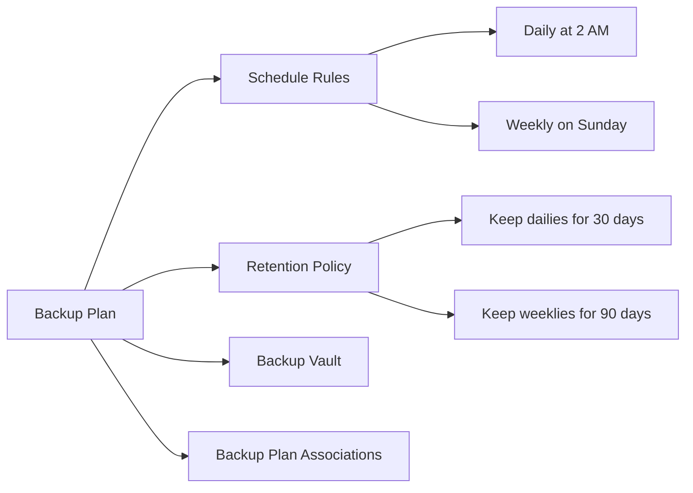

# How to Create a Backup Plan for Compute Engine Instances Using Google Cloud

Author: [nawazdhandala](https://www.github.com/nawazdhandala)

Tags: GCP, Google Cloud, Backup and DR, Compute Engine, Backup Plan, Disaster Recovery

Description: Step-by-step guide to creating backup plans for Compute Engine instances using Google Cloud Backup and DR Service with scheduling and retention policies.

---

Backing up Compute Engine VMs is one of those things that every team knows they should do but often puts off until something goes wrong. Google Cloud Backup and DR Service makes it straightforward to set up automated backup plans that handle scheduling, retention, and consistency for your VMs. Once configured, backups run on schedule without anyone having to think about them.

The key concept is the backup plan - a policy that defines what gets backed up, how often, and how long backups are kept. You attach a backup plan to one or more VMs, and the service takes care of the rest.

## Prerequisites

Before creating backup plans, make sure you have:

- Backup and DR Service API enabled in the project where the Compute Engine instances are located
- A backup vault created for storing backup data
- Compute Engine instances you want to protect
- The required Backup and DR IAM roles, such as `roles/backupdr.backupUser` and `roles/viewer` for configuring scheduled backups
- Backup vault access granted to the workload project

## Understanding Backup Plan Components

A backup plan consists of several parts:


```mermaid
graph LR
    A[Backup Plan] --> B[Schedule Rules]
    A --> C[Retention Policy]
    A --> D[Backup Vault]
    A --> E[Backup Plan Associations]
    B --> F[Daily at 2 AM]
    B --> G[Weekly on Sunday]
    C --> H[Keep dailies for 30 days]
    C --> I[Keep weeklies for 90 days]
```

**Schedule rules** define when backups run. You can have multiple schedules - for example, daily backups with a separate weekly schedule.

**Retention policies** define how long backups are kept. Different schedules can have different retention periods.

**Backup vault** is where the backup data is stored.

**Backup plan associations** define which VMs are covered by the plan.

## Step 1: Create a Backup Plan

Use the gcloud CLI to create a backup plan with your desired schedule and retention:

```bash
# Create a backup plan for production Compute Engine instances

# This plan runs daily backups at 2 AM UTC and keeps them for 30 days
gcloud backup-dr backup-plans create production-vm-daily \
    --project=my-project \
    --location=us-central1 \
    --backup-vault=vault-central \
    --resource-type=compute.googleapis.com/Instance \
    --backup-rule=rule-id=daily-backup,retention-days=30,recurrence=DAILY,time-zone=UTC,backup-window-start=2,backup-window-end=8 \
    --description="Daily backups for production VMs"
```

## Step 2: Define Backup Rules

Add backup rules to the plan that define schedules and retention. You can have multiple rules for different backup frequencies.

```bash
# Add a weekly backup rule - runs every Sunday at midnight UTC
# Retains backups for 90 days
gcloud backup-dr backup-plans update production-vm-daily \
    --project=my-project \
    --location=us-central1 \
    --add-backup-rule=rule-id=weekly-backup,retention-days=90,recurrence=WEEKLY,days-of-week=SUNDAY,time-zone=UTC,backup-window-start=0,backup-window-end=6
```

For more complex scheduling needs, you can define the plan with multiple backup rules:

```bash
# Comprehensive backup plan with multiple schedules
gcloud backup-dr backup-plans create production-vm-tiered \
    --project=my-project \
    --location=us-central1 \
    --backup-vault=vault-central \
    --resource-type=compute.googleapis.com/Instance \
    --backup-rule=rule-id=daily-backup,retention-days=30,recurrence=DAILY,time-zone=America/New_York,backup-window-start=2,backup-window-end=8 \
    --backup-rule=rule-id=weekly-backup,retention-days=90,recurrence=WEEKLY,days-of-week=SUNDAY,time-zone=America/New_York,backup-window-start=0,backup-window-end=6 \
    --backup-rule=rule-id=monthly-backup,retention-days=365,recurrence=MONTHLY,week-day-of-month=FIRST-SUNDAY,time-zone=America/New_York,backup-window-start=0,backup-window-end=6
```

## Step 3: Associate VMs with the Backup Plan

Now attach your Compute Engine instances to the backup plan. You can do this individually or use labels to automatically include VMs.

```bash
# Associate a specific VM with the backup plan
VM_ID=$(gcloud compute instances describe web-server-1 \
    --project=my-project \
    --zone=us-central1-a \
    --format="value(id)")

gcloud backup-dr backup-plan-associations create web-server-1-backup \
    --project=my-project \
    --location=us-central1 \
    --backup-plan=projects/my-project/locations/us-central1/backupPlans/production-vm-daily \
    --resource="projects/my-project/zones/us-central1-a/instances/${VM_ID}" \
    --resource-type=compute.googleapis.com/Instance

# Associate another VM
API_VM_ID=$(gcloud compute instances describe api-server-1 \
    --project=my-project \
    --zone=us-central1-a \
    --format="value(id)")

gcloud backup-dr backup-plan-associations create api-server-1-backup \
    --project=my-project \
    --location=us-central1 \
    --backup-plan=projects/my-project/locations/us-central1/backupPlans/production-vm-daily \
    --resource="projects/my-project/zones/us-central1-a/instances/${API_VM_ID}" \
    --resource-type=compute.googleapis.com/Instance
```

For larger environments, automating association based on labels is much more practical:

```bash
#!/bin/bash
# associate-labeled-vms.sh
# Automatically associate all VMs with a specific label to a backup plan

PROJECT="my-project"
LOCATION="us-central1"
BACKUP_PLAN="production-vm-daily"

# Find all VMs with the label "backup=production"
INSTANCES=$(gcloud compute instances list \
    --project=${PROJECT} \
    --filter="labels.backup=production" \
    --format="csv[no-heading](name,zone)")

# Associate each VM with the backup plan
while IFS=',' read -r NAME ZONE; do
    ZONE_SHORT=$(basename ${ZONE})
    VM_ID=$(gcloud compute instances describe "${NAME}" \
        --project=${PROJECT} \
        --zone=${ZONE_SHORT} \
        --format="value(id)")

    echo "Associating ${NAME} in ${ZONE_SHORT}..."

    gcloud backup-dr backup-plan-associations create "${NAME}-backup" \
        --project=${PROJECT} \
        --location=${LOCATION} \
        --backup-plan="projects/${PROJECT}/locations/${LOCATION}/backupPlans/${BACKUP_PLAN}" \
        --resource="projects/${PROJECT}/zones/${ZONE_SHORT}/instances/${VM_ID}" \
        --resource-type=compute.googleapis.com/Instance

done <<< "${INSTANCES}"
```

## Step 4: Configure Application-Consistent Backups

For VMs running databases or other stateful applications, crash-consistent backups might not be enough. Application-consistent backups ensure the application flushes its buffers and reaches a consistent state before the snapshot is taken.

For Linux VMs, enable guest flush on the backup plan:

```bash
# Enable guest flush for Compute Engine backups created by this plan
gcloud backup-dr backup-plans update production-vm-daily \
    --project=my-project \
    --location=us-central1 \
    --compute-instance-properties=guest-flush=true
```

For VMs running specific databases, configure pre and post snapshot scripts in `/etc/google/snapshots/pre.sh` and `/etc/google/snapshots/post.sh`:

```bash
#!/bin/bash
# /etc/google/snapshots/pre.sh
# Runs before the backup snapshot to ensure database consistency

# For MySQL - flush tables and lock
mysql -u backup_user -p'password' -e "FLUSH TABLES WITH READ LOCK;"

# For PostgreSQL - create a checkpoint
sudo -u postgres psql -c "CHECKPOINT;"

echo "Pre-backup script completed successfully"
```

```bash
#!/bin/bash
# /etc/google/snapshots/post.sh
# Runs after the snapshot is taken to release locks

# For MySQL - unlock tables
mysql -u backup_user -p'password' -e "UNLOCK TABLES;"

echo "Post-backup script completed successfully"
```

## Step 5: Monitor Backup Jobs

Keep an eye on your backup jobs to make sure everything is running smoothly:

```bash
# List recent backups for a data source
gcloud backup-dr backups list \
    --project=my-project \
    --location=us-central1 \
    --backup-vault=vault-central \
    --data-source=DATA_SOURCE \
    --limit=20

# Get details on a specific backup
gcloud backup-dr backups describe BACKUP_ID \
    --project=my-project \
    --location=us-central1 \
    --backup-vault=vault-central \
    --data-source=DATA_SOURCE
```

Set up alerting for backup failures by using this filter in a Logs Explorer log-based alert. You can test the filter from the CLI first:

```bash
# Test the Cloud Logging query for failed scheduled backups
gcloud logging read \
    'logName:"bdr_backup_restore_jobs" jsonPayload.jobCategory="SCHEDULED_BACKUP" jsonPayload.jobStatus="FAILED"' \
    --project=my-project \
    --limit=20
```

## Step 6: Test Backup Restores

A backup is only as good as your ability to restore from it. Test restores regularly:

```bash
# Restore a VM from a backup to verify data integrity
# This creates a new VM from the backup, not replacing the original
gcloud backup-dr backups restore compute BACKUP_ID \
    --project=my-project \
    --location=us-central1 \
    --backup-vault=vault-central \
    --data-source=DATA_SOURCE \
    --name=web-server-1-restore-test \
    --target-project=my-project \
    --target-zone=us-central1-b \
    --network-interface=network=projects/my-project/global/networks/default,subnet=projects/my-project/regions/us-central1/subnetworks/default
```

After the restore completes, verify the data on the restored VM and then delete it to avoid ongoing costs:

```bash
# Verify the restored VM is healthy
gcloud compute ssh web-server-1-restore-test --zone=us-central1-b --command="
    # Check that critical services are running
    systemctl status nginx
    systemctl status mysql

    # Verify data integrity
    mysql -e 'SELECT COUNT(*) FROM production.orders;'
"

# Clean up the test restore
gcloud compute instances delete web-server-1-restore-test \
    --zone=us-central1-b --quiet
```

## Backup Plan Best Practices

A few things I have learned from running backup plans in production:

Schedule backups during off-peak hours to minimize performance impact on your VMs. The snapshot process is fast but can cause brief I/O latency.

Use different retention periods for different backup frequencies. Daily backups for 30 days, weekly for 90 days, and monthly for a year is a common pattern that balances cost with recovery flexibility.

Label your VMs consistently and use automation to associate them with backup plans. Manual association does not scale and inevitably leads to missed VMs.

Test restores at least quarterly. A backup you have never tested is a backup you cannot trust.

## Summary

Creating backup plans for Compute Engine instances with Google Cloud Backup and DR Service comes down to defining schedules, setting retention periods, and associating your VMs with the plan. The service handles the rest - taking snapshots on schedule, managing retention, and storing data in immutable backup vaults. Add application-consistent backups for database VMs, set up monitoring for failures, and test restores regularly to make sure your backups actually work when you need them.
