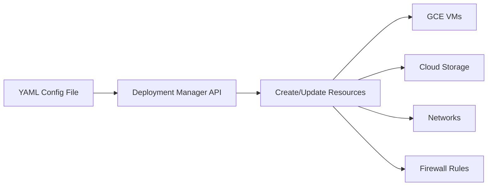

# How to Create a Basic Deployment Manager Configuration File for GCP Resources

Author: [nawazdhandala](https://www.github.com/nawazdhandala)

Tags: GCP, Deployment Manager, Infrastructure as Code, Configuration Management, Cloud Automation

Description: Learn how to write basic Google Cloud Deployment Manager configuration files to define and provision GCP resources as code with repeatable, version-controlled deployments.

---

Google Cloud Deployment Manager is GCP's native infrastructure-as-code tool. You define your cloud resources in YAML configuration files, and Deployment Manager creates, updates, or deletes them based on that configuration. If you are already working in the Google Cloud ecosystem and want to manage resources declaratively without adding a third-party tool, Deployment Manager is the straightforward option.

This guide covers the fundamentals of writing Deployment Manager configurations, from simple single-resource files to multi-resource deployments.

## How Deployment Manager Works

Deployment Manager uses a declarative model. You describe the desired state of your infrastructure in a configuration file, and the service figures out what needs to be created, modified, or deleted to reach that state.



A configuration file contains:

- **resources** - The GCP resources you want to manage
- **imports** (optional) - Template files for reusable configurations
- **outputs** (optional) - Values you want to expose after deployment

## Your First Configuration File

Let me start with the simplest possible configuration - creating a single Cloud Storage bucket.

```yaml
# simple-bucket.yaml
# Creates a single Cloud Storage bucket
resources:
- name: my-first-bucket
  type: storage.v1.bucket
  properties:
    name: my-unique-bucket-name-12345
    location: US
    storageClass: STANDARD
```

Deploy it with the gcloud CLI.

```bash
# Create a deployment from the configuration
gcloud deployment-manager deployments create my-first-deployment \
    --config simple-bucket.yaml \
    --project=YOUR_PROJECT_ID
```

Let me break down the structure:

- **name** - A unique name within the deployment (used internally by Deployment Manager)
- **type** - The GCP resource type. This follows the pattern `service.version.resource`
- **properties** - Resource-specific configuration that maps to the underlying API

## Understanding Resource Types

Resource types tell Deployment Manager what kind of resource to create. The format is based on the Google Cloud API that manages that resource.

Common resource types include:

| Resource | Type |
|----------|------|
| Compute Instance | `compute.v1.instance` |
| Cloud Storage Bucket | `storage.v1.bucket` |
| VPC Network | `compute.v1.network` |
| Firewall Rule | `compute.v1.firewall` |
| Pub/Sub Topic | `pubsub.v1.topic` |
| Cloud SQL Instance | `sqladmin.v1beta4.instance` |
| GKE Cluster | `container.v1.cluster` |

You can find the full list in the Google Cloud API documentation or by using the type provider discovery API.

```bash
# List available resource types
gcloud deployment-manager types list --project=YOUR_PROJECT_ID | head -50
```

## Creating a Compute Engine Instance

Here is a configuration that creates a virtual machine with a startup script.

```yaml
# compute-instance.yaml
# Creates a Compute Engine VM with a startup script
resources:
- name: web-server
  type: compute.v1.instance
  properties:
    zone: us-central1-a
    machineType: zones/us-central1-a/machineTypes/e2-medium
    disks:
    - deviceName: boot-disk
      type: PERSISTENT
      boot: true
      autoDelete: true
      initializeParams:
        sourceImage: projects/debian-cloud/global/images/family/debian-12
        diskSizeGb: 20
    networkInterfaces:
    - network: global/networks/default
      accessConfigs:
      - name: External NAT
        type: ONE_TO_ONE_NAT
    metadata:
      items:
      - key: startup-script
        value: |
          #!/bin/bash
          apt-get update
          apt-get install -y nginx
          systemctl start nginx
    tags:
      items:
      - http-server
    serviceAccounts:
    - email: default
      scopes:
      - https://www.googleapis.com/auth/cloud-platform
```

```bash
# Deploy the VM
gcloud deployment-manager deployments create web-server-deployment \
    --config compute-instance.yaml
```

## Multi-Resource Configurations

Real deployments involve multiple resources that depend on each other. Here is a configuration that creates a VPC network, subnet, firewall rule, and VM instance.

```yaml
# multi-resource.yaml
# Creates a complete network environment with a web server
resources:

# VPC Network
- name: my-vpc
  type: compute.v1.network
  properties:
    autoCreateSubnetworks: false
    routingConfig:
      routingMode: REGIONAL

# Subnet
- name: my-subnet
  type: compute.v1.subnetwork
  properties:
    ipCidrRange: 10.0.1.0/24
    network: $(ref.my-vpc.selfLink)
    region: us-central1
    privateIpGoogleAccess: true

# Firewall rule to allow HTTP traffic
- name: allow-http
  type: compute.v1.firewall
  properties:
    network: $(ref.my-vpc.selfLink)
    allowed:
    - IPProtocol: TCP
      ports:
      - "80"
      - "443"
    sourceRanges:
    - "0.0.0.0/0"
    targetTags:
    - http-server

# Firewall rule to allow SSH
- name: allow-ssh
  type: compute.v1.firewall
  properties:
    network: $(ref.my-vpc.selfLink)
    allowed:
    - IPProtocol: TCP
      ports:
      - "22"
    sourceRanges:
    - "0.0.0.0/0"
    targetTags:
    - ssh-server

# Web server instance
- name: web-server
  type: compute.v1.instance
  properties:
    zone: us-central1-a
    machineType: zones/us-central1-a/machineTypes/e2-medium
    disks:
    - deviceName: boot
      type: PERSISTENT
      boot: true
      autoDelete: true
      initializeParams:
        sourceImage: projects/debian-cloud/global/images/family/debian-12
    networkInterfaces:
    - network: $(ref.my-vpc.selfLink)
      subnetwork: $(ref.my-subnet.selfLink)
      accessConfigs:
      - name: External NAT
        type: ONE_TO_ONE_NAT
    tags:
      items:
      - http-server
      - ssh-server
    metadata:
      items:
      - key: startup-script
        value: |
          #!/bin/bash
          apt-get update && apt-get install -y nginx
          echo "Hello from Deployment Manager" > /var/www/html/index.html
          systemctl start nginx
```

### References Between Resources

Notice the `$(ref.my-vpc.selfLink)` syntax. This is how you reference one resource from another. Deployment Manager automatically:

1. Figures out the dependency order (network before subnet before instance)
2. Waits for the referenced resource to be created before creating the dependent one
3. Substitutes the actual value (like the network's selfLink URL) at deployment time

Common reference patterns:

```yaml
# Reference a resource's selfLink
$(ref.resource-name.selfLink)

# Reference a resource's name
$(ref.resource-name.name)

# Reference a resource's IP address
$(ref.resource-name.networkInterfaces[0].networkIP)
```

## Using Outputs

Outputs let you expose values from the deployment that you might need later, like IP addresses or resource URLs.

```yaml
# outputs-example.yaml
resources:
- name: web-server
  type: compute.v1.instance
  properties:
    zone: us-central1-a
    machineType: zones/us-central1-a/machineTypes/e2-small
    disks:
    - deviceName: boot
      type: PERSISTENT
      boot: true
      autoDelete: true
      initializeParams:
        sourceImage: projects/debian-cloud/global/images/family/debian-12
    networkInterfaces:
    - network: global/networks/default
      accessConfigs:
      - name: External NAT
        type: ONE_TO_ONE_NAT

outputs:
- name: instanceIP
  value: $(ref.web-server.networkInterfaces[0].accessConfigs[0].natIP)
- name: instanceSelfLink
  value: $(ref.web-server.selfLink)
```

After deploying, retrieve the outputs.

```bash
# Get deployment outputs
gcloud deployment-manager deployments describe my-deployment \
    --project=YOUR_PROJECT_ID \
    --format="yaml(outputs)"
```

## Managing Deployments

### Preview Before Deploying

Always preview changes before applying them.

```bash
# Preview what will happen
gcloud deployment-manager deployments create my-deployment \
    --config config.yaml \
    --preview

# If the preview looks good, update to apply
gcloud deployment-manager deployments update my-deployment
```

### Update an Existing Deployment

Modify your configuration file and update the deployment.

```bash
# Update the deployment with new configuration
gcloud deployment-manager deployments update my-deployment \
    --config updated-config.yaml
```

Deployment Manager calculates the diff between the current state and desired state, then applies only the necessary changes.

### Delete a Deployment

```bash
# Delete the deployment and all its resources
gcloud deployment-manager deployments delete my-deployment

# Delete the deployment but keep the resources
gcloud deployment-manager deployments delete my-deployment --delete-policy=ABANDON
```

## Configuration Tips

**Use descriptive resource names.** The name field is used in references and error messages. Make them meaningful.

**Keep configurations in version control.** Treat your Deployment Manager configs like code. Store them in Git, review changes, and use branches for different environments.

**Use environment variables for project-specific values.** Instead of hardcoding project IDs and zones, pass them as properties or use templates.

**Start simple and iterate.** Write and test one resource at a time. Complex configurations with many resources are hard to debug when something goes wrong.

**Check the API documentation.** The properties for each resource type map directly to the API's request body. The Compute Engine API documentation shows you exactly what fields are available for each resource.

Deployment Manager gives you a native GCP way to manage infrastructure as code. For simple deployments and GCP-only environments, it is a solid choice. As your configurations grow more complex, you will want to look into Jinja or Python templates, which I cover in separate guides.
