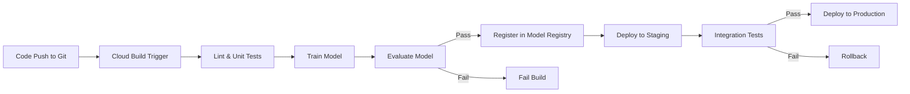

# How to Create a CI/CD Pipeline for Machine Learning Models on Google Cloud with Cloud Build

Author: [nawazdhandala](https://www.github.com/nawazdhandala)

Tags: MLOps, Cloud Build, CI/CD, Vertex AI, Google Cloud

Description: Learn how to build a complete CI/CD pipeline for machine learning models on Google Cloud using Cloud Build for automated testing, training, and deployment.

---

Most teams treat ML model deployment as a manual process. Someone trains a model in a notebook, exports it, and deploys it to production by hand. This works until it does not - until the model needs to be retrained, until you need to roll back to a previous version, or until someone accidentally deploys an untested model.

CI/CD for ML models applies the same discipline as software CI/CD: every change is tested, validated, and deployed through an automated pipeline. On Google Cloud, Cloud Build is the natural choice for this because it integrates tightly with the rest of the GCP ecosystem. Let me show you how to set it up end to end.

## What the Pipeline Does

Here is the workflow we are building.



A code push triggers the pipeline. It runs tests, trains the model, evaluates it against quality thresholds, registers it in the Vertex AI Model Registry, deploys to staging for integration testing, and finally promotes to production.

## Step 1: Project Structure

First, organize your ML project for CI/CD. Here is the structure I use.

```
ml-project/
  src/
    features/
      feature_engineering.py
    training/
      train.py
      hyperparameters.yaml
    evaluation/
      evaluate.py
    serving/
      predictor.py
  tests/
    unit/
      test_features.py
      test_training.py
    integration/
      test_endpoint.py
  configs/
    staging.yaml
    production.yaml
  Dockerfile
  cloudbuild.yaml
  requirements.txt
```

## Step 2: Write the Cloud Build Configuration

The `cloudbuild.yaml` defines each step of the pipeline. Each step runs in a container and can access artifacts from previous steps.

```yaml
# cloudbuild.yaml
steps:
  # Step 1: Install dependencies and run linting
  - name: 'python:3.10'
    id: 'lint'
    entrypoint: 'bash'
    args:
      - '-c'
      - |
        pip install -r requirements.txt
        pip install flake8 pytest
        flake8 src/ --max-line-length=120
    waitFor: ['-']  # Run immediately, no dependencies

  # Step 2: Run unit tests
  - name: 'python:3.10'
    id: 'unit-tests'
    entrypoint: 'bash'
    args:
      - '-c'
      - |
        pip install -r requirements.txt
        pip install pytest
        pytest tests/unit/ -v --tb=short
    waitFor: ['lint']

  # Step 3: Build the training container
  - name: 'gcr.io/cloud-builders/docker'
    id: 'build-training-image'
    args:
      - 'build'
      - '-t'
      - 'us-central1-docker.pkg.dev/$PROJECT_ID/ml-images/trainer:$COMMIT_SHA'
      - '-f'
      - 'Dockerfile'
      - '.'
    waitFor: ['unit-tests']

  # Step 4: Push the training container to Artifact Registry
  - name: 'gcr.io/cloud-builders/docker'
    id: 'push-training-image'
    args:
      - 'push'
      - 'us-central1-docker.pkg.dev/$PROJECT_ID/ml-images/trainer:$COMMIT_SHA'
    waitFor: ['build-training-image']

  # Step 5: Train the model using Vertex AI Custom Training
  - name: 'gcr.io/google.com/cloudsdktool/cloud-sdk'
    id: 'train-model'
    entrypoint: 'python'
    args:
      - 'scripts/submit_training_job.py'
      - '--image=us-central1-docker.pkg.dev/$PROJECT_ID/ml-images/trainer:$COMMIT_SHA'
      - '--commit-sha=$COMMIT_SHA'
    waitFor: ['push-training-image']

  # Step 6: Evaluate the trained model
  - name: 'python:3.10'
    id: 'evaluate-model'
    entrypoint: 'python'
    args:
      - 'scripts/evaluate_model.py'
      - '--model-dir=gs://$PROJECT_ID-ml-artifacts/models/$COMMIT_SHA'
      - '--threshold=0.85'
    waitFor: ['train-model']

  # Step 7: Register the model in Vertex AI Model Registry
  - name: 'gcr.io/google.com/cloudsdktool/cloud-sdk'
    id: 'register-model'
    entrypoint: 'python'
    args:
      - 'scripts/register_model.py'
      - '--model-dir=gs://$PROJECT_ID-ml-artifacts/models/$COMMIT_SHA'
      - '--version=$COMMIT_SHA'
    waitFor: ['evaluate-model']

  # Step 8: Deploy to staging endpoint
  - name: 'gcr.io/google.com/cloudsdktool/cloud-sdk'
    id: 'deploy-staging'
    entrypoint: 'python'
    args:
      - 'scripts/deploy_model.py'
      - '--environment=staging'
      - '--version=$COMMIT_SHA'
    waitFor: ['register-model']

  # Step 9: Run integration tests against staging
  - name: 'python:3.10'
    id: 'integration-tests'
    entrypoint: 'bash'
    args:
      - '-c'
      - |
        pip install -r requirements.txt
        pip install pytest
        pytest tests/integration/ -v --tb=short
    waitFor: ['deploy-staging']

  # Step 10: Deploy to production (only on main branch)
  - name: 'gcr.io/google.com/cloudsdktool/cloud-sdk'
    id: 'deploy-production'
    entrypoint: 'bash'
    args:
      - '-c'
      - |
        if [ "$BRANCH_NAME" = "main" ]; then
          python scripts/deploy_model.py \
            --environment=production \
            --version=$COMMIT_SHA \
            --traffic-percentage=10
        else
          echo "Skipping production deployment for non-main branch"
        fi
    waitFor: ['integration-tests']

options:
  logging: CLOUD_LOGGING_ONLY
  machineType: 'E2_HIGHCPU_8'

timeout: '7200s'  # 2 hour timeout for the full pipeline
```

## Step 3: Write the Training Job Submission Script

This script submits a Vertex AI Custom Training job and waits for it to complete.

```python
# scripts/submit_training_job.py
import argparse
from google.cloud import aiplatform

def submit_training_job(image_uri, commit_sha):
    """Submit a custom training job to Vertex AI."""
    aiplatform.init(
        project="my-project",
        location="us-central1",
        staging_bucket="gs://my-project-ml-artifacts"
    )

    # Define the training job
    job = aiplatform.CustomContainerTrainingJob(
        display_name=f"training-{commit_sha[:8]}",
        container_uri=image_uri,
        model_serving_container_image_uri=(
            "us-docker.pkg.dev/vertex-ai/prediction/sklearn-cpu.1-2:latest"
        ),
    )

    # Run the training job
    model = job.run(
        model_display_name=f"model-{commit_sha[:8]}",
        replica_count=1,
        machine_type="n1-standard-8",
        accelerator_type="NVIDIA_TESLA_T4",
        accelerator_count=1,
        args=[
            "--output-dir", f"gs://my-project-ml-artifacts/models/{commit_sha}",
            "--epochs", "50",
            "--batch-size", "64",
        ],
    )

    print(f"Training completed. Model: {model.resource_name}")
    return model.resource_name

if __name__ == "__main__":
    parser = argparse.ArgumentParser()
    parser.add_argument("--image", required=True)
    parser.add_argument("--commit-sha", required=True)
    args = parser.parse_args()

    submit_training_job(args.image, args.commit_sha)
```

## Step 4: Write the Model Evaluation Script

This script evaluates the trained model and fails the build if it does not meet quality thresholds.

```python
# scripts/evaluate_model.py
import argparse
import sys
import json
from google.cloud import storage

def evaluate_model(model_dir, threshold):
    """Evaluate the model against quality thresholds.
    Exits with code 1 if the model fails."""

    # Load the evaluation metrics produced during training
    client = storage.Client()
    bucket_name = model_dir.split("/")[2]
    blob_path = "/".join(model_dir.split("/")[3:]) + "/metrics.json"

    bucket = client.bucket(bucket_name)
    blob = bucket.blob(blob_path)
    metrics = json.loads(blob.download_as_string())

    print("Model evaluation metrics:")
    print(f"  Accuracy:  {metrics['accuracy']:.4f}")
    print(f"  F1 Score:  {metrics['f1_score']:.4f}")
    print(f"  Precision: {metrics['precision']:.4f}")
    print(f"  Recall:    {metrics['recall']:.4f}")
    print(f"  Threshold: {threshold}")

    # Check if the model meets the quality bar
    if metrics["accuracy"] < threshold:
        print(f"\nFAILED: Accuracy {metrics['accuracy']:.4f} is below threshold {threshold}")
        sys.exit(1)

    if metrics["f1_score"] < threshold:
        print(f"\nFAILED: F1 score {metrics['f1_score']:.4f} is below threshold {threshold}")
        sys.exit(1)

    print("\nPASSED: Model meets quality thresholds")

if __name__ == "__main__":
    parser = argparse.ArgumentParser()
    parser.add_argument("--model-dir", required=True)
    parser.add_argument("--threshold", type=float, default=0.85)
    args = parser.parse_args()

    evaluate_model(args.model_dir, args.threshold)
```

## Step 5: Write the Deployment Script

The deployment script handles both staging and production deployments with proper traffic management.

```python
# scripts/deploy_model.py
import argparse
from google.cloud import aiplatform

def deploy_model(environment, version, traffic_percentage=100):
    """Deploy a model version to the specified environment endpoint."""
    aiplatform.init(project="my-project", location="us-central1")

    # Load environment-specific configuration
    endpoint_ids = {
        "staging": "STAGING_ENDPOINT_ID",
        "production": "PRODUCTION_ENDPOINT_ID",
    }

    endpoint = aiplatform.Endpoint(endpoint_ids[environment])

    # Find the model version to deploy
    models = aiplatform.Model.list(
        filter=f'display_name="model-{version[:8]}"'
    )

    if not models:
        raise ValueError(f"No model found for version {version}")

    model = models[0]

    # Deploy the model with the specified traffic percentage
    model.deploy(
        endpoint=endpoint,
        deployed_model_display_name=f"model-{version[:8]}",
        machine_type="n1-standard-4",
        min_replica_count=1,
        max_replica_count=10,
        traffic_percentage=traffic_percentage,
    )

    print(f"Model {version[:8]} deployed to {environment}")
    print(f"Traffic percentage: {traffic_percentage}%")

if __name__ == "__main__":
    parser = argparse.ArgumentParser()
    parser.add_argument("--environment", required=True)
    parser.add_argument("--version", required=True)
    parser.add_argument("--traffic-percentage", type=int, default=100)
    args = parser.parse_args()

    deploy_model(args.environment, args.version, args.traffic_percentage)
```

## Step 6: Set Up the Cloud Build Trigger

Create a trigger that runs the pipeline on pushes to the main branch or on pull requests.

```bash
# Create a trigger for the main branch
gcloud builds triggers create github \
  --name="ml-pipeline-main" \
  --repo-owner="my-org" \
  --repo-name="ml-project" \
  --branch-pattern="^main$" \
  --build-config="cloudbuild.yaml" \
  --region=us-central1

# Create a trigger for pull requests (runs everything except production deploy)
gcloud builds triggers create github \
  --name="ml-pipeline-pr" \
  --repo-owner="my-org" \
  --repo-name="ml-project" \
  --pull-request-pattern="^main$" \
  --build-config="cloudbuild.yaml" \
  --region=us-central1
```

## Step 7: Write Integration Tests

Integration tests verify that the deployed model endpoint is working correctly.

```python
# tests/integration/test_endpoint.py
import pytest
from google.cloud import aiplatform

def test_staging_endpoint_prediction():
    """Verify the staging endpoint returns valid predictions."""
    aiplatform.init(project="my-project", location="us-central1")

    endpoint = aiplatform.Endpoint("STAGING_ENDPOINT_ID")

    # Send a test prediction request
    test_instance = {
        "feature_1": 0.5,
        "feature_2": 1.2,
        "feature_3": "category_a",
    }

    prediction = endpoint.predict(instances=[test_instance])

    # Verify the prediction format and values
    assert prediction.predictions is not None
    assert len(prediction.predictions) == 1
    assert "predicted_class" in prediction.predictions[0]

def test_staging_endpoint_latency():
    """Verify the endpoint responds within acceptable latency."""
    import time

    aiplatform.init(project="my-project", location="us-central1")
    endpoint = aiplatform.Endpoint("STAGING_ENDPOINT_ID")

    test_instance = {"feature_1": 0.5, "feature_2": 1.2, "feature_3": "category_a"}

    start = time.time()
    endpoint.predict(instances=[test_instance])
    latency = time.time() - start

    # Prediction should complete within 500ms
    assert latency < 0.5, f"Latency too high: {latency:.3f}s"
```

## Wrapping Up

A CI/CD pipeline for ML models brings the same reliability and reproducibility that software teams have enjoyed for years. Cloud Build is a solid choice for this on GCP because it integrates natively with Artifact Registry, Vertex AI, and the rest of the ecosystem. The key principle is that every model change - whether to the training code, the features, or the hyperparameters - goes through the same automated pipeline: test, train, evaluate, deploy to staging, test again, then promote to production. This eliminates the "it worked on my machine" problem that plagues many ML teams.
