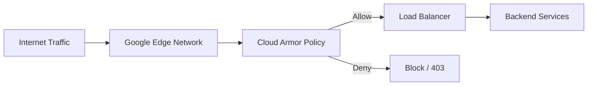

# How to Create a Cloud Armor Security Policy and Attach It to a GCP Load Balancer

Author: [nawazdhandala](https://www.github.com/nawazdhandala)

Tags: GCP, Cloud Armor, Security Policy, Load Balancer, WAF

Description: Step-by-step guide to creating a Google Cloud Armor security policy and attaching it to a GCP load balancer for DDoS protection and web application security.

---

Google Cloud Armor is GCP's edge security service that protects your applications from DDoS attacks, web exploits, and unwanted traffic. It works by attaching security policies to your load balancer's backend services. Each policy contains rules that evaluate incoming requests and decide whether to allow, deny, rate limit, or redirect them.

In this guide, I will walk through creating a Cloud Armor security policy from scratch, adding rules, and attaching it to your load balancer.

## How Cloud Armor Works

Cloud Armor sits at the edge of Google's network, between the internet and your load balancer. Every request that hits your external HTTP(S) load balancer passes through Cloud Armor's rule evaluation engine before reaching your backends.



Each security policy has an ordered list of rules. Rules are evaluated from highest priority (lowest number) to lowest priority. The first matching rule determines the action. If no rule matches, the default rule applies.

## Prerequisites

- An external HTTP(S) load balancer with at least one backend service
- The `compute.securityAdmin` role or equivalent permissions
- The Cloud Armor API enabled (it is enabled by default with Compute Engine)

## Step 1: Create a Security Policy

Create a new security policy with a default rule.

```bash
# Create a security policy with a default allow rule
gcloud compute security-policies create my-security-policy \
    --description="Security policy for production load balancer" \
    --project=my-project
```

By default, a new policy has a single rule with priority 2147483647 (the lowest possible priority) that allows all traffic. This acts as the catch-all rule.

You can also create a policy with a default deny rule if you prefer a whitelist approach.

```bash
# Create a policy where the default action is to deny
gcloud compute security-policies rules update 2147483647 \
    --security-policy=my-security-policy \
    --action=deny-403 \
    --description="Default deny rule" \
    --project=my-project
```

## Step 2: View the Policy

Check the policy's current state.

```bash
# Describe the security policy
gcloud compute security-policies describe my-security-policy \
    --project=my-project

# List all rules in the policy
gcloud compute security-policies rules list \
    --security-policy=my-security-policy \
    --project=my-project
```

## Step 3: Add Security Rules

Let's add several types of rules to the policy.

### Block a Specific IP Address

```bash
# Block a specific IP address known to be malicious
gcloud compute security-policies rules create 1000 \
    --security-policy=my-security-policy \
    --src-ip-ranges="203.0.113.50" \
    --action=deny-403 \
    --description="Block known malicious IP" \
    --project=my-project
```

### Allow a Trusted IP Range

```bash
# Allow traffic from your corporate network
gcloud compute security-policies rules create 500 \
    --security-policy=my-security-policy \
    --src-ip-ranges="10.0.0.0/8,172.16.0.0/12" \
    --action=allow \
    --description="Allow corporate network" \
    --project=my-project
```

### Block a Country

```bash
# Block traffic from specific countries using geo-based rules
gcloud compute security-policies rules create 2000 \
    --security-policy=my-security-policy \
    --expression="origin.region_code == 'XX'" \
    --action=deny-403 \
    --description="Block traffic from country XX" \
    --project=my-project
```

### Block Requests Matching a Pattern

```bash
# Block requests with suspicious user agents
gcloud compute security-policies rules create 3000 \
    --security-policy=my-security-policy \
    --expression="request.headers['user-agent'].contains('BadBot')" \
    --action=deny-403 \
    --description="Block BadBot user agent" \
    --project=my-project
```

## Step 4: Attach the Policy to a Backend Service

This is the critical step. The policy only takes effect when attached to a backend service.

```bash
# Attach the security policy to a backend service
gcloud compute backend-services update my-backend-service \
    --security-policy=my-security-policy \
    --global \
    --project=my-project
```

You can attach the same policy to multiple backend services, or use different policies for different backends.

```bash
# Attach to another backend service
gcloud compute backend-services update api-backend-service \
    --security-policy=my-security-policy \
    --global \
    --project=my-project
```

## Step 5: Verify the Policy Is Active

After attaching the policy, verify it is working.

```bash
# Check which policy is attached to a backend service
gcloud compute backend-services describe my-backend-service \
    --global \
    --format="value(securityPolicy)" \
    --project=my-project

# Test by making a request from a blocked IP (if you have one to test with)
curl -I https://my-app.example.com
```

## Terraform Configuration

Here is the complete setup in Terraform.

```hcl
# Create the security policy
resource "google_compute_security_policy" "production" {
  name        = "production-policy"
  description = "Security policy for production load balancer"

  # Default rule - allow all traffic
  rule {
    action   = "allow"
    priority = 2147483647
    description = "Default allow rule"

    match {
      versioned_expr = "SRC_IPS_V1"
      config {
        src_ip_ranges = ["*"]
      }
    }
  }

  # Block known malicious IPs
  rule {
    action   = "deny(403)"
    priority = 1000
    description = "Block malicious IPs"

    match {
      versioned_expr = "SRC_IPS_V1"
      config {
        src_ip_ranges = [
          "203.0.113.50/32",
          "198.51.100.0/24",
        ]
      }
    }
  }

  # Allow corporate network
  rule {
    action   = "allow"
    priority = 500
    description = "Allow corporate network"

    match {
      versioned_expr = "SRC_IPS_V1"
      config {
        src_ip_ranges = [
          "10.0.0.0/8",
          "172.16.0.0/12",
        ]
      }
    }
  }

  # Block requests with suspicious patterns
  rule {
    action   = "deny(403)"
    priority = 3000
    description = "Block suspicious user agents"

    match {
      expr {
        expression = "request.headers['user-agent'].contains('BadBot')"
      }
    }
  }
}

# Attach the policy to the backend service
resource "google_compute_backend_service" "web" {
  name                  = "web-backend"
  protocol              = "HTTP"
  port_name             = "http"
  load_balancing_scheme = "EXTERNAL"
  security_policy       = google_compute_security_policy.production.id

  backend {
    group = google_compute_instance_group_manager.web.instance_group
  }

  health_checks = [google_compute_health_check.default.id]
}
```

## Understanding Rule Priority

Rules are evaluated in priority order, lowest number first. Here is a recommended priority scheme:

| Priority Range | Purpose |
|---------------|---------|
| 0-999 | Emergency rules (immediate blocks) |
| 1000-1999 | IP-based allow/deny rules |
| 2000-2999 | Geo-based rules |
| 3000-3999 | Custom expression rules |
| 4000-4999 | Rate limiting rules |
| 5000-5999 | WAF rules |
| 2147483647 | Default rule (always last) |

This structure makes it easy to insert new rules without renumbering existing ones.

## Step 6: Enable Logging

Cloud Armor logs are crucial for understanding what traffic is being blocked.

```bash
# View recent Cloud Armor log entries
gcloud logging read \
    'resource.type="http_load_balancer" AND jsonPayload.enforcedSecurityPolicy.name="my-security-policy"' \
    --format="table(timestamp,httpRequest.remoteIp,httpRequest.requestUrl,jsonPayload.enforcedSecurityPolicy.outcome)" \
    --limit=20 \
    --project=my-project
```

You can also enable verbose logging on the policy.

```bash
# Enable verbose logging to capture request details
gcloud compute security-policies update my-security-policy \
    --log-level=VERBOSE \
    --project=my-project
```

## Step 7: Preview Mode

Before enforcing new rules, you can test them in preview mode. Preview mode logs what would happen without actually blocking traffic.

```bash
# Create a rule in preview mode
gcloud compute security-policies rules create 4000 \
    --security-policy=my-security-policy \
    --expression="origin.region_code == 'CN'" \
    --action=deny-403 \
    --description="Block China traffic - PREVIEW" \
    --preview \
    --project=my-project
```

Check the logs to see what traffic would be affected.

```bash
# Check preview mode matches
gcloud logging read \
    'resource.type="http_load_balancer" AND jsonPayload.previewSecurityPolicy.name="my-security-policy"' \
    --limit=20 \
    --project=my-project
```

Once you are confident the rule behaves correctly, remove the preview flag.

```bash
# Enable the rule for enforcement
gcloud compute security-policies rules update 4000 \
    --security-policy=my-security-policy \
    --no-preview \
    --project=my-project
```

## Detaching a Policy

To remove a security policy from a backend service:

```bash
# Remove the security policy from the backend service
gcloud compute backend-services update my-backend-service \
    --no-security-policy \
    --global \
    --project=my-project
```

## Troubleshooting

**Legitimate traffic being blocked**: Check the Cloud Armor logs to see which rule is matching. Look at the `enforcedSecurityPolicy.matchedFieldType` field. Use preview mode for new rules before enforcing them.

**Policy not taking effect**: Verify the policy is attached to the correct backend service. Changes can take a few minutes to propagate to all edge locations.

**Rules not matching as expected**: Double-check the rule expression syntax. Use the `gcloud compute security-policies rules describe` command to verify the rule configuration.

## Wrapping Up

Cloud Armor security policies are the first line of defense for your GCP-hosted applications. Creating a policy, adding rules, and attaching it to your load balancer takes just a few minutes, but it gives you powerful control over what traffic reaches your backends. Start with basic IP-based rules and a default allow policy, then gradually add more specific rules as you understand your traffic patterns. Always use preview mode for new rules, and keep an eye on the logs to make sure legitimate traffic is not being caught by mistake.
