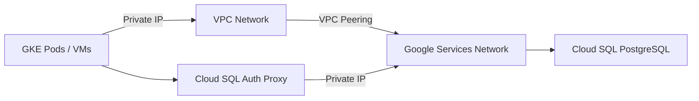

# How to Create a Cloud SQL for PostgreSQL Instance with Private IP

Author: [nawazdhandala](https://www.github.com/nawazdhandala)

Tags: GCP, Cloud SQL, PostgreSQL, Private IP, VPC, Networking

Description: Learn how to create a Cloud SQL for PostgreSQL instance configured with private IP only, ensuring your database traffic stays within your VPC network.

---

When running production databases on Google Cloud, you want your database traffic to stay off the public internet. Cloud SQL supports private IP connectivity, which means your database gets an IP address on your VPC network and all communication happens internally. This guide covers how to set up a Cloud SQL for PostgreSQL instance with private IP from scratch.

## Why Private IP Matters

With a public IP configuration, even though connections are encrypted and you can restrict access through authorized networks, your traffic still traverses the public internet. With private IP:

- Traffic between your application and database never leaves Google's network
- Lower latency since packets take a shorter path
- Reduced attack surface - no public endpoint to probe
- Compliance requirements are easier to meet

The trade-off is that you need to set up Private Service Access on your VPC, and you can only connect from resources within the same VPC (or connected VPCs via peering).

## Prerequisites

You will need:

- A Google Cloud project with billing enabled
- A VPC network (the default network works, but a custom VPC is recommended for production)
- IAM permissions for Cloud SQL Admin and Compute Network Admin
- The Cloud SQL Admin API and Service Networking API enabled

Enable both APIs with these commands:

```bash
# Enable the required APIs for Cloud SQL with private IP
gcloud services enable sqladmin.googleapis.com
gcloud services enable servicenetworking.googleapis.com
```

## Step 1: Configure Private Service Access

Private Service Access creates a VPC peering connection between your network and Google's service producer network. This is what allows Cloud SQL to assign a private IP from your address range.

First, allocate an IP address range for Google services:

```bash
# Allocate a /16 IP range for Google managed services
# This range will be used by Cloud SQL and other Google services
gcloud compute addresses create google-managed-services-range \
    --global \
    --purpose=VPC_PEERING \
    --addresses=10.100.0.0 \
    --prefix-length=16 \
    --network=my-vpc-network
```

The range you allocate should not overlap with any existing subnets in your VPC. A `/16` gives you 65,536 addresses, which is plenty for most setups.

Next, create the private connection:

```bash
# Create the private service connection using the allocated range
gcloud services vpc-peerings connect \
    --service=servicenetworking.googleapis.com \
    --ranges=google-managed-services-range \
    --network=my-vpc-network
```

This operation takes a minute or two. You can check the status with:

```bash
# Verify the peering connection was created
gcloud services vpc-peerings list --network=my-vpc-network
```

## Step 2: Create the Cloud SQL Instance with Private IP

Now you can create the PostgreSQL instance with private IP enabled and public IP disabled:

```bash
# Create a Cloud SQL PostgreSQL instance with private IP only
gcloud sql instances create myapp-postgres \
    --database-version=POSTGRES_15 \
    --tier=db-custom-4-16384 \
    --region=us-central1 \
    --network=projects/my-project-id/global/networks/my-vpc-network \
    --no-assign-ip \
    --allocated-ip-range-name=google-managed-services-range \
    --storage-type=SSD \
    --storage-size=100GB \
    --storage-auto-increase \
    --availability-type=REGIONAL \
    --backup-start-time=03:00 \
    --enable-point-in-time-recovery \
    --retained-backups-count=14 \
    --root-password=your-secure-password-here
```

Let me break down the key flags:

- `--no-assign-ip` disables the public IP address
- `--network` specifies which VPC to use (must be the full resource path)
- `--allocated-ip-range-name` tells Cloud SQL which IP range to pick from
- `--tier=db-custom-4-16384` gives you 4 vCPUs and 16 GB RAM
- `--availability-type=REGIONAL` enables high availability with automatic failover

The instance creation takes about 5-10 minutes.

## Step 3: Verify the Private IP Assignment

Once the instance is created, check its IP configuration:

```bash
# Check the IP addresses assigned to your instance
gcloud sql instances describe myapp-postgres \
    --format="json(ipAddresses, connectionName)"
```

You should see output showing only a `PRIVATE` type IP address. The `connectionName` will be in the format `project-id:region:instance-name` - you will need this for the Cloud SQL Auth Proxy.

## Step 4: Connect from a Compute Engine VM

To test connectivity, SSH into a VM in the same VPC and connect using the private IP:

```bash
# Install the PostgreSQL client if not already present
sudo apt-get update && sudo apt-get install -y postgresql-client

# Connect to Cloud SQL using the private IP
psql -h 10.100.0.2 -U postgres -d postgres
```

Replace `10.100.0.2` with the actual private IP from the previous step.

## Step 5: Set Up the Cloud SQL Auth Proxy (Recommended)

Even with private IP, using the Cloud SQL Auth Proxy adds an extra layer of security. It handles IAM authentication and encrypts the connection:

```bash
# Download the Cloud SQL Auth Proxy
curl -o cloud-sql-proxy \
    https://storage.googleapis.com/cloud-sql-connectors/cloud-sql-proxy/v2.8.0/cloud-sql-proxy.linux.amd64

chmod +x cloud-sql-proxy

# Start the proxy using private IP
# The --private-ip flag tells the proxy to connect via private IP
./cloud-sql-proxy \
    --private-ip \
    --port=5432 \
    my-project-id:us-central1:myapp-postgres
```

Then connect through the proxy:

```bash
# Connect through the proxy on localhost
psql -h 127.0.0.1 -U postgres -d postgres
```

## Step 6: Create Application Database and User

Set up the database for your application:

```sql
-- Create the application database with UTF-8 encoding
CREATE DATABASE myapp
    WITH ENCODING 'UTF8'
    LC_COLLATE = 'en_US.UTF8'
    LC_CTYPE = 'en_US.UTF8';

-- Create an application user with a strong password
CREATE USER myapp_user WITH PASSWORD 'strong-password-here';

-- Grant privileges on the database
GRANT ALL PRIVILEGES ON DATABASE myapp TO myapp_user;

-- Connect to the new database and grant schema privileges
\c myapp
GRANT ALL ON SCHEMA public TO myapp_user;
```

## Network Architecture Overview

Here is how the network topology looks with private IP:



Your application traffic flows through the VPC peering connection directly to Cloud SQL. No public internet involved.

## Connecting from Other VPC Networks

If your application runs in a different VPC, you have a few options:

1. **VPC Peering**: Peer the two VPCs together. Note that VPC peering is not transitive - the peered VPC does not automatically get access to the Google services peering.
2. **Shared VPC**: Use a Shared VPC where the host project owns the network and service projects deploy resources into it.
3. **Cloud VPN or Interconnect**: For on-premises or cross-project connectivity.

For Shared VPC setups, the Private Service Access must be configured on the host project's VPC, and the Cloud SQL instance must be connected to that same network.

## DNS Configuration

Cloud SQL private IP instances are accessible via their IP address, but you might want a DNS name. You can set up a Cloud DNS private zone:

```bash
# Create a private DNS zone for your database endpoints
gcloud dns managed-zones create db-zone \
    --dns-name=db.internal. \
    --visibility=private \
    --networks=my-vpc-network

# Add a record for your Cloud SQL instance
gcloud dns record-sets create postgres.db.internal. \
    --zone=db-zone \
    --type=A \
    --ttl=300 \
    --rrdatas=10.100.0.2
```

Now your application can connect to `postgres.db.internal` instead of a bare IP address.

## Firewall Considerations

With private IP, you generally do not need to create firewall rules for Cloud SQL access since the connection goes through VPC peering. However, if you have restrictive egress rules on your VMs or GKE nodes, make sure traffic to the allocated IP range on port 5432 is allowed.

```bash
# Allow PostgreSQL traffic to the Cloud SQL IP range (if needed)
gcloud compute firewall-rules create allow-cloudsql-private \
    --network=my-vpc-network \
    --allow=tcp:5432 \
    --destination-ranges=10.100.0.0/16 \
    --direction=EGRESS \
    --priority=1000
```

## Monitoring Private IP Connections

Use Cloud SQL's built-in metrics to monitor your connections:

- `database/network/connections` - Active connection count
- `database/network/received_bytes_count` - Network bytes in
- `database/network/sent_bytes_count` - Network bytes out

Set up alerts in Cloud Monitoring when connection counts approach your instance's limit or when network throughput spikes unexpectedly.

## Summary

Setting up Cloud SQL for PostgreSQL with private IP takes a few extra steps compared to public IP, but the security benefits are worth it. The key steps are: allocate an IP range, create the Private Service Access peering, then create the instance with `--no-assign-ip`. Once it is running, your database is accessible only from within your VPC, significantly reducing your attack surface.
