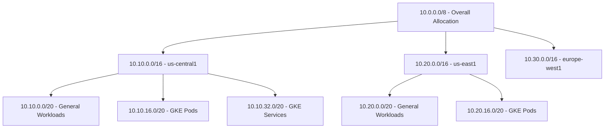

# How to Create a Custom Mode VPC Network in Google Cloud Platform

Author: [nawazdhandala](https://www.github.com/nawazdhandala)

Tags: GCP, VPC, Networking, Custom Mode, Subnets

Description: A practical guide to creating custom mode VPC networks in GCP, including subnet design, configuration steps, and why custom mode beats auto mode for production workloads.

---

When you create a new project in Google Cloud, it comes with a default VPC network in "auto mode." Auto mode creates one subnet in every GCP region automatically. That sounds convenient, but for any serious production workload, you want custom mode VPCs where you control exactly which regions have subnets and what IP ranges they use.

In this post, I will explain the difference between auto mode and custom mode VPCs, walk through creating a custom mode network from scratch, and share some practical advice on subnet planning.

## Auto Mode vs. Custom Mode

Auto mode VPCs automatically create a subnet in every region using predefined IP ranges from the 10.128.0.0/9 block. Custom mode VPCs start empty - you add subnets only where you need them, with IP ranges you choose.

Here is why custom mode wins for production:

- **IP address control**: You pick the CIDR ranges, avoiding conflicts with on-premises networks or other VPCs you need to peer with.
- **No wasted resources**: Auto mode creates subnets in regions you will never use. Custom mode keeps things clean.
- **Predictable addressing**: You can design a consistent IP scheme that makes sense for your organization.
- **Peering compatibility**: Auto mode's predefined ranges often overlap with other networks, making VPC peering impossible.

## Creating a Custom Mode VPC Network

Let us create a custom mode VPC from scratch:

```bash
# Create a custom mode VPC network
# Custom mode means no subnets are created automatically
gcloud compute networks create production-vpc \
  --subnet-mode=custom \
  --bgp-routing-mode=regional \
  --description="Production VPC for application workloads"
```

The `--bgp-routing-mode` flag controls how Cloud Router advertises routes:
- `regional`: Routes are advertised only within the region where the Cloud Router lives. This is the default and works for most setups.
- `global`: Routes are advertised across all regions. Use this if you need Cloud VPN or Interconnect traffic to reach subnets in other regions.

## Designing Your Subnet Layout

Before creating subnets, plan your IP allocation. Here is a scheme I have used successfully for medium-sized deployments:



The general rule is: allocate more space than you think you need. Expanding subnets later is possible but adding new non-overlapping ranges gets harder as your network grows.

## Creating Subnets

Now create subnets in the regions you actually use:

```bash
# Create a subnet in us-central1 for general workloads
gcloud compute networks subnets create prod-us-central1 \
  --network=production-vpc \
  --region=us-central1 \
  --range=10.10.0.0/20 \
  --enable-private-ip-google-access \
  --enable-flow-logs \
  --logging-flow-sampling=0.5 \
  --logging-metadata=include-all
```

```bash
# Create a subnet in us-east1 for DR and secondary workloads
gcloud compute networks subnets create prod-us-east1 \
  --network=production-vpc \
  --region=us-east1 \
  --range=10.20.0.0/20 \
  --enable-private-ip-google-access \
  --enable-flow-logs
```

```bash
# Create a subnet in europe-west1 for EU-based workloads
gcloud compute networks subnets create prod-europe-west1 \
  --network=production-vpc \
  --region=europe-west1 \
  --range=10.30.0.0/20 \
  --enable-private-ip-google-access \
  --enable-flow-logs
```

I always enable two features on every subnet:

- **Private Google Access** (`--enable-private-ip-google-access`): Lets VMs without external IPs access Google APIs and services. Essential for security-conscious deployments.
- **Flow Logs** (`--enable-flow-logs`): Records network flows for monitoring and troubleshooting. The sampling rate of 0.5 captures half the flows, which is a good balance between visibility and cost.

## Adding Secondary IP Ranges for GKE

If you plan to run GKE clusters, you need secondary IP ranges for pods and services:

```bash
# Add secondary ranges to the us-central1 subnet for GKE
gcloud compute networks subnets update prod-us-central1 \
  --region=us-central1 \
  --add-secondary-ranges=gke-pods=10.10.16.0/20,gke-services=10.10.32.0/20
```

These secondary ranges are used exclusively by GKE and do not interfere with VM IP allocation on the primary range.

## Setting Up Basic Firewall Rules

A new custom mode VPC has no firewall rules (unlike the default network which has some permissive rules). You need to create your own:

```bash
# Allow internal communication within the VPC
gcloud compute firewall-rules create production-vpc-allow-internal \
  --network=production-vpc \
  --direction=INGRESS \
  --action=ALLOW \
  --rules=tcp:0-65535,udp:0-65535,icmp \
  --source-ranges=10.10.0.0/20,10.20.0.0/20,10.30.0.0/20 \
  --description="Allow all internal traffic between subnets"
```

```bash
# Allow SSH from IAP (Identity-Aware Proxy) for secure VM access
gcloud compute firewall-rules create production-vpc-allow-iap-ssh \
  --network=production-vpc \
  --direction=INGRESS \
  --action=ALLOW \
  --rules=tcp:22 \
  --source-ranges=35.235.240.0/20 \
  --description="Allow SSH via IAP tunnel"
```

```bash
# Allow health check probes from Google's load balancer ranges
gcloud compute firewall-rules create production-vpc-allow-health-checks \
  --network=production-vpc \
  --direction=INGRESS \
  --action=ALLOW \
  --rules=tcp \
  --source-ranges=35.191.0.0/16,130.211.0.0/22 \
  --target-tags=allow-health-checks \
  --description="Allow Google health check probes"
```

## Converting an Auto Mode VPC to Custom Mode

If you already have an auto mode VPC and want to switch to custom mode (which I recommend for production), you can convert it:

```bash
# Convert an auto mode VPC to custom mode
# Warning: this is irreversible - you cannot go back to auto mode
gcloud compute networks update my-auto-vpc \
  --switch-to-custom-subnet-mode
```

This conversion keeps all existing subnets intact but stops auto-creating subnets in new regions. It is a one-way operation - you cannot convert back to auto mode.

## Verifying Your Network Configuration

After setting everything up, verify the configuration:

```bash
# List all subnets in the VPC
gcloud compute networks subnets list \
  --network=production-vpc \
  --format="table(name, region, ipCidrRange, privateIpGoogleAccess, enableFlowLogs)"
```

```bash
# Describe the network to see its properties
gcloud compute networks describe production-vpc \
  --format="yaml(name, subnetworkMode, routingConfig, peerings)"
```

```bash
# List all firewall rules for the network
gcloud compute firewall-rules list \
  --filter="network=production-vpc" \
  --format="table(name, direction, action, sourceRanges, allowed)"
```

## Common Mistakes to Avoid

1. **Using /24 subnets everywhere**: A /24 only gives you 251 usable IPs. That fills up fast, especially with GKE. Start with /20 at minimum for production subnets.
2. **Forgetting Private Google Access**: Without it, VMs without external IPs cannot reach Google APIs. Always enable it.
3. **Overlapping with on-prem ranges**: Before choosing CIDR blocks, inventory all your existing networks. Overlapping ranges will block VPC peering and VPN connectivity.
4. **Not enabling flow logs**: Flow logs are your debugging lifeline. The cost is minimal compared to the hours you save when troubleshooting connectivity issues.

## Wrapping Up

Custom mode VPCs give you the control you need for production-grade networking in GCP. Take the time to plan your IP allocation, enable Private Google Access and flow logs on every subnet, and set up firewall rules that follow the principle of least privilege. The upfront planning pays off enormously when you need to peer networks, set up VPNs, or troubleshoot connectivity down the road.
