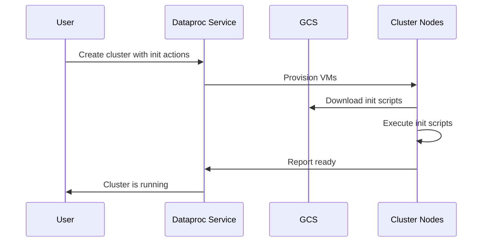

# How to Create a Dataproc Cluster with Custom Initialization Actions

Author: [nawazdhandala](https://www.github.com/nawazdhandala)

Tags: GCP, Google Cloud Dataproc, Hadoop, Spark, Cluster Management

Description: Learn how to use initialization actions to customize Google Cloud Dataproc clusters with additional software, configurations, and dependencies during cluster creation.

---

Google Cloud Dataproc gives you managed Hadoop and Spark clusters, but the default cluster configuration does not include everything you need. Maybe you need a specific Python library for your PySpark jobs. Maybe you need to install a monitoring agent. Maybe your team uses a custom security configuration that must be applied to every node.

Initialization actions solve this problem. They are scripts that run on every node during cluster creation, before any jobs are submitted. Think of them as a startup script for your cluster nodes.

## How Initialization Actions Work

When you create a Dataproc cluster, each node (master and workers) downloads and executes your initialization scripts. The scripts run as root, so they can install packages, modify system configurations, and set up any software you need.

The scripts must be stored in Google Cloud Storage. Dataproc downloads them from GCS and runs them in the order you specify.



## Writing an Initialization Script

An initialization action is a regular bash script. Here is one that installs Python packages for PySpark.

```bash
#!/bin/bash
# init-python-packages.sh
# Installs Python packages needed by PySpark jobs

set -euxo pipefail

# Install pip packages on all nodes
pip3 install \
    pandas==2.1.0 \
    numpy==1.25.0 \
    scikit-learn==1.3.0 \
    google-cloud-bigquery==3.12.0 \
    pyarrow==13.0.0

echo "Python packages installed successfully"
```

The `set -euxo pipefail` at the top is important. It makes the script exit on any error (`-e`), prints each command before executing it (`-x`), treats unset variables as errors (`-u`), and fails if any command in a pipe fails (`-o pipefail`). Without these flags, a failed installation might go unnoticed.

## Uploading and Using Initialization Actions

Upload the script to GCS and reference it when creating the cluster.

```bash
# Upload the init script to GCS
gsutil cp init-python-packages.sh \
  gs://my-bucket/dataproc-init/init-python-packages.sh

# Create a cluster with the initialization action
gcloud dataproc clusters create my-cluster \
  --region=us-central1 \
  --initialization-actions=gs://my-bucket/dataproc-init/init-python-packages.sh \
  --initialization-action-timeout=10m \
  --num-workers=4 \
  --worker-machine-type=n1-standard-4 \
  --master-machine-type=n1-standard-4 \
  --image-version=2.1-debian11
```

The `--initialization-action-timeout` flag sets how long Dataproc waits for the script to complete. The default is 10 minutes. If your script installs large packages or compiles software, increase this.

## Running Different Scripts on Master vs. Workers

Sometimes you need to install different software on master nodes versus worker nodes. Use the `ROLE` environment variable that Dataproc sets on each node.

```bash
#!/bin/bash
# init-role-based.sh
# Installs different software based on node role

set -euxo pipefail

# Determine the role of this node
ROLE=$(/usr/share/google/get_metadata_value attributes/dataproc-role)

echo "Node role is: $ROLE"

# Install common packages on all nodes
apt-get update
apt-get install -y jq htop

if [[ "${ROLE}" == 'Master' ]]; then
    # Master-only installations
    echo "Installing master-specific software"

    # Install Jupyter for interactive development
    pip3 install jupyter jupyterlab

    # Install monitoring tools
    apt-get install -y prometheus-node-exporter

    # Start Jupyter on port 8888
    nohup jupyter lab --ip=0.0.0.0 --port=8888 \
        --no-browser --allow-root &

elif [[ "${ROLE}" == 'Worker' ]]; then
    # Worker-only installations
    echo "Installing worker-specific software"

    # Install GPU drivers if this is a GPU cluster
    # (only needed on workers that have GPUs attached)
    # nvidia-driver-install.sh would go here
fi

echo "Initialization complete for role: $ROLE"
```

## Multiple Initialization Actions

You can specify multiple scripts. They execute in order on each node.

```bash
# Multiple init actions run sequentially
gcloud dataproc clusters create my-cluster \
  --region=us-central1 \
  --initialization-actions=\
gs://my-bucket/init/install-python-packages.sh,\
gs://my-bucket/init/configure-logging.sh,\
gs://my-bucket/init/setup-security.sh \
  --initialization-action-timeout=20m \
  --num-workers=4
```

Each script runs after the previous one completes. If any script fails, the entire cluster creation fails. Keep this in mind when ordering your scripts - put critical dependencies first.

## Using Metadata to Pass Parameters

You can pass parameters to your init scripts using cluster metadata.

```bash
# Pass custom metadata that init scripts can read
gcloud dataproc clusters create my-cluster \
  --region=us-central1 \
  --metadata=ENVIRONMENT=production,DB_HOST=10.0.1.5,LOG_LEVEL=INFO \
  --initialization-actions=gs://my-bucket/init/configure-app.sh \
  --num-workers=4
```

Inside the init script, read the metadata values.

```bash
#!/bin/bash
# configure-app.sh
# Configures application settings using cluster metadata

set -euxo pipefail

# Read metadata values
ENVIRONMENT=$(/usr/share/google/get_metadata_value attributes/ENVIRONMENT)
DB_HOST=$(/usr/share/google/get_metadata_value attributes/DB_HOST)
LOG_LEVEL=$(/usr/share/google/get_metadata_value attributes/LOG_LEVEL)

echo "Configuring for environment: $ENVIRONMENT"

# Write application configuration file
cat > /etc/app/config.properties << EOF
environment=$ENVIRONMENT
database.host=$DB_HOST
log.level=$LOG_LEVEL
EOF

# Set Spark defaults based on environment
if [[ "$ENVIRONMENT" == "production" ]]; then
    cat >> /etc/spark/conf/spark-defaults.conf << EOF
spark.sql.shuffle.partitions=200
spark.executor.memory=4g
spark.driver.memory=2g
EOF
else
    cat >> /etc/spark/conf/spark-defaults.conf << EOF
spark.sql.shuffle.partitions=20
spark.executor.memory=1g
spark.driver.memory=1g
EOF
fi

echo "Configuration complete"
```

## Pre-built Initialization Actions

Google provides a collection of community-maintained initialization actions for common software. These are stored in a public GCS bucket.

```bash
# Use Google's pre-built init action for Conda
gcloud dataproc clusters create my-cluster \
  --region=us-central1 \
  --initialization-actions=\
gs://goog-dataproc-initialization-actions-us-central1/conda/bootstrap-conda.sh \
  --metadata='CONDA_PACKAGES=scipy numpy pandas' \
  --num-workers=2
```

Some commonly used pre-built actions include:

- `conda/bootstrap-conda.sh` - Install Conda and Python packages
- `hue/hue.sh` - Install Hue web interface
- `connectors/connectors.sh` - Install BigQuery and GCS connectors
- `gpu/install_gpu_driver.sh` - Install NVIDIA GPU drivers

## Debugging Failed Initialization Actions

When an init action fails, the cluster creation fails too. Debugging requires checking the init script logs.

```bash
# View initialization action logs for a failed cluster
gcloud dataproc clusters describe my-cluster \
  --region=us-central1

# The output includes the GCS location of init action logs
# Usually at: gs://dataproc-staging-REGION-PROJECT_NUM/google-cloud-dataproc-metainfo/CLUSTER_UUID/

# Download and inspect the init action output
gsutil cat gs://dataproc-staging-us-central1-123456/\
google-cloud-dataproc-metainfo/CLUSTER_UUID/\
m/dataproc-initialization-script-0_output
```

Common reasons for init action failures:

- Network connectivity issues (private clusters without Cloud NAT cannot download packages)
- Package version conflicts
- Timeout exceeded (large installations need longer timeouts)
- Script syntax errors

## Best Practices

Test your init scripts on a single-node cluster first. It is faster and cheaper to iterate.

```bash
# Create a minimal cluster for testing init scripts
gcloud dataproc clusters create test-init \
  --region=us-central1 \
  --single-node \
  --initialization-actions=gs://my-bucket/init/my-script.sh \
  --initialization-action-timeout=15m
```

Pin package versions in your init scripts. An unversioned `pip install pandas` might install a different version tomorrow and break your jobs.

Keep init scripts idempotent. If the script runs twice (which can happen during retries), it should produce the same result. Use `apt-get install -y` instead of interactive installs, and check if software is already installed before installing it.

Store init scripts in a versioned GCS bucket or include a version in the path. This way you can create clusters with different init script versions for testing without affecting production.

For clusters that need many customizations, consider building a custom Dataproc image instead. Images are faster to boot from than running multiple init scripts, and they provide a more consistent environment.
