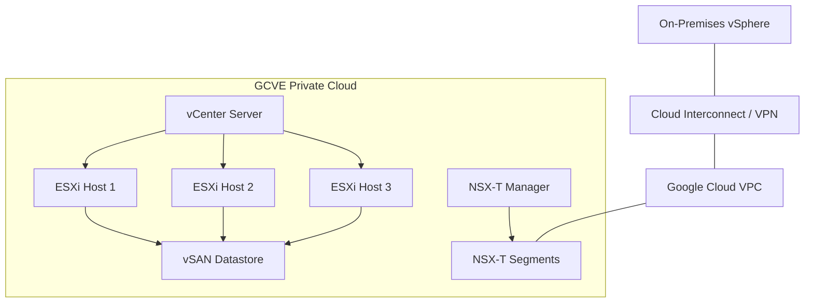

# How to Create a Google Cloud VMware Engine Private Cloud with vSphere and NSX-T

Author: [nawazdhandala](https://www.github.com/nawazdhandala)

Tags: GCP, Google Cloud, VMware Engine, vSphere, NSX-T, Private Cloud, Migration

Description: A complete guide to creating a Google Cloud VMware Engine private cloud with vSphere and NSX-T networking for running VMware workloads natively on GCP.

---

If your organization has been running VMware for years, migrating to the cloud does not have to mean rewriting everything for Kubernetes or rearchitecting every application. Google Cloud VMware Engine (GCVE) gives you a fully managed VMware environment running on dedicated hardware in Google's data centers. You get vSphere, vSAN, NSX-T, and VMware Aria integrations - the same tools your team already knows - but running on Google Cloud infrastructure with native integration into GCP services.

Creating a GCVE private cloud is the first step, and while it is mostly a provisioning exercise, there are important decisions around sizing, networking, and configuration that will affect everything you do afterward.

## What You Get with a GCVE Private Cloud

A private cloud in GCVE is a dedicated cluster of bare-metal nodes running the VMware stack. Each private cloud includes:

- **vCenter Server**: For managing your virtual machines and resources
- **ESXi hosts**: The hypervisor layer running on dedicated bare-metal servers
- **vSAN**: Distributed storage across the ESXi hosts
- **NSX-T**: Software-defined networking with microsegmentation
- **HCX**: Optional, for live migration of VMs from on-premises


```mermaid
graph TB
    subgraph "GCVE Private Cloud"
        A[vCenter Server] --> B[ESXi Host 1]
        A --> C[ESXi Host 2]
        A --> D[ESXi Host 3]
        B --> E[vSAN Datastore]
        C --> E
        D --> E
        F[NSX-T Manager] --> G[NSX-T Segments]
    end
    H[Google Cloud VPC] --- G
    I[Cloud Interconnect / VPN] --- H
    J[On-Premises vSphere] --- I
```

## Prerequisites

Before creating a private cloud, you need:

- A Google Cloud project with billing enabled
- The VMware Engine API enabled
- The VMware Engine Admin role
- A VMware Engine network and a VPC network for private connectivity
- Sufficient quota for the node types you plan to use

## Step 1: Enable the VMware Engine API

```bash
# Enable the VMware Engine API

gcloud services enable vmwareengine.googleapis.com \
    --project=my-project
```

## Step 2: Set Up a VMware Engine Network

GCVE uses a VMware Engine network to connect the VMware environment to your VPC. For new projects, create a standard VMware Engine network and peer it with your VPC. Private Service Access is only required for legacy VMware Engine networks.

```bash
# Create a standard VMware Engine network
gcloud vmware networks create gcve-network \
    --project=my-project \
    --location=global \
    --type=STANDARD \
    --description="Production VMware Engine network"

# Peer the VMware Engine network with your VPC
gcloud vmware network-peerings create gcve-default-peering \
    --project=my-project \
    --location=global \
    --peer-network-type=STANDARD \
    --peer-network=default \
    --vmware-engine-network=gcve-network \
    --description="Peering GCVE with the default VPC"
```

The management IP range you choose later must be unique and must not overlap with your VPC subnets, on-premises networks, or workload network segments. VMware Engine accepts a management range between /24 and /20.

## Step 3: Create the Private Cloud

Now create the private cloud itself. This is where you choose the region, node type, and initial cluster size.

```bash
# Create a GCVE private cloud with 3 nodes (minimum for production)
gcloud vmware private-clouds create my-private-cloud \
    --project=my-project \
    --location=us-central1-a \
    --cluster=cluster-1 \
    --node-type-config=type=standard-72,count=3 \
    --management-range=10.100.0.0/22 \
    --vmware-engine-network=gcve-network \
    --description="Production VMware private cloud"
```

The key parameters:

**node-type-config count**: Minimum 3 for production (for vSAN quorum). You can start with 3 and scale up later.

**node-type-config type**: Defines the hardware configuration of each host. `standard-72` gives you 72 cores, 768 GB RAM, and roughly 20 TB of vSAN storage per node. There are also larger node types available for memory-intensive workloads.

**management-range**: A /22 CIDR range for vCenter, NSX-T Manager, ESXi hosts, and other management components.

This operation takes 30-60 minutes to complete because Google is provisioning dedicated bare-metal servers, installing ESXi, setting up vSAN, deploying vCenter, and configuring NSX-T.

```bash
# Monitor the creation progress
gcloud vmware private-clouds describe my-private-cloud \
    --project=my-project \
    --location=us-central1-a
```

Wait until the state shows READY.

## Step 4: Access vCenter and NSX-T Manager

Once the private cloud is ready, get the credentials to access the management interfaces:

```bash
# Get vCenter credentials
gcloud vmware private-clouds vcenter credentials describe \
    --project=my-project \
    --private-cloud=my-private-cloud \
    --location=us-central1-a

# Get NSX-T Manager credentials
gcloud vmware private-clouds nsx credentials describe \
    --project=my-project \
    --private-cloud=my-private-cloud \
    --location=us-central1-a
```

These commands return the admin usernames and passwords. The management interfaces (vCenter and NSX-T Manager) are accessible over the VMware Engine network peering from your VPC - they are not exposed to the public internet.

To access the management UIs, you need a jump host or VPN connection into your VPC:

```bash
# Create a small VM in your VPC to use as a jump host
gcloud compute instances create mgmt-jumpbox \
    --project=my-project \
    --zone=us-central1-a \
    --machine-type=e2-medium \
    --image-family=windows-2022 \
    --image-project=windows-cloud \
    --boot-disk-size=50GB \
    --network=default \
    --subnet=default
```

RDP into the jump host and open a browser to the vCenter URL (shown in the private cloud details). Log in with the credentials you retrieved.

## Step 5: Configure NSX-T Network Segments

NSX-T provides the networking layer for your VMs. For workload VMs, create network segments in the NSX-T Manager UI for your private cloud. Choose CIDR ranges that do not overlap with the management range, VPC subnets, or on-premises networks.

The `gcloud vmware private-clouds subnets` commands are for listing, describing, and updating VMware Engine subnets such as service subnets; they do not create NSX-T workload segments.

## Step 6: Configure DNS and NTP

Proper DNS resolution and time synchronization are essential for a healthy vSphere environment. When a standard VMware Engine network is peered with your VPC, VMware Engine automatically creates the management DNS zone binding for resolving vCenter, NSX Manager, and HCX from Google Cloud VMs. For workload VM DNS, configure DNS and DHCP options on the NSX-T segments or in your guest operating systems.

For NTP, configure it through vCenter to point to Google's NTP servers (time.google.com) or your organization's internal NTP infrastructure.

## Step 7: Set Up External Access Policies

By default, the private cloud is isolated. To allow traffic to or from external IP addresses, enable the required network policy services, allocate any required external IP addresses, and then create external access rules:

```bash
# Create an external access rule for HTTPS traffic
gcloud vmware network-policies external-access-rules create allow-https \
    --project=my-project \
    --location=us-central1 \
    --network-policy=gcve-network-policy \
    --priority=1000 \
    --action=ALLOW \
    --ip-protocol=TCP \
    --source-ranges=192.168.1.0/24 \
    --destination-ranges=0.0.0.0/0 \
    --destination-ports=443
```

## Step 8: Scale the Cluster

Once your initial setup is verified, you can add more nodes to handle your workloads:

```bash
# Add nodes to the existing cluster
gcloud vmware private-clouds clusters update cluster-1 \
    --project=my-project \
    --private-cloud=my-private-cloud \
    --location=us-central1-a \
    --update-nodes-config=type=standard-72,count=5
```

Scaling up adds new ESXi hosts to the cluster. vSAN automatically rebalances storage across the new nodes, and DRS distributes VMs for optimal resource utilization.

## Post-Deployment Checklist

After creating your private cloud, run through these items:

- Verify vCenter access and create resource pools for different workloads
- Configure NSX-T distributed firewall rules for microsegmentation
- Set up vSAN storage policies appropriate for your workloads (RAID-1 for critical data, RAID-5 for capacity)
- Configure backup integration with Google Cloud Backup and DR
- Set up monitoring by forwarding vCenter metrics to Cloud Monitoring with the standalone agent
- Create additional admin accounts instead of using the default credentials

## Summary

Creating a Google Cloud VMware Engine private cloud gives you a fully managed VMware environment with familiar tools - vSphere, vSAN, and NSX-T - running on Google's infrastructure. The process involves enabling APIs, setting up network connectivity, provisioning the private cloud, and configuring networking through NSX-T. While the initial provisioning takes about an hour, what you get is a production-ready VMware environment that integrates with your existing GCP VPC and services, letting your team work with the tools they already know while taking advantage of Google Cloud's global infrastructure.
