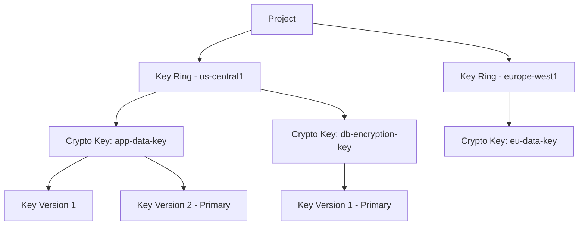

# How to Create a Key Ring and Symmetric Encryption Key in Google Cloud KMS

Author: [nawazdhandala](https://www.github.com/nawazdhandala)

Tags: GCP, Cloud KMS, Encryption, Key Management, Security

Description: A practical guide to creating key rings and symmetric encryption keys in Google Cloud KMS, covering key hierarchy, locations, rotation policies, and access control.

---

Cloud KMS is Google Cloud's managed key management service. It lets you create, manage, and use cryptographic keys without running your own hardware security modules. Whether you need to encrypt application data, protect secrets at rest, or sign digital artifacts, Cloud KMS provides the key infrastructure.

The fundamental building blocks are key rings and crypto keys. A key ring is a logical grouping that lives in a specific location. A crypto key lives inside a key ring and holds the actual key material. Understanding this hierarchy is important because key rings cannot be deleted once created, and the location you choose determines where cryptographic operations happen.

## The Key Hierarchy

Cloud KMS organizes keys in a three-level hierarchy:



- **Key Ring**: A container for keys, tied to a specific location. Cannot be deleted.
- **Crypto Key**: The logical key entity. Holds configuration like purpose, algorithm, and rotation schedule.
- **Key Version**: The actual key material. Multiple versions can exist, but only one is "primary" (used for new encryption operations).

## Prerequisites

- A GCP project with billing enabled
- The Cloud KMS API enabled
- The `roles/cloudkms.admin` role (or more specific roles for key creation)

```bash
# Enable the Cloud KMS API
gcloud services enable cloudkms.googleapis.com --project=my-project-id
```

## Step 1 - Create a Key Ring

A key ring groups related keys and defines where the key material is stored and where cryptographic operations run. Choose the location based on where your data lives and your compliance requirements.

```bash
# Create a key ring in a specific region
gcloud kms keyrings create my-app-keyring \
  --location=us-central1 \
  --project=my-project-id
```

Common locations:
- Single regions: `us-central1`, `europe-west1`, `asia-east1`
- Multi-regions: `us`, `europe`, `asia`
- Global: `global` (for keys used across regions, like Secret Manager CMEK)

```bash
# Create a key ring in the global location
gcloud kms keyrings create global-keyring \
  --location=global \
  --project=my-project-id

# Create a key ring in the US multi-region
gcloud kms keyrings create us-keyring \
  --location=us \
  --project=my-project-id
```

Once you create a key ring, you cannot delete it or change its location. Plan your key ring structure carefully before creating them.

## Step 2 - Create a Symmetric Encryption Key

A symmetric encryption key uses the same key material for both encryption and decryption. This is the most common type for encrypting data at rest.

```bash
# Create a symmetric encryption key
gcloud kms keys create app-data-key \
  --keyring=my-app-keyring \
  --location=us-central1 \
  --purpose=encryption \
  --project=my-project-id
```

The `purpose` parameter defines what the key can be used for. For symmetric encryption, use `encryption`. Other purposes include `asymmetric-encryption`, `asymmetric-signing`, and `mac`.

### With Automatic Rotation

Set up automatic key rotation from the start. This creates new key versions on a schedule:

```bash
# Create a key with automatic rotation every 90 days
gcloud kms keys create app-data-key \
  --keyring=my-app-keyring \
  --location=us-central1 \
  --purpose=encryption \
  --rotation-period=7776000s \
  --next-rotation-time="2026-05-17T00:00:00Z" \
  --project=my-project-id
```

The rotation period is in seconds. 7776000 seconds is 90 days. Google recommends rotating keys at least every 365 days.

### With a Specific Algorithm

By default, symmetric encryption keys use `GOOGLE_SYMMETRIC_ENCRYPTION`. You can also specify this explicitly:

```bash
# Create a key with an explicit algorithm
gcloud kms keys create app-data-key \
  --keyring=my-app-keyring \
  --location=us-central1 \
  --purpose=encryption \
  --default-algorithm=google-symmetric-encryption \
  --project=my-project-id
```

### With Custom Protection Level

Keys can be backed by software (default) or by hardware security modules (HSM):

```bash
# Create a software-backed key (default)
gcloud kms keys create software-key \
  --keyring=my-app-keyring \
  --location=us-central1 \
  --purpose=encryption \
  --protection-level=software \
  --project=my-project-id

# Create an HSM-backed key
gcloud kms keys create hsm-key \
  --keyring=my-app-keyring \
  --location=us-central1 \
  --purpose=encryption \
  --protection-level=hsm \
  --project=my-project-id
```

HSM-backed keys cost more but provide FIPS 140-2 Level 3 compliance.

## Terraform Configuration

Here is a complete Terraform setup for key rings and symmetric keys:

```hcl
# Create a key ring
resource "google_kms_key_ring" "app_keyring" {
  name     = "my-app-keyring"
  location = "us-central1"
  project  = var.project_id
}

# Create a symmetric encryption key with rotation
resource "google_kms_crypto_key" "app_data_key" {
  name            = "app-data-key"
  key_ring        = google_kms_key_ring.app_keyring.id
  rotation_period = "7776000s"  # 90 days
  purpose         = "ENCRYPT_DECRYPT"

  # Prevent Terraform from destroying the key
  lifecycle {
    prevent_destroy = true
  }

  version_template {
    algorithm        = "GOOGLE_SYMMETRIC_ENCRYPTION"
    protection_level = "SOFTWARE"
  }
}

# Create an HSM-backed key for sensitive data
resource "google_kms_crypto_key" "sensitive_data_key" {
  name            = "sensitive-data-key"
  key_ring        = google_kms_key_ring.app_keyring.id
  rotation_period = "7776000s"
  purpose         = "ENCRYPT_DECRYPT"

  lifecycle {
    prevent_destroy = true
  }

  version_template {
    algorithm        = "GOOGLE_SYMMETRIC_ENCRYPTION"
    protection_level = "HSM"
  }
}
```

The `prevent_destroy` lifecycle rule is important. Accidentally destroying a KMS key makes all data encrypted with it permanently unrecoverable.

## Granting Access to the Key

Keys are useless without access. Grant the appropriate roles to the identities that need to use them:

```bash
# Grant encrypt/decrypt permission to an application service account
gcloud kms keys add-iam-policy-binding app-data-key \
  --keyring=my-app-keyring \
  --location=us-central1 \
  --member="serviceAccount:my-app@my-project-id.iam.gserviceaccount.com" \
  --role="roles/cloudkms.cryptoKeyEncrypterDecrypter" \
  --project=my-project-id
```

Available roles:
- `roles/cloudkms.cryptoKeyEncrypterDecrypter` - encrypt and decrypt
- `roles/cloudkms.cryptoKeyEncrypter` - encrypt only
- `roles/cloudkms.cryptoKeyDecrypter` - decrypt only
- `roles/cloudkms.admin` - full management access

## Listing Keys and Key Rings

```bash
# List all key rings in a location
gcloud kms keyrings list \
  --location=us-central1 \
  --project=my-project-id

# List all keys in a key ring
gcloud kms keys list \
  --keyring=my-app-keyring \
  --location=us-central1 \
  --project=my-project-id

# List all versions of a key
gcloud kms keys versions list \
  --key=app-data-key \
  --keyring=my-app-keyring \
  --location=us-central1 \
  --project=my-project-id
```

## Verifying a Key

Check the details of a key to confirm its configuration:

```bash
# Describe a key
gcloud kms keys describe app-data-key \
  --keyring=my-app-keyring \
  --location=us-central1 \
  --project=my-project-id \
  --format=yaml
```

The output includes the key's purpose, algorithm, protection level, rotation schedule, and the primary version number.

## Key Ring and Key Naming Conventions

Use a consistent naming scheme that includes the purpose and environment:

```
Key rings:  {app}-{environment}-keyring    (e.g., payments-prod-keyring)
Keys:       {purpose}-{type}-key           (e.g., data-encryption-key, config-wrapping-key)
```

Group related keys in the same key ring. For example, all keys for the payments service go in `payments-prod-keyring`. This makes access management easier because you can grant roles at the key ring level.

## Things You Cannot Undo

Cloud KMS has several irreversible operations that catch people off guard:

- **Key rings cannot be deleted.** Once created, they exist forever in your project. Use meaningful names.
- **Key versions can be destroyed, but not undeleted.** There is a 24-hour scheduled destruction period during which you can cancel, but after that the key material is gone.
- **Key locations cannot be changed.** If you create a key ring in us-central1, it stays in us-central1.
- **Key purpose cannot be changed.** An encryption key cannot be converted to a signing key.

Plan your key hierarchy thoughtfully before creating anything. Draw it out, get agreement from your team, and use Terraform to make the configuration reproducible and reviewable.

Cloud KMS key rings and symmetric keys form the foundation of data encryption in GCP. Whether you are encrypting application data directly, using CMEK with other services, or implementing envelope encryption, it all starts with a well-organized key hierarchy and properly configured symmetric keys.
