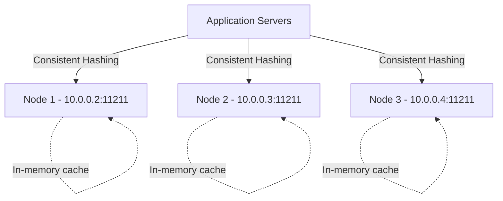

# How to Create a Memorystore for Memcached Instance

Author: [nawazdhandala](https://www.github.com/nawazdhandala)

Tags: GCP, Memorystore, Memcached, Caching, Managed Services

Description: Create and configure a Memorystore for Memcached instance on Google Cloud, including node configuration, networking, and connecting from your applications.

---

While Redis gets most of the attention in the caching world, Memcached still has a strong place in production architectures. It is simpler, uses less memory per key, and distributes data across multiple nodes natively. If your use case is straightforward key-value caching without the need for data structures, persistence, or pub/sub, Memcached might be the better fit.

Google Cloud's Memorystore for Memcached gives you a fully managed Memcached deployment. You specify how many nodes you want and how much memory each node gets, and Google handles the rest. In this post, I will walk through creating a Memcached instance, configuring it properly, and connecting your applications.

## Memcached vs. Redis - When to Choose Memcached

Before creating a Memcached instance, make sure it is the right tool:

**Choose Memcached when:**
- You need simple key-value caching (GET/SET)
- Multi-threaded performance is important
- You want horizontal scaling by adding nodes
- Data persistence is not needed (cache only)
- You want lower memory overhead per key

**Choose Redis when:**
- You need data structures (lists, sets, sorted sets, hashes)
- You need persistence or replication
- You need pub/sub messaging
- You need atomic operations and transactions
- You need TTL management per key

## Prerequisites

Enable the Memorystore Memcached API:

```bash
# Enable the Memorystore for Memcached API
gcloud services enable memcache.googleapis.com
```

You also need a VPC network with private services access configured:

```bash
# Allocate a private IP range if you have not already
gcloud compute addresses create memcached-range \
  --global \
  --purpose=VPC_PEERING \
  --prefix-length=16 \
  --network=default

# Create the private services connection
gcloud services vpc-peerings connect \
  --service=servicenetworking.googleapis.com \
  --ranges=memcached-range \
  --network=default
```

## Creating a Memcached Instance

Here is the basic command:

```bash
# Create a Memorystore Memcached instance with 3 nodes, 1 vCPU and 1 GB each
gcloud memcache instances create my-memcached \
  --region=us-central1 \
  --node-count=3 \
  --node-cpu=1 \
  --node-memory=1gb \
  --memcached-version=MEMCACHE_1_6_15
```

This creates a 3-node Memcached cluster where each node has 1 vCPU and 1 GB of memory, giving you 3 GB of total cache capacity.

### Understanding the Parameters

- `--node-count` - Number of Memcached nodes (1 to 20). More nodes mean more total capacity and better distribution.
- `--node-cpu` - vCPUs per node (1 to 32). More CPUs handle more concurrent connections.
- `--node-memory` - Memory per node in MB or GB (1 GB to 256 GB per node). This is the cache storage.
- `--memcached-version` - The Memcached version to run.

### Production Configuration

For a production workload, you typically want more nodes with moderate resources:

```bash
# Create a production Memcached instance with higher capacity
gcloud memcache instances create production-cache \
  --region=us-central1 \
  --node-count=5 \
  --node-cpu=2 \
  --node-memory=4gb \
  --memcached-version=MEMCACHE_1_6_15 \
  --display-name="Production Memcached" \
  --labels=env=production,team=backend \
  --authorized-network=projects/my-project/global/networks/default
```

This gives you 20 GB of total cache capacity (5 nodes x 4 GB each) with 10 vCPUs total.

## Configuring Memcached Parameters

You can customize Memcached's behavior with parameters:

```bash
# Create an instance with custom Memcached parameters
gcloud memcache instances create custom-cache \
  --region=us-central1 \
  --node-count=3 \
  --node-cpu=1 \
  --node-memory=2gb \
  --parameters=max-item-size=5242880,listen-backlog=2048
```

Common parameters:

- `max-item-size` - Maximum size of a single item in bytes (default 1 MB, max 5 MB)
- `listen-backlog` - TCP connection backlog size
- `max-reqs-per-event` - Maximum number of requests per event
- `idle-timeout` - Close idle connections after this many seconds

## Checking Instance Details

After creation, inspect the instance:

```bash
# Describe the Memcached instance to see all details
gcloud memcache instances describe my-memcached --region=us-central1
```

This shows the discovery endpoint, node endpoints, and current state.

Get the discovery endpoint specifically:

```bash
# Get the discovery endpoint for automatic node discovery
gcloud memcache instances describe my-memcached \
  --region=us-central1 \
  --format="value(discoveryEndpoint)"
```

List all nodes and their IP addresses:

```bash
# List all nodes in the Memcached instance
gcloud memcache instances describe my-memcached \
  --region=us-central1 \
  --format="table(memcacheNodes[].host, memcacheNodes[].port, memcacheNodes[].state)"
```

## Connecting from Applications

### Auto-Discovery

Memorystore Memcached supports auto-discovery, which means your client can automatically find all nodes. This is the recommended approach because it handles node additions and removals.

### Python with pymemcache

```python
# connect_memcached.py - Connect to Memorystore Memcached from Python
from pymemcache.client.hash import HashClient
from pymemcache import serde
import json

def create_memcached_client(nodes):
    """Create a Memcached hash client that distributes keys across nodes."""

    # HashClient distributes keys across multiple servers using consistent hashing
    client = HashClient(
        servers=nodes,
        serializer=serde.python_memcache_serializer,
        deserializer=serde.python_memcache_deserializer,
        connect_timeout=5,
        timeout=3,
        retry_attempts=2,
        use_pooling=True,
        max_pool_size=25
    )

    return client

# Node list from gcloud memcache instances describe output
nodes = [
    ("10.0.0.2", 11211),
    ("10.0.0.3", 11211),
    ("10.0.0.4", 11211),
]

cache = create_memcached_client(nodes)

# Basic operations
cache.set("user:1001", {"name": "Alice", "role": "admin"}, expire=3600)
user = cache.get("user:1001")
print(f"Cached user: {user}")

# Cache-aside pattern
def get_user(user_id):
    """Fetch user from cache, falling back to database on miss."""
    cache_key = f"user:{user_id}"
    user = cache.get(cache_key)

    if user is not None:
        return user

    # Cache miss - fetch from database
    user = fetch_user_from_db(user_id)  # Your DB function
    if user:
        cache.set(cache_key, user, expire=3600)

    return user
```

### Node.js with memjs

```javascript
// connect_memcached.js - Connect to Memorystore Memcached from Node.js
const memjs = require("memjs");

// Connect to multiple nodes with comma-separated host:port pairs
const client = memjs.Client.create(
    "10.0.0.2:11211,10.0.0.3:11211,10.0.0.4:11211",
    {
        retries: 2,
        retry_delay: 0.2,
        timeout: 3,
        conntimeout: 5,
        keepAlive: true,
        keepAliveDelay: 30
    }
);

async function cacheExample() {
    // Set a value with 1-hour TTL
    await client.set("greeting", "Hello from Memcached", { expires: 3600 });

    // Get the value
    const result = await client.get("greeting");
    if (result.value) {
        console.log("Value:", result.value.toString());
    } else {
        console.log("Cache miss");
    }
}

cacheExample().catch(console.error);
```

## Scaling the Instance

Memcached scales horizontally by adding or removing nodes:

```bash
# Scale up by adding more nodes
gcloud memcache instances update my-memcached \
  --region=us-central1 \
  --node-count=5

# Scale down by removing nodes
gcloud memcache instances update my-memcached \
  --region=us-central1 \
  --node-count=2
```

When you add nodes, your client's consistent hashing will redistribute some keys to the new nodes. This causes temporary cache misses for the redistributed keys, which is expected.

When you remove nodes, all data on the removed nodes is lost. Plan for a temporary increase in cache misses.

## Architecture for Memcached



Each node stores a portion of the cached data. The client library determines which node holds a given key using consistent hashing.

## Monitoring

Track Memcached performance with Cloud Monitoring:

```bash
# Key metrics to monitor for Memcached
# - memcache.googleapis.com/node/cpu/usage_time - CPU usage per node
# - memcache.googleapis.com/node/memory/usage - Memory usage per node
# - memcache.googleapis.com/node/hit_ratio - Cache hit ratio
# - memcache.googleapis.com/node/items/current - Number of items cached
```

The hit ratio is the most important metric. A low hit ratio means your cache is not effective - either your keys are not being cached long enough, or your application is not looking in the cache before hitting the database.

## Deleting an Instance

When you no longer need the Memcached instance:

```bash
# Delete the Memcached instance
gcloud memcache instances delete my-memcached --region=us-central1
```

All cached data is immediately and permanently lost.

## Wrapping Up

Memorystore for Memcached gives you a managed, scalable caching layer that is perfect for simple key-value caching workloads. Create the instance with the right node count and memory size for your dataset, connect using consistent hashing in your client library, and monitor the hit ratio to make sure your cache is pulling its weight. If your needs grow beyond simple caching into data structures and persistence, you can always switch to Memorystore for Redis later.
