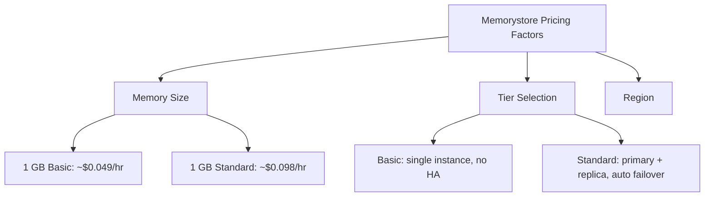

# How to Create a Memorystore for Redis Instance Using the gcloud CLI

Author: [nawazdhandala](https://www.github.com/nawazdhandala)

Tags: GCP, Memorystore, Redis, gcloud CLI, Managed Cache

Description: Step-by-step guide to creating a Google Cloud Memorystore for Redis instance using the gcloud CLI, including configuration options and best practices.

---

If you need a managed Redis instance on Google Cloud, Memorystore for Redis is the way to go. It gives you a fully managed Redis service without the operational overhead of running and patching Redis servers yourself. Google handles replication, failover, patching, and monitoring while you focus on using Redis for caching, session management, or real-time analytics.

In this post, I will walk you through creating a Memorystore for Redis instance using the `gcloud` CLI. I prefer the CLI over the console because it is scriptable, repeatable, and easy to integrate into infrastructure-as-code workflows.

## Prerequisites

Before you start, make sure you have:

- A GCP project with billing enabled
- The `gcloud` CLI installed and configured
- The Redis API enabled

Enable the API if you have not already:

```bash
# Enable the Memorystore for Redis API
gcloud services enable redis.googleapis.com
```

Also verify your project and region:

```bash
# Confirm your active project and set the default region
gcloud config set project my-project
gcloud config set compute/region us-central1
```

## Understanding Memorystore Tiers

Memorystore offers two tiers:

**Basic tier** - A single Redis instance with no replication. Good for caching where data loss on failure is acceptable. Lower cost.

**Standard tier** - A primary instance with a replica in a different zone. Automatic failover if the primary goes down. Required for production workloads where availability matters.

## Creating a Basic Tier Instance

Here is the simplest command to create a Redis instance:

```bash
# Create a basic tier Memorystore Redis instance with 1 GB of memory
gcloud redis instances create my-redis-cache \
  --size=1 \
  --region=us-central1 \
  --tier=basic \
  --redis-version=redis_7_0
```

This creates a 1 GB Redis 7.0 instance in the basic tier. The instance will be ready in a few minutes.

Let me break down each flag:

- `--size` - Memory size in GB (1 to 300)
- `--region` - The GCP region where the instance is created
- `--tier` - Either `basic` or `standard`
- `--redis-version` - The Redis version (`redis_7_0`, `redis_6_x`, `redis_5_0`)

## Creating a Standard Tier Instance

For production use, create a standard tier instance with replication:

```bash
# Create a standard tier instance with replication for high availability
gcloud redis instances create my-redis-production \
  --size=5 \
  --region=us-central1 \
  --tier=standard \
  --redis-version=redis_7_0 \
  --zone=us-central1-a \
  --alternative-zone=us-central1-b \
  --display-name="Production Redis Cache"
```

The `--zone` and `--alternative-zone` flags control where the primary and replica are placed. Putting them in different zones ensures your Redis instance survives a zone failure.

## Configuring Network Settings

By default, Memorystore creates instances on the default VPC network. To use a specific network or enable private IP:

```bash
# Create an instance on a specific VPC network with a reserved IP range
gcloud redis instances create my-redis-private \
  --size=2 \
  --region=us-central1 \
  --tier=standard \
  --redis-version=redis_7_0 \
  --network=projects/my-project/global/networks/my-vpc \
  --reserved-ip-range=redis-reserved-range \
  --connect-mode=PRIVATE_SERVICE_ACCESS
```

For private service access, you first need to create a reserved IP range and establish a private connection:

```bash
# Allocate a private IP range for Memorystore
gcloud compute addresses create redis-reserved-range \
  --global \
  --purpose=VPC_PEERING \
  --prefix-length=16 \
  --network=my-vpc

# Create the private services connection
gcloud services vpc-peerings connect \
  --service=servicenetworking.googleapis.com \
  --ranges=redis-reserved-range \
  --network=my-vpc
```

## Setting Redis Configuration Parameters

You can customize Redis configuration parameters at creation time:

```bash
# Create an instance with custom Redis configuration parameters
gcloud redis instances create my-redis-custom \
  --size=3 \
  --region=us-central1 \
  --tier=standard \
  --redis-version=redis_7_0 \
  --redis-config=maxmemory-policy=allkeys-lru,notify-keyspace-events=Ex
```

Common configuration parameters:

- `maxmemory-policy` - What happens when memory is full (`allkeys-lru`, `volatile-lru`, `noeviction`, etc.)
- `notify-keyspace-events` - Enable keyspace notifications for pub/sub
- `activedefrag` - Enable active defragmentation

## Enabling AUTH

For security, enable AUTH so clients must provide a password:

```bash
# Create an instance with AUTH enabled for password-based authentication
gcloud redis instances create my-redis-secure \
  --size=2 \
  --region=us-central1 \
  --tier=standard \
  --redis-version=redis_7_0 \
  --enable-auth
```

After creation, retrieve the AUTH string:

```bash
# Get the AUTH string for the Redis instance
gcloud redis instances get-auth-string my-redis-secure --region=us-central1
```

## Verifying the Instance

After creation, check the instance details:

```bash
# Describe the instance to see all configuration details
gcloud redis instances describe my-redis-production --region=us-central1
```

This shows the host IP, port, current status, memory usage, and all configuration details.

List all Redis instances in a region:

```bash
# List all Memorystore Redis instances in the current region
gcloud redis instances list --region=us-central1
```

## Connecting to Your Instance

Once created, get the connection details:

```bash
# Get the IP address and port of the Redis instance
gcloud redis instances describe my-redis-production \
  --region=us-central1 \
  --format="get(host,port)"
```

You can test the connection from a Compute Engine VM in the same VPC:

```bash
# Install redis-cli on a Compute Engine VM and test the connection
sudo apt-get install redis-tools

# Connect to the Redis instance using its private IP
redis-cli -h 10.0.0.3 -p 6379

# If AUTH is enabled, authenticate first
redis-cli -h 10.0.0.3 -p 6379 -a YOUR_AUTH_STRING
```

## Automating with a Shell Script

Here is a script that creates a complete Memorystore setup:

```bash
#!/bin/bash
# create-redis-instance.sh - Automated Memorystore Redis provisioning

PROJECT_ID="my-project"
REGION="us-central1"
INSTANCE_NAME="app-cache"
SIZE_GB=5
TIER="standard"
REDIS_VERSION="redis_7_0"

echo "Creating Memorystore Redis instance: ${INSTANCE_NAME}"

# Create the instance with production-ready settings
gcloud redis instances create "${INSTANCE_NAME}" \
  --project="${PROJECT_ID}" \
  --region="${REGION}" \
  --size="${SIZE_GB}" \
  --tier="${TIER}" \
  --redis-version="${REDIS_VERSION}" \
  --zone="${REGION}-a" \
  --alternative-zone="${REGION}-b" \
  --enable-auth \
  --redis-config=maxmemory-policy=allkeys-lru \
  --display-name="Application Cache" \
  --labels=env=production,team=backend

# Wait for the instance to be ready
echo "Waiting for instance to become ready..."
gcloud redis instances describe "${INSTANCE_NAME}" \
  --region="${REGION}" \
  --format="value(state)"

# Output connection details
echo "Instance details:"
gcloud redis instances describe "${INSTANCE_NAME}" \
  --region="${REGION}" \
  --format="table(host,port,memorySizeGb,tier,redisVersion)"

# Get the AUTH string
echo "AUTH string:"
gcloud redis instances get-auth-string "${INSTANCE_NAME}" \
  --region="${REGION}"
```

## Labels and Organization

Use labels to organize and track costs across multiple Redis instances:

```bash
# Add labels for cost tracking and organization
gcloud redis instances create my-redis \
  --size=2 \
  --region=us-central1 \
  --tier=standard \
  --redis-version=redis_7_0 \
  --labels=environment=production,team=platform,service=user-api
```

## Cost Estimation

Memorystore pricing is based on:

- **Instance size** - GB of memory provisioned
- **Tier** - Standard tier costs roughly 2x basic tier
- **Region** - Prices vary by region

A quick reference for US regions:



For a 5 GB standard tier instance, expect roughly $350-400/month. Check the pricing calculator for exact numbers in your region.

## Common Creation Errors

**Insufficient quota.** Memorystore has a quota on the total memory per region. Request a quota increase if you hit the limit.

**Network not found.** If specifying a custom network, use the full resource path: `projects/PROJECT/global/networks/NETWORK`.

**Invalid Redis config.** Not all Redis configuration parameters are supported. Check the documentation for the list of allowed parameters.

**Region unavailability.** Not all regions support all instance sizes or Redis versions. Check availability before scripting.

## Wrapping Up

Creating a Memorystore for Redis instance with the gcloud CLI is straightforward. Choose your tier based on availability requirements, size it based on your dataset, configure AUTH for security, and set the right eviction policy for your use case. With the CLI commands in this post, you can script the entire provisioning process and integrate it into your infrastructure automation.
