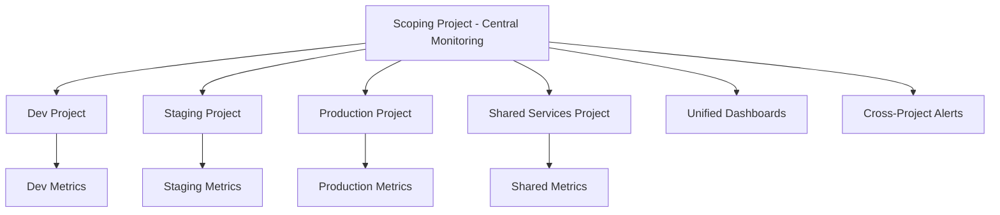

# How to Create a Multi-Project Monitoring Dashboard Using Metrics Scopes in GCP

Author: [nawazdhandala](https://www.github.com/nawazdhandala)

Tags: GCP, Cloud Monitoring, Metrics Scopes, Multi-Project, Dashboards

Description: Learn how to use metrics scopes in Google Cloud Monitoring to build dashboards that aggregate and visualize metrics across multiple GCP projects.

---

Most organizations running production workloads on GCP end up with multiple projects. Maybe you have separate projects for each environment (dev, staging, prod), for each team, or for each microservice. The challenge comes when you want a single dashboard that shows metrics from all of them. That is where metrics scopes come in.

In this post, I will explain how metrics scopes work and walk you through setting up a multi-project monitoring dashboard from scratch.

## What Are Metrics Scopes?

Every GCP project has a metrics scope. Think of it as the monitoring boundary - it defines which projects' metrics are visible from a given project. By default, a project's metrics scope only contains its own metrics. But you can expand a project's metrics scope to include other projects, making those projects' metrics visible in the same Cloud Monitoring interface.

Here is the mental model:

- **Scoping project**: The project where you view your dashboards and configure alerts
- **Monitored projects**: The projects whose metrics are pulled into the scoping project's metrics scope

You pick one project as your central monitoring hub and add the other projects to its metrics scope. After that, dashboards and alerts in the scoping project can reference metrics from any of the monitored projects.

## How Metrics Scopes Differ from the Old Workspace Model

If you used GCP Monitoring before 2021, you might remember "Workspaces." Metrics scopes replaced Workspaces and brought some important changes:

- Each project now has its own metrics scope by default (no separate workspace creation needed)
- You add monitored projects to a scoping project rather than creating a shared workspace
- The relationship is many-to-many: a project can be monitored by multiple scoping projects

## Setting Up a Multi-Project Metrics Scope

### Using the Cloud Console

1. Navigate to **Monitoring** > **Settings** in the scoping project
2. Click **Metric Scopes** tab
3. Click **Add Projects**
4. Select the projects you want to monitor
5. Click **Add**

It takes a few minutes for metrics from the newly added projects to become visible.

### Using the gcloud CLI

You can also manage metrics scopes from the command line:

```bash
# Add a monitored project to the scoping project's metrics scope
gcloud beta monitoring metrics-scopes create \
  projects/monitored-project-id \
  --project=scoping-project-id
```

To list which projects are currently in a metrics scope:

```bash
# List all monitored projects in the current scope
gcloud beta monitoring metrics-scopes list --project=scoping-project-id
```

To remove a project from the metrics scope:

```bash
# Remove a monitored project from the scope
gcloud beta monitoring metrics-scopes delete \
  projects/monitored-project-id \
  --project=scoping-project-id
```

### Using the API Directly

For automation, the REST API works well:

```bash
# Add a monitored project via the Cloud Monitoring API
curl -X POST \
  "https://monitoring.googleapis.com/v1/locations/global/metricsScopes/SCOPING_PROJECT_NUMBER/projects" \
  -H "Authorization: Bearer $(gcloud auth print-access-token)" \
  -H "Content-Type: application/json" \
  -d '{
    "name": "locations/global/metricsScopes/SCOPING_PROJECT_NUMBER/projects/MONITORED_PROJECT_NUMBER"
  }'
```

## Building a Cross-Project Dashboard

Once your metrics scope includes multiple projects, building a cross-project dashboard is straightforward. The key is using the `project_id` label to filter or group metrics by project.

### Example: CPU Utilization Across All Projects

This MQL query shows CPU utilization for Compute Engine instances across all monitored projects:

```
# CPU utilization grouped by project
fetch gce_instance
| metric 'compute.googleapis.com/instance/cpu/utilization'
| group_by [project_id, instance_id], [val: mean(value.utilization)]
| every 1m
```

### Example: Side-by-Side Project Comparison

You can create a dashboard that compares the same metric across projects. This is useful for comparing environments:

```
# Average CPU utilization per project for comparison
fetch gce_instance
| metric 'compute.googleapis.com/instance/cpu/utilization'
| group_by [project_id], [val: mean(value.utilization)]
| every 5m
```

### Example: Aggregated Request Counts

If you run the same service across multiple projects, you might want the total request count:

```
# Total HTTP request count summed across all projects
fetch https_lb_rule
| metric 'loadbalancing.googleapis.com/https/request_count'
| group_by [], [val: sum(value.request_count)]
| every 1m
```

## Creating the Dashboard as Code

Here is a JSON dashboard definition that includes cross-project widgets:

```json
{
  "displayName": "Multi-Project Overview",
  "mosaicLayout": {
    "tiles": [
      {
        "xPos": 0,
        "yPos": 0,
        "width": 6,
        "height": 4,
        "widget": {
          "title": "CPU Utilization by Project",
          "xyChart": {
            "dataSets": [
              {
                "timeSeriesQuery": {
                  "timeSeriesFilter": {
                    "filter": "metric.type=\"compute.googleapis.com/instance/cpu/utilization\"",
                    "aggregation": {
                      "alignmentPeriod": "300s",
                      "perSeriesAligner": "ALIGN_MEAN",
                      "groupByFields": ["project"],
                      "crossSeriesReducer": "REDUCE_MEAN"
                    }
                  }
                }
              }
            ]
          }
        }
      },
      {
        "xPos": 6,
        "yPos": 0,
        "width": 6,
        "height": 4,
        "widget": {
          "title": "Network Egress by Project",
          "xyChart": {
            "dataSets": [
              {
                "timeSeriesQuery": {
                  "timeSeriesFilter": {
                    "filter": "metric.type=\"compute.googleapis.com/instance/network/sent_bytes_count\"",
                    "aggregation": {
                      "alignmentPeriod": "300s",
                      "perSeriesAligner": "ALIGN_RATE",
                      "groupByFields": ["project"],
                      "crossSeriesReducer": "REDUCE_SUM"
                    }
                  }
                }
              }
            ]
          }
        }
      }
    ]
  }
}
```

Deploy it with:

```bash
# Create the multi-project dashboard from JSON
gcloud monitoring dashboards create \
  --config-from-file=multi-project-dashboard.json \
  --project=scoping-project-id
```

## IAM Considerations

For metrics scopes to work, the scoping project needs the right permissions on the monitored projects. Specifically:

- The `roles/monitoring.viewer` role (or equivalent) must be granted on each monitored project
- The service agent for Cloud Monitoring in the scoping project needs access to read metrics from monitored projects

In most cases, if the projects are in the same organization, the permissions are handled automatically when you add a project to the metrics scope. If you are working across organizations, you will need to set up the IAM bindings manually:

```bash
# Grant monitoring viewer role to the scoping project's service agent
gcloud projects add-iam-policy-binding monitored-project-id \
  --member="serviceAccount:service-SCOPING_PROJECT_NUMBER@gcp-sa-monitoring-notification.iam.gserviceaccount.com" \
  --role="roles/monitoring.viewer"
```

## Architecture Patterns

Here is a diagram showing a common multi-project monitoring setup:



This pattern works well for organizations that want centralized visibility without giving every team access to every project.

## Limitations to Know About

Metrics scopes are powerful but they do have boundaries:

- **Maximum monitored projects**: A single metrics scope can include up to 375 monitored projects. For larger organizations, you may need multiple scoping projects.
- **No cross-organization by default**: Adding projects from different organizations requires manual IAM setup.
- **Metric volume**: More monitored projects means more metrics data in your dashboards. Keep your queries focused to avoid slow-loading dashboards.
- **Log data is not shared**: Metrics scopes only cover metrics. Log data stays in each project's Cloud Logging unless you set up aggregated sinks separately.

## Wrapping Up

Metrics scopes in Cloud Monitoring solve the fragmented visibility problem that comes with multi-project GCP environments. By designating a scoping project and adding your other projects as monitored projects, you get a single pane of glass for dashboards and alerts without duplicating metrics or running additional infrastructure.

The setup takes just a few minutes, and the payoff is significant - especially during incidents when you need to see the full picture quickly.
