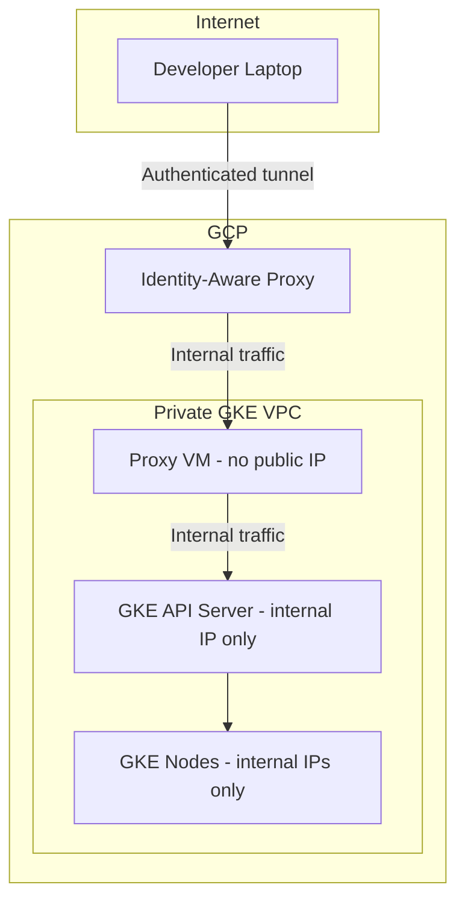

# How to Create a Private GKE Cluster with No Public Endpoint and Access It Through IAP

Author: [nawazdhandala](https://www.github.com/nawazdhandala)

Tags: GCP, GKE, Kubernetes, IAP, Security, Private Cluster

Description: Learn how to create a fully private GKE cluster with no public endpoint and securely access it through Identity-Aware Proxy for production-grade security.

---

Running a GKE cluster with a public API endpoint is a security risk that most teams eventually need to address. A private cluster keeps the Kubernetes API server on an internal IP, which means it is not reachable from the internet. But then the question becomes: how do developers and CI/CD systems access `kubectl` without a public endpoint?

The answer is Identity-Aware Proxy (IAP). IAP lets you tunnel TCP connections to internal resources through Google's infrastructure, authenticated with your Google identity. No VPN needed, no bastion host to maintain, and every connection is authenticated and logged.

Let me walk through creating a private GKE cluster from scratch and setting up IAP access.

## Why Go Fully Private

A standard GKE cluster exposes the Kubernetes API server on a public IP. Even though it is protected by authentication, having it publicly reachable means:

- It is a target for brute force and credential stuffing attacks
- Any vulnerability in the API server is directly exploitable from the internet
- You need to maintain authorized networks lists

A private cluster with no public endpoint eliminates the entire attack surface. The API server only has an internal IP, period.

## Step 1: Create the VPC and Subnets

Private clusters need a VPC with properly sized subnets for nodes, pods, and services.

```bash
# Create a custom VPC for the private cluster
gcloud compute networks create private-gke-vpc \
  --subnet-mode custom

# Create a subnet with secondary ranges for pods and services
gcloud compute networks subnets create private-gke-subnet \
  --network private-gke-vpc \
  --region us-central1 \
  --range 10.0.0.0/20 \
  --secondary-range pods=10.4.0.0/14,services=10.8.0.0/20
```

The secondary ranges are for GKE's VPC-native networking. The pod range needs to be large enough for all pods across all nodes.

## Step 2: Create the Private GKE Cluster

Create the cluster with both `--enable-private-nodes` and `--enable-private-endpoint`. The combination of these two flags gives you a fully private cluster.

```bash
# Create a fully private GKE cluster
gcloud container clusters create private-cluster \
  --region us-central1 \
  --network private-gke-vpc \
  --subnetwork private-gke-subnet \
  --cluster-secondary-range-name pods \
  --services-secondary-range-name services \
  --enable-private-nodes \
  --enable-private-endpoint \
  --master-ipv4-cidr 172.16.0.0/28 \
  --enable-ip-alias \
  --enable-master-authorized-networks \
  --no-enable-basic-auth \
  --no-issue-client-certificate \
  --workload-pool YOUR_PROJECT_ID.svc.id.goog \
  --num-nodes 3 \
  --machine-type e2-standard-4
```

Key flags explained:

- `--enable-private-nodes`: Nodes only get internal IPs
- `--enable-private-endpoint`: The API server only gets an internal IP
- `--master-ipv4-cidr`: The CIDR block for the control plane's VPC peering connection
- `--workload-pool`: Enables Workload Identity for secure pod-to-GCP-service authentication

## Step 3: Set Up a Proxy VM for IAP Access

Since the API server has no public IP, you need a way to reach it. We will create a small VM in the same VPC that acts as a tunnel endpoint.

```bash
# Create a small VM that will serve as the IAP tunnel endpoint
gcloud compute instances create gke-proxy-vm \
  --zone us-central1-a \
  --machine-type e2-micro \
  --network private-gke-vpc \
  --subnet private-gke-subnet \
  --no-address \
  --metadata startup-script='#!/bin/bash
    apt-get update
    apt-get install -y kubectl google-cloud-sdk-gke-gcloud-auth-plugin tinyproxy
    # Configure tinyproxy to listen on all interfaces
    sed -i "s/^Allow 127.0.0.1$/Allow 10.0.0.0\/8/" /etc/tinyproxy/tinyproxy.conf
    sed -i "s/^Port 8888$/Port 8888/" /etc/tinyproxy/tinyproxy.conf
    systemctl restart tinyproxy'
```

Notice `--no-address` - this VM also has no public IP. Everything stays internal.

## Step 4: Configure IAP for TCP Forwarding

IAP TCP forwarding lets you create encrypted tunnels to VMs without needing them to have public IPs.

```bash
# Create a firewall rule allowing IAP traffic to the proxy VM
gcloud compute firewall-rules create allow-iap-to-proxy \
  --network private-gke-vpc \
  --allow tcp:22,tcp:8888 \
  --source-ranges 35.235.240.0/20 \
  --target-tags gke-proxy

# Add the network tag to the proxy VM
gcloud compute instances add-tags gke-proxy-vm \
  --zone us-central1-a \
  --tags gke-proxy
```

The source range `35.235.240.0/20` is Google's IAP IP range. This is the only range that needs to reach your VM.

## Step 5: Grant IAP Access to Developers

Control who can use IAP tunnels through IAM.

```bash
# Grant a user permission to create IAP tunnels
gcloud projects add-iam-policy-binding YOUR_PROJECT_ID \
  --member "user:developer@company.com" \
  --role "roles/iap.tunnelResourceAccessor"

# Grant a group (recommended for teams)
gcloud projects add-iam-policy-binding YOUR_PROJECT_ID \
  --member "group:gke-developers@company.com" \
  --role "roles/iap.tunnelResourceAccessor"
```

## Step 6: Connect to the Cluster Through IAP

Now, from your local machine, open an IAP tunnel and use it to reach the cluster.

```bash
# Start an IAP tunnel to the proxy VM on port 8888
gcloud compute start-iap-tunnel gke-proxy-vm 8888 \
  --local-host-port localhost:8888 \
  --zone us-central1-a &

# Wait a moment for the tunnel to establish
sleep 5

# Get cluster credentials (this configures kubectl)
HTTPS_PROXY=localhost:8888 gcloud container clusters get-credentials private-cluster \
  --region us-central1 \
  --internal-ip

# Now kubectl works through the IAP tunnel
HTTPS_PROXY=localhost:8888 kubectl get nodes
```

To make this easier, you can set the proxy in your kubeconfig or create a shell alias.

```bash
# Add this to your shell profile for convenience
alias kpriv='HTTPS_PROXY=localhost:8888 kubectl'

# Then just use
kpriv get pods
kpriv apply -f deployment.yaml
```

## Alternative: Direct IAP Tunnel to the API Server

If you do not want to maintain a proxy VM, you can use the `connect-gateway` feature which lets you access the cluster through Google's Connect service.

```bash
# Register the cluster with the Connect gateway
gcloud container fleet memberships register private-cluster \
  --gke-cluster us-central1/private-cluster \
  --enable-workload-identity

# Get credentials through the gateway (no proxy needed)
gcloud container fleet memberships get-credentials private-cluster

# kubectl now works through the Connect gateway
kubectl get nodes
```

This approach is cleaner but requires GKE Enterprise (formerly Anthos) features.

## CI/CD Access

Your CI/CD pipeline also needs to reach the private cluster. If you use Cloud Build, it can connect to the private cluster through a private pool.

```bash
# Create a Cloud Build private worker pool in the same VPC
gcloud builds worker-pools create gke-deploy-pool \
  --region us-central1 \
  --peered-network projects/YOUR_PROJECT_ID/global/networks/private-gke-vpc

# In your cloudbuild.yaml, specify the worker pool
# options:
#   pool:
#     name: 'projects/YOUR_PROJECT_ID/locations/us-central1/workerPools/gke-deploy-pool'
```

## Authorized Networks for the Control Plane

Even though the endpoint is private, you should still configure authorized networks to limit which internal IPs can reach the API server.

```bash
# Allow only the proxy VM's subnet and Cloud Build's subnet
gcloud container clusters update private-cluster \
  --region us-central1 \
  --enable-master-authorized-networks \
  --master-authorized-networks 10.0.0.0/20,10.1.0.0/20
```

## Network Architecture Summary

Here is the full picture of how traffic flows:



## Wrapping Up

A fully private GKE cluster with IAP access gives you the strongest security posture without sacrificing developer productivity. There is no VPN to configure, no bastion host to patch, and every connection is authenticated through Google identity and logged in Cloud Audit Logs. The initial setup takes more effort than a standard cluster, but for any production workload handling sensitive data, it is the right approach. Once the proxy VM and IAP tunnel are configured, the day-to-day developer experience is just adding a proxy prefix to your kubectl commands, or using the Connect gateway for an even smoother experience.
