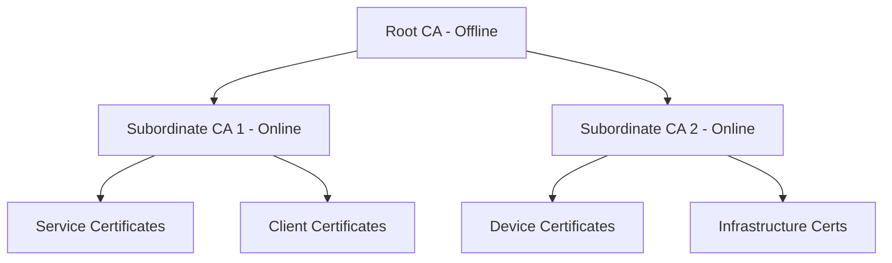

# How to Create a Private Root Certificate Authority Using GCP CA Service

Author: [nawazdhandala](https://www.github.com/nawazdhandala)

Tags: GCP, Certificate Authority Service, PKI, TLS, Security

Description: Learn how to create and manage a private root certificate authority using Google Cloud Certificate Authority Service for internal PKI and TLS certificate management.

---

Running your own Public Key Infrastructure (PKI) used to mean setting up OpenSSL on a hardened server, figuring out certificate signing request workflows, managing CRLs, and hoping nobody accidentally deleted the root key. It worked but it was fragile and operationally painful.

GCP Certificate Authority Service (CA Service) gives you a managed PKI. You create certificate authorities, issue certificates, manage revocation, and Google handles the HSM-backed key storage, high availability, and audit logging. In this post, I will show you how to set up a private root CA and subordinate CA for issuing internal certificates.

## Why a Private CA?

Public CAs (like Let's Encrypt or DigiCert) issue certificates that are trusted by browsers and operating systems globally. Private CAs issue certificates trusted only within your organization. Use a private CA when:

- You need mutual TLS (mTLS) between internal services
- You want to issue certificates for internal domains not publicly resolvable
- Your compliance requirements mandate control over the certificate chain
- You need certificates for IoT devices, VPN connections, or internal APIs

## Architecture

A typical PKI setup has two tiers:



The root CA signs subordinate CAs, and subordinate CAs issue end-entity certificates. The root CA can be kept offline (DevOps tier in CA Service) for maximum security, while subordinate CAs stay online for automatic certificate issuance.

## Prerequisites

- CA Service API enabled (`gcloud services enable privateca.googleapis.com`)
- CA Service Admin role (`roles/privateca.admin`)
- A GCP project with billing enabled

## Step 1: Create a CA Pool for the Root

CA pools are containers for certificate authorities. They define the issuance policies that apply to all CAs in the pool.

```bash
# Create a CA pool for the root CA
gcloud privateca pools create root-ca-pool \
  --location=us-central1 \
  --tier=enterprise \
  --project=PROJECT_ID
```

The `enterprise` tier provides HSM-backed key storage and supports root CAs. The `devops` tier is cheaper but only supports subordinate CAs.

## Step 2: Create the Root CA

Now create the root certificate authority:

```bash
# Create a root CA with a 10-year validity and RSA 4096 key
gcloud privateca roots create my-root-ca \
  --pool=root-ca-pool \
  --location=us-central1 \
  --subject="CN=My Organization Root CA,O=My Organization,C=US" \
  --key-algorithm=rsa-pkcs1-4096-sha256 \
  --max-chain-length=1 \
  --validity="P10Y" \
  --project=PROJECT_ID
```

Let me break down the key parameters:

- `--subject`: The distinguished name for the CA certificate. Use your organization's real name.
- `--key-algorithm`: RSA 4096-bit with SHA-256 is the standard choice for root CAs.
- `--max-chain-length=1`: Only allows one level of subordinate CAs below this root.
- `--validity="P10Y"`: The root CA certificate is valid for 10 years.

## Step 3: Create a CA Pool for Subordinate CAs

Create a separate pool for subordinate CAs with issuance policies:

```bash
# Create a CA pool for subordinate CAs with issuance constraints
gcloud privateca pools create subordinate-ca-pool \
  --location=us-central1 \
  --tier=devops \
  --project=PROJECT_ID
```

Add an issuance policy to control what certificates the subordinate CAs can issue:

```bash
# Set issuance policy - restrict certificate lifetime and key types
gcloud privateca pools update subordinate-ca-pool \
  --location=us-central1 \
  --issuance-policy=issuance-policy.yaml \
  --project=PROJECT_ID
```

Create `issuance-policy.yaml`:

```yaml
# issuance-policy.yaml
# Restrict what certificates can be issued from this pool
maximumLifetime: "8640000s"  # Maximum 100 days
allowedKeyTypes:
  - rsa:
      minModulusSize: 2048
      maxModulusSize: 4096
  - ellipticCurve:
      signatureAlgorithm: ECDSA_P256
allowedIssuanceModes:
  allowCsrBasedIssuance: true
  allowConfigBasedIssuance: true
baselineValues:
  keyUsage:
    baseKeyUsage:
      digitalSignature: true
      keyEncipherment: true
    extendedKeyUsage:
      serverAuth: true
      clientAuth: true
```

## Step 4: Create a Subordinate CA

Create a subordinate CA signed by the root:

```bash
# Create a subordinate CA signed by the root CA
gcloud privateca subordinates create my-subordinate-ca \
  --pool=subordinate-ca-pool \
  --location=us-central1 \
  --issuer-pool=root-ca-pool \
  --issuer-location=us-central1 \
  --subject="CN=My Organization Subordinate CA,O=My Organization,C=US" \
  --key-algorithm=rsa-pkcs1-2048-sha256 \
  --validity="P3Y" \
  --project=PROJECT_ID
```

This creates a subordinate CA with a 3-year certificate signed by the root CA.

## Step 5: Issue Certificates

Now you can issue certificates from the subordinate CA pool.

Issue a server certificate using gcloud:

```bash
# Issue a certificate for an internal service
gcloud privateca certificates create my-service-cert \
  --issuer-pool=subordinate-ca-pool \
  --issuer-location=us-central1 \
  --subject="CN=api.internal.example.com,O=My Organization" \
  --dns-san="api.internal.example.com,api.staging.internal.example.com" \
  --ip-san="10.0.1.50" \
  --validity="P90D" \
  --generate-key \
  --key-output-file=private-key.pem \
  --cert-output-file=certificate.pem \
  --cert-chain-output-file=chain.pem \
  --project=PROJECT_ID
```

Or issue from a CSR:

```bash
# Generate a CSR with OpenSSL first
openssl req -new -newkey rsa:2048 -nodes \
  -keyout service.key \
  -out service.csr \
  -subj "/CN=api.internal.example.com/O=My Organization"

# Submit the CSR to the CA
gcloud privateca certificates create from-csr-cert \
  --issuer-pool=subordinate-ca-pool \
  --issuer-location=us-central1 \
  --csr=service.csr \
  --validity="P90D" \
  --cert-output-file=certificate.pem \
  --project=PROJECT_ID
```

## Step 6: Issue Certificates Programmatically

For automated certificate issuance in your applications:

```python
from google.cloud import security_privateca_v1
from google.protobuf import duration_pb2

def issue_certificate(project_id, location, pool_id, cert_id,
                       common_name, dns_names, validity_days=90):
    """Issue a certificate from a CA pool programmatically."""

    client = security_privateca_v1.CertificateAuthorityServiceClient()

    # Build the certificate configuration
    cert_config = security_privateca_v1.CertificateConfig(
        subject_config=security_privateca_v1.CertificateConfig.SubjectConfig(
            subject=security_privateca_v1.Subject(
                common_name=common_name,
                organization="My Organization",
            ),
            subject_alt_name=security_privateca_v1.SubjectAltNames(
                dns_names=dns_names,
            ),
        ),
        x509_config=security_privateca_v1.X509Parameters(
            key_usage=security_privateca_v1.KeyUsage(
                base_key_usage=security_privateca_v1.KeyUsage.KeyUsageOptions(
                    digital_signature=True,
                    key_encipherment=True,
                ),
                extended_key_usage=security_privateca_v1.KeyUsage.ExtendedKeyUsageOptions(
                    server_auth=True,
                    client_auth=True,
                ),
            ),
        ),
        public_key=security_privateca_v1.PublicKey(
            format_=security_privateca_v1.PublicKey.KeyFormat.PEM,
            key=open("public_key.pem", "rb").read(),
        ),
    )

    # Set certificate lifetime
    lifetime = duration_pb2.Duration(seconds=validity_days * 86400)

    # Create the certificate
    certificate = security_privateca_v1.Certificate(
        config=cert_config,
        lifetime=lifetime,
    )

    pool_path = client.ca_pool_path(project_id, location, pool_id)

    response = client.create_certificate(
        parent=pool_path,
        certificate=certificate,
        certificate_id=cert_id,
    )

    print(f"Certificate issued: {response.name}")
    print(f"PEM certificate:\n{response.pem_certificate}")

    return response

# Issue a certificate
issue_certificate(
    project_id="my-project",
    location="us-central1",
    pool_id="subordinate-ca-pool",
    cert_id="api-service-cert-001",
    common_name="api.internal.example.com",
    dns_names=["api.internal.example.com"],
)
```

## Step 7: Manage Certificate Revocation

When a certificate needs to be revoked (key compromise, employee departure, etc.):

```bash
# Revoke a certificate
gcloud privateca certificates revoke my-service-cert \
  --issuer-pool=subordinate-ca-pool \
  --issuer-location=us-central1 \
  --reason=KEY_COMPROMISE \
  --project=PROJECT_ID
```

CA Service automatically publishes Certificate Revocation Lists (CRLs) and supports OCSP for real-time revocation checking.

## Step 8: Terraform Configuration

Here is the complete setup in Terraform:

```hcl
# Root CA pool
resource "google_privateca_ca_pool" "root_pool" {
  name     = "root-ca-pool"
  location = "us-central1"
  tier     = "ENTERPRISE"
  project  = var.project_id
}

# Root CA
resource "google_privateca_certificate_authority" "root_ca" {
  pool                     = google_privateca_ca_pool.root_pool.name
  certificate_authority_id = "my-root-ca"
  location                 = "us-central1"
  type                     = "SELF_SIGNED"

  config {
    subject_config {
      subject {
        organization = "My Organization"
        common_name  = "My Organization Root CA"
      }
    }
    x509_config {
      ca_options {
        is_ca                  = true
        max_issuer_path_length = 1
      }
      key_usage {
        base_key_usage {
          cert_sign = true
          crl_sign  = true
        }
      }
    }
  }

  key_spec {
    algorithm = "RSA_PKCS1_4096_SHA256"
  }

  lifetime = "315360000s"  # 10 years
}

# Subordinate CA pool
resource "google_privateca_ca_pool" "sub_pool" {
  name     = "subordinate-ca-pool"
  location = "us-central1"
  tier     = "DEVOPS"
  project  = var.project_id
}

# Subordinate CA
resource "google_privateca_certificate_authority" "sub_ca" {
  pool                     = google_privateca_ca_pool.sub_pool.name
  certificate_authority_id = "my-subordinate-ca"
  location                 = "us-central1"
  type                     = "SUBORDINATE"

  subordinate_config {
    certificate_authority = google_privateca_certificate_authority.root_ca.name
  }

  config {
    subject_config {
      subject {
        organization = "My Organization"
        common_name  = "My Organization Subordinate CA"
      }
    }
    x509_config {
      ca_options {
        is_ca = true
      }
      key_usage {
        base_key_usage {
          cert_sign        = true
          crl_sign         = true
          digital_signature = true
        }
        extended_key_usage {
          server_auth = true
          client_auth = true
        }
      }
    }
  }

  key_spec {
    algorithm = "RSA_PKCS1_2048_SHA256"
  }

  lifetime = "94608000s"  # 3 years
}
```

## Distributing the Root Certificate

For clients to trust certificates issued by your private CA, they need the root CA certificate. Export it:

```bash
# Export the root CA certificate
gcloud privateca roots describe my-root-ca \
  --pool=root-ca-pool \
  --location=us-central1 \
  --format="value(pemCaCertificates[0])" \
  --project=PROJECT_ID > root-ca.pem
```

Distribute this certificate to all systems that need to trust your internal certificates - application servers, Kubernetes clusters, developer machines, and monitoring tools.

## Summary

GCP CA Service takes the operational burden out of running a private PKI. Create a root CA with HSM-backed key storage, set up subordinate CAs for different use cases, define issuance policies to control what certificates can be issued, and use the API for automated certificate lifecycle management. The two-tier architecture (offline root, online subordinates) follows PKI best practices without requiring you to manage the underlying infrastructure.
