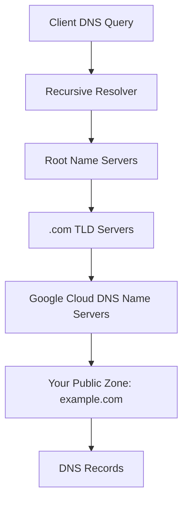

# How to Create a Public Managed DNS Zone in Google Cloud DNS

Author: [nawazdhandala](https://www.github.com/nawazdhandala)

Tags: GCP, Cloud DNS, DNS Zone, Domain Management, Networking

Description: Step-by-step guide to creating a public managed DNS zone in Google Cloud DNS, configuring name servers, and managing DNS records for your domain.

---

Google Cloud DNS is a high-performance, resilient, global DNS service that runs on the same infrastructure as Google itself. When you create a public managed DNS zone in Cloud DNS, you are essentially telling Google to be the authoritative DNS server for your domain. All DNS queries for your domain are answered by Google's globally distributed DNS infrastructure, which means fast resolution times and high availability.

This post walks through creating a public DNS zone, pointing your domain to it, and managing the basic records you need to get started.

## What Is a Public Managed DNS Zone?

A DNS zone represents a portion of the DNS namespace that you manage. A public zone is accessible from the internet - anyone can query it. "Managed" means Google handles the DNS server infrastructure; you just manage the records.

When you create a public managed zone for `example.com`, you get a set of name servers (like `ns-cloud-a1.googledomains.com`). You then update your domain registrar to point to these name servers, and from that point on, Cloud DNS answers all DNS queries for your domain.

## Prerequisites

- A GCP project with the Cloud DNS API enabled
- A registered domain name
- Access to your domain registrar to update name servers
- The `gcloud` CLI installed

Enable the Cloud DNS API:

```bash
# Enable the Cloud DNS API
gcloud services enable dns.googleapis.com
```

## Step 1: Create the Public DNS Zone

```bash
# Create a public managed DNS zone for your domain
gcloud dns managed-zones create my-zone \
    --dns-name="example.com." \
    --description="Public DNS zone for example.com" \
    --visibility=public
```

Important details:
- The `--dns-name` must end with a dot (this is standard DNS notation for a fully qualified domain name)
- The zone name (`my-zone`) is a GCP resource identifier - it does not have to match the domain name
- `--visibility=public` makes this zone queryable from the internet

## Step 2: Get the Name Servers

After creating the zone, Cloud DNS assigns four name servers:

```bash
# Get the assigned name servers for the zone
gcloud dns managed-zones describe my-zone \
    --format="value(nameServers)"
```

This outputs something like:

```
ns-cloud-a1.googledomains.com.
ns-cloud-a2.googledomains.com.
ns-cloud-a3.googledomains.com.
ns-cloud-a4.googledomains.com.
```

## Step 3: Update Your Domain Registrar

Go to your domain registrar (GoDaddy, Namecheap, Google Domains, Route 53, etc.) and update the name servers for your domain to the four servers from the previous step.

The process varies by registrar, but generally:
1. Log in to your registrar's control panel
2. Find the domain's name server settings
3. Replace the existing name servers with the four Google Cloud DNS name servers
4. Save the changes

Name server changes can take anywhere from a few minutes to 48 hours to propagate globally. In practice, most updates propagate within an hour or two.

## Step 4: Verify Name Server Propagation

Check if the name server update has propagated:

```bash
# Check the current name servers for your domain
dig NS example.com +short

# Query a specific public DNS resolver
dig @8.8.8.8 NS example.com +short

# Use the whois tool for registrar-level NS check
whois example.com | grep "Name Server"
```

You should see the Google Cloud DNS name servers in the response.

## Step 5: Add DNS Records

Now you can add records to your zone. Here are the most common types:

### A Record (Points to an IP address)

```bash
# Create an A record pointing your domain to an IP address
gcloud dns record-sets create example.com. \
    --zone=my-zone \
    --type=A \
    --ttl=300 \
    --rrdatas="203.0.113.10"
```

### AAAA Record (IPv6 address)

```bash
# Create an AAAA record for IPv6
gcloud dns record-sets create example.com. \
    --zone=my-zone \
    --type=AAAA \
    --ttl=300 \
    --rrdatas="2001:db8::1"
```

### CNAME Record (Alias to another domain)

```bash
# Create a CNAME record for www subdomain
gcloud dns record-sets create www.example.com. \
    --zone=my-zone \
    --type=CNAME \
    --ttl=300 \
    --rrdatas="example.com."
```

### MX Records (Mail servers)

```bash
# Create MX records for email (example using Google Workspace)
gcloud dns record-sets create example.com. \
    --zone=my-zone \
    --type=MX \
    --ttl=3600 \
    --rrdatas="1 smtp.google.com.,5 smtp2.google.com."
```

### TXT Record (Verification, SPF, etc.)

```bash
# Create a TXT record for SPF email authentication
gcloud dns record-sets create example.com. \
    --zone=my-zone \
    --type=TXT \
    --ttl=300 \
    --rrdatas='"v=spf1 include:_spf.google.com ~all"'
```

Note the double quoting for TXT records: the outer quotes are for the shell, and the inner quotes are part of the DNS record value.

## Step 6: Verify Your Records

```bash
# List all records in the zone
gcloud dns record-sets list --zone=my-zone

# Query a specific record
dig example.com A +short
dig www.example.com CNAME +short
dig example.com MX +short
```

## Managing Records with Transactions

For bulk changes, use transactions to apply multiple record changes atomically:

```bash
# Start a transaction
gcloud dns record-sets transaction start --zone=my-zone

# Add records within the transaction
gcloud dns record-sets transaction add \
    --zone=my-zone \
    --name="app.example.com." \
    --type=A \
    --ttl=300 \
    "203.0.113.20"

gcloud dns record-sets transaction add \
    --zone=my-zone \
    --name="api.example.com." \
    --type=A \
    --ttl=300 \
    "203.0.113.30"

gcloud dns record-sets transaction add \
    --zone=my-zone \
    --name="mail.example.com." \
    --type=CNAME \
    --ttl=300 \
    "smtp.google.com."

# Execute all changes at once
gcloud dns record-sets transaction execute --zone=my-zone
```

If anything goes wrong, you can abort the transaction:

```bash
# Abort a pending transaction
gcloud dns record-sets transaction abort --zone=my-zone
```

## DNSSEC (Domain Name System Security Extensions)

DNSSEC adds cryptographic signatures to DNS records, preventing DNS spoofing attacks. Enable it on your zone:

```bash
# Enable DNSSEC on the zone
gcloud dns managed-zones update my-zone \
    --dnssec-state=on
```

After enabling DNSSEC, you need to add the DS (Delegation Signer) records at your domain registrar:

```bash
# Get the DS records to add at your registrar
gcloud dns managed-zones describe my-zone \
    --format="value(dnsSecConfig.defaultKeySpecs)"
```

## Terraform Configuration

For infrastructure-as-code, here is the Terraform equivalent:

```hcl
# Create a public DNS zone
resource "google_dns_managed_zone" "public" {
  name        = "my-zone"
  dns_name    = "example.com."
  description = "Public DNS zone for example.com"
  visibility  = "public"

  # Enable DNSSEC
  dnssec_config {
    state = "on"
  }
}

# A record for the root domain
resource "google_dns_record_set" "root_a" {
  managed_zone = google_dns_managed_zone.public.name
  name         = "example.com."
  type         = "A"
  ttl          = 300
  rrdatas      = ["203.0.113.10"]
}

# CNAME for www
resource "google_dns_record_set" "www" {
  managed_zone = google_dns_managed_zone.public.name
  name         = "www.example.com."
  type         = "CNAME"
  ttl          = 300
  rrdatas      = ["example.com."]
}
```

## Architecture Overview



## Cost

Cloud DNS charges per managed zone per month (around $0.20/zone) plus per million queries ($0.40/million for the first billion). For most applications, the DNS cost is negligible.

## Common Mistakes

**Missing trailing dot**: All DNS names in Cloud DNS must end with a dot. `example.com.` is correct; `example.com` will cause errors.

**Not updating name servers at the registrar**: Creating a zone does nothing until you point your domain to Cloud DNS name servers.

**CNAME at the zone apex**: You cannot create a CNAME record for the root domain (`example.com.`). Use an A record instead. CNAMEs are only for subdomains.

**TTL too high during migration**: Use short TTLs (60-300 seconds) during DNS migrations so changes propagate quickly. Increase TTLs after everything is stable.

## Wrapping Up

Setting up a public managed DNS zone in Google Cloud DNS is straightforward: create the zone, update your registrar to point to Google's name servers, and add your records. Cloud DNS gives you the reliability and performance of Google's global DNS infrastructure, with simple management through the gcloud CLI, Console, Terraform, or the API. For most projects, it is the best DNS solution within the GCP ecosystem.
