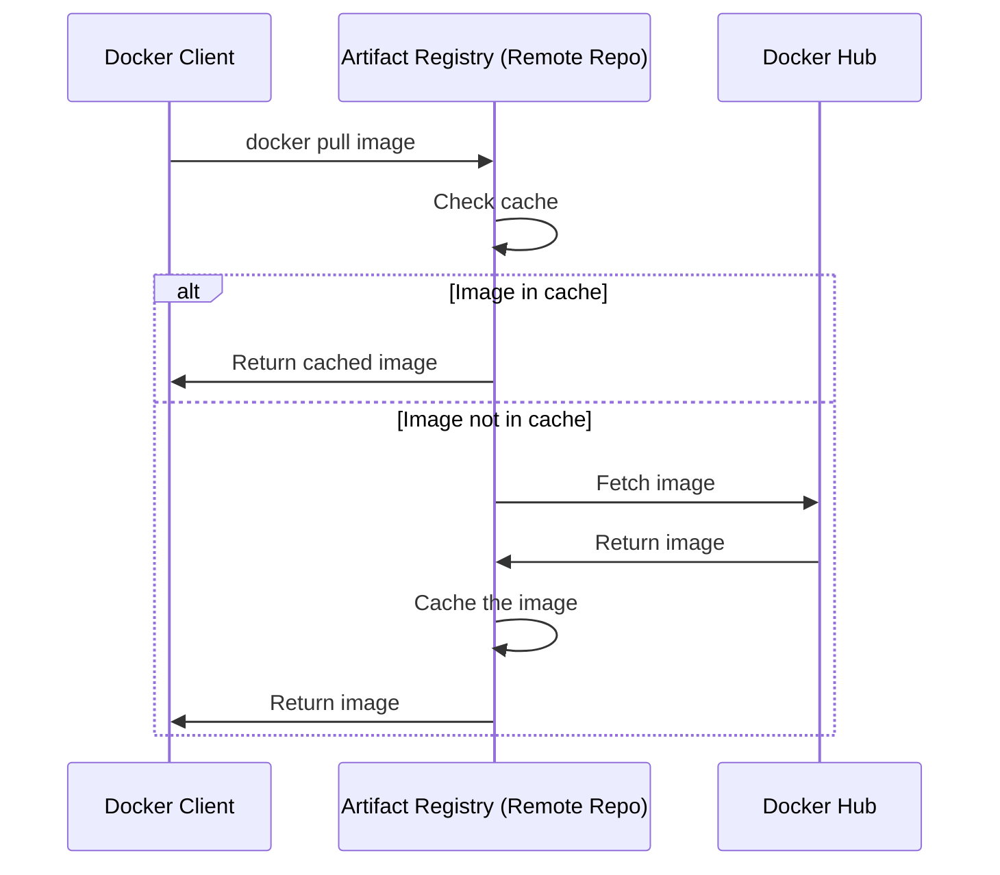

# How to Create a Remote Repository in Artifact Registry to Proxy Docker Hub

Author: [nawazdhandala](https://www.github.com/nawazdhandala)

Tags: GCP, Artifact Registry, Remote Repository, Docker Hub, Proxy, DevOps

Description: Set up a remote repository in Google Artifact Registry to proxy and cache Docker Hub images, avoiding rate limits and improving pull performance.

---

Docker Hub rate limits have become a real headache for CI/CD pipelines. If your builds pull base images from Docker Hub on every run, you are going to hit the limit sooner or later - 100 pulls per 6 hours for anonymous users, 200 for authenticated users. When that happens, your builds start failing.

Artifact Registry remote repositories solve this by acting as a caching proxy. When you pull an image through the remote repository, it fetches the image from Docker Hub and caches it locally. Subsequent pulls come from the cache, which is faster and does not count against Docker Hub rate limits.

## How Remote Repositories Work

The flow is straightforward:



## Creating the Remote Repository

Create a remote repository that points to Docker Hub:

```bash
# Create a remote repository that proxies Docker Hub
gcloud artifacts repositories create dockerhub-proxy \
  --repository-format=docker \
  --location=us-central1 \
  --mode=remote-repository \
  --remote-repo-config-desc="Docker Hub proxy" \
  --remote-docker-repo=DOCKER-HUB \
  --project=my-project
```

The `--remote-docker-repo=DOCKER-HUB` flag tells Artifact Registry to use Docker Hub as the upstream source. This is a predefined preset that points to `https://registry-1.docker.io`.

## Pulling Images Through the Proxy

First, configure Docker authentication for Artifact Registry:

```bash
# Configure Docker to authenticate with Artifact Registry
gcloud auth configure-docker us-central1-docker.pkg.dev
```

Now pull images using the Artifact Registry URL instead of Docker Hub:

```bash
# Instead of: docker pull nginx:latest
# Use the remote repository path:
docker pull us-central1-docker.pkg.dev/my-project/dockerhub-proxy/nginx:latest

# Instead of: docker pull library/node:18-alpine
docker pull us-central1-docker.pkg.dev/my-project/dockerhub-proxy/library/node:18-alpine
```

The first pull goes to Docker Hub and gets cached. After that, pulls come from the cache.

## Pulling Non-Library Images

For images that are not in Docker Hub's `library/` namespace, include the full path:

```bash
# Pull a non-library image (e.g., grafana/grafana)
docker pull us-central1-docker.pkg.dev/my-project/dockerhub-proxy/grafana/grafana:latest

# Pull bitnami images
docker pull us-central1-docker.pkg.dev/my-project/dockerhub-proxy/bitnami/postgresql:15
```

## Using the Proxy in Dockerfiles

Update your Dockerfiles to pull base images through the proxy:

```dockerfile
# Dockerfile - Using the remote repository for base images
FROM us-central1-docker.pkg.dev/my-project/dockerhub-proxy/library/node:18-alpine

WORKDIR /app
COPY package*.json ./
RUN npm ci --production
COPY . .
EXPOSE 8080
CMD ["node", "server.js"]
```

## Using the Proxy in Cloud Build

Configure Cloud Build to use the proxy for its build steps:

```yaml
# cloudbuild.yaml - Pull base images through the proxy
steps:
  # Use the proxied node image instead of directly from Docker Hub
  - name: 'us-central1-docker.pkg.dev/$PROJECT_ID/dockerhub-proxy/library/node:18'
    entrypoint: 'npm'
    args: ['ci']

  - name: 'us-central1-docker.pkg.dev/$PROJECT_ID/dockerhub-proxy/library/node:18'
    entrypoint: 'npm'
    args: ['test']

  - name: 'gcr.io/cloud-builders/docker'
    args:
      - 'build'
      - '-t'
      - 'us-central1-docker.pkg.dev/$PROJECT_ID/my-repo/my-app:$SHORT_SHA'
      - '.'
```

## Authenticated Upstream Access

If you have a Docker Hub paid plan, you can configure the remote repository to use your Docker Hub credentials. This gives you higher rate limits:

```bash
# First, store your Docker Hub credentials in Secret Manager
echo -n "your-dockerhub-password" | \
  gcloud secrets create dockerhub-password \
    --data-file=- \
    --project=my-project

# Create the remote repository with authentication
gcloud artifacts repositories create dockerhub-proxy-auth \
  --repository-format=docker \
  --location=us-central1 \
  --mode=remote-repository \
  --remote-repo-config-desc="Authenticated Docker Hub proxy" \
  --remote-docker-repo=DOCKER-HUB \
  --remote-username=your-dockerhub-username \
  --remote-password-secret-version=projects/my-project/secrets/dockerhub-password/versions/latest \
  --project=my-project
```

## Using the Proxy in GKE

For GKE workloads, update your Kubernetes manifests to reference the proxied image paths:

```yaml
# deployment.yaml - Using proxied images in Kubernetes
apiVersion: apps/v1
kind: Deployment
metadata:
  name: my-app
spec:
  replicas: 3
  selector:
    matchLabels:
      app: my-app
  template:
    metadata:
      labels:
        app: my-app
    spec:
      containers:
      - name: my-app
        # Pull through Artifact Registry proxy instead of Docker Hub directly
        image: us-central1-docker.pkg.dev/my-project/dockerhub-proxy/library/nginx:1.25
        ports:
        - containerPort: 80
```

Make sure your GKE nodes have read access to the Artifact Registry repository.

## Cache Behavior

A few things to know about how the cache works:

- **Cache TTL**: Cached images are kept according to Artifact Registry's internal policies. Generally, images stay cached as long as the repository exists and is not cleaned up.
- **Tag updates**: If you pull `nginx:latest` and Docker Hub updates the image, the proxy will fetch the new version on the next pull.
- **Storage costs**: Cached images count toward your Artifact Registry storage, so you are paying for the cache space.
- **No manual cache clearing**: You cannot manually invalidate the cache. If you need a fresh pull, use a specific digest instead of a tag.

## Setting Up IAM Permissions

Grant access so your workloads can pull through the proxy:

```bash
# Grant read access to GKE service accounts
gcloud artifacts repositories add-iam-policy-binding dockerhub-proxy \
  --location=us-central1 \
  --member="serviceAccount:my-gke-sa@my-project.iam.gserviceaccount.com" \
  --role="roles/artifactregistry.reader" \
  --project=my-project

# Grant read access to Cloud Build
gcloud artifacts repositories add-iam-policy-binding dockerhub-proxy \
  --location=us-central1 \
  --member="serviceAccount:$(gcloud projects describe my-project --format='value(projectNumber)')@cloudbuild.gserviceaccount.com" \
  --role="roles/artifactregistry.reader" \
  --project=my-project
```

## Cost vs. Benefit Analysis

Using a remote repository costs more than pulling directly from Docker Hub (free), but the benefits usually outweigh the cost:

- **No more rate limit failures** in CI/CD pipelines
- **Faster image pulls** since the cache is in your GCP region
- **Better reliability** because you are not dependent on Docker Hub's availability
- **Network cost savings** since pulls from GCP to GCP are cheaper than from the internet

The storage cost is the main expense. If you are caching hundreds of large images, it adds up. Use cleanup policies to manage this.

## Terraform Configuration

Define the remote repository in Terraform:

```hcl
# main.tf - Remote repository for Docker Hub
resource "google_artifact_registry_repository" "dockerhub_proxy" {
  location      = "us-central1"
  repository_id = "dockerhub-proxy"
  format        = "DOCKER"
  mode          = "REMOTE_REPOSITORY"
  description   = "Caching proxy for Docker Hub"

  remote_repository_config {
    docker_repository {
      public_repository = "DOCKER_HUB"
    }
  }
}
```

## Wrapping Up

A remote repository in Artifact Registry is a simple way to solve Docker Hub rate limiting problems and speed up your image pulls. Create the repository, point it at Docker Hub, update your image references to use the Artifact Registry path, and you are done. The cache handles the rest. It is one of those small infrastructure changes that prevents a whole category of CI/CD failures.
