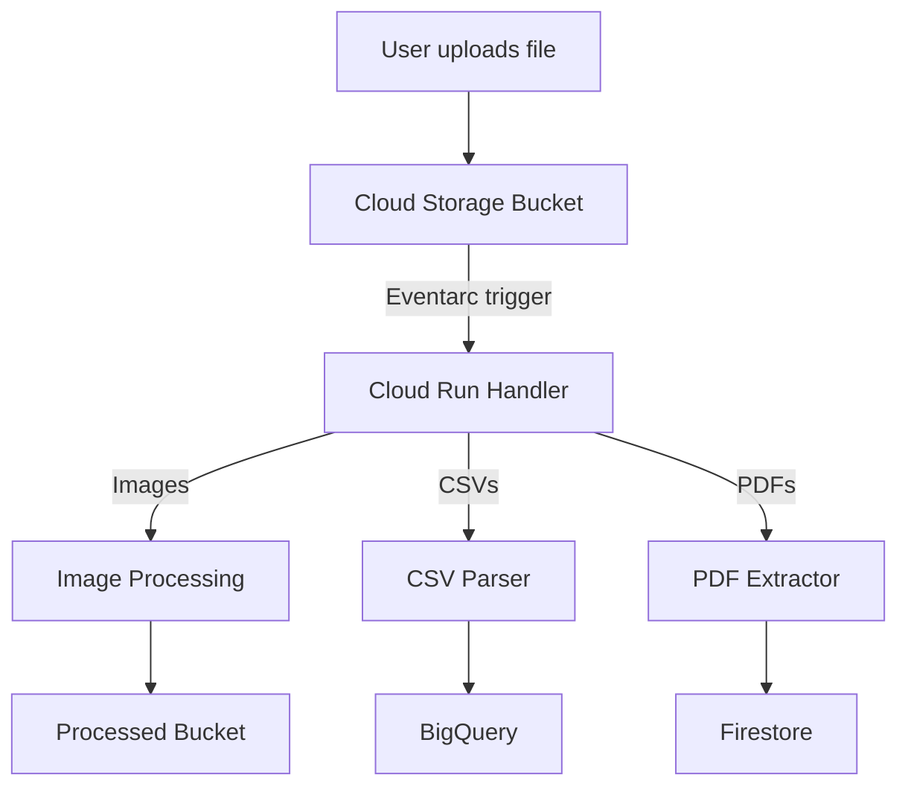

# How to Create an Eventarc Trigger to Route Cloud Storage Events to Cloud Run

Author: [nawazdhandala](https://www.github.com/nawazdhandala)

Tags: GCP, Eventarc, Cloud Storage, Cloud Run, Event-Driven

Description: Step-by-step guide to creating Eventarc triggers that route Google Cloud Storage events like file uploads and deletions to Cloud Run services for processing.

---

When a file is uploaded to a Cloud Storage bucket, you often want something to happen automatically - process an image, parse a CSV, scan for malware, or trigger a data pipeline. Eventarc makes this easy by routing Cloud Storage events directly to your Cloud Run services. No Pub/Sub topic configuration needed, no glue code - Eventarc handles the event delivery for you.

In this post, I will show you how to set up Eventarc triggers to route Cloud Storage events to a Cloud Run service, covering both direct events and audit-log-based events.

## Two Types of Cloud Storage Events

Eventarc supports two ways to capture Cloud Storage events:

1. **Direct events**: Use Cloud Storage notifications. These are faster (lower latency) and support events like `google.cloud.storage.object.v1.finalized` (file created/overwritten) and `google.cloud.storage.object.v1.deleted`.

2. **Audit log events**: Use Cloud Audit Logs. These capture any GCS API call and give you more event types, but have slightly higher latency.

For most use cases like processing uploaded files, direct events are the better choice.

## Prerequisites

Enable the required APIs.

```bash
# Enable required APIs
gcloud services enable \
  run.googleapis.com \
  eventarc.googleapis.com \
  storage.googleapis.com

# Grant the Eventarc service account the necessary roles
PROJECT_NUMBER=$(gcloud projects describe YOUR_PROJECT --format="value(projectNumber)")

# Grant Pub/Sub publisher role to the Cloud Storage service account
gcloud projects add-iam-policy-binding YOUR_PROJECT \
  --member="serviceAccount:service-${PROJECT_NUMBER}@gs-project-accounts.iam.gserviceaccount.com" \
  --role="roles/pubsub.publisher"
```

## Step 1: Create the Cloud Run Service

Build a Cloud Run service that handles Cloud Storage events. The service receives CloudEvents via HTTP POST.

```javascript
// server.js
// Cloud Run service that processes Cloud Storage events from Eventarc
const express = require("express");
const { Storage } = require("@google-cloud/storage");

const app = express();
app.use(express.json());

const storage = new Storage();

app.post("/", async (req, res) => {
  // Eventarc sends CloudEvents format
  const cloudEvent = req.body;

  // Extract event metadata
  const eventType = req.headers["ce-type"];
  const eventSource = req.headers["ce-source"];
  const eventId = req.headers["ce-id"];

  console.log(`Received event: ${eventType}, ID: ${eventId}`);

  // The event data contains Cloud Storage object information
  const data = cloudEvent;
  const bucket = data.bucket;
  const name = data.name;
  const contentType = data.contentType;
  const size = parseInt(data.size || "0");

  console.log(`File: gs://${bucket}/${name}`);
  console.log(`Content-Type: ${contentType}, Size: ${size} bytes`);

  try {
    switch (eventType) {
      case "google.cloud.storage.object.v1.finalized":
        await handleFileCreated(bucket, name, contentType, size);
        break;
      case "google.cloud.storage.object.v1.deleted":
        await handleFileDeleted(bucket, name);
        break;
      case "google.cloud.storage.object.v1.metadataUpdated":
        await handleMetadataUpdated(bucket, name, data);
        break;
      default:
        console.log(`Unhandled event type: ${eventType}`);
    }

    res.status(200).json({ status: "processed" });
  } catch (error) {
    console.error(`Error processing event: ${error.message}`);
    res.status(500).json({ error: error.message });
  }
});

async function handleFileCreated(bucket, name, contentType, size) {
  console.log(`Processing new file: gs://${bucket}/${name}`);

  // Skip processing for certain paths
  if (name.startsWith("processed/") || name.startsWith("temp/")) {
    console.log("Skipping file in excluded directory");
    return;
  }

  // Route based on content type
  if (contentType && contentType.startsWith("image/")) {
    await processImage(bucket, name);
  } else if (name.endsWith(".csv")) {
    await processCsv(bucket, name);
  } else if (name.endsWith(".json")) {
    await processJson(bucket, name);
  } else {
    console.log(`No processor for content type: ${contentType}`);
  }
}

async function processImage(bucket, name) {
  console.log(`Processing image: ${name}`);
  // Download, resize, generate thumbnails, etc.
  const file = storage.bucket(bucket).file(name);
  const [metadata] = await file.getMetadata();
  console.log(`Image metadata:`, metadata);

  // Example: copy to a processed folder
  await file.copy(storage.bucket(bucket).file(`processed/${name}`));
  console.log(`Copied to processed/${name}`);
}

async function processCsv(bucket, name) {
  console.log(`Processing CSV: ${name}`);
  // Download and parse the CSV
  const file = storage.bucket(bucket).file(name);
  const [content] = await file.download();
  const lines = content.toString().split("\n");
  console.log(`CSV has ${lines.length} lines`);
}

async function processJson(bucket, name) {
  console.log(`Processing JSON: ${name}`);
  const file = storage.bucket(bucket).file(name);
  const [content] = await file.download();
  const data = JSON.parse(content.toString());
  console.log(`JSON has ${Object.keys(data).length} top-level keys`);
}

async function handleFileDeleted(bucket, name) {
  console.log(`File deleted: gs://${bucket}/${name}`);
  // Clean up any derived files
  const processedFile = storage.bucket(bucket).file(`processed/${name}`);
  const [exists] = await processedFile.exists();
  if (exists) {
    await processedFile.delete();
    console.log(`Deleted processed file: processed/${name}`);
  }
}

async function handleMetadataUpdated(bucket, name, data) {
  console.log(`Metadata updated for: gs://${bucket}/${name}`);
  console.log(`Updated metadata:`, data.metadata);
}

const PORT = process.env.PORT || 8080;
app.listen(PORT, () => {
  console.log(`Listening on port ${PORT}`);
});
```

Deploy to Cloud Run.

```bash
# Deploy the Cloud Run service
gcloud run deploy storage-event-handler \
  --source=. \
  --region=us-central1 \
  --no-allow-unauthenticated \
  --memory=512Mi \
  --timeout=300s \
  --max-instances=10
```

## Step 2: Create the Eventarc Trigger

Create a trigger that routes Cloud Storage events to your Cloud Run service.

```bash
# Create an Eventarc trigger for file creation events
gcloud eventarc triggers create storage-upload-trigger \
  --location=us-central1 \
  --destination-run-service=storage-event-handler \
  --destination-run-region=us-central1 \
  --event-filters="type=google.cloud.storage.object.v1.finalized" \
  --event-filters="bucket=my-upload-bucket" \
  --service-account=eventarc-sa@YOUR_PROJECT.iam.gserviceaccount.com
```

The trigger listens for `finalized` events on the specified bucket and routes them to the Cloud Run service.

## Creating Triggers for Multiple Event Types

You can create separate triggers for different event types on the same bucket.

```bash
# Trigger for file deletions
gcloud eventarc triggers create storage-delete-trigger \
  --location=us-central1 \
  --destination-run-service=storage-event-handler \
  --destination-run-region=us-central1 \
  --event-filters="type=google.cloud.storage.object.v1.deleted" \
  --event-filters="bucket=my-upload-bucket" \
  --service-account=eventarc-sa@YOUR_PROJECT.iam.gserviceaccount.com

# Trigger for metadata updates
gcloud eventarc triggers create storage-metadata-trigger \
  --location=us-central1 \
  --destination-run-service=storage-event-handler \
  --destination-run-region=us-central1 \
  --event-filters="type=google.cloud.storage.object.v1.metadataUpdated" \
  --event-filters="bucket=my-upload-bucket" \
  --service-account=eventarc-sa@YOUR_PROJECT.iam.gserviceaccount.com
```

## Setting Up IAM

The service account used by Eventarc needs the right permissions.

```bash
# Create the service account
gcloud iam service-accounts create eventarc-sa \
  --display-name="Eventarc Trigger SA"

# Grant it permission to invoke Cloud Run
gcloud run services add-iam-policy-binding storage-event-handler \
  --region=us-central1 \
  --member="serviceAccount:eventarc-sa@YOUR_PROJECT.iam.gserviceaccount.com" \
  --role="roles/run.invoker"

# Grant Eventarc event receiver role
gcloud projects add-iam-policy-binding YOUR_PROJECT \
  --member="serviceAccount:eventarc-sa@YOUR_PROJECT.iam.gserviceaccount.com" \
  --role="roles/eventarc.eventReceiver"
```

## Testing the Trigger

Upload a file to the bucket and check the Cloud Run logs.

```bash
# Upload a test file
echo "test,data,here" > /tmp/test.csv
gsutil cp /tmp/test.csv gs://my-upload-bucket/test.csv

# Check the Cloud Run service logs
gcloud run services logs read storage-event-handler \
  --region=us-central1 \
  --limit=10
```

You should see log entries showing the event was received and the file was processed.

## Managing Triggers

```bash
# List all Eventarc triggers
gcloud eventarc triggers list --location=us-central1

# View trigger details
gcloud eventarc triggers describe storage-upload-trigger \
  --location=us-central1

# Delete a trigger
gcloud eventarc triggers delete storage-upload-trigger \
  --location=us-central1
```

## Architecture for a File Processing Pipeline

Here is a common pattern using Cloud Storage events.



## Avoiding Infinite Loops

A common mistake is having your Cloud Run handler write processed files back to the same bucket that triggers the event. This creates an infinite loop. Prevent this by:

1. Writing to a different bucket
2. Writing to a prefix like `processed/` and filtering in your handler
3. Using metadata to mark files as processed

```javascript
// Check if this file should be processed to avoid loops
if (name.startsWith("processed/") || name.startsWith("output/")) {
  console.log("Skipping already-processed file");
  res.status(200).json({ status: "skipped" });
  return;
}
```

## Wrapping Up

Eventarc triggers for Cloud Storage events give you a clean, managed way to react to file changes in your buckets. The setup is straightforward: deploy a Cloud Run service that handles CloudEvents, create an Eventarc trigger for the event types and bucket you care about, and set up the IAM permissions. Your service scales automatically with the volume of events, and Eventarc handles the delivery and retry logic. Just watch out for infinite loops when writing back to the same bucket, and you are good to go.
