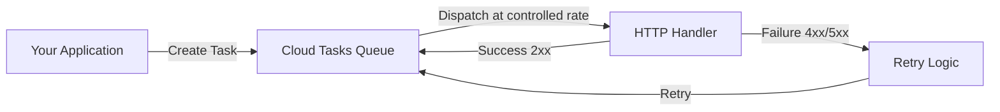

# How to Create and Configure a Cloud Tasks Queue for Asynchronous Processing

Author: [nawazdhandala](https://www.github.com/nawazdhandala)

Tags: GCP, Cloud Tasks, Queue, Asynchronous Processing, Serverless

Description: Learn how to create and configure Google Cloud Tasks queues for reliable asynchronous task processing with rate limiting, retry policies, and routing configuration.

---

When your application needs to do work that does not have to happen immediately - sending emails, processing images, syncing data to a third-party service - you should offload that work to a task queue. Google Cloud Tasks is a fully managed queue service that lets you create tasks, manage their execution rate, handle retries, and route them to your HTTP handlers. In this post, I will walk through creating and configuring Cloud Tasks queues from scratch.

## What Cloud Tasks Does

Cloud Tasks sits between your application and your task handlers. Your application creates tasks and adds them to a queue. Cloud Tasks then dispatches those tasks to your handler (a Cloud Run service, Cloud Function, or any HTTP endpoint) at a controlled rate. If the handler fails, Cloud Tasks retries the task according to your retry policy.



## Prerequisites

Enable the Cloud Tasks API.

```bash
# Enable the Cloud Tasks API
gcloud services enable cloudtasks.googleapis.com
```

## Creating a Basic Queue

The simplest way to create a queue is with the gcloud CLI.

```bash
# Create a basic Cloud Tasks queue
gcloud tasks queues create my-processing-queue \
  --location=us-central1
```

That is all you need for a basic queue. Cloud Tasks will use default settings for rate limiting and retries.

## Configuring Rate Limiting

Rate limiting controls how fast tasks are dispatched from the queue. This is crucial for protecting your handlers from overload and respecting rate limits on downstream services.

```bash
# Create a queue with rate limiting configuration
gcloud tasks queues create email-queue \
  --location=us-central1 \
  --max-dispatches-per-second=10 \
  --max-concurrent-dispatches=5 \
  --max-burst-size=20
```

Here is what each parameter means:

- `max-dispatches-per-second`: The maximum rate at which tasks are dispatched. Set to 10, the queue will send at most 10 tasks per second.
- `max-concurrent-dispatches`: The maximum number of tasks that can be running simultaneously. If set to 5, no more than 5 tasks will be in-flight at once.
- `max-burst-size`: Allows short bursts above the dispatch rate. The queue can temporarily dispatch faster to catch up after idle periods.

For a practical example, if your email provider allows 100 emails per minute (roughly 1.6 per second), configure like this:

```bash
# Queue configured for a rate-limited email provider
gcloud tasks queues create rate-limited-email-queue \
  --location=us-central1 \
  --max-dispatches-per-second=1.5 \
  --max-concurrent-dispatches=3
```

## Configuring Retry Policies

When a task handler fails, Cloud Tasks retries it. You control how many times and with what backoff.

```bash
# Create a queue with a custom retry policy
gcloud tasks queues create resilient-queue \
  --location=us-central1 \
  --max-attempts=10 \
  --min-backoff="1s" \
  --max-backoff="300s" \
  --max-doublings=5 \
  --max-retry-duration="3600s"
```

The retry parameters:

- `max-attempts`: Maximum number of attempts including the initial attempt. Set to -1 for unlimited retries.
- `min-backoff`: The minimum time to wait before retrying a failed task.
- `max-backoff`: The maximum time to wait between retries.
- `max-doublings`: How many times the backoff interval doubles before increasing linearly.
- `max-retry-duration`: The total time window within which retries can occur. After this duration, the task is considered permanently failed.

Here is how the retry intervals work with `min-backoff=1s`, `max-doublings=4`, `max-backoff=300s`:

```
Attempt 1: Immediate
Attempt 2: 1s wait
Attempt 3: 2s wait  (doubled)
Attempt 4: 4s wait  (doubled)
Attempt 5: 8s wait  (doubled)
Attempt 6: 16s wait (doubled, max_doublings reached)
Attempt 7: 32s wait (linear increase)
Attempt 8: 48s wait (linear increase)
...continues until max_backoff (300s) or max_attempts reached
```

## Configuring Routing

You can set a default routing target for all tasks in a queue. This is useful when all tasks in a queue go to the same service.

```bash
# Update queue with default routing to a Cloud Run service
gcloud tasks queues update my-processing-queue \
  --location=us-central1 \
  --routing-override-uri-path-override="/process" \
  --routing-override-host-override="my-service-abc123-uc.a.run.app"
```

## Creating Tasks with the gcloud CLI

Once your queue is set up, you can create tasks.

```bash
# Create a simple HTTP task
gcloud tasks create-http-task \
  --queue=my-processing-queue \
  --location=us-central1 \
  --url="https://my-service.a.run.app/process" \
  --method=POST \
  --header="Content-Type: application/json" \
  --body-content='{"user_id": "12345", "action": "send_welcome_email"}'
```

## Creating Tasks Programmatically

In practice, you will create tasks from your application code. Here is a Node.js example.

```javascript
// create-task.js
// Creates a Cloud Tasks task programmatically
const { CloudTasksClient } = require("@google-cloud/tasks");

const client = new CloudTasksClient();

async function createTask(payload) {
  const project = "my-project";
  const location = "us-central1";
  const queue = "email-queue";

  // Build the fully qualified queue name
  const parent = client.queuePath(project, location, queue);

  // Create the task configuration
  const task = {
    httpRequest: {
      httpMethod: "POST",
      url: "https://my-service.a.run.app/send-email",
      headers: {
        "Content-Type": "application/json",
      },
      // Encode the payload as base64
      body: Buffer.from(JSON.stringify(payload)).toString("base64"),
      // Use OIDC authentication for Cloud Run
      oidcToken: {
        serviceAccountEmail: "task-invoker@my-project.iam.gserviceaccount.com",
        audience: "https://my-service.a.run.app",
      },
    },
  };

  // Create the task
  const [response] = await client.createTask({ parent, task });
  console.log(`Task created: ${response.name}`);
  return response;
}

// Usage
createTask({
  to: "user@example.com",
  subject: "Welcome!",
  template: "welcome_email",
});
```

And a Python version.

```python
# create_task.py
# Creates a Cloud Tasks task using the Python client library
from google.cloud import tasks_v2
import json

def create_task(payload, queue_name="email-queue"):
    """Create a task in the specified queue."""
    client = tasks_v2.CloudTasksClient()

    project = "my-project"
    location = "us-central1"

    # Build the queue path
    parent = client.queue_path(project, location, queue_name)

    # Build the task
    task = tasks_v2.Task(
        http_request=tasks_v2.HttpRequest(
            http_method=tasks_v2.HttpMethod.POST,
            url="https://my-service.a.run.app/send-email",
            headers={"Content-Type": "application/json"},
            body=json.dumps(payload).encode(),
            oidc_token=tasks_v2.OidcToken(
                service_account_email="task-invoker@my-project.iam.gserviceaccount.com",
                audience="https://my-service.a.run.app",
            ),
        )
    )

    response = client.create_task(parent=parent, task=task)
    print(f"Task created: {response.name}")
    return response

# Usage
create_task({
    "to": "user@example.com",
    "subject": "Welcome!",
    "template": "welcome_email"
})
```

## Scheduling Tasks for Later

Cloud Tasks supports scheduling tasks to execute at a specific future time.

```javascript
// Schedule a task to run 30 minutes from now
const task = {
  scheduleTime: {
    seconds: Math.floor(Date.now() / 1000) + 30 * 60, // 30 minutes from now
  },
  httpRequest: {
    httpMethod: "POST",
    url: "https://my-service.a.run.app/send-reminder",
    body: Buffer.from(JSON.stringify({ userId: "12345" })).toString("base64"),
    headers: { "Content-Type": "application/json" },
  },
};
```

## Managing Queues

Here are essential queue management commands.

```bash
# List all queues in a region
gcloud tasks queues list --location=us-central1

# Describe a specific queue
gcloud tasks queues describe my-processing-queue --location=us-central1

# Pause a queue (stops dispatching but keeps accepting tasks)
gcloud tasks queues pause my-processing-queue --location=us-central1

# Resume a paused queue
gcloud tasks queues resume my-processing-queue --location=us-central1

# Purge all tasks from a queue
gcloud tasks queues purge my-processing-queue --location=us-central1

# Delete a queue
gcloud tasks queues delete my-processing-queue --location=us-central1

# List tasks in a queue
gcloud tasks list --queue=my-processing-queue --location=us-central1
```

## Wrapping Up

Cloud Tasks queues give you a managed, configurable way to handle asynchronous workloads. The key decisions when setting up a queue are: what dispatch rate does your handler support, how aggressively should tasks be retried, and how long should a task be retried before giving up. Start with conservative rate limits and retry policies, then adjust based on observed behavior. The queue is the buffer between your application's need to offload work and your handler's capacity to process it.
