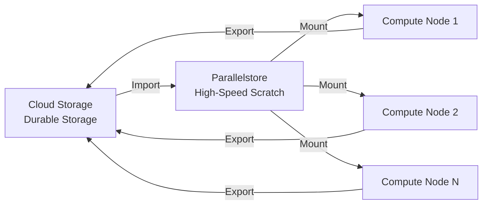

# How to Create and Configure a Google Cloud Parallelstore Instance for HPC Workloads

Author: [nawazdhandala](https://www.github.com/nawazdhandala)

Tags: GCP, Parallelstore, HPC, High Performance Computing, File System, Storage, Google Cloud

Description: Create and configure a Google Cloud Parallelstore instance for high-performance computing workloads that require low-latency parallel file system access.

---

High-performance computing workloads - scientific simulations, genomics processing, financial modeling, weather forecasting - need file systems that can handle massive parallel read/write throughput. Standard file storage like Filestore or Cloud Storage does not cut it when hundreds of compute nodes need simultaneous access to the same dataset with microsecond-level latency. Google Cloud Parallelstore is built specifically for this. It is a fully managed parallel file system based on Intel DAOS that delivers the kind of I/O performance HPC workloads demand.

In this post, I will walk through creating a Parallelstore instance, configuring it for your workload, connecting compute instances, and importing data for processing.

## What Parallelstore Provides

Parallelstore is designed for workloads that need:

- **High throughput** - hundreds of GB/s aggregate bandwidth
- **Low latency** - sub-millisecond access times
- **Parallel access** - hundreds of compute nodes reading and writing simultaneously
- **POSIX compatibility** - works with existing HPC applications without modification
- **Scratch storage** - ideal for temporary datasets during computation

It is not designed for long-term storage. Think of it as a high-speed scratch space that sits between your compute nodes and your durable storage (Cloud Storage or Filestore).



## Prerequisites

- A Google Cloud project with billing enabled
- Parallelstore API enabled
- A VPC network with Private Service Access configured
- Compute Engine instances in the same region as the Parallelstore instance
- Sufficient quota for Parallelstore capacity

## Step 1: Enable the API and Configure Networking

Parallelstore requires Private Service Access on your VPC. Set this up first.

```bash
# Enable the Parallelstore API
gcloud services enable parallelstore.googleapis.com

# Allocate an IP range for Private Service Access if you haven't already
gcloud compute addresses create parallelstore-range \
  --global \
  --purpose=VPC_PEERING \
  --addresses=10.100.0.0 \
  --prefix-length=24 \
  --network=default

# Create the private connection
gcloud services vpc-peerings connect \
  --service=servicenetworking.googleapis.com \
  --ranges=parallelstore-range \
  --network=default
```

## Step 2: Create a Parallelstore Instance

Create the instance with your desired capacity. Parallelstore instances come in predefined capacity tiers.

```bash
# Create a Parallelstore instance
gcloud parallelstore instances create my-hpc-scratch \
  --location=us-central1-a \
  --capacity-gib=12000 \
  --network=default \
  --description="Scratch storage for HPC simulation workloads"
```

You can also use the Python client for programmatic creation:

```python
from google.cloud import parallelstore_v1

def create_parallelstore_instance(project_id, zone, instance_id, capacity_gib):
    """Creates a Parallelstore instance for HPC workloads."""
    client = parallelstore_v1.ParallelstoreClient()

    parent = f"projects/{project_id}/locations/{zone}"

    instance = parallelstore_v1.Instance(
        description="HPC scratch storage",
        capacity_gib=capacity_gib,
        network=f"projects/{project_id}/global/networks/default",
    )

    # Create the instance - this is a long-running operation
    operation = client.create_instance(
        parent=parent,
        instance=instance,
        instance_id=instance_id,
    )

    print(f"Creating Parallelstore instance {instance_id}...")
    print("This may take several minutes.")

    result = operation.result(timeout=1800)

    print(f"Instance created: {result.name}")
    print(f"Capacity: {result.capacity_gib} GiB")
    print(f"State: {result.state}")
    print(f"Access points: {result.access_points}")
    print(f"DAOS version: {result.daos_version}")

    return result

# Create a 12 TB Parallelstore instance
instance = create_parallelstore_instance(
    "my-project",
    "us-central1-a",
    "hpc-scratch-001",
    12000  # 12 TB
)
```

## Step 3: Get Instance Details

After creation, get the access points needed for mounting:

```bash
# Describe the instance to get access points
gcloud parallelstore instances describe my-hpc-scratch \
  --location=us-central1-a \
  --format="yaml(name, state, capacityGib, accessPoints, network, daoVersion)"
```

```python
def get_instance_details(project_id, zone, instance_id):
    """Gets Parallelstore instance details including access points."""
    client = parallelstore_v1.ParallelstoreClient()

    name = f"projects/{project_id}/locations/{zone}/instances/{instance_id}"
    instance = client.get_instance(name=name)

    print(f"Instance: {instance.name}")
    print(f"State: {instance.state}")
    print(f"Capacity: {instance.capacity_gib} GiB")
    print(f"Network: {instance.network}")
    print(f"\nAccess Points:")
    for ap in instance.access_points:
        print(f"  - {ap}")

    return instance

details = get_instance_details("my-project", "us-central1-a", "hpc-scratch-001")
```

## Step 4: Mount the File System on Compute Instances

Each compute node needs the DAOS client library installed and configured to mount the Parallelstore file system.

This script installs the DAOS client and mounts the file system:

```bash
#!/bin/bash
# install-and-mount-parallelstore.sh
# Run this on each compute instance that needs access

# Install the DAOS client library
# The package name and repo depend on your OS version
sudo apt-get update
sudo apt-get install -y daos-client

# Create the mount point
sudo mkdir -p /mnt/parallelstore

# Configure the DAOS agent
# Replace ACCESS_POINT with your instance's access point IP
cat << 'AGENT_CONFIG' | sudo tee /etc/daos/daos_agent.yml
name: daos_agent
access_points:
  - ACCESS_POINT_1
  - ACCESS_POINT_2

transport_config:
  allow_insecure: true

log_file: /var/log/daos_agent.log
AGENT_CONFIG

# Start the DAOS agent service
sudo systemctl enable daos_agent
sudo systemctl start daos_agent

# Mount the Parallelstore file system using dfuse
sudo dfuse -m /mnt/parallelstore \
  --pool default-pool \
  --container default-container \
  --disable-caching \
  --thread-count 16

echo "Parallelstore mounted at /mnt/parallelstore"
df -h /mnt/parallelstore
```

For automated setup across many nodes, use a startup script:

```python
from google.cloud import compute_v1

def create_hpc_instance_with_parallelstore(
    project_id, zone, instance_name, machine_type, parallelstore_access_points
):
    """Creates a compute instance configured to mount Parallelstore."""
    client = compute_v1.InstancesClient()

    # Startup script that installs DAOS and mounts Parallelstore
    access_points_str = "\\n  - ".join(parallelstore_access_points)
    startup_script = f"""#!/bin/bash
set -e

# Install DAOS client
apt-get update && apt-get install -y daos-client

# Configure DAOS agent
cat > /etc/daos/daos_agent.yml << EOF
name: daos_agent
access_points:
  - {access_points_str}
transport_config:
  allow_insecure: true
log_file: /var/log/daos_agent.log
EOF

# Start DAOS agent
systemctl enable daos_agent
systemctl start daos_agent

# Mount Parallelstore
mkdir -p /mnt/scratch
dfuse -m /mnt/scratch --pool default-pool --container default-container --thread-count 16

echo "Parallelstore mounted successfully" >> /var/log/startup.log
"""

    instance = compute_v1.Instance()
    instance.name = instance_name
    instance.machine_type = f"zones/{zone}/machineTypes/{machine_type}"

    # Boot disk
    disk = compute_v1.AttachedDisk()
    disk.boot = True
    disk.auto_delete = True
    disk.initialize_params = compute_v1.AttachedDiskInitializeParams()
    disk.initialize_params.source_image = (
        "projects/ubuntu-os-cloud/global/images/family/ubuntu-2204-lts"
    )
    disk.initialize_params.disk_size_gb = 50
    instance.disks = [disk]

    # Network - must be same VPC as Parallelstore
    network_interface = compute_v1.NetworkInterface()
    network_interface.network = f"projects/{project_id}/global/networks/default"
    access_config = compute_v1.AccessConfig()
    access_config.name = "External NAT"
    network_interface.access_configs = [access_config]
    instance.network_interfaces = [network_interface]

    # Startup script metadata
    instance.metadata = compute_v1.Metadata()
    instance.metadata.items = [
        compute_v1.Items(key="startup-script", value=startup_script)
    ]

    # Create the instance
    operation = client.insert(
        project=project_id,
        zone=zone,
        instance_resource=instance,
    )
    operation.result()
    print(f"Instance {instance_name} created with Parallelstore mount")

# Create an HPC compute node
create_hpc_instance_with_parallelstore(
    "my-project",
    "us-central1-a",
    "hpc-node-001",
    "c2-standard-60",
    ["10.100.0.2", "10.100.0.3"]
)
```

## Step 5: Import Data from Cloud Storage

Before running your HPC workload, import the input data from Cloud Storage into Parallelstore.

```python
from google.cloud import parallelstore_v1

def import_data_from_gcs(project_id, zone, instance_id, gcs_uri, destination_path):
    """Imports data from Cloud Storage into Parallelstore."""
    client = parallelstore_v1.ParallelstoreClient()

    instance_name = (
        f"projects/{project_id}/locations/{zone}/instances/{instance_id}"
    )

    request = parallelstore_v1.ImportDataRequest(
        name=instance_name,
        source_gcs_bucket=parallelstore_v1.SourceGcsBucket(
            uri=gcs_uri,
        ),
        destination_parallelstore=parallelstore_v1.DestinationParallelstore(
            path=destination_path,
        ),
    )

    operation = client.import_data(request=request)
    print(f"Importing data from {gcs_uri} to {destination_path}...")

    result = operation.result(timeout=3600)
    print(f"Import complete: {result}")
    return result

# Import simulation input data
import_data_from_gcs(
    "my-project",
    "us-central1-a",
    "hpc-scratch-001",
    "gs://my-hpc-data/simulation-input/",
    "/simulation/input/"
)
```

## Step 6: Export Results Back to Cloud Storage

After processing, export the results to durable storage:

```python
from google.cloud import parallelstore_v1

def export_data_to_gcs(project_id, zone, instance_id, source_path, gcs_uri):
    """Exports data from Parallelstore to Cloud Storage."""
    client = parallelstore_v1.ParallelstoreClient()

    instance_name = (
        f"projects/{project_id}/locations/{zone}/instances/{instance_id}"
    )

    request = parallelstore_v1.ExportDataRequest(
        name=instance_name,
        source_parallelstore=parallelstore_v1.SourceParallelstore(
            path=source_path,
        ),
        destination_gcs_bucket=parallelstore_v1.DestinationGcsBucket(
            uri=gcs_uri,
        ),
    )

    operation = client.export_data(request=request)
    print(f"Exporting {source_path} to {gcs_uri}...")

    result = operation.result(timeout=3600)
    print(f"Export complete: {result}")
    return result

# Export simulation results
export_data_to_gcs(
    "my-project",
    "us-central1-a",
    "hpc-scratch-001",
    "/simulation/output/",
    "gs://my-hpc-data/simulation-results/"
)
```

## Step 7: Clean Up

Delete the Parallelstore instance when your workload is done to stop incurring costs:

```bash
# Delete the Parallelstore instance
gcloud parallelstore instances delete my-hpc-scratch \
  --location=us-central1-a

# Or programmatically
```

```python
def delete_parallelstore_instance(project_id, zone, instance_id):
    """Deletes a Parallelstore instance."""
    client = parallelstore_v1.ParallelstoreClient()

    name = f"projects/{project_id}/locations/{zone}/instances/{instance_id}"

    operation = client.delete_instance(name=name)
    print(f"Deleting Parallelstore instance {instance_id}...")
    operation.result(timeout=600)
    print("Instance deleted")

delete_parallelstore_instance("my-project", "us-central1-a", "hpc-scratch-001")
```

## Performance Tuning Tips

To get the most out of Parallelstore:

- **Match capacity to throughput needs** - larger instances provide more aggregate bandwidth
- **Use multiple access points** - distribute client connections across all available access points
- **Tune thread count** - set dfuse thread count to match your workload's I/O parallelism
- **Minimize metadata operations** - Parallelstore excels at large sequential I/O; lots of small file creates will be slower
- **Use the right machine type** - pair Parallelstore with compute-optimized (C2, C3) or HPC-optimized (H3) instances for best network throughput

## Summary

Google Cloud Parallelstore fills the gap between standard file storage and the extreme I/O demands of HPC workloads. The workflow is straightforward: create an instance sized for your throughput needs, import data from Cloud Storage, mount the file system on your compute nodes, run your workload with parallel access from all nodes, export results back to durable storage, and delete the instance. The key benefit is that your existing POSIX-based HPC applications work without modification - they see a regular file system, but get parallel file system performance underneath. Just remember that Parallelstore is scratch storage, not permanent storage. Always export your results before deleting the instance.
