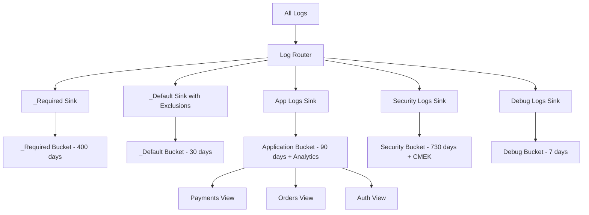

# How to Create and Configure Custom Log Buckets in Cloud Logging

Author: [nawazdhandala](https://www.github.com/nawazdhandala)

Tags: GCP, Cloud Logging, Log Buckets, Log Management, Retention

Description: Learn how to create and configure custom log buckets in Cloud Logging with different retention periods, regions, and access controls for your logs.

---

Every GCP project comes with two default log buckets: `_Required` (400-day retention, cannot be modified) and `_Default` (30-day retention, configurable). For many teams, these defaults are not enough. You might need different retention periods for different types of logs, regional data residency for compliance, or separate access controls so that specific teams can only see their own logs.

Custom log buckets solve all of these problems. In this post, I will show you how to create, configure, and use custom log buckets effectively.

## Understanding Log Buckets

Log buckets are the storage containers for your Cloud Logging data. They determine:

- **How long logs are retained**: Each bucket has its own retention period
- **Where logs are stored**: Buckets can be region-specific
- **Who can access the logs**: IAM policies can be set per bucket
- **Whether SQL querying is available**: Log Analytics can be enabled per bucket

Logs flow into buckets through sinks. The `_Default` sink sends logs to the `_Default` bucket, and the `_Required` sink sends certain audit logs to the `_Required` bucket. Custom sinks can direct logs to custom buckets.

## Creating a Custom Log Bucket

### Using gcloud CLI

Create a bucket with a specific retention period:

```bash
# Create a custom log bucket with 90-day retention
gcloud logging buckets create application-logs \
  --location=global \
  --retention-days=90 \
  --description="Application logs with 90-day retention" \
  --project=my-project
```

Create a regional bucket for data residency requirements:

```bash
# Create a region-specific log bucket in Europe
gcloud logging buckets create eu-compliance-logs \
  --location=europe-west1 \
  --retention-days=365 \
  --description="Compliance logs stored in EU" \
  --project=my-project
```

Create a bucket with Log Analytics enabled:

```bash
# Create a log bucket with SQL query support
gcloud logging buckets create analytics-logs \
  --location=global \
  --retention-days=60 \
  --enable-analytics \
  --description="Logs with Log Analytics enabled for SQL queries" \
  --project=my-project
```

### Using the Cloud Console

1. Go to **Logging** > **Log Storage**
2. Click **Create Log Bucket**
3. Configure the name, region, retention, and analytics settings
4. Click **Create Bucket**

## Routing Logs to Custom Buckets

After creating a bucket, you need a sink to route logs into it. The destination format for a log bucket is:

```
logging.googleapis.com/projects/PROJECT_ID/locations/LOCATION/buckets/BUCKET_NAME
```

### Creating a Sink to a Custom Bucket

```bash
# Create a sink that routes application logs to the custom bucket
gcloud logging sinks create app-logs-sink \
  logging.googleapis.com/projects/my-project/locations/global/buckets/application-logs \
  --log-filter='resource.type="cloud_run_revision" OR resource.type="gce_instance"' \
  --project=my-project
```

### Routing Security Logs to a Separate Bucket

```bash
# Route audit and security logs to a dedicated bucket
gcloud logging sinks create security-logs-sink \
  logging.googleapis.com/projects/my-project/locations/europe-west1/buckets/eu-compliance-logs \
  --log-filter='logName:"cloudaudit.googleapis.com" OR logName:"iam.googleapis.com"' \
  --project=my-project
```

## Managing Retention Periods

Different log types warrant different retention periods. Here is a common pattern:

| Log Type | Bucket | Retention |
|----------|--------|-----------|
| Application debug logs | short-term-logs | 7 days |
| Application info/error logs | application-logs | 90 days |
| Audit logs | compliance-logs | 365 days |
| Security logs | security-logs | 730 days (2 years) |

### Updating Retention on an Existing Bucket

```bash
# Update retention period on an existing bucket
gcloud logging buckets update application-logs \
  --location=global \
  --retention-days=120 \
  --project=my-project
```

### Configuring the _Default Bucket

You can also change the retention on the `_Default` bucket:

```bash
# Extend _Default bucket retention to 90 days
gcloud logging buckets update _Default \
  --location=global \
  --retention-days=90 \
  --project=my-project
```

## CMEK Encryption

By default, log buckets are encrypted with Google-managed keys. For additional control, you can use Customer-Managed Encryption Keys (CMEK):

```bash
# Create a log bucket with CMEK encryption
gcloud logging buckets create encrypted-logs \
  --location=us-central1 \
  --retention-days=365 \
  --cmek-kms-key-name=projects/my-project/locations/us-central1/keyRings/my-keyring/cryptoKeys/my-key \
  --project=my-project
```

Before this works, you need to grant the Cloud Logging service account access to the KMS key:

```bash
# Get the logging service account
gcloud logging settings describe --project=my-project

# Grant the service account Encrypter/Decrypter role on the KMS key
gcloud kms keys add-iam-policy-binding my-key \
  --location=us-central1 \
  --keyring=my-keyring \
  --member="serviceAccount:service-PROJECT_NUMBER@gcp-sa-logging.iam.gserviceaccount.com" \
  --role="roles/cloudkms.cryptoKeyEncrypterDecrypter"
```

## Access Control with Log Views

Log views let you control which logs within a bucket a user can see. This is useful when multiple teams share a bucket but should only see their own logs.

### Creating a Log View

```bash
# Create a view that only shows logs from the payments service
gcloud logging views create payments-team-view \
  --bucket=application-logs \
  --location=global \
  --log-filter='resource.labels.service_name="payments-service"' \
  --description="Logs visible to the payments team" \
  --project=my-project
```

### Granting Access to a View

```bash
# Grant a team access to only their view
gcloud logging views add-iam-policy-binding payments-team-view \
  --bucket=application-logs \
  --location=global \
  --member="group:payments-team@company.com" \
  --role="roles/logging.viewAccessor" \
  --project=my-project
```

Now the payments team can see only their service's logs, even though the bucket contains logs from all services.

## Architecture Pattern: Multi-Bucket Setup

Here is a practical architecture that I use for production environments:



This pattern gives you:
- Cost-effective short retention for debug logs
- Medium retention with analytics for application logs
- Long retention with encryption for security and compliance logs
- Per-team access control through views

## Terraform Configuration

```hcl
# Application logs bucket with analytics
resource "google_logging_project_bucket_config" "app_logs" {
  project        = var.project_id
  location       = "global"
  bucket_id      = "application-logs"
  retention_days = 90
  description    = "Application logs with 90-day retention"

  enable_analytics = true
}

# Security logs bucket in EU with long retention
resource "google_logging_project_bucket_config" "security_logs" {
  project        = var.project_id
  location       = "europe-west1"
  bucket_id      = "security-logs"
  retention_days = 730
  description    = "Security and compliance logs stored in EU"

  cmek_settings {
    kms_key_name = var.kms_key_name
  }
}

# Debug logs bucket with short retention
resource "google_logging_project_bucket_config" "debug_logs" {
  project        = var.project_id
  location       = "global"
  bucket_id      = "debug-logs"
  retention_days = 7
  description    = "Debug logs with 7-day retention"
}

# Sink to route app logs
resource "google_logging_project_sink" "app_sink" {
  name        = "app-logs-sink"
  destination = "logging.googleapis.com/${google_logging_project_bucket_config.app_logs.id}"
  filter      = "resource.type=\"cloud_run_revision\" AND severity>=INFO"

  unique_writer_identity = true
}

# Sink to route security logs
resource "google_logging_project_sink" "security_sink" {
  name        = "security-logs-sink"
  destination = "logging.googleapis.com/${google_logging_project_bucket_config.security_logs.id}"
  filter      = "logName:\"cloudaudit.googleapis.com\""

  unique_writer_identity = true
}

# Log view for the payments team
resource "google_logging_log_view" "payments" {
  name        = "payments-team-view"
  bucket      = google_logging_project_bucket_config.app_logs.id
  description = "Logs visible to the payments team"
  filter      = "resource.labels.service_name=\"payments-service\""
}
```

## Listing and Managing Buckets

Check what buckets exist in your project:

```bash
# List all log buckets
gcloud logging buckets list --location=global --project=my-project

# Describe a specific bucket
gcloud logging buckets describe application-logs \
  --location=global \
  --project=my-project
```

Delete a custom bucket (the bucket must be empty):

```bash
# Delete a custom log bucket
gcloud logging buckets delete debug-logs \
  --location=global \
  --project=my-project
```

## Wrapping Up

Custom log buckets give you fine-grained control over log storage that the default buckets cannot provide. By creating purpose-specific buckets with appropriate retention periods, regional placement, encryption, and access controls, you can build a logging architecture that balances cost, compliance, and operational needs. Start by mapping out your log types and their requirements, then create buckets and sinks to match.
