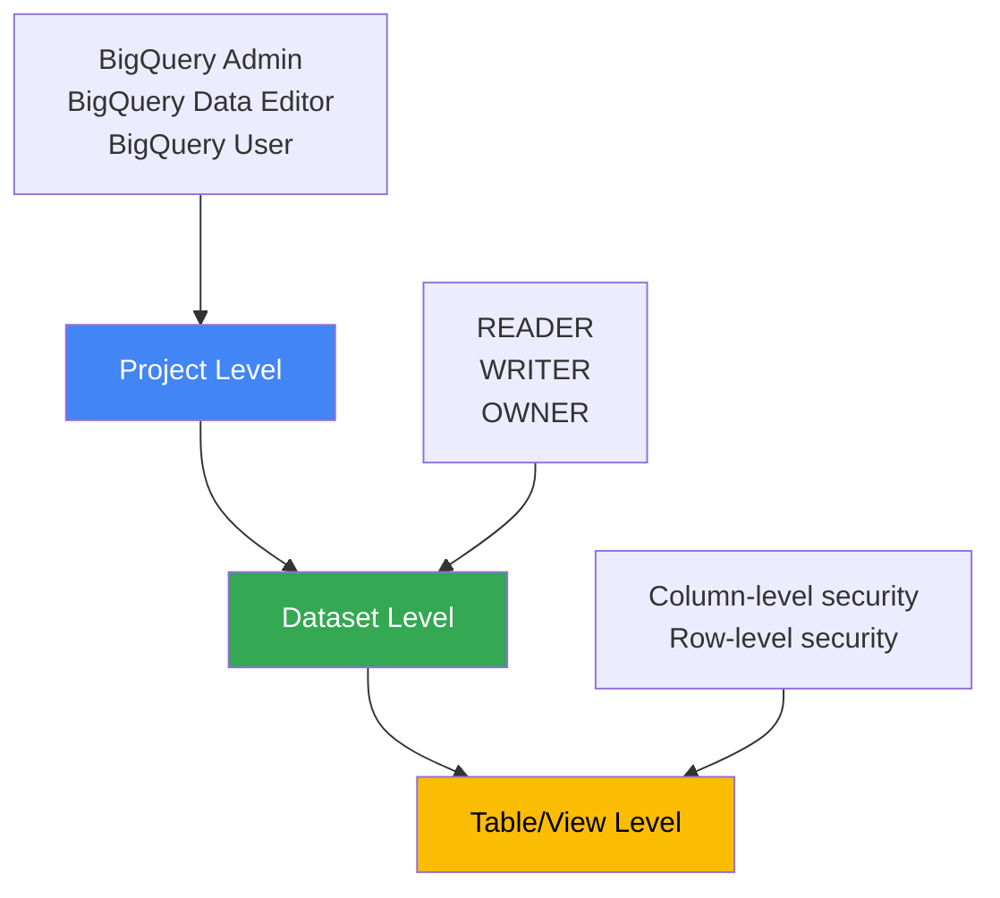

# How to Create and Manage BigQuery Datasets with Access Controls

Author: [nawazdhandala](https://www.github.com/nawazdhandala)

Tags: GCP, BigQuery, Datasets, Access Control, IAM, Data Governance

Description: Learn how to create BigQuery datasets with proper access controls including dataset-level permissions, table-level access, and row-level security for data governance.

---

BigQuery datasets are the primary organizational unit for your tables and views. Getting access controls right at the dataset level is critical because it determines who can query your data, who can modify schemas, and who can manage the dataset itself. Too open and you have a security problem. Too restrictive and your data consumers cannot do their jobs.

In this post, I will cover creating datasets with proper access controls, managing permissions at different levels, and implementing row-level security for fine-grained access.

## Creating a Dataset

Start with a basic dataset creation.

```bash
# Create a BigQuery dataset in the US multi-region
bq mk --dataset \
    --location=US \
    --description="Sales analytics data" \
    --default_table_expiration=0 \
    my-project-id:sales_analytics
```

Key options:
- `--location`: Where the data is stored (cannot be changed after creation)
- `--default_table_expiration`: How long tables last (0 means no expiration)
- `--description`: Human-readable description

## Understanding BigQuery Access Control Levels

BigQuery has three levels of access control:



- **Project level**: IAM roles apply to all datasets in the project
- **Dataset level**: Access entries apply to all tables in the dataset
- **Table level**: Fine-grained controls on specific tables

## Dataset-Level Access Controls

When you create a dataset, you can set access controls directly.

```bash
# Create a dataset with specific access controls
bq mk --dataset \
    --location=US \
    --description="Sensitive customer data" \
    my-project-id:customer_data
```

Add access entries after creation:

```bash
# Grant a group read access to the dataset
bq update --dataset \
    --access_entry='{"role":"READER","groupByEmail":"data-analysts@company.com"}' \
    my-project-id:customer_data

# Grant a service account write access
bq update --dataset \
    --access_entry='{"role":"WRITER","userByEmail":"etl-pipeline@my-project-id.iam.gserviceaccount.com"}' \
    my-project-id:customer_data

# Grant a user owner access
bq update --dataset \
    --access_entry='{"role":"OWNER","userByEmail":"data-admin@company.com"}' \
    my-project-id:customer_data
```

The three dataset-level roles:
- **READER**: Can run queries against tables in the dataset
- **WRITER**: Can create, update, and delete tables in the dataset
- **OWNER**: Full control including ability to modify access controls

## Viewing Current Access Controls

```bash
# View the current access controls on a dataset
bq show --format=prettyjson my-project-id:customer_data | python3 -c "
import json, sys
data = json.load(sys.stdin)
for entry in data.get('access', []):
    print(json.dumps(entry, indent=2))
"
```

Or more simply:

```bash
# View dataset info including access controls
bq show --format=prettyjson my-project-id:customer_data
```

## Using IAM Roles Instead of Dataset Access

For more consistent access management, use IAM roles at the project or dataset level.

```bash
# Grant BigQuery Data Viewer at the dataset level using IAM
gcloud projects add-iam-policy-binding my-project-id \
    --member="group:data-analysts@company.com" \
    --role="roles/bigquery.dataViewer" \
    --condition="expression=resource.name.startsWith('projects/my-project-id/datasets/customer_data'),title=customer-data-read"
```

Common BigQuery IAM roles:

| Role | What It Allows |
|------|---------------|
| `bigquery.dataViewer` | Read data and metadata |
| `bigquery.dataEditor` | Read and write data |
| `bigquery.dataOwner` | Full data access including deleting datasets |
| `bigquery.user` | Run queries (needs data access separately) |
| `bigquery.jobUser` | Create and run query jobs |
| `bigquery.admin` | Full BigQuery administration |

## Managing Access with Terraform

Here is a Terraform configuration for a dataset with proper access controls.

```hcl
# Create the dataset with access controls
resource "google_bigquery_dataset" "customer_data" {
  dataset_id    = "customer_data"
  friendly_name = "Customer Data"
  description   = "Sensitive customer information"
  location      = "US"

  # Default table expiration (none)
  default_table_expiration_ms = null

  # Dataset creator gets owner access automatically
  # Add additional access entries

  # Data analysts can read
  access {
    role          = "READER"
    group_by_email = "data-analysts@company.com"
  }

  # ETL pipeline can write
  access {
    role          = "WRITER"
    user_by_email = "etl-pipeline@my-project-id.iam.gserviceaccount.com"
  }

  # Data admin has full control
  access {
    role          = "OWNER"
    user_by_email = "data-admin@company.com"
  }

  # Keep the default special group for project owners
  access {
    role          = "OWNER"
    special_group = "projectOwners"
  }
}
```

Important: When using Terraform's `access` blocks, you must include ALL access entries, including the default `projectOwners` entry. Terraform replaces the entire access list, so omitting the default entries removes them.

## Column-Level Security

For tables containing sensitive columns (like PII), you can restrict access to specific columns using policy tags.

```bash
# Create a taxonomy for data classification
gcloud data-catalog taxonomies create \
    --display-name="PII Classification" \
    --description="Policy tags for PII data" \
    --location=us \
    --project=my-project-id
```

```bash
# Create a policy tag for sensitive data
gcloud data-catalog taxonomies policy-tags create \
    --taxonomy=TAXONOMY_ID \
    --display-name="Sensitive PII" \
    --description="Columns containing PII" \
    --location=us \
    --project=my-project-id
```

Apply the policy tag to a column in your table schema:

```bash
# Update a table schema to add a policy tag to a column
bq update --schema='[
    {"name": "user_id", "type": "STRING"},
    {"name": "email", "type": "STRING", "policyTags": {"names": ["projects/my-project-id/locations/us/taxonomies/TAXONOMY_ID/policyTags/TAG_ID"]}},
    {"name": "name", "type": "STRING", "policyTags": {"names": ["projects/my-project-id/locations/us/taxonomies/TAXONOMY_ID/policyTags/TAG_ID"]}},
    {"name": "order_count", "type": "INTEGER"}
]' my-project-id:customer_data.users
```

Users without the `datacatalog.categoryFineGrainedReader` role on the policy tag will get an error when querying the tagged columns.

## Row-Level Security

Row-level security lets you restrict which rows a user can see, based on their identity.

```sql
-- Create a row access policy that limits users to their region's data
CREATE ROW ACCESS POLICY region_filter
ON `my-project-id.customer_data.orders`
GRANT TO ("group:us-analysts@company.com")
FILTER USING (region = 'US');

-- Create another policy for EU analysts
CREATE ROW ACCESS POLICY eu_filter
ON `my-project-id.customer_data.orders`
GRANT TO ("group:eu-analysts@company.com")
FILTER USING (region = 'EU');

-- Admins can see all rows
CREATE ROW ACCESS POLICY admin_all
ON `my-project-id.customer_data.orders`
GRANT TO ("group:data-admins@company.com")
FILTER USING (TRUE);
```

When a user queries the table, BigQuery automatically applies their row access policy. US analysts only see US rows, EU analysts only see EU rows, and admins see everything.

To list existing row access policies:

```sql
-- List all row access policies on a table
SELECT *
FROM `my-project-id.customer_data.INFORMATION_SCHEMA.ROW_ACCESS_POLICIES`
WHERE table_name = 'orders';
```

## Dataset Labels for Organization

Use labels to organize and categorize datasets.

```bash
# Add labels to a dataset
bq update --set_label=team:analytics \
    --set_label=env:production \
    --set_label=classification:sensitive \
    my-project-id:customer_data
```

Labels help with cost attribution, access review, and organizational clarity.

## Copying Datasets Across Projects

When you need to share data across projects while maintaining access controls.

```bash
# Copy a dataset to another project
bq mk --transfer_config \
    --target_dataset=customer_data \
    --display_name="Cross-project dataset copy" \
    --data_source=cross_region_copy \
    --params='{"source_dataset_id":"customer_data","source_project_id":"source-project-id"}' \
    --project_id=target-project-id
```

## Best Practices

1. **Use groups, not individuals**: Manage access through Google Groups. When someone leaves the team, remove them from the group.

2. **Separate read and write access**: Data analysts usually only need read access. Only ETL pipelines and data engineers should have write access.

3. **Classify your datasets**: Use labels and naming conventions to indicate sensitivity levels.

4. **Use authorized views for cross-dataset sharing**: Instead of granting direct access to a dataset, create authorized views that expose only what is needed.

5. **Audit access regularly**: Review dataset access controls quarterly to remove stale permissions.

6. **Default deny**: Start with minimal access and add permissions as needed. Do not start with broad access and try to restrict later.

## Summary

BigQuery dataset access controls give you multiple layers of security - from project-level IAM roles to dataset-level access entries to column-level policy tags and row-level security. Start by creating datasets with explicit access entries, use Google Groups for manageable permissions, and layer in column and row-level security for sensitive data. The combination of these controls lets you share data broadly within your organization while keeping sensitive information properly restricted.
