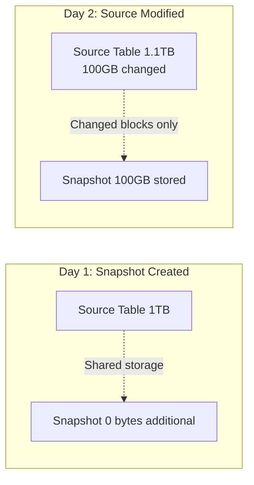

# How to Create and Manage BigQuery Table Snapshots for Point-in-Time Recovery

Author: [nawazdhandala](https://www.github.com/nawazdhandala)

Tags: GCP, BigQuery, Table Snapshots, Backup, Data Recovery, Data Governance

Description: Learn how to create and manage BigQuery table snapshots for point-in-time recovery, including snapshot scheduling, restoration, and cost-effective backup strategies.

---

Mistakes happen. Someone runs a DELETE without a WHERE clause, an ETL pipeline overwrites a table with bad data, or a schema migration goes sideways. Without backups, recovering from these situations can be painful or impossible. BigQuery table snapshots solve this by letting you capture a read-only copy of a table at a specific point in time.

Snapshots are storage-efficient because they only store the delta from the source table. If your 1 TB table has not changed since the snapshot was created, the snapshot uses nearly zero additional storage. You can create them instantly, and restoring a table from a snapshot takes seconds.

## How Snapshots Work

A BigQuery table snapshot is a lightweight, read-only copy of a table at a specific moment. It uses copy-on-write semantics, meaning it shares storage with the source table until the source changes.



When you modify the source table after taking a snapshot, BigQuery stores the old data blocks separately for the snapshot. This makes snapshots very storage-efficient.

## Creating a Table Snapshot

The simplest way to create a snapshot:

```sql
-- Create a snapshot of a table
CREATE SNAPSHOT TABLE `my-project-id.backups.orders_snapshot_20260217`
CLONE `my-project-id.production.orders`;
```

You can also use the `bq` command:

```bash
# Create a table snapshot using bq
bq cp --snapshot \
    my-project-id:production.orders \
    my-project-id:backups.orders_snapshot_20260217
```

## Creating a Point-in-Time Snapshot

BigQuery maintains a 7-day history of every table through time travel. You can create a snapshot of a table as it existed at any point in the last 7 days.

```sql
-- Create a snapshot of the table as it was 2 hours ago
CREATE SNAPSHOT TABLE `my-project-id.backups.orders_2hours_ago`
CLONE `my-project-id.production.orders`
FOR SYSTEM_TIME AS OF TIMESTAMP_SUB(CURRENT_TIMESTAMP(), INTERVAL 2 HOUR);
```

```sql
-- Create a snapshot at a specific timestamp
CREATE SNAPSHOT TABLE `my-project-id.backups.orders_before_migration`
CLONE `my-project-id.production.orders`
FOR SYSTEM_TIME AS OF '2026-02-16T08:00:00Z';
```

This is incredibly useful when you discover a problem hours after it happened. Instead of restoring from yesterday's backup, you can create a snapshot of the table just before the issue occurred.

## Setting Snapshot Expiration

To avoid accumulating snapshots indefinitely, set an expiration.

```sql
-- Create a snapshot that expires in 30 days
CREATE SNAPSHOT TABLE `my-project-id.backups.orders_snapshot_20260217`
CLONE `my-project-id.production.orders`
OPTIONS (
    expiration_timestamp = TIMESTAMP_ADD(CURRENT_TIMESTAMP(), INTERVAL 30 DAY)
);
```

You can also set expiration on an existing snapshot:

```sql
-- Update the expiration on an existing snapshot
ALTER SNAPSHOT TABLE `my-project-id.backups.orders_snapshot_20260217`
SET OPTIONS (
    expiration_timestamp = TIMESTAMP('2026-06-01')
);
```

## Restoring a Table from a Snapshot

To restore a table from a snapshot, you clone the snapshot back to a table.

```sql
-- Restore a table from a snapshot
CREATE OR REPLACE TABLE `my-project-id.production.orders`
CLONE `my-project-id.backups.orders_snapshot_20260217`;
```

If you want to restore to a different name (to compare before committing to the restore):

```sql
-- Restore to a staging table for review
CREATE TABLE `my-project-id.staging.orders_restored`
CLONE `my-project-id.backups.orders_snapshot_20260217`;
```

Then compare the restored data with the current data:

```sql
-- Compare row counts
SELECT
    'current' AS source, COUNT(*) AS row_count
FROM `my-project-id.production.orders`
UNION ALL
SELECT
    'restored' AS source, COUNT(*) AS row_count
FROM `my-project-id.staging.orders_restored`;
```

## Scheduled Snapshots

BigQuery does not have a built-in snapshot scheduler, but you can set one up using Cloud Scheduler and Cloud Functions, or use scheduled queries.

### Using Scheduled Queries

```sql
-- Create a scheduled query that takes daily snapshots
-- Run this as a scheduled query in BigQuery
DECLARE snapshot_name STRING;
SET snapshot_name = CONCAT('my-project-id.backups.orders_snapshot_', FORMAT_DATE('%Y%m%d', CURRENT_DATE()));

EXECUTE IMMEDIATE FORMAT("""
    CREATE SNAPSHOT TABLE `%s`
    CLONE `my-project-id.production.orders`
    OPTIONS (
        expiration_timestamp = TIMESTAMP_ADD(CURRENT_TIMESTAMP(), INTERVAL 30 DAY)
    )
""", snapshot_name);
```

### Using a Shell Script with Cloud Scheduler

```bash
#!/bin/bash
# snapshot-tables.sh - Create daily snapshots of critical tables

PROJECT="my-project-id"
BACKUP_DATASET="backups"
DATE=$(date +%Y%m%d)

# List of tables to snapshot
TABLES=(
    "production.orders"
    "production.customers"
    "production.inventory"
)

for TABLE in "${TABLES[@]}"; do
    # Extract dataset and table name
    DATASET=$(echo "$TABLE" | cut -d. -f1)
    TABLE_NAME=$(echo "$TABLE" | cut -d. -f2)

    SNAPSHOT_NAME="${BACKUP_DATASET}.${TABLE_NAME}_snapshot_${DATE}"

    echo "Creating snapshot: ${SNAPSHOT_NAME}"

    bq cp --snapshot \
        "${PROJECT}:${TABLE}" \
        "${PROJECT}:${SNAPSHOT_NAME}"

    # Set expiration to 30 days
    bq update --expiration=2592000 "${PROJECT}:${SNAPSHOT_NAME}"
done

echo "All snapshots created successfully"
```

## Listing Snapshots

View all snapshots in a dataset:

```bash
# List all tables in the backups dataset (snapshots show as SNAPSHOT type)
bq ls --format=prettyjson my-project-id:backups | python3 -c "
import json, sys
data = json.load(sys.stdin)
for table in data:
    if table.get('type') == 'SNAPSHOT':
        print(f\"{table['tableReference']['tableId']} - Created: {table.get('creationTime', 'unknown')}\")
"
```

Or using SQL:

```sql
-- List all snapshots in the backups dataset
SELECT
    table_name,
    table_type,
    creation_time,
    snapshot_time_ms
FROM
    `my-project-id.backups.INFORMATION_SCHEMA.TABLES`
WHERE
    table_type = 'SNAPSHOT'
ORDER BY
    creation_time DESC;
```

## Deleting Old Snapshots

Clean up snapshots that are no longer needed.

```bash
# Delete a specific snapshot
bq rm -t my-project-id:backups.orders_snapshot_20260101
```

For bulk cleanup:

```bash
# Delete all snapshots older than 60 days
bq ls my-project-id:backups --format=json | python3 -c "
import json, sys, subprocess
from datetime import datetime, timedelta

cutoff = datetime.now() - timedelta(days=60)
tables = json.load(sys.stdin)

for table in tables:
    if table.get('type') == 'SNAPSHOT':
        created = datetime.fromtimestamp(int(table['creationTime']) / 1000)
        if created < cutoff:
            table_id = table['tableReference']['tableId']
            print(f'Deleting: {table_id}')
            subprocess.run(['bq', 'rm', '-t', '-f', f'my-project-id:backups.{table_id}'])
"
```

## Snapshot Storage Costs

Snapshots use incremental storage. Here is how billing works:

- When created, a snapshot shares storage with the source table (no additional cost)
- When the source table is modified, the snapshot stores the old data blocks
- When the source table is deleted, the snapshot stores all the data independently
- Storage is billed at BigQuery's active storage rate

```sql
-- Check snapshot storage usage
SELECT
    table_name,
    ROUND(total_rows) AS total_rows,
    ROUND(total_logical_bytes / POW(1024, 3), 2) AS size_gb
FROM
    `my-project-id.backups.INFORMATION_SCHEMA.TABLE_STORAGE`
WHERE
    table_name LIKE '%snapshot%'
ORDER BY
    total_logical_bytes DESC;
```

## Snapshots vs Table Copies

Snapshots and table copies both create backups, but they work differently:

| Feature | Snapshot | Table Copy |
|---------|----------|------------|
| Storage | Incremental (efficient) | Full copy (expensive) |
| Speed | Instant | Depends on table size |
| Read-only | Yes | No |
| Time travel support | Yes (at creation time) | No |
| Can be queried | Yes | Yes |

Use snapshots for backups and point-in-time recovery. Use table copies when you need a writable copy.

## Snapshot Cross-Project

You can create snapshots across projects if you have the right permissions.

```sql
-- Create a snapshot in a backup project from a production table in another project
CREATE SNAPSHOT TABLE `backup-project.backups.orders_snapshot_20260217`
CLONE `production-project.production.orders`;
```

The user needs `bigquery.tables.getData` on the source table and `bigquery.tables.create` on the destination dataset.

## Disaster Recovery Strategy

Here is a practical snapshot-based disaster recovery strategy:

1. **Hourly snapshots** with 24-hour expiration for critical tables
2. **Daily snapshots** with 30-day expiration for all production tables
3. **Monthly snapshots** with 1-year expiration for compliance
4. **Pre-deployment snapshots** before any schema migration or bulk data operation

```sql
-- Pre-deployment snapshot before a schema migration
CREATE SNAPSHOT TABLE `my-project-id.backups.orders_pre_migration_20260217`
CLONE `my-project-id.production.orders`
OPTIONS (
    expiration_timestamp = TIMESTAMP_ADD(CURRENT_TIMESTAMP(), INTERVAL 7 DAY),
    description = "Pre-migration snapshot before adding new columns"
);
```

If the migration fails, restore:

```sql
-- Roll back the migration
CREATE OR REPLACE TABLE `my-project-id.production.orders`
CLONE `my-project-id.backups.orders_pre_migration_20260217`;
```

## Summary

BigQuery table snapshots give you instant, storage-efficient backups with point-in-time recovery. Create snapshots before risky operations, set up scheduled snapshots for ongoing protection, and use time travel to capture table state from up to 7 days ago. The incremental storage model means snapshots are cheap to maintain, and restoring a table from a snapshot takes seconds regardless of table size. Build a layered snapshot strategy with different retention periods for different recovery scenarios, and always create a snapshot before running schema migrations or bulk data operations.
