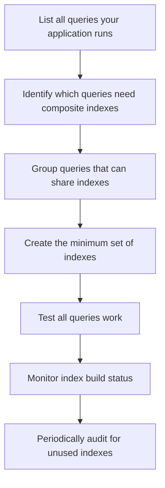

# How to Create and Manage Composite Indexes in Firestore

Author: [nawazdhandala](https://www.github.com/nawazdhandala)

Tags: GCP, Firestore, Indexes, Composite Indexes, Performance

Description: Learn how to create, manage, and optimize composite indexes in Firestore to support complex queries efficiently at any scale.

---

Firestore automatically creates single-field indexes for every field in every document. These cover simple queries. But the moment you need to filter or sort on multiple fields in a single query, you need composite indexes. Getting your composite indexes right is essential for building a performant Firestore application. In this post, I will cover everything you need to know about creating and managing composite indexes.

## How Firestore Indexes Work

Every Firestore query is backed by an index. When you run a query, Firestore does not scan your documents looking for matches. Instead, it looks up the matching documents in the index, which is pre-sorted and optimized for fast retrieval.

Single-field indexes are created automatically. If you have a `users` collection with fields `name`, `email`, and `createdAt`, Firestore creates ascending and descending indexes on each of these fields automatically.

Composite indexes cover queries that involve multiple fields. Firestore does not create these automatically - you have to create them yourself (or let Firestore create them for you through error messages).

## When You Need a Composite Index

You need a composite index when your query:

- Filters on one field and sorts on a different field
- Filters on multiple fields (with at least one non-equality filter)
- Filters with equality on one field and uses a range filter on another field
- Combines an `array-contains` or `in` operator with additional filters

Here are concrete examples:

```javascript
const db = admin.firestore();

// Needs composite index: equality filter + different sort field
const query1 = db.collection('products')
    .where('category', '==', 'electronics')
    .orderBy('price', 'asc');

// Needs composite index: equality + range on different field
const query2 = db.collection('orders')
    .where('userId', '==', 'user-123')
    .where('createdAt', '>', new Date('2026-01-01'));

// Needs composite index: multiple equality + sort
const query3 = db.collection('tasks')
    .where('projectId', '==', 'proj-001')
    .where('status', '==', 'open')
    .orderBy('priority', 'desc');

// Needs composite index: array-contains + additional filter
const query4 = db.collection('articles')
    .where('tags', 'array-contains', 'javascript')
    .where('published', '==', true)
    .orderBy('publishedAt', 'desc');
```

## Method 1: Create from Error Messages

The easiest way to create composite indexes is to run your query and let Firestore tell you what it needs. When a query requires a composite index that does not exist, Firestore returns an error with a URL:

```
FAILED_PRECONDITION: The query requires an index. You can create it here:
https://console.firebase.google.com/v1/r/project/my-project/firestore/indexes?create_composite=...
```

Click the link and Firestore creates the index for you. This is the approach most developers use during development.

## Method 2: Create with gcloud CLI

For automated deployments and infrastructure-as-code:

```bash
# Create a composite index for filtering products by category and sorting by price
gcloud firestore indexes composite create \
    --collection-group=products \
    --field-config=field-path=category,order=ASCENDING \
    --field-config=field-path=price,order=ASCENDING

# Create a composite index with a descending sort
gcloud firestore indexes composite create \
    --collection-group=orders \
    --field-config=field-path=userId,order=ASCENDING \
    --field-config=field-path=createdAt,order=DESCENDING

# Create a composite index for array-contains queries
gcloud firestore indexes composite create \
    --collection-group=articles \
    --field-config=field-path=tags,array-config=CONTAINS \
    --field-config=field-path=published,order=ASCENDING \
    --field-config=field-path=publishedAt,order=DESCENDING
```

## Method 3: Firebase Configuration File

For version-controlled index management, use a `firestore.indexes.json` file:

```json
{
  "indexes": [
    {
      "collectionGroup": "products",
      "queryScope": "COLLECTION",
      "fields": [
        { "fieldPath": "category", "order": "ASCENDING" },
        { "fieldPath": "price", "order": "ASCENDING" }
      ]
    },
    {
      "collectionGroup": "products",
      "queryScope": "COLLECTION",
      "fields": [
        { "fieldPath": "category", "order": "ASCENDING" },
        { "fieldPath": "active", "order": "ASCENDING" },
        { "fieldPath": "createdAt", "order": "DESCENDING" }
      ]
    },
    {
      "collectionGroup": "orders",
      "queryScope": "COLLECTION",
      "fields": [
        { "fieldPath": "userId", "order": "ASCENDING" },
        { "fieldPath": "status", "order": "ASCENDING" },
        { "fieldPath": "createdAt", "order": "DESCENDING" }
      ]
    },
    {
      "collectionGroup": "tasks",
      "queryScope": "COLLECTION",
      "fields": [
        { "fieldPath": "projectId", "order": "ASCENDING" },
        { "fieldPath": "status", "order": "ASCENDING" },
        { "fieldPath": "priority", "order": "DESCENDING" }
      ]
    }
  ],
  "fieldOverrides": []
}
```

Deploy the indexes:

```bash
# Deploy all indexes defined in the configuration file
firebase deploy --only firestore:indexes
```

This approach is great for teams because the index definitions are checked into version control alongside the application code.

## Collection Group Indexes

Regular composite indexes cover queries on a single collection. Collection group indexes cover queries across all collections with the same name (including subcollections):

```json
{
  "indexes": [
    {
      "collectionGroup": "orders",
      "queryScope": "COLLECTION_GROUP",
      "fields": [
        { "fieldPath": "status", "order": "ASCENDING" },
        { "fieldPath": "createdAt", "order": "DESCENDING" }
      ]
    }
  ]
}
```

This index supports queries like:

```javascript
// Query all 'orders' subcollections across all users
const allPendingOrders = await db
    .collectionGroup('orders')
    .where('status', '==', 'pending')
    .orderBy('createdAt', 'desc')
    .get();
```

## Listing and Monitoring Indexes

Check your existing indexes:

```bash
# List all composite indexes for the database
gcloud firestore indexes composite list

# List indexes for a specific collection
gcloud firestore indexes composite list \
    --filter="collectionGroup=products"
```

You can also see index build status. New indexes take time to build, especially for large collections:

```bash
# Check the state of all indexes (CREATING, READY, or NEEDS_REPAIR)
gcloud firestore indexes composite list --format="table(name,state,queryScope)"
```

## Deleting Unused Indexes

Each composite index adds storage cost and slightly increases write latency (because every write must update the index). Remove indexes you no longer need:

```bash
# List indexes to find the one you want to delete
gcloud firestore indexes composite list

# Delete a specific composite index by its name
gcloud firestore indexes composite delete INDEX_NAME
```

## Index Design Strategy

Here is a framework for planning your indexes:



### Minimizing the Number of Indexes

Firestore has a limit of 200 composite indexes per database. You can reduce the number of indexes needed by:

**Sharing indexes across queries.** An index on `(category ASC, price ASC)` supports:
- `where('category', '==', X).orderBy('price')`
- `where('category', '==', X).where('price', '>', Y)`
- `where('category', '==', X).where('price', '>=', Y).where('price', '<=', Z)`

**Using field overrides to exempt fields from single-field indexing.** If a field is only queried in composite indexes, you can disable its single-field index to save storage:

```json
{
  "fieldOverrides": [
    {
      "collectionGroup": "logs",
      "fieldPath": "metadata",
      "indexes": []
    }
  ]
}
```

## Index Build Time

Composite indexes are built asynchronously. The build time depends on:

- The number of documents in the collection
- The number of fields in the index
- Current Firestore load

For a collection with millions of documents, index creation can take 10-30 minutes. For very large collections (hundreds of millions of documents), it can take hours.

Your application can read and write to the collection while the index is building. The only limitation is that queries requiring the new index will fail until it reaches the READY state.

## Common Patterns

### E-Commerce Product Listing

```json
{
  "collectionGroup": "products",
  "queryScope": "COLLECTION",
  "fields": [
    { "fieldPath": "active", "order": "ASCENDING" },
    { "fieldPath": "category", "order": "ASCENDING" },
    { "fieldPath": "price", "order": "ASCENDING" }
  ]
}
```

### User Activity Feed

```json
{
  "collectionGroup": "activities",
  "queryScope": "COLLECTION",
  "fields": [
    { "fieldPath": "userId", "order": "ASCENDING" },
    { "fieldPath": "type", "order": "ASCENDING" },
    { "fieldPath": "timestamp", "order": "DESCENDING" }
  ]
}
```

### Content Search with Tags

```json
{
  "collectionGroup": "articles",
  "queryScope": "COLLECTION",
  "fields": [
    { "fieldPath": "tags", "arrayConfig": "CONTAINS" },
    { "fieldPath": "status", "order": "ASCENDING" },
    { "fieldPath": "publishedAt", "order": "DESCENDING" }
  ]
}
```

## Troubleshooting

### Index Build Stuck in CREATING State

If an index has been in CREATING state for a very long time:

1. Check if the collection has an unusually large number of documents
2. Verify that there are no documents with missing fields that the index covers
3. As a last resort, delete and recreate the index

### Query Returns "requires an index" Despite Index Existing

This usually means the sort direction in your query does not match the index. An index on `(field ASC)` does not serve a query with `orderBy('field', 'desc')`. Check the exact field order and direction in your index definition.

## Wrapping Up

Composite indexes are the bridge between Firestore's simple query model and the complex queries your application needs. Start by letting error messages guide your index creation during development, then formalize your indexes in a configuration file for production deployments. Keep your index count manageable by sharing indexes across queries when possible, and periodically audit for indexes that are no longer needed. With the right set of composite indexes, Firestore can serve complex queries with consistent low latency regardless of how much data you have.
