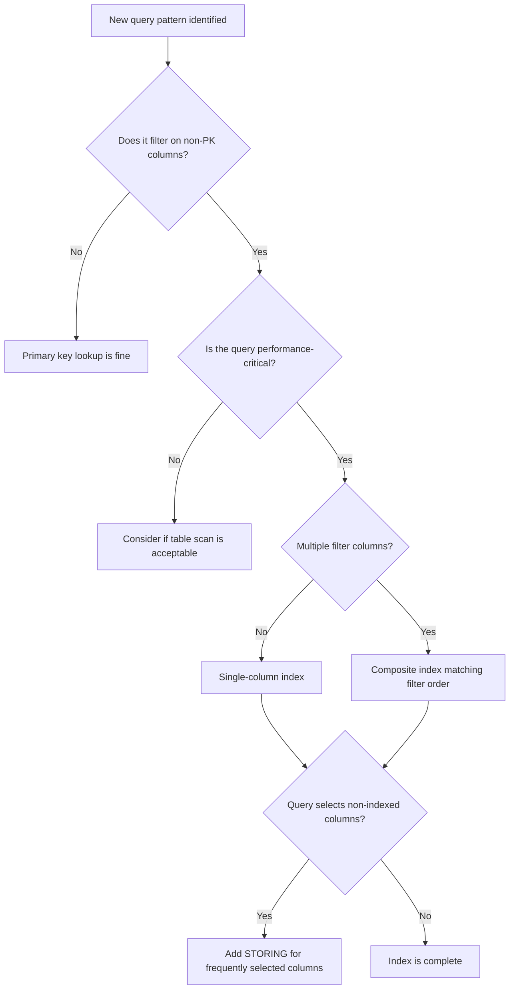

# How to Create and Manage Secondary Indexes in Cloud Spanner

Author: [nawazdhandala](https://www.github.com/nawazdhandala)

Tags: GCP, Cloud Spanner, Indexes, Query Optimization, Database

Description: A practical guide to creating, managing, and optimizing secondary indexes in Cloud Spanner for faster query performance.

---

Cloud Spanner stores data sorted by primary key, which makes lookups by primary key extremely fast. But what happens when you need to query data by a column that is not part of the primary key? That is where secondary indexes come in. They let you efficiently query data using non-primary-key columns without resorting to full table scans. In this post, I will cover how to create, manage, and think about secondary indexes in Spanner.

## Why Secondary Indexes Matter

Let's say you have a Users table with UserId as the primary key:

```sql
-- A basic Users table with UserId as primary key
CREATE TABLE Users (
    UserId STRING(36) NOT NULL,
    Email STRING(256) NOT NULL,
    DisplayName STRING(128),
    CreatedAt TIMESTAMP NOT NULL
) PRIMARY KEY (UserId);
```

Looking up a user by UserId is fast because Spanner stores rows sorted by primary key. But if you need to find a user by their email address, Spanner has to scan every row in the table to find a match. For a table with millions of rows, that is not going to work.

## Creating a Basic Secondary Index

The simplest form of secondary index indexes a single column:

```sql
-- Create an index on the Email column for fast lookups by email
CREATE INDEX UsersByEmail ON Users(Email);
```

With this index in place, queries that filter on Email can use the index instead of scanning the full table:

```sql
-- This query will now use the UsersByEmail index
SELECT UserId, Email, DisplayName
FROM Users
WHERE Email = 'alice@example.com';
```

## Unique Indexes

If you want to enforce that no two users can have the same email, use a unique index:

```sql
-- Enforce uniqueness on the Email column
CREATE UNIQUE INDEX UsersByEmailUnique ON Users(Email);
```

Any attempt to insert a row with a duplicate email will now fail with an error. This is a clean way to enforce business rules at the database level.

## Covering Indexes with STORING

When Spanner uses a secondary index to find rows, it gets the indexed columns plus the primary key columns. If your query needs additional columns, Spanner has to do a "back-join" to the base table to fetch them. This extra hop adds latency.

You can avoid the back-join by storing additional columns directly in the index:

```sql
-- Store DisplayName in the index to avoid back-joins
CREATE INDEX UsersByEmail ON Users(Email) STORING (DisplayName);
```

Now a query that selects Email and DisplayName can be served entirely from the index:

```sql
-- This query is fully covered by the index - no back-join needed
SELECT Email, DisplayName
FROM Users
WHERE Email = 'alice@example.com';
```

The tradeoff is that STORING columns increases the storage footprint of the index and adds slightly more work during writes. But for frequently-run queries, the read performance improvement is usually worth it.

## Composite Indexes

When your queries filter on multiple columns, a composite index covers them efficiently:

```sql
-- Composite index for queries that filter by DisplayName and sort by CreatedAt
CREATE INDEX UsersByNameAndDate ON Users(DisplayName, CreatedAt DESC);
```

Column order in composite indexes matters. The index is sorted by the first column, then by the second column within each value of the first. Design your composite indexes to match your most common query patterns.

This query benefits from the composite index:

```sql
-- Efficiently uses the composite index
SELECT UserId, DisplayName, CreatedAt
FROM Users
WHERE DisplayName = 'Alice'
ORDER BY CreatedAt DESC;
```

## NULL-Filtered Indexes

By default, indexes include rows where the indexed column is NULL. If you are only ever querying for non-NULL values, you can save space and improve performance with a NULL-filtered index:

```sql
-- Only index rows where LastLoginAt is not NULL
CREATE NULL_FILTERED INDEX UsersByLastLogin ON Users(LastLoginAt);
```

This is particularly useful for sparse columns where most rows have NULL values. The index will be much smaller, and writes to rows with NULL values for the indexed column will not incur index maintenance overhead.

## Indexes on Interleaved Tables

Indexes on interleaved tables work the same way, but you can also create interleaved indexes. An interleaved index is co-located with the parent table's data:

```sql
-- Assume Albums is interleaved in Artists
-- This index is itself interleaved in Artists for co-location
CREATE INDEX AlbumsByReleaseYear ON Albums(ArtistId, ReleaseYear),
    INTERLEAVE IN Artists;
```

This is useful when you always access albums within the context of a specific artist. The index entries for an artist's albums are stored next to the artist data.

## Managing Indexes

To see all indexes on a database, inspect the DDL:

```bash
# Show the complete schema including all index definitions
gcloud spanner databases ddl describe my-database \
    --instance=my-spanner-instance
```

To drop an index:

```sql
-- Remove an index that is no longer needed
DROP INDEX UsersByEmail;
```

## Index Creation is Online

One of Spanner's strengths is that index creation does not block reads or writes. When you create an index on a table that already has data, Spanner backfills the index in the background. However, the CREATE INDEX statement will not return until the backfill is complete.

For large tables, this can take a while. You can check the progress of long-running schema operations:

```bash
# List ongoing database operations including index creation progress
gcloud spanner operations list \
    --instance=my-spanner-instance \
    --database=my-database
```

## Forcing Index Usage

Spanner's query optimizer usually picks the right index automatically. But sometimes you might want to force a specific index, especially during testing:

```sql
-- Force the query to use a specific index
SELECT UserId, Email
FROM Users@{FORCE_INDEX=UsersByEmail}
WHERE Email = 'alice@example.com';
```

Use this sparingly. The optimizer generally makes good choices, and forcing an index can lead to worse performance if the data distribution changes.

## How Many Indexes is Too Many?

Every index adds overhead to write operations because Spanner has to update the index whenever the indexed columns change. There is no hard limit, but here are some guidelines:

- Index columns that are frequently used in WHERE clauses
- Avoid indexing columns that change very frequently
- Use STORING judiciously - do not store every column in every index
- Monitor write latency after adding indexes to make sure the overhead is acceptable

Here is a mental model for thinking about it:



## Wrapping Up

Secondary indexes in Cloud Spanner are a fundamental performance tool. They turn expensive full-table scans into fast index lookups, and features like STORING, NULL filtering, and interleaved indexes give you fine-grained control over the performance-storage tradeoff. The key is to let your query patterns drive your index design. Start with the queries you know you need, create indexes for those, and monitor both read and write performance to find the right balance.
