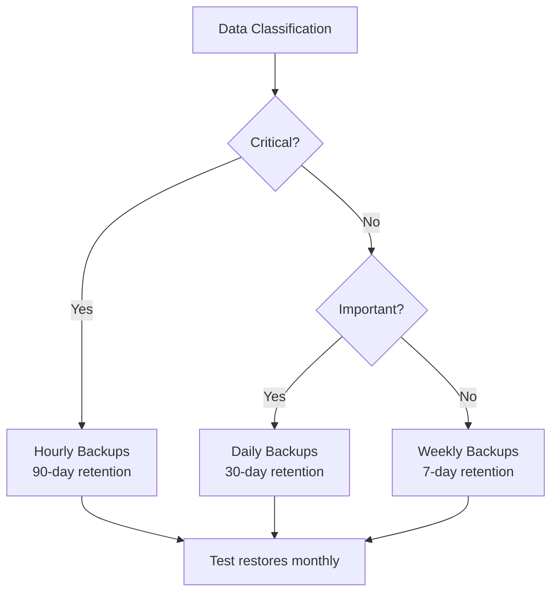

# How to Create and Restore Bigtable Backups

Author: [nawazdhandala](https://www.github.com/nawazdhandala)

Tags: GCP, Cloud Bigtable, Backups, Disaster Recovery, Data Protection

Description: A practical guide to creating, managing, and restoring Cloud Bigtable backups for data protection and disaster recovery scenarios.

---

Even with Bigtable's built-in replication, you still need backups. Replication protects you from infrastructure failures, but it does not protect you from application bugs, accidental deletes, or corrupted data that gets replicated to all clusters. A backup gives you a point-in-time snapshot you can restore to if something goes wrong.

Bigtable supports native backups that are fast to create and restore. Let me show you how to set them up, automate them, and use them when you need to recover data.

## Creating a Backup

You create backups using `gcloud` or client libraries. Each backup is associated with a specific cluster and has an expiration date.

```bash
# Create a backup of a table
# The backup is stored in the specified cluster
gcloud bigtable backups create my-backup-20260217 \
  --instance=my-instance \
  --cluster=my-cluster \
  --table=my-table \
  --expiration-date=2026-03-17T00:00:00Z \
  --project=your-project-id

# You can also use a relative expiration
gcloud bigtable backups create daily-backup \
  --instance=my-instance \
  --cluster=my-cluster \
  --table=my-table \
  --retention-period=30d \
  --project=your-project-id
```

The backup is created asynchronously. For large tables, it may take some time, but the table remains fully available during the backup process.

## Listing and Describing Backups

Check on your existing backups to see their status and expiration.

```bash
# List all backups for a cluster
gcloud bigtable backups list \
  --instance=my-instance \
  --cluster=my-cluster \
  --project=your-project-id

# Get details about a specific backup
gcloud bigtable backups describe my-backup-20260217 \
  --instance=my-instance \
  --cluster=my-cluster \
  --project=your-project-id
```

The describe output shows you the backup state (CREATING or READY), the source table, the start and end times, the size in bytes, and the expiration date.

## Restoring from a Backup

Restoring a backup creates a new table from the backup data. You cannot restore into an existing table - you always get a new table.

```bash
# Restore a backup into a new table
gcloud bigtable backups restore my-backup-20260217 \
  --instance=my-instance \
  --cluster=my-cluster \
  --destination=my-table-restored \
  --destination-instance=my-instance \
  --project=your-project-id
```

You can also restore to a different instance (as long as it is in the same project):

```bash
# Restore to a different instance for testing
gcloud bigtable backups restore my-backup-20260217 \
  --instance=my-instance \
  --cluster=my-cluster \
  --destination=test-table \
  --destination-instance=my-test-instance \
  --project=your-project-id
```

## Automating Backups with Cloud Scheduler

For production systems, you want automated daily backups. Here is how to set it up with Cloud Functions and Cloud Scheduler.

```javascript
// Cloud Function that creates a daily Bigtable backup
// Triggered by Cloud Scheduler via Pub/Sub
const { BigtableTableAdminClient } = require('@google-cloud/bigtable').v2;
const functions = require('firebase-functions');

const adminClient = new BigtableTableAdminClient();

exports.createBigtableBackup = functions.pubsub
  .schedule('every day 02:00')
  .timeZone('America/Chicago')
  .onRun(async () => {
    const projectId = 'your-project-id';
    const instanceId = 'my-instance';
    const clusterId = 'my-cluster';
    const tableId = 'my-table';

    // Generate a unique backup ID with the date
    const date = new Date().toISOString().split('T')[0].replace(/-/g, '');
    const backupId = `daily-${tableId}-${date}`;

    // Set expiration to 30 days from now
    const expireTime = new Date();
    expireTime.setDate(expireTime.getDate() + 30);

    const parent = adminClient.clusterPath(projectId, instanceId, clusterId);

    try {
      const [operation] = await adminClient.createBackup({
        parent: parent,
        backupId: backupId,
        backup: {
          sourceTable: adminClient.tablePath(projectId, instanceId, tableId),
          expireTime: {
            seconds: Math.floor(expireTime.getTime() / 1000)
          }
        }
      });

      // Wait for the backup to complete
      const [backup] = await operation.promise();
      console.log(`Backup created: ${backup.name}`);
      console.log(`Size: ${backup.sizeBytes} bytes`);
    } catch (error) {
      console.error('Backup creation failed:', error);
      throw error;
    }
  });
```

## Managing Backup Lifecycle with Python

Here is a complete backup management script in Python.

```python
# Bigtable backup management script
# Handles creation, listing, cleanup, and restoration
from google.cloud import bigtable
from google.cloud.bigtable import backup as backup_module
from datetime import datetime, timedelta, timezone
import sys

PROJECT_ID = 'your-project-id'
INSTANCE_ID = 'my-instance'
CLUSTER_ID = 'my-cluster'

def get_instance():
    client = bigtable.Client(project=PROJECT_ID, admin=True)
    return client.instance(INSTANCE_ID)

def create_backup(table_id, retention_days=30):
    """Create a backup of the specified table."""
    instance = get_instance()
    table = instance.table(table_id)
    cluster = instance.cluster(CLUSTER_ID)

    # Generate backup ID with timestamp
    timestamp = datetime.now().strftime('%Y%m%d-%H%M%S')
    backup_id = f"backup-{table_id}-{timestamp}"

    # Set expiration
    expire_time = datetime.now(timezone.utc) + timedelta(days=retention_days)

    print(f"Creating backup {backup_id}...")
    backup = cluster.backup(backup_id, table=table, expire_time=expire_time)
    operation = backup.create()

    # Wait for completion
    operation.result(timeout=600)  # Wait up to 10 minutes
    backup.reload()

    print(f"Backup created: {backup_id}")
    print(f"  Size: {backup.size_bytes} bytes")
    print(f"  Expires: {backup.expire_time}")
    return backup_id

def list_backups():
    """List all backups in the cluster."""
    instance = get_instance()
    cluster = instance.cluster(CLUSTER_ID)

    backups = cluster.list_backups()
    for backup in backups:
        backup.reload()
        print(f"  {backup.backup_id}")
        print(f"    Source: {backup.source_table}")
        print(f"    Size: {backup.size_bytes} bytes")
        print(f"    State: {backup.state}")
        print(f"    Expires: {backup.expire_time}")
        print()

def restore_backup(backup_id, new_table_id):
    """Restore a backup to a new table."""
    instance = get_instance()
    cluster = instance.cluster(CLUSTER_ID)
    backup = cluster.backup(backup_id)

    print(f"Restoring {backup_id} to table {new_table_id}...")
    restored_table = backup.restore(new_table_id)
    print(f"Table {new_table_id} restored successfully")
    return restored_table

def cleanup_old_backups(table_id, keep_count=7):
    """Delete old backups, keeping the most recent ones."""
    instance = get_instance()
    cluster = instance.cluster(CLUSTER_ID)

    # Get all backups for this table, sorted by creation time
    all_backups = list(cluster.list_backups())
    table_backups = [b for b in all_backups
                     if table_id in b.backup_id]

    # Sort by backup ID (which includes timestamp)
    table_backups.sort(key=lambda b: b.backup_id, reverse=True)

    # Delete old ones
    if len(table_backups) > keep_count:
        for old_backup in table_backups[keep_count:]:
            print(f"Deleting old backup: {old_backup.backup_id}")
            old_backup.delete()

    print(f"Kept {min(len(table_backups), keep_count)} backups, "
          f"deleted {max(0, len(table_backups) - keep_count)}")

# Command-line usage
if __name__ == '__main__':
    action = sys.argv[1] if len(sys.argv) > 1 else 'list'

    if action == 'create':
        table_id = sys.argv[2]
        create_backup(table_id)
    elif action == 'list':
        list_backups()
    elif action == 'restore':
        backup_id = sys.argv[2]
        new_table = sys.argv[3]
        restore_backup(backup_id, new_table)
    elif action == 'cleanup':
        table_id = sys.argv[2]
        cleanup_old_backups(table_id)
```

## Backup Strategies

Different data has different backup requirements. Here is a practical framework:



For critical tables (user data, financial records):
- Backup every hour
- Retain backups for 90 days
- Test restoration monthly

For important tables (order history, analytics):
- Backup daily
- Retain backups for 30 days
- Test restoration quarterly

For transient tables (caches, temp data):
- Backup weekly or not at all
- Retain for 7 days

## Important Limitations

There are several things to keep in mind about Bigtable backups.

Backups are tied to a specific cluster. If you have a multi-cluster instance, the backup only captures data from one cluster. For a completely consistent backup, consider briefly pausing writes or accepting that the backup captures a point-in-time snapshot from one cluster's perspective.

You cannot update the data in a backup. It is a read-only snapshot. To modify backed-up data, restore it to a new table, make your changes, and create a new backup.

Backup expiration is required. You must set an expiration date, and the maximum retention is 30 days for regular backups. For longer retention, you can copy the backup or use Bigtable exports to Cloud Storage.

Restoring creates a new table. You cannot overwrite an existing table from a backup. If you need to restore into the original table name, delete the original table first, then restore.

## Wrapping Up

Bigtable backups are your safety net against data loss from application errors, accidental deletes, or corrupted data. Automate your backup creation with Cloud Scheduler and Cloud Functions, implement a retention policy that matches your data's importance, and regularly test your restore process. A backup you have never tested restoring is only slightly better than no backup at all. The creation and restoration process is fast - even for large tables - so there is little excuse not to have a solid backup strategy in place.
