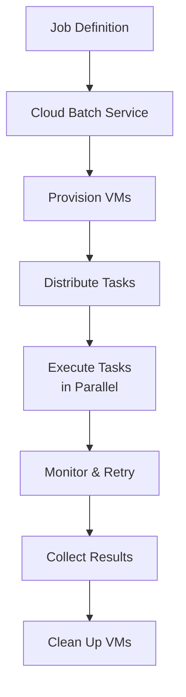

# How to Create and Run Your First Batch Processing Job on Google Cloud Batch

Author: [nawazdhandala](https://www.github.com/nawazdhandala)

Tags: GCP, Cloud Batch, Batch Processing, Compute, Job Scheduling, Google Cloud

Description: Create and run your first batch processing job on Google Cloud Batch to execute compute-intensive tasks with automatic resource provisioning and scheduling.

---

Google Cloud Batch is a fully managed service for running batch processing workloads. If you have ever set up a cluster of VMs to process data, render frames, run simulations, or execute scientific computations, you know the pain of managing the infrastructure - provisioning machines, distributing work, handling failures, and tearing everything down when the job finishes. Cloud Batch handles all of that. You define what you want to run, how much compute you need, and Cloud Batch takes care of the rest.

In this post, I will walk through creating your first batch job from scratch, covering job definitions, task specifications, resource allocation, and monitoring.

## What Cloud Batch Does

Cloud Batch provisions compute resources on demand, distributes your tasks across those resources, monitors execution, retries failed tasks, and cleans up when the job is done. You pay only for the compute time your tasks actually use.

It supports two types of workloads:

- **Script-based jobs** - run shell scripts directly on provisioned VMs
- **Container-based jobs** - run Docker containers on provisioned VMs



## Prerequisites

- A Google Cloud project with billing enabled
- The Batch API enabled (`batch.googleapis.com`)
- The `gcloud` CLI installed and configured
- IAM permissions: `batch.jobs.create`, `batch.jobs.get`

Enable the API first:

```bash
# Enable the Batch API
gcloud services enable batch.googleapis.com
```

## Step 1: Create a Simple Script-Based Job

Let's start with the simplest possible batch job - running a script across multiple tasks.

This creates a job that processes files in parallel using a shell script:

```bash
# Create a batch job using gcloud
gcloud batch jobs submit my-first-batch-job \
  --location=us-central1 \
  --config=- <<'EOF'
{
  "taskGroups": [
    {
      "taskSpec": {
        "runnables": [
          {
            "script": {
              "text": "echo 'Processing task ${BATCH_TASK_INDEX} of ${BATCH_TASK_COUNT}'\necho 'Task ID: ${BATCH_TASK_ID}'\nsleep 10\necho 'Task ${BATCH_TASK_INDEX} complete'"
            }
          }
        ],
        "computeResource": {
          "cpuMilli": 1000,
          "memoryMib": 512
        },
        "maxRetryCount": 2,
        "maxRunDuration": "600s"
      },
      "taskCount": 10,
      "parallelism": 5
    }
  ],
  "logsPolicy": {
    "destination": "CLOUD_LOGGING"
  }
}
EOF
```

Let me break down the key fields:

- `taskCount: 10` - creates 10 independent tasks
- `parallelism: 5` - runs up to 5 tasks simultaneously
- `cpuMilli: 1000` - each task gets 1 vCPU (1000 milli-CPUs)
- `memoryMib: 512` - each task gets 512 MB of memory
- `maxRetryCount: 2` - automatically retry failed tasks up to 2 times

## Step 2: Create a Job with the Python Client Library

For more control, use the Python client library to define and submit jobs programmatically.

This Python script creates a data processing batch job:

```python
from google.cloud import batch_v1

def create_batch_job(project_id, region, job_name):
    """Creates a batch job that processes data files in parallel."""
    client = batch_v1.BatchServiceClient()

    # Define what each task will run
    runnable = batch_v1.Runnable()
    runnable.script = batch_v1.Runnable.Script()
    runnable.script.text = """#!/bin/bash
    # This script runs once per task
    # BATCH_TASK_INDEX tells you which task this is (0-based)
    echo "Starting task $BATCH_TASK_INDEX at $(date)"

    # Download the input file for this task from GCS
    INPUT_FILE="gs://my-data-bucket/input/part_${BATCH_TASK_INDEX}.csv"
    OUTPUT_FILE="gs://my-data-bucket/output/result_${BATCH_TASK_INDEX}.csv"

    # Copy input file locally
    gsutil cp "$INPUT_FILE" /tmp/input.csv

    # Process the file (replace with your actual processing)
    wc -l /tmp/input.csv > /tmp/output.csv
    grep -c "ERROR" /tmp/input.csv >> /tmp/output.csv

    # Upload the result
    gsutil cp /tmp/output.csv "$OUTPUT_FILE"

    echo "Task $BATCH_TASK_INDEX complete at $(date)"
    """

    # Define resource requirements for each task
    resources = batch_v1.ComputeResource()
    resources.cpu_milli = 2000    # 2 vCPUs per task
    resources.memory_mib = 4096   # 4 GB RAM per task

    # Build the task specification
    task = batch_v1.TaskSpec()
    task.runnables = [runnable]
    task.compute_resource = resources
    task.max_retry_count = 3
    task.max_run_duration = "1800s"  # 30 minute timeout per task

    # Define the task group (how many tasks, parallelism)
    group = batch_v1.TaskGroup()
    group.task_spec = task
    group.task_count = 100       # Process 100 files
    group.parallelism = 20       # Run 20 tasks at a time

    # Define the VM allocation policy
    allocation_policy = batch_v1.AllocationPolicy()

    # Specify the machine type
    instance = batch_v1.AllocationPolicy.InstancePolicy()
    instance.machine_type = "e2-standard-4"

    instance_policy = batch_v1.AllocationPolicy.InstancePolicyOrTemplate()
    instance_policy.policy = instance
    allocation_policy.instances = [instance_policy]

    # Set the location
    location = batch_v1.AllocationPolicy.LocationPolicy()
    location.allowed_locations = [f"zones/{region}-a", f"zones/{region}-b"]
    allocation_policy.location = location

    # Build the complete job definition
    job = batch_v1.Job()
    job.task_groups = [group]
    job.allocation_policy = allocation_policy

    # Configure logging
    job.logs_policy = batch_v1.LogsPolicy()
    job.logs_policy.destination = batch_v1.LogsPolicy.Destination.CLOUD_LOGGING

    # Submit the job
    parent = f"projects/{project_id}/locations/{region}"
    request = batch_v1.CreateJobRequest(
        parent=parent,
        job=job,
        job_id=job_name,
    )

    response = client.create_job(request=request)
    print(f"Job created: {response.name}")
    print(f"Status: {response.status.state}")
    return response

# Create and submit the job
job = create_batch_job("my-project", "us-central1", "data-processing-001")
```

## Step 3: Monitor the Job

Track job progress through the CLI, API, or Python client.

These commands show different monitoring approaches:

```bash
# Check job status
gcloud batch jobs describe my-first-batch-job \
  --location=us-central1

# List all tasks in the job
gcloud batch tasks list \
  --job=my-first-batch-job \
  --location=us-central1

# View task logs
gcloud logging read \
  'labels.job_uid="JOB_UID" AND labels.task_id="task/0"' \
  --limit=50
```

Monitor programmatically with the Python client:

```python
from google.cloud import batch_v1
import time

def monitor_job(project_id, region, job_name):
    """Monitors a batch job until completion."""
    client = batch_v1.BatchServiceClient()
    job_path = f"projects/{project_id}/locations/{region}/jobs/{job_name}"

    while True:
        job = client.get_job(name=job_path)
        state = job.status.state

        # Count task states
        task_counts = {}
        for event in job.status.status_events:
            print(f"  [{event.event_time}] {event.description}")

        print(f"Job state: {state}")
        print(f"Task groups: {len(job.task_groups)}")

        if state in [
            batch_v1.JobStatus.State.SUCCEEDED,
            batch_v1.JobStatus.State.FAILED,
        ]:
            print(f"Job finished with state: {state}")
            break

        time.sleep(30)  # Check every 30 seconds

    return job

monitor_job("my-project", "us-central1", "data-processing-001")
```

## Step 4: Handle Task Dependencies

For multi-step processing where one set of tasks depends on another, use task groups with ordering.

```python
from google.cloud import batch_v1

def create_multi_step_job(project_id, region, job_name):
    """Creates a batch job with sequential task groups."""
    client = batch_v1.BatchServiceClient()

    # Step 1: Download and preprocess data
    preprocess_runnable = batch_v1.Runnable()
    preprocess_runnable.script = batch_v1.Runnable.Script()
    preprocess_runnable.script.text = """#!/bin/bash
    echo "Preprocessing task $BATCH_TASK_INDEX"
    gsutil cp gs://my-bucket/raw/file_${BATCH_TASK_INDEX}.csv /tmp/
    # Preprocess the file
    python3 /scripts/preprocess.py /tmp/file_${BATCH_TASK_INDEX}.csv
    gsutil cp /tmp/processed_${BATCH_TASK_INDEX}.csv gs://my-bucket/processed/
    """

    preprocess_task = batch_v1.TaskSpec()
    preprocess_task.runnables = [preprocess_runnable]
    preprocess_task.compute_resource = batch_v1.ComputeResource(
        cpu_milli=2000, memory_mib=4096
    )

    preprocess_group = batch_v1.TaskGroup()
    preprocess_group.task_spec = preprocess_task
    preprocess_group.task_count = 50
    preprocess_group.parallelism = 10

    # Step 2: Aggregate results (runs after all preprocessing is done)
    aggregate_runnable = batch_v1.Runnable()
    aggregate_runnable.script = batch_v1.Runnable.Script()
    aggregate_runnable.script.text = """#!/bin/bash
    echo "Aggregating results"
    gsutil cp gs://my-bucket/processed/*.csv /tmp/processed/
    python3 /scripts/aggregate.py /tmp/processed/ /tmp/final_result.csv
    gsutil cp /tmp/final_result.csv gs://my-bucket/results/
    """

    aggregate_task = batch_v1.TaskSpec()
    aggregate_task.runnables = [aggregate_runnable]
    aggregate_task.compute_resource = batch_v1.ComputeResource(
        cpu_milli=4000, memory_mib=16384
    )

    aggregate_group = batch_v1.TaskGroup()
    aggregate_group.task_spec = aggregate_task
    aggregate_group.task_count = 1
    aggregate_group.parallelism = 1

    # Build the job with both task groups
    job = batch_v1.Job()
    job.task_groups = [preprocess_group, aggregate_group]

    # Configure allocation
    allocation = batch_v1.AllocationPolicy()
    instance_policy = batch_v1.AllocationPolicy.InstancePolicyOrTemplate()
    instance_policy.policy = batch_v1.AllocationPolicy.InstancePolicy(
        machine_type="e2-standard-4"
    )
    allocation.instances = [instance_policy]
    job.allocation_policy = allocation
    job.logs_policy = batch_v1.LogsPolicy(
        destination=batch_v1.LogsPolicy.Destination.CLOUD_LOGGING
    )

    # Submit the job
    request = batch_v1.CreateJobRequest(
        parent=f"projects/{project_id}/locations/{region}",
        job=job,
        job_id=job_name,
    )

    response = client.create_job(request=request)
    print(f"Multi-step job created: {response.name}")
    return response
```

## Step 5: Clean Up and Cost Control

Set up job lifecycle policies to avoid runaway costs:

```bash
# Delete a completed job
gcloud batch jobs delete my-first-batch-job \
  --location=us-central1

# List all jobs and their status for cleanup
gcloud batch jobs list \
  --location=us-central1 \
  --format="table(name, status.state, createTime)"
```

## Summary

Google Cloud Batch takes the infrastructure management out of batch processing. Define your tasks as scripts or containers, specify the compute resources, set the parallelism level, and let Cloud Batch handle provisioning, scheduling, execution, and cleanup. The environment variables like BATCH_TASK_INDEX and BATCH_TASK_COUNT let each task know which portion of the work to handle. Start with a simple script-based job to get familiar with the service, then move to containerized workloads for more complex processing pipelines. The combination of automatic retries, configurable parallelism, and pay-per-use pricing makes it a practical choice for any workload that does not need to run continuously.
