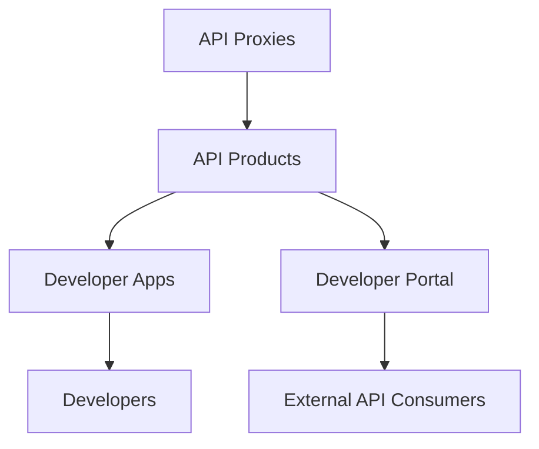

# How to Create API Products in Apigee and Publish Them to a Developer Portal

Author: [nawazdhandala](https://www.github.com/nawazdhandala)

Tags: Apigee, GCP, API Products, Developer Portal, API Management

Description: Learn how to bundle API proxies into products, configure access levels and quotas, and publish them to a developer portal for external API consumers.

---

In Apigee, an API Product is the unit of packaging for your APIs. It bundles one or more API proxies together with access controls, quota limits, and metadata. Think of it as a "plan" or "tier" for your API. You might have a Free product with limited access and a Premium product with higher quotas and more endpoints. Developers subscribe to products, not individual proxies. This separation is what makes Apigee's monetization and access control model so flexible.

## The Apigee Hierarchy

Understanding how the pieces fit together helps everything make sense:



- **API Proxies** are the technical implementations (request routing, policies)
- **API Products** bundle proxies with business rules (quotas, access levels)
- **Developers** are the people or organizations consuming your API
- **Developer Apps** are registered applications that get API keys
- **Developer Portal** is the self-service website where developers discover and subscribe to your APIs

## Creating an API Product

You can create products through the Apigee Console or the management API.

### Using the Apigee Management API

This command creates a Free tier product:

```bash
# Create a Free tier API product
curl -X POST \
  "https://apigee.googleapis.com/v1/organizations/YOUR_ORG/apiproducts" \
  -H "Authorization: Bearer $(gcloud auth print-access-token)" \
  -H "Content-Type: application/json" \
  -d '{
    "name": "weather-api-free",
    "displayName": "Weather API - Free Tier",
    "description": "Access to basic weather data with limited quota. Perfect for personal projects and evaluation.",
    "approvalType": "auto",
    "attributes": [
      {
        "name": "access",
        "value": "public"
      },
      {
        "name": "tier",
        "value": "free"
      }
    ],
    "environments": ["eval", "prod"],
    "proxies": ["weather-api"],
    "quota": "1000",
    "quotaInterval": "1",
    "quotaTimeUnit": "day",
    "scopes": ["read"],
    "apiResources": ["/weather/**", "/forecast/**"]
  }'
```

Now create a Premium tier with higher limits and more endpoints:

```bash
# Create a Premium tier API product
curl -X POST \
  "https://apigee.googleapis.com/v1/organizations/YOUR_ORG/apiproducts" \
  -H "Authorization: Bearer $(gcloud auth print-access-token)" \
  -H "Content-Type: application/json" \
  -d '{
    "name": "weather-api-premium",
    "displayName": "Weather API - Premium",
    "description": "Full access to weather data including historical data, alerts, and high-resolution forecasts. Includes priority support.",
    "approvalType": "manual",
    "attributes": [
      {
        "name": "access",
        "value": "public"
      },
      {
        "name": "tier",
        "value": "premium"
      },
      {
        "name": "support-level",
        "value": "priority"
      }
    ],
    "environments": ["prod"],
    "proxies": ["weather-api", "weather-historical-api", "weather-alerts-api"],
    "quota": "100000",
    "quotaInterval": "1",
    "quotaTimeUnit": "day",
    "scopes": ["read", "write", "admin"],
    "apiResources": ["/**"]
  }'
```

### Key Configuration Options Explained

**approvalType**: Set to `auto` for self-service sign-up or `manual` for approval-required access. Manual approval is common for premium or enterprise tiers.

**apiResources**: Controls which paths within the proxy are accessible. The Free tier above only grants access to `/weather/**` and `/forecast/**`, while Premium gets `/**` (everything).

**quota, quotaInterval, quotaTimeUnit**: The default quota for this product. These values become available as flow variables in your proxy after API key verification.

**environments**: Which Apigee environments this product is available in. You might make the Free tier available in both eval and prod, but Premium only in prod.

**scopes**: OAuth scopes associated with this product. Useful when using OAuth for authentication.

## Registering Developers

Before developers can subscribe to products, they need to be registered.

Create a developer:

```bash
# Register a developer
curl -X POST \
  "https://apigee.googleapis.com/v1/organizations/YOUR_ORG/developers" \
  -H "Authorization: Bearer $(gcloud auth print-access-token)" \
  -H "Content-Type: application/json" \
  -d '{
    "email": "developer@example.com",
    "firstName": "Jane",
    "lastName": "Developer",
    "userName": "jdeveloper",
    "attributes": [
      {
        "name": "company",
        "value": "Example Corp"
      }
    ]
  }'
```

## Creating Developer Apps

A developer app is the entity that gets API keys. Each app is associated with one or more API products.

```bash
# Create a developer app subscribed to the Free tier
curl -X POST \
  "https://apigee.googleapis.com/v1/organizations/YOUR_ORG/developers/developer@example.com/apps" \
  -H "Authorization: Bearer $(gcloud auth print-access-token)" \
  -H "Content-Type: application/json" \
  -d '{
    "name": "my-weather-app",
    "displayName": "My Weather App",
    "apiProducts": ["weather-api-free"],
    "callbackUrl": "https://example.com/callback",
    "attributes": [
      {
        "name": "app-type",
        "value": "web"
      }
    ]
  }'
```

After creating the app, retrieve the API key:

```bash
# Get the app details including API keys
curl "https://apigee.googleapis.com/v1/organizations/YOUR_ORG/developers/developer@example.com/apps/my-weather-app" \
  -H "Authorization: Bearer $(gcloud auth print-access-token)"
```

The response includes `credentials` with a `consumerKey` - that is the API key.

## Setting Up the Developer Portal

Apigee provides an integrated developer portal that you can customize with your branding. The portal lets developers:

- Browse available API products
- Read API documentation
- Register and create apps
- Get API keys
- View their usage statistics

### Creating the Portal

```bash
# Create an Apigee developer portal
curl -X POST \
  "https://apigee.googleapis.com/v1/organizations/YOUR_ORG/sites" \
  -H "Authorization: Bearer $(gcloud auth print-access-token)" \
  -H "Content-Type: application/json" \
  -d '{
    "name": "weather-api-portal",
    "description": "Developer portal for the Weather API"
  }'
```

### Adding API Documentation

You can publish OpenAPI specifications to the portal so developers can see exactly what endpoints are available.

Create an API spec:

```yaml
# weather-api-spec.yaml
openapi: 3.0.0
info:
  title: Weather API
  version: "1.0"
  description: |
    Access current weather data, forecasts, and historical weather
    information for locations worldwide.

    ## Authentication
    All requests require an API key passed in the `x-api-key` header.

    ## Rate Limits
    - Free tier: 1,000 requests/day
    - Premium: 100,000 requests/day

servers:
  - url: https://api.yourdomain.com

paths:
  /weather/current:
    get:
      summary: Get current weather
      description: Returns current weather conditions for a given location
      parameters:
        - name: city
          in: query
          required: true
          schema:
            type: string
          description: City name
        - name: units
          in: query
          schema:
            type: string
            enum: [metric, imperial]
            default: metric
      responses:
        "200":
          description: Weather data
          content:
            application/json:
              schema:
                type: object
                properties:
                  city:
                    type: string
                  temperature:
                    type: number
                  conditions:
                    type: string
                  humidity:
                    type: number
        "429":
          description: Rate limit exceeded
```

Upload the spec to the portal:

```bash
# Upload the OpenAPI spec
curl -X POST \
  "https://apigee.googleapis.com/v1/organizations/YOUR_ORG/sites/weather-api-portal/apidocs" \
  -H "Authorization: Bearer $(gcloud auth print-access-token)" \
  -H "Content-Type: application/json" \
  -d '{
    "title": "Weather API Documentation",
    "description": "Complete reference for the Weather API",
    "anonAllowed": true,
    "published": true,
    "apiProductName": "weather-api-free"
  }'
```

## Connecting Products to Proxy Policies

In your API proxy, use the VerifyAPIKey policy to validate keys and automatically load the associated product's quota settings.

The proxy configuration that uses product-based quotas:

```xml
<!-- apiproxy/policies/VerifyAPIKey.xml -->
<?xml version="1.0" encoding="UTF-8" standalone="yes"?>
<VerifyAPIKey name="VerifyAPIKey">
    <DisplayName>Verify API Key</DisplayName>
    <APIKey ref="request.header.x-api-key"/>
</VerifyAPIKey>
```

```xml
<!-- apiproxy/policies/EnforceProductQuota.xml -->
<?xml version="1.0" encoding="UTF-8" standalone="yes"?>
<Quota name="EnforceProductQuota">
    <DisplayName>Enforce Product Quota</DisplayName>
    <!-- These flow variables are set automatically after API key verification -->
    <Allow countRef="verifyapikey.VerifyAPIKey.apiproduct.developer.quota.limit">
        <Allow count="100"/>
    </Allow>
    <Interval ref="verifyapikey.VerifyAPIKey.apiproduct.developer.quota.interval">
        <Interval>1</Interval>
    </Interval>
    <TimeUnit ref="verifyapikey.VerifyAPIKey.apiproduct.developer.quota.timeunit">
        <TimeUnit>day</TimeUnit>
    </TimeUnit>
    <Identifier ref="client_id"/>
    <Distributed>true</Distributed>
    <Synchronous>true</Synchronous>
</Quota>
```

## Managing Product Lifecycle

As your API evolves, you will need to manage product versions:

```bash
# Update an existing product (e.g., increase Free tier quota)
curl -X PUT \
  "https://apigee.googleapis.com/v1/organizations/YOUR_ORG/apiproducts/weather-api-free" \
  -H "Authorization: Bearer $(gcloud auth print-access-token)" \
  -H "Content-Type: application/json" \
  -d '{
    "name": "weather-api-free",
    "displayName": "Weather API - Free Tier",
    "description": "Updated: Now with 2000 requests per day!",
    "approvalType": "auto",
    "environments": ["eval", "prod"],
    "proxies": ["weather-api"],
    "quota": "2000",
    "quotaInterval": "1",
    "quotaTimeUnit": "day",
    "apiResources": ["/weather/**", "/forecast/**"]
  }'

# List all products
curl "https://apigee.googleapis.com/v1/organizations/YOUR_ORG/apiproducts" \
  -H "Authorization: Bearer $(gcloud auth print-access-token)"

# Delete a product (only if no apps are subscribed)
curl -X DELETE \
  "https://apigee.googleapis.com/v1/organizations/YOUR_ORG/apiproducts/deprecated-product" \
  -H "Authorization: Bearer $(gcloud auth print-access-token)"
```

## Summary

API Products in Apigee are the bridge between technical proxy implementations and business-facing API offerings. Create products that bundle proxies with appropriate quotas and access controls, register developers and their apps, and publish everything through a developer portal. The key insight is that products let you change business rules (quotas, access) without touching proxy code, and proxies automatically pick up product settings through flow variables after API key verification. Start with a Free and Premium tier, add an OpenAPI spec for documentation, and set up the developer portal for self-service onboarding.
