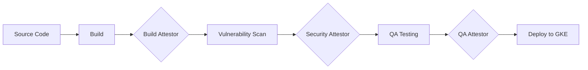

# How to Create Attestors for Binary Authorization Using KMS Keys

Author: [nawazdhandala](https://www.github.com/nawazdhandala)

Tags: GCP, Binary Authorization, Cloud KMS, Attestors, Container Security

Description: Learn how to create and manage attestors for Binary Authorization using Cloud KMS keys for cryptographic signing of container image attestations in Google Cloud.

---

In Binary Authorization, attestors are the gatekeepers. They are the entities that vouch for a container image by creating a cryptographic signature that says "this image is approved." Before GKE will admit an image, it checks that all required attestors have signed off on it.

Each attestor uses a cryptographic key to sign attestations. Cloud KMS is the natural choice for key management since it provides hardware-backed key storage, access controls, and audit logging. You do not have to manage key material yourself.

In this post, I will cover how to set up attestors with KMS keys, how to create different attestors for different pipeline stages, and how to manage the lifecycle of keys and attestors.

## Why Multiple Attestors?

A single attestor is fine for simple setups, but production environments typically need multiple attestors representing different approval gates:



Each attestor uses its own KMS key, and the Binary Authorization policy can require all of them before admitting an image.

## Prerequisites

- A GCP project with Binary Authorization and Container Analysis APIs enabled
- Cloud KMS API enabled
- Appropriate IAM permissions

```bash
# Enable all required APIs
gcloud services enable \
  binaryauthorization.googleapis.com \
  containeranalysis.googleapis.com \
  cloudkms.googleapis.com \
  --project=my-project-id
```

## Step 1: Create a KMS Keyring

Start by creating a keyring to organize your attestor keys.

```bash
# Create a keyring for binary authorization keys
gcloud kms keyrings create binauthz-keys \
  --location=global \
  --project=my-project-id
```

I use the `global` location for simplicity, but you can use a specific region if you have data residency requirements.

## Step 2: Create KMS Keys for Each Attestor

Create separate asymmetric signing keys for each attestor.

```bash
# Key for the build pipeline attestor
gcloud kms keys create build-signer \
  --location=global \
  --keyring=binauthz-keys \
  --purpose=asymmetric-signing \
  --default-algorithm=ec-sign-p256-sha256 \
  --project=my-project-id

# Key for the security scan attestor
gcloud kms keys create security-signer \
  --location=global \
  --keyring=binauthz-keys \
  --purpose=asymmetric-signing \
  --default-algorithm=ec-sign-p256-sha256 \
  --project=my-project-id

# Key for the QA attestor
gcloud kms keys create qa-signer \
  --location=global \
  --keyring=binauthz-keys \
  --purpose=asymmetric-signing \
  --default-algorithm=ec-sign-p256-sha256 \
  --project=my-project-id
```

The `ec-sign-p256-sha256` algorithm is recommended for attestation signing. It is fast, produces small signatures, and is widely supported.

## Step 3: Create Container Analysis Notes

Each attestor needs an associated Container Analysis note. The note serves as a metadata anchor for the attestation occurrences.

```bash
# Create a note for the build attestor
curl -X POST \
  -H "Authorization: Bearer $(gcloud auth print-access-token)" \
  -H "Content-Type: application/json" \
  -d '{
    "attestation": {
      "hint": {
        "humanReadableName": "Build Pipeline Verification"
      }
    }
  }' \
  "https://containeranalysis.googleapis.com/v1/projects/my-project-id/notes?noteId=build-note"

# Create a note for the security attestor
curl -X POST \
  -H "Authorization: Bearer $(gcloud auth print-access-token)" \
  -H "Content-Type: application/json" \
  -d '{
    "attestation": {
      "hint": {
        "humanReadableName": "Security Scan Verification"
      }
    }
  }' \
  "https://containeranalysis.googleapis.com/v1/projects/my-project-id/notes?noteId=security-note"

# Create a note for the QA attestor
curl -X POST \
  -H "Authorization: Bearer $(gcloud auth print-access-token)" \
  -H "Content-Type: application/json" \
  -d '{
    "attestation": {
      "hint": {
        "humanReadableName": "QA Approval Verification"
      }
    }
  }' \
  "https://containeranalysis.googleapis.com/v1/projects/my-project-id/notes?noteId=qa-note"
```

## Step 4: Create the Attestors

Now create the attestors and link them to their respective notes and keys.

```bash
# Create the build attestor
gcloud container binauthz attestors create build-attestor \
  --attestation-authority-note=build-note \
  --attestation-authority-note-project=my-project-id \
  --project=my-project-id

# Add the KMS key to the build attestor
gcloud container binauthz attestors public-keys add \
  --attestor=build-attestor \
  --keyversion-project=my-project-id \
  --keyversion-location=global \
  --keyversion-keyring=binauthz-keys \
  --keyversion-key=build-signer \
  --keyversion=1 \
  --project=my-project-id

# Create the security attestor
gcloud container binauthz attestors create security-attestor \
  --attestation-authority-note=security-note \
  --attestation-authority-note-project=my-project-id \
  --project=my-project-id

# Add the KMS key to the security attestor
gcloud container binauthz attestors public-keys add \
  --attestor=security-attestor \
  --keyversion-project=my-project-id \
  --keyversion-location=global \
  --keyversion-keyring=binauthz-keys \
  --keyversion-key=security-signer \
  --keyversion=1 \
  --project=my-project-id

# Create the QA attestor
gcloud container binauthz attestors create qa-attestor \
  --attestation-authority-note=qa-note \
  --attestation-authority-note-project=my-project-id \
  --project=my-project-id

# Add the KMS key to the QA attestor
gcloud container binauthz attestors public-keys add \
  --attestor=qa-attestor \
  --keyversion-project=my-project-id \
  --keyversion-location=global \
  --keyversion-keyring=binauthz-keys \
  --keyversion-key=qa-signer \
  --keyversion=1 \
  --project=my-project-id
```

## Step 5: Verify the Attestors

Check that everything was created correctly.

```bash
# List all attestors
gcloud container binauthz attestors list --project=my-project-id

# Describe a specific attestor to see its key configuration
gcloud container binauthz attestors describe build-attestor \
  --project=my-project-id
```

## Step 6: Update the Binary Authorization Policy

Configure your policy to require attestations from all three attestors.

```yaml
# policy.yaml - Require all three attestors
admissionWhitelistPatterns:
  - namePattern: gcr.io/google_containers/*
  - namePattern: k8s.gcr.io/**
  - namePattern: gke.gcr.io/**
defaultAdmissionRule:
  enforcementMode: ENFORCED_BLOCK_AND_AUDIT_LOG
  evaluationMode: REQUIRE_ATTESTATION
  requireAttestationsBy:
    - projects/my-project-id/attestors/build-attestor
    - projects/my-project-id/attestors/security-attestor
    - projects/my-project-id/attestors/qa-attestor
globalPolicyEvaluationMode: ENABLE
```

```bash
# Apply the policy
gcloud container binauthz policy import policy.yaml --project=my-project-id
```

## Step 7: Create Attestations in Your Pipeline

Here is how each stage of your pipeline creates its attestation.

```bash
# Get the image digest
IMAGE_DIGEST=$(gcloud container images describe \
  gcr.io/my-project-id/my-app:v1.0 \
  --format='value(image_summary.digest)')

IMAGE_URL="gcr.io/my-project-id/my-app@${IMAGE_DIGEST}"

# Build stage creates its attestation
gcloud container binauthz attestations sign-and-create \
  --artifact-url="${IMAGE_URL}" \
  --attestor=build-attestor \
  --attestor-project=my-project-id \
  --keyversion-project=my-project-id \
  --keyversion-location=global \
  --keyversion-keyring=binauthz-keys \
  --keyversion-key=build-signer \
  --keyversion=1 \
  --project=my-project-id

# Security scan stage creates its attestation (after scan passes)
gcloud container binauthz attestations sign-and-create \
  --artifact-url="${IMAGE_URL}" \
  --attestor=security-attestor \
  --attestor-project=my-project-id \
  --keyversion-project=my-project-id \
  --keyversion-location=global \
  --keyversion-keyring=binauthz-keys \
  --keyversion-key=security-signer \
  --keyversion=1 \
  --project=my-project-id

# QA stage creates its attestation (after tests pass)
gcloud container binauthz attestations sign-and-create \
  --artifact-url="${IMAGE_URL}" \
  --attestor=qa-attestor \
  --attestor-project=my-project-id \
  --keyversion-project=my-project-id \
  --keyversion-location=global \
  --keyversion-keyring=binauthz-keys \
  --keyversion-key=qa-signer \
  --keyversion=1 \
  --project=my-project-id
```

## Step 8: Verify Attestations Exist

Check that all attestations are in place for an image.

```bash
# List attestations for a specific image
gcloud container binauthz attestations list \
  --attestor=build-attestor \
  --attestor-project=my-project-id \
  --artifact-url="${IMAGE_URL}" \
  --project=my-project-id
```

## Step 9: Set Up IAM for Attestor Keys

Control who can sign attestations by restricting access to the KMS keys.

```bash
# Grant the CI/CD service account permission to use the build signing key
gcloud kms keys add-iam-policy-binding build-signer \
  --location=global \
  --keyring=binauthz-keys \
  --member="serviceAccount:ci-pipeline@my-project-id.iam.gserviceaccount.com" \
  --role="roles/cloudkms.signerVerifier" \
  --project=my-project-id

# Grant the security scanner permission to use the security signing key
gcloud kms keys add-iam-policy-binding security-signer \
  --location=global \
  --keyring=binauthz-keys \
  --member="serviceAccount:security-scanner@my-project-id.iam.gserviceaccount.com" \
  --role="roles/cloudkms.signerVerifier" \
  --project=my-project-id
```

## Key Rotation

KMS supports automatic key rotation. When a key is rotated, a new key version is created, but old versions remain valid for verification. You need to update the attestor to include the new key version.

```bash
# Rotate a KMS key (creates a new version)
gcloud kms keys update build-signer \
  --location=global \
  --keyring=binauthz-keys \
  --rotation-period=90d \
  --next-rotation-time=$(date -u -d "+1 day" +%Y-%m-%dT%H:%M:%SZ) \
  --project=my-project-id

# After rotation, add the new key version to the attestor
gcloud container binauthz attestors public-keys add \
  --attestor=build-attestor \
  --keyversion-project=my-project-id \
  --keyversion-location=global \
  --keyversion-keyring=binauthz-keys \
  --keyversion-key=build-signer \
  --keyversion=2 \
  --project=my-project-id
```

## Conclusion

Creating separate attestors with dedicated KMS keys for each pipeline stage gives you fine-grained control over your container supply chain. Each gate in your pipeline independently vouches for an image, and the Binary Authorization policy ensures all gates must pass before an image reaches production. The KMS integration means key material is never exposed, access is controlled through IAM, and every signing operation is logged. This setup takes more effort than a single attestor, but it provides the level of assurance that production environments demand.
