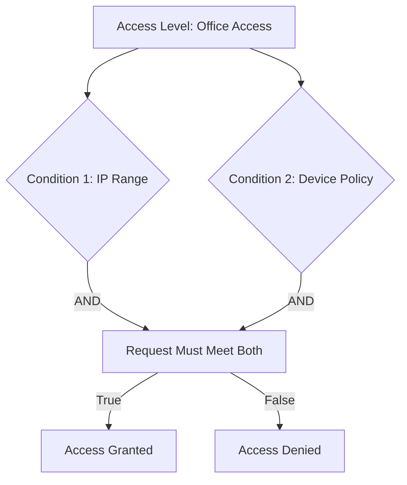

# How to Create Basic Access Levels in GCP Access Context Manager

Author: [nawazdhandala](https://www.github.com/nawazdhandala)

Tags: GCP, Access Context Manager, Access Levels, VPC Service Controls, Zero Trust

Description: Learn how to create basic access levels in GCP Access Context Manager to define conditions under which users and services can access resources protected by VPC Service Controls.

---

Access levels are the building blocks of VPC Service Controls. They define the conditions under which a request is considered "trusted" - things like coming from a known IP range, using a managed device, or meeting specific geographic criteria. Without access levels, a VPC Service Perimeter would block all access from outside the boundary, including your own developers.

Access Context Manager is the GCP service that manages these access levels. You define the conditions, and then reference the access levels in your perimeter configuration to allow matching traffic through.

In this guide, I will cover how to create the most common types of basic access levels.

## What Are Basic Access Levels?

A basic access level consists of one or more conditions. Each condition specifies criteria that a request must meet. Conditions within an access level can be combined with AND (all conditions must be met) or OR (any condition must be met).



## Prerequisites

- An organization-level GCP setup
- An access policy (created automatically when you set up VPC Service Controls)
- The `roles/accesscontextmanager.policyAdmin` role

```bash
# Get your access policy ID
ACCESS_POLICY_ID=$(gcloud access-context-manager policies list \
  --organization=ORGANIZATION_ID \
  --format="value(name)")
echo "Access Policy: $ACCESS_POLICY_ID"
```

## Creating an IP-Based Access Level

The most common access level type. It allows access from specific IP ranges.

```bash
# Create an access level for your office network
gcloud access-context-manager levels create office-network \
  --title="Office Network" \
  --basic-level-spec=office-spec.yaml \
  --policy=$ACCESS_POLICY_ID
```

Create the `office-spec.yaml` file:

```yaml
# office-spec.yaml - Allow access from office IP ranges
conditions:
  - ipSubnetworks:
      - 203.0.113.0/24      # Main office
      - 198.51.100.0/24     # Branch office
      - 192.0.2.0/24        # VPN endpoint
```

## Creating a Multi-Condition Access Level

Combine IP range with other conditions.

```yaml
# secure-access-spec.yaml - Require both corporate IP and managed device
conditions:
  - ipSubnetworks:
      - 203.0.113.0/24
    devicePolicy:
      requireScreenlock: true
      osConstraints:
        - osType: DESKTOP_CHROME_OS
          requireVerifiedChromeOs: true
        - osType: DESKTOP_WINDOWS
        - osType: DESKTOP_MAC
```

```bash
# Create the access level
gcloud access-context-manager levels create secure-access \
  --title="Secure Corporate Access" \
  --basic-level-spec=secure-access-spec.yaml \
  --policy=$ACCESS_POLICY_ID
```

## Creating an Access Level with OR Conditions

If you want to allow access from either one condition OR another (not requiring both), use multiple conditions in the array.

```yaml
# flexible-access-spec.yaml - Allow access from office OR VPN
# Each condition is evaluated independently (OR logic)
conditions:
  - ipSubnetworks:
      - 203.0.113.0/24      # Office network
  - ipSubnetworks:
      - 10.0.0.0/8          # VPN network
```

When you have multiple conditions at the top level, they are combined with OR logic. A request only needs to match one condition.

```bash
# Create the access level
gcloud access-context-manager levels create flexible-access \
  --title="Office or VPN Access" \
  --basic-level-spec=flexible-access-spec.yaml \
  --policy=$ACCESS_POLICY_ID
```

## Creating a Region-Based Access Level

Restrict access to specific geographic regions.

```yaml
# region-spec.yaml - Allow access from specific countries
conditions:
  - regions:
      - US
      - CA
      - GB
```

```bash
# Create the access level
gcloud access-context-manager levels create allowed-regions \
  --title="Allowed Regions" \
  --basic-level-spec=region-spec.yaml \
  --policy=$ACCESS_POLICY_ID
```

## Creating an Access Level for Service Accounts

You can create access levels that match specific service accounts by combining them with principal conditions.

```yaml
# sa-spec.yaml - Allow specific service accounts
conditions:
  - members:
      - serviceAccount:trusted-pipeline@my-project.iam.gserviceaccount.com
      - serviceAccount:monitoring-agent@ops-project.iam.gserviceaccount.com
```

```bash
# Create the access level
gcloud access-context-manager levels create trusted-services \
  --title="Trusted Service Accounts" \
  --basic-level-spec=sa-spec.yaml \
  --policy=$ACCESS_POLICY_ID
```

## Combining Access Levels

You can create access levels that depend on other access levels. This lets you build hierarchical policies.

```yaml
# combined-spec.yaml - Require both office network AND endpoint verification
conditions:
  - requiredAccessLevels:
      - accessPolicies/POLICY_ID/accessLevels/office-network
      - accessPolicies/POLICY_ID/accessLevels/endpoint-verified
```

This condition requires the request to satisfy both the `office-network` and `endpoint-verified` access levels simultaneously.

```bash
# Create the combined access level
gcloud access-context-manager levels create full-trust \
  --title="Full Trust - Network and Device" \
  --basic-level-spec=combined-spec.yaml \
  --policy=$ACCESS_POLICY_ID
```

## Using Access Levels in VPC Service Controls

Once created, reference access levels in your perimeter configuration.

```bash
# Add an access level to a perimeter
gcloud access-context-manager perimeters update my-perimeter \
  --add-access-levels="accessPolicies/$ACCESS_POLICY_ID/accessLevels/office-network" \
  --policy=$ACCESS_POLICY_ID
```

Or in ingress rules:

```yaml
# ingress-with-access-level.yaml
- ingressFrom:
    identityType: ANY_USER_ACCOUNT
    sources:
      - accessLevel: accessPolicies/POLICY_ID/accessLevels/office-network
  ingressTo:
    operations:
      - serviceName: "*"
        methodSelectors:
          - method: "*"
    resources:
      - "*"
```

## Listing and Managing Access Levels

```bash
# List all access levels
gcloud access-context-manager levels list \
  --policy=$ACCESS_POLICY_ID \
  --format="table(name, title)"

# Describe a specific access level
gcloud access-context-manager levels describe office-network \
  --policy=$ACCESS_POLICY_ID \
  --format=json

# Update an access level
gcloud access-context-manager levels update office-network \
  --basic-level-spec=updated-spec.yaml \
  --policy=$ACCESS_POLICY_ID

# Delete an access level
gcloud access-context-manager levels delete old-access-level \
  --policy=$ACCESS_POLICY_ID
```

## Testing Access Levels

Access levels cannot be tested in isolation. You test them by using them in a perimeter (preferably in dry-run mode) and checking audit logs.

```bash
# Check if requests from a specific IP are matching an access level
gcloud logging read \
  'protoPayload.metadata.@type="type.googleapis.com/google.cloud.audit.VpcServiceControlAuditMetadata" AND protoPayload.metadata.accessLevels!=""' \
  --limit=10 \
  --format="table(timestamp, protoPayload.authenticationInfo.principalEmail, protoPayload.metadata.accessLevels)" \
  --project=my-project-id
```

## Common Access Level Patterns

Here are access levels I commonly create for organizations:

1. **Corporate Network**: IP ranges for offices and VPN endpoints
2. **CI/CD Pipeline**: Service accounts used by build pipelines
3. **On-Call Access**: Broader access during incident response (combined with specific user identities)
4. **Vendor Access**: IP ranges and identities for trusted vendors
5. **Cloud Shell**: Google's Cloud Shell IP ranges for developer access

## Best Practices

1. **Name access levels descriptively.** Use names like `office-us-east`, `vpn-europe`, or `cicd-pipeline` instead of generic names.

2. **Keep IP ranges updated.** When your office changes ISPs or your VPN ranges change, update the access levels promptly.

3. **Use the least permissive access level possible.** Combine IP ranges with device policies for stronger assurance.

4. **Document each access level.** The title field is limited, so keep a separate document explaining what each access level is for and who it serves.

5. **Audit access levels quarterly.** Remove ones that are no longer needed, and verify that IP ranges are still accurate.

## Conclusion

Basic access levels in Access Context Manager are the foundation of context-aware access control in Google Cloud. They let you define what "trusted" means for your organization - whether that is coming from a corporate IP, using a managed device, or being a specific service account. Start with simple IP-based access levels for your primary office and VPN, then add complexity as your security requirements evolve. The key is making sure every access level has a clear purpose and is kept up to date.
