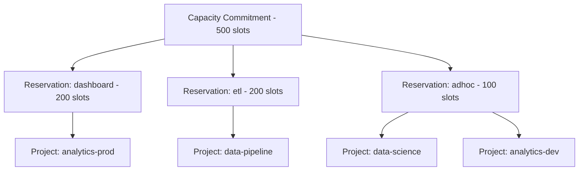

# How to Create BigQuery Slot Reservations and Assign Projects to Them

Author: [nawazdhandala](https://www.github.com/nawazdhandala)

Tags: GCP, BigQuery, Slots, Reservations, Resource Management, Cost Optimization

Description: Learn how to create BigQuery slot reservations and assign projects to them for predictable query performance and cost management.

---

If you are running BigQuery at any reasonable scale, you have probably hit the limits of on-demand pricing. Either the per-query costs are getting unpredictable, or you need guaranteed compute capacity for critical workloads. BigQuery slot reservations let you purchase dedicated compute capacity and allocate it across your projects and workloads. This gives you predictable costs and the ability to prioritize important queries over less critical ones.

In this post, I will walk through the full process of creating slot commitments, building reservations, and assigning projects to them.

## How Slots, Commitments, and Reservations Relate

Before diving into the commands, it helps to understand the hierarchy. A capacity commitment is a purchase of slots at a specific edition and commitment plan. Think of it as buying compute capacity. A reservation is a named pool of slots drawn from your commitments. You can have multiple reservations carved from the same commitment. An assignment maps a project, folder, or organization to a reservation, directing its jobs to use those slots.

Here is the flow: you buy slots through a commitment, allocate them to reservations, and then assign projects to those reservations.



## Step 1 - Create a Capacity Commitment

First, purchase the total number of slots you need.

```bash
# Create a 500-slot Enterprise commitment with annual pricing
gcloud bq reservations create-capacity-commitment \
  --project=my-admin-project \
  --location=us-central1 \
  --edition=ENTERPRISE \
  --slots=500 \
  --commitment-plan=ANNUAL
```

Annual commitments give you the best per-slot pricing, but you are locked in for a year. If you are not sure about the right size, start with a monthly commitment.

```bash
# Start with a monthly commitment for flexibility
gcloud bq reservations create-capacity-commitment \
  --project=my-admin-project \
  --location=us-central1 \
  --edition=ENTERPRISE \
  --slots=500 \
  --commitment-plan=MONTHLY
```

You can have multiple commitments, and slots from all commitments in the same edition are pooled together. So if you bought 300 slots last month and need 200 more, just create another commitment.

```bash
# Add another 200 slots on top of existing commitments
gcloud bq reservations create-capacity-commitment \
  --project=my-admin-project \
  --location=us-central1 \
  --edition=ENTERPRISE \
  --slots=200 \
  --commitment-plan=MONTHLY
```

## Step 2 - Create Reservations

Now carve up your total slot pool into named reservations for different workloads.

```bash
# Create a reservation for dashboard/BI queries
gcloud bq reservations create dashboard-queries \
  --project=my-admin-project \
  --location=us-central1 \
  --slots=200 \
  --edition=ENTERPRISE

# Create a reservation for ETL and pipeline jobs
gcloud bq reservations create etl-pipelines \
  --project=my-admin-project \
  --location=us-central1 \
  --slots=200 \
  --edition=ENTERPRISE

# Create a reservation for ad-hoc analysis with autoscaling
gcloud bq reservations create adhoc-analysis \
  --project=my-admin-project \
  --location=us-central1 \
  --slots=100 \
  --edition=ENTERPRISE \
  --autoscale-max-slots=200
```

The total slots across all reservations should not exceed your total committed slots (though autoscaling can go beyond that at flex rates). In this example, 200 + 200 + 100 = 500, which matches the commitment.

You can also use the Python client for more programmatic control.

```python
from google.cloud import bigquery_reservation_v1

client = bigquery_reservation_v1.ReservationServiceClient()
parent = "projects/my-admin-project/locations/us-central1"

# Create the dashboard reservation
dashboard_reservation = bigquery_reservation_v1.Reservation(
    slot_capacity=200,
    edition=bigquery_reservation_v1.Edition.ENTERPRISE,
)

response = client.create_reservation(
    parent=parent,
    reservation_id="dashboard-queries",
    reservation=dashboard_reservation,
)
print(f"Created reservation: {response.name}")
```

## Step 3 - Assign Projects to Reservations

With reservations created, assign your projects to them.

```bash
# Assign the analytics production project to the dashboard reservation
gcloud bq reservations assignments create \
  --project=my-admin-project \
  --location=us-central1 \
  --reservation=dashboard-queries \
  --assignee=projects/analytics-prod \
  --job-type=QUERY

# Assign the data pipeline project to the ETL reservation
gcloud bq reservations assignments create \
  --project=my-admin-project \
  --location=us-central1 \
  --reservation=etl-pipelines \
  --assignee=projects/data-pipeline \
  --job-type=QUERY

# Assign the data pipeline project's LOAD jobs separately
gcloud bq reservations assignments create \
  --project=my-admin-project \
  --location=us-central1 \
  --reservation=etl-pipelines \
  --assignee=projects/data-pipeline \
  --job-type=PIPELINE

# Assign data science and dev projects to ad-hoc reservation
gcloud bq reservations assignments create \
  --project=my-admin-project \
  --location=us-central1 \
  --reservation=adhoc-analysis \
  --assignee=projects/data-science \
  --job-type=QUERY

gcloud bq reservations assignments create \
  --project=my-admin-project \
  --location=us-central1 \
  --reservation=adhoc-analysis \
  --assignee=projects/analytics-dev \
  --job-type=QUERY
```

Notice that you can assign different job types to different reservations for the same project. This lets you handle QUERY, PIPELINE (load), and ML_EXTERNAL jobs with different capacity pools.

## Understanding Assignment Inheritance

Assignments follow the GCP resource hierarchy. An assignment at the organization level applies to all projects in that organization. An assignment at the folder level applies to all projects in that folder. A project-level assignment overrides folder and organization-level assignments.

```bash
# Assign an entire folder to a reservation
# All projects in this folder will use this reservation
gcloud bq reservations assignments create \
  --project=my-admin-project \
  --location=us-central1 \
  --reservation=adhoc-analysis \
  --assignee=folders/123456789 \
  --job-type=QUERY
```

This is useful for setting a default reservation for all projects and then overriding specific projects that need different capacity.

## Listing and Managing Reservations

Check the current state of your reservations and assignments.

```bash
# List all capacity commitments
gcloud bq reservations list-capacity-commitments \
  --project=my-admin-project \
  --location=us-central1

# List all reservations
gcloud bq reservations list \
  --project=my-admin-project \
  --location=us-central1

# List all assignments for a specific reservation
gcloud bq reservations assignments list \
  --project=my-admin-project \
  --location=us-central1 \
  --reservation=dashboard-queries
```

## Updating Slot Allocations

As your workload changes, you can redistribute slots between reservations without buying new capacity.

```bash
# Increase dashboard reservation from 200 to 250 slots
gcloud bq reservations update dashboard-queries \
  --project=my-admin-project \
  --location=us-central1 \
  --slots=250

# Decrease ETL reservation to compensate
gcloud bq reservations update etl-pipelines \
  --project=my-admin-project \
  --location=us-central1 \
  --slots=150
```

You can also enable idle slot sharing so that unused slots in one reservation can be temporarily used by other reservations.

```bash
# Enable idle slot sharing by setting ignore_idle_slots to false (default)
gcloud bq reservations update etl-pipelines \
  --project=my-admin-project \
  --location=us-central1 \
  --ignore-idle-slots=false
```

When idle slot sharing is enabled, if the ETL reservation is not using all 150 of its slots, the unused capacity can be borrowed by the dashboard or ad-hoc reservations. When ETL jobs ramp up, the slots are reclaimed.

## Monitoring Slot Usage Per Reservation

Track how effectively each reservation is using its allocated slots.

```sql
-- Slot utilization by reservation over the last 24 hours
SELECT
  reservation_id,
  TIMESTAMP_TRUNC(period_start, HOUR) AS hour,
  -- Average slots consumed
  AVG(period_slot_ms / 1000) AS avg_slots_used,
  -- Peak slots consumed
  MAX(period_slot_ms / 1000) AS peak_slots_used,
  -- Number of concurrent jobs
  COUNT(DISTINCT job_id) AS job_count
FROM
  `region-us-central1`.INFORMATION_SCHEMA.JOBS_TIMELINE
WHERE
  period_start > TIMESTAMP_SUB(CURRENT_TIMESTAMP(), INTERVAL 24 HOUR)
  AND reservation_id IS NOT NULL
GROUP BY
  reservation_id, hour
ORDER BY
  reservation_id, hour;
```

## Removing Assignments and Reservations

If you need to clean up, remove assignments first, then reservations, then commitments.

```bash
# Remove a project assignment (get the assignment ID first)
gcloud bq reservations assignments list \
  --project=my-admin-project \
  --location=us-central1 \
  --reservation=adhoc-analysis

# Delete the assignment using its ID
gcloud bq reservations assignments delete ASSIGNMENT_ID \
  --project=my-admin-project \
  --location=us-central1 \
  --reservation=adhoc-analysis

# Delete the reservation (must have no assignments)
gcloud bq reservations delete adhoc-analysis \
  --project=my-admin-project \
  --location=us-central1
```

Capacity commitments cannot be deleted before their commitment period ends (annual commitments last a year, monthly commitments last a month). Plan accordingly.

## Wrapping Up

BigQuery slot reservations give you fine-grained control over compute allocation across your organization. The pattern of creating workload-specific reservations and assigning projects to them ensures that critical workloads always have guaranteed capacity while less critical work can use whatever is left over. Combined with autoscaling and idle slot sharing, this gives you both the predictability of reserved capacity and the flexibility to handle variable demand. Start by analyzing your current slot utilization patterns, then design your reservation topology to match your workload priorities.
