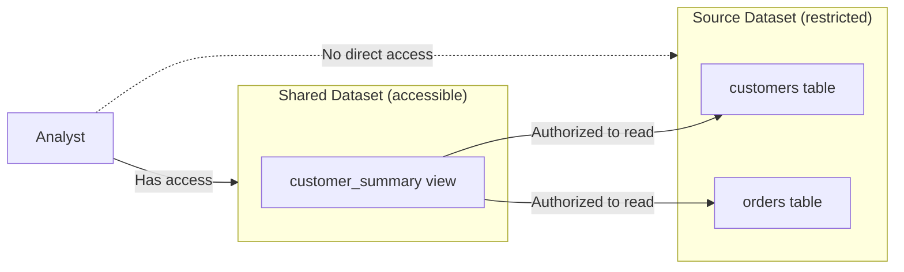

# How to Create BigQuery Views and Authorized Views for Secure Data Sharing

Author: [nawazdhandala](https://www.github.com/nawazdhandala)

Tags: GCP, BigQuery, Views, Authorized Views, Data Sharing, Security

Description: Learn how to create BigQuery views and authorized views to securely share data across datasets and projects without exposing underlying tables directly.

---

Sharing data in BigQuery often means giving someone access to an entire dataset, which includes all its tables. But what if you only want to share a subset of columns, filtered rows, or aggregated data? That is where views come in, and specifically authorized views.

An authorized view is a view that can access data in a source dataset even though the user querying the view does not have direct access to the source dataset. This lets you expose exactly the data you want to share without giving anyone access to the raw tables.

## Regular Views vs Authorized Views

A regular view is just a saved SQL query. When someone queries it, BigQuery runs the underlying SQL. The user needs access to both the view and the underlying tables.

An authorized view is different. You grant the view itself access to the source dataset. Users only need access to the dataset containing the view, not the source dataset. The view acts as a controlled window into data they could not otherwise see.



## Creating a Regular View

Start with a basic view. This is straightforward SQL.

```sql
-- Create a view that shows order summaries without sensitive details
CREATE VIEW `my-project-id.analytics.order_summary` AS
SELECT
    order_id,
    customer_id,
    order_date,
    total_amount,
    status
FROM
    `my-project-id.raw_data.orders`
WHERE
    order_date >= '2025-01-01';
```

Or using the `bq` command line:

```bash
# Create a view using bq
bq mk --view \
    "SELECT order_id, customer_id, order_date, total_amount, status FROM \`my-project-id.raw_data.orders\` WHERE order_date >= '2025-01-01'" \
    my-project-id:analytics.order_summary
```

## Creating an Authorized View

Authorized views require a few steps: create the view, then authorize it in the source dataset.

### Step 1: Create the View

Create a view in a separate dataset from the source tables.

```sql
-- Create a view in the shared dataset that queries the restricted source dataset
CREATE VIEW `my-project-id.shared_analytics.customer_metrics` AS
SELECT
    c.customer_id,
    c.company_name,
    c.industry,
    COUNT(o.order_id) AS total_orders,
    SUM(o.total_amount) AS total_revenue,
    MAX(o.order_date) AS last_order_date
FROM
    `my-project-id.restricted_data.customers` c
LEFT JOIN
    `my-project-id.restricted_data.orders` o
    ON c.customer_id = o.customer_id
GROUP BY
    c.customer_id, c.company_name, c.industry;
```

### Step 2: Authorize the View in the Source Dataset

Now tell the source dataset that this view is authorized to read its data.

```bash
# Authorize the view to access the source dataset
bq update --dataset \
    --access_entry='{"view":{"projectId":"my-project-id","datasetId":"shared_analytics","tableId":"customer_metrics"}}' \
    my-project-id:restricted_data
```

### Step 3: Grant Users Access to the Shared Dataset

Users need access to the dataset containing the view, but not the source dataset.

```bash
# Grant analysts read access to the shared dataset
bq update --dataset \
    --access_entry='{"role":"READER","groupByEmail":"analysts@company.com"}' \
    my-project-id:shared_analytics
```

Now analysts can query `shared_analytics.customer_metrics` and get results, even though they have no access to `restricted_data.customers` or `restricted_data.orders`.

## Practical Example: PII Masking

One of the most common uses for authorized views is masking personally identifiable information.

```sql
-- Create a view that masks PII fields
CREATE VIEW `my-project-id.shared_data.masked_customers` AS
SELECT
    customer_id,
    -- Mask email: show domain only
    CONCAT('***@', SPLIT(email, '@')[OFFSET(1)]) AS email_masked,
    -- Mask phone: show last 4 digits
    CONCAT('***-***-', RIGHT(phone_number, 4)) AS phone_masked,
    -- Keep non-sensitive fields as-is
    company_name,
    industry,
    country,
    created_date
FROM
    `my-project-id.sensitive_data.customers`;
```

Then authorize and share:

```bash
# Authorize the view
bq update --dataset \
    --access_entry='{"view":{"projectId":"my-project-id","datasetId":"shared_data","tableId":"masked_customers"}}' \
    my-project-id:sensitive_data

# Grant access to the shared dataset
bq update --dataset \
    --access_entry='{"role":"READER","groupByEmail":"support-team@company.com"}' \
    my-project-id:shared_data
```

The support team can look up customers but never sees full email addresses or phone numbers.

## Cross-Project Authorized Views

Authorized views work across projects too. Create a view in project B that queries data in project A.

```sql
-- View in project-b that queries data in project-a
CREATE VIEW `project-b.shared.cross_project_metrics` AS
SELECT
    region,
    COUNT(*) AS order_count,
    SUM(revenue) AS total_revenue
FROM
    `project-a.production_data.orders`
GROUP BY region;
```

Authorize the view in project A:

```bash
# In project-a, authorize the view from project-b
bq update --dataset \
    --access_entry='{"view":{"projectId":"project-b","datasetId":"shared","tableId":"cross_project_metrics"}}' \
    project-a:production_data
```

## Terraform Configuration

```hcl
# Source dataset with restricted access
resource "google_bigquery_dataset" "restricted" {
  dataset_id = "restricted_data"
  location   = "US"

  # Only data engineers have direct access
  access {
    role          = "OWNER"
    special_group = "projectOwners"
  }

  access {
    role          = "WRITER"
    user_by_email = "etl@my-project.iam.gserviceaccount.com"
  }

  # Authorize the view to read this dataset
  access {
    view {
      project_id = var.project_id
      dataset_id = google_bigquery_dataset.shared.dataset_id
      table_id   = google_bigquery_table.customer_view.table_id
    }
  }
}

# Shared dataset accessible to analysts
resource "google_bigquery_dataset" "shared" {
  dataset_id = "shared_analytics"
  location   = "US"

  access {
    role          = "OWNER"
    special_group = "projectOwners"
  }

  access {
    role           = "READER"
    group_by_email = "analysts@company.com"
  }
}

# The authorized view
resource "google_bigquery_table" "customer_view" {
  dataset_id = google_bigquery_dataset.shared.dataset_id
  table_id   = "customer_metrics"

  view {
    query          = <<-SQL
      SELECT
        customer_id,
        company_name,
        industry,
        order_count,
        total_revenue
      FROM `${var.project_id}.restricted_data.customer_summary`
    SQL
    use_legacy_sql = false
  }
}
```

## Managing Multiple Authorized Views

When you have many views that need authorization, keep them organized.

```bash
# List all authorized views for a dataset
bq show --format=prettyjson my-project-id:restricted_data | python3 -c "
import json, sys
data = json.load(sys.stdin)
for entry in data.get('access', []):
    if 'view' in entry:
        view = entry['view']
        print(f\"{view['projectId']}.{view['datasetId']}.{view['tableId']}\")
"
```

## Removing an Authorized View

To revoke a view's authorization:

```bash
# Remove the authorized view entry from the dataset
# First, get the current access list, edit it, and reapply
bq show --format=prettyjson my-project-id:restricted_data > /tmp/dataset.json
# Edit /tmp/dataset.json to remove the view entry
# Then reapply with bq update
```

Unfortunately, `bq` does not have a direct "remove access entry" command. You need to get the full access list, remove the entry, and reapply. Terraform handles this much more cleanly.

## Views with Parameters Using SQL Functions

For reusable filtered views, combine views with table functions.

```sql
-- Create a table function that acts as a parameterized view
CREATE TABLE FUNCTION `my-project-id.shared_analytics.orders_by_region`(region_filter STRING)
AS
SELECT
    order_id,
    customer_id,
    order_date,
    total_amount
FROM
    `my-project-id.restricted_data.orders`
WHERE
    region = region_filter;
```

Users can call it with a parameter:

```sql
-- Query the parameterized view
SELECT * FROM `my-project-id.shared_analytics.orders_by_region`('US');
```

## Common Pitfalls

**View and source in the same dataset**: An authorized view must be in a different dataset than the tables it queries. If they are in the same dataset, the view does not need authorization - regular access suffices.

**Forgetting to authorize after creating the view**: Creating the view is not enough. You must explicitly add it as an authorized view in the source dataset.

**Circular authorization**: Dataset A authorizes a view in dataset B, and dataset B authorizes a view in dataset A. This works but can be confusing to manage.

**View permissions are not column-level**: An authorized view either has access to the entire source dataset or not. Use the view's SQL to control which columns are exposed.

## Summary

Authorized views are the standard way to share BigQuery data securely across teams and projects. Create the view in a shared dataset, authorize it in the source dataset, and grant users access to the shared dataset only. This gives you complete control over what data is exposed - you can filter rows, mask columns, aggregate data, and join tables, all while keeping the underlying data inaccessible to end users. For teams dealing with sensitive data, authorized views are essential.
