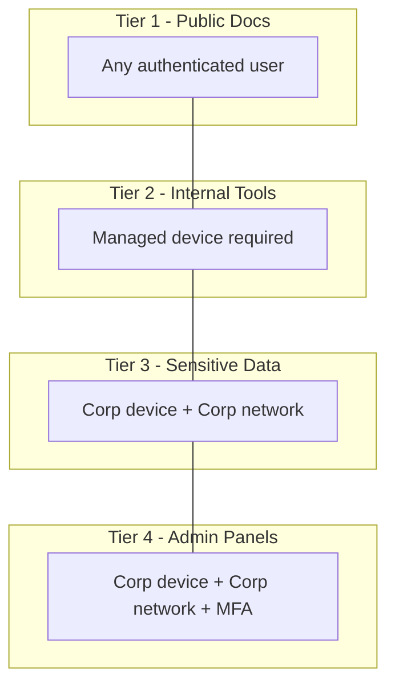

# How to Create Context-Aware Access Policies for BeyondCorp Enterprise

Author: [nawazdhandala](https://www.github.com/nawazdhandala)

Tags: GCP, BeyondCorp, Access Context Manager, Zero Trust, Security

Description: Learn how to create context-aware access policies using Access Context Manager for BeyondCorp Enterprise to enforce conditional access based on identity, device, and network.

---

Context-aware access is the core mechanism that makes BeyondCorp Enterprise more than just identity verification. Instead of a simple "is this user allowed?" check, context-aware policies evaluate multiple signals: who the user is, what device they are using, where they are connecting from, and what time it is. Only when all conditions are satisfied does access get granted.

This guide covers creating, combining, and applying context-aware access policies using Access Context Manager.

## Understanding Access Context Manager Components

Access Context Manager has three main building blocks:

- **Access Policy**: The top-level container. Most organizations have one policy tied to their organization node.
- **Access Levels**: Named conditions that evaluate to true or false. Think of them as reusable security checks.
- **Service Perimeters**: Boundaries around GCP services that restrict data movement (part of VPC Service Controls, separate from BeyondCorp).

For BeyondCorp, we focus on access levels and how they apply to IAP-protected resources.

## Prerequisites

- Organization-level access (Access Context Manager operates at the org level)
- An existing access policy for your organization
- BeyondCorp Enterprise license for advanced features
- Endpoint Verification deployed for device-based policies

```bash
# Enable the required API
gcloud services enable accesscontextmanager.googleapis.com --project=my-project-id

# Find your organization's access policy
gcloud access-context-manager policies list --organization=ORG_ID
```

If no policy exists, create one.

```bash
# Create an access policy for your organization
gcloud access-context-manager policies create \
  --organization=ORG_ID \
  --title="Organization Access Policy"
```

## Creating IP-Based Access Levels

The simplest access level is network-based. Allow access only from specific IP ranges.

```yaml
# corp-network-spec.yaml
# Allow access from corporate office IP ranges
- ipSubnetworks:
    - "203.0.113.0/24"
    - "198.51.100.0/24"
    - "192.0.2.0/24"
```

```bash
# Create the access level
gcloud access-context-manager levels create corp-network \
  --title="Corporate Network" \
  --basic-level-spec=corp-network-spec.yaml \
  --policy=POLICY_NUMBER
```

## Creating Device-Based Access Levels

Device policies check the security posture of the connecting device.

```yaml
# managed-device-spec.yaml
# Require an encrypted device with screen lock enabled
- devicePolicy:
    requireScreenlock: true
    allowedEncryptionStatuses:
      - ENCRYPTED
    osConstraints:
      - osType: DESKTOP_MAC
        minimumVersion: "13.0.0"
      - osType: DESKTOP_WINDOWS
        minimumVersion: "10.0.19045"
      - osType: DESKTOP_CHROME_OS
```

```bash
# Create the device-based access level
gcloud access-context-manager levels create managed-device \
  --title="Managed Encrypted Device" \
  --basic-level-spec=managed-device-spec.yaml \
  --policy=POLICY_NUMBER
```

You can also require company-owned devices specifically.

```yaml
# corp-owned-spec.yaml
# Only allow company-owned, fully managed devices
- devicePolicy:
    requireScreenlock: true
    requireCorpOwned: true
    allowedEncryptionStatuses:
      - ENCRYPTED
    allowedDeviceManagementLevels:
      - ADVANCED
```

## Creating Geographic Access Levels

Restrict access to specific geographic regions.

```yaml
# allowed-regions-spec.yaml
# Allow access only from the US and Canada
- regions:
    - "US"
    - "CA"
```

```bash
# Create the geographic access level
gcloud access-context-manager levels create allowed-regions \
  --title="US and Canada Only" \
  --basic-level-spec=allowed-regions-spec.yaml \
  --policy=POLICY_NUMBER
```

## Combining Conditions with AND Logic

A single access level with multiple conditions uses AND logic by default. All conditions must be true.

```yaml
# strict-access-spec.yaml
# Requires BOTH corporate network AND managed device (AND logic)
- ipSubnetworks:
    - "203.0.113.0/24"
  devicePolicy:
    requireScreenlock: true
    allowedEncryptionStatuses:
      - ENCRYPTED
  regions:
    - "US"
```

## Combining Conditions with OR Logic

For OR logic between different condition sets, use multiple entries in the spec.

```yaml
# flexible-access-spec.yaml
# Allow access from corporate network OR from a managed device (OR logic)
- ipSubnetworks:
    - "203.0.113.0/24"
- devicePolicy:
    requireScreenlock: true
    requireCorpOwned: true
    allowedEncryptionStatuses:
      - ENCRYPTED
```

When creating the access level with OR logic, set the combining function.

```bash
# Create an access level with OR combining logic
gcloud access-context-manager levels create flexible-access \
  --title="Corp Network OR Managed Device" \
  --basic-level-spec=flexible-access-spec.yaml \
  --combine-function=OR \
  --policy=POLICY_NUMBER
```

## Creating Custom Access Levels with CEL

For complex logic that basic access levels cannot express, use Custom Access Levels with Common Expression Language (CEL).

```bash
# Create a custom access level using CEL
gcloud access-context-manager levels create custom-time-based \
  --title="Business Hours from Corporate Network" \
  --custom-level-spec=custom-spec.yaml \
  --policy=POLICY_NUMBER
```

```yaml
# custom-spec.yaml
# Allow access during business hours from corporate network,
# or anytime from managed devices
expression: |
  (
    request.time.getHours("America/New_York") >= 8 &&
    request.time.getHours("America/New_York") <= 18 &&
    inIpRange(origin.ip, ["203.0.113.0/24"])
  ) || (
    device.encryption_status == DeviceEncryptionStatus.ENCRYPTED &&
    device.is_corp_owned_device
  )
```

CEL gives you access to:
- `origin.ip` - The source IP address
- `request.time` - The timestamp of the request
- `device.*` - Device attributes from Endpoint Verification
- `levels.*` - Other access levels (for nesting)

## Nesting Access Levels

You can reference other access levels within a custom CEL expression, building hierarchical policies.

```yaml
# premium-access-spec.yaml
# Requires both the managed-device level AND the corp-network level
expression: |
  "accessPolicies/POLICY_NUMBER/accessLevels/managed-device" in request.auth.access_levels &&
  "accessPolicies/POLICY_NUMBER/accessLevels/corp-network" in request.auth.access_levels
```

## Applying Access Levels to IAP Resources

Once you have your access levels defined, bind them to IAP-protected resources.

```bash
# Apply an access level as a condition on an IAP binding
gcloud iap web add-iam-policy-binding \
  --resource-type=backend-services \
  --service=my-web-app \
  --member="group:developers@example.com" \
  --role="roles/iap.httpsResourceAccessor" \
  --condition="expression=\"accessPolicies/POLICY_NUMBER/accessLevels/managed-device\" in request.auth.access_levels,title=Require Managed Device" \
  --project=my-project-id
```

You can create different access bindings for different user groups.

```bash
# Admins need managed device + corp network
gcloud iap web add-iam-policy-binding \
  --resource-type=backend-services \
  --service=my-admin-panel \
  --member="group:admins@example.com" \
  --role="roles/iap.httpsResourceAccessor" \
  --condition="expression=\"accessPolicies/POLICY_NUMBER/accessLevels/strict-access\" in request.auth.access_levels,title=Strict Access for Admins" \
  --project=my-project-id

# Regular users just need a managed device
gcloud iap web add-iam-policy-binding \
  --resource-type=backend-services \
  --service=my-web-app \
  --member="group:all-staff@example.com" \
  --role="roles/iap.httpsResourceAccessor" \
  --condition="expression=\"accessPolicies/POLICY_NUMBER/accessLevels/managed-device\" in request.auth.access_levels,title=Require Managed Device" \
  --project=my-project-id
```

## Testing Access Levels

Before applying access levels to production resources, test them.

```bash
# List all access levels in your policy
gcloud access-context-manager levels list --policy=POLICY_NUMBER

# Describe a specific access level to verify its configuration
gcloud access-context-manager levels describe managed-device \
  --policy=POLICY_NUMBER

# Test an access level evaluation (dry run)
gcloud access-context-manager levels test-iam-permissions \
  --policy=POLICY_NUMBER
```

## Tiered Access Strategy

A common pattern is to create tiers of access based on application sensitivity.



Create access levels for each tier and bind them to the appropriate applications.

## Monitoring Access Level Evaluations

Track how access levels are being evaluated in production.

```bash
# View access level evaluation logs
gcloud logging read \
  'resource.type="audited_resource" AND
   protoPayload.serviceName="iap.googleapis.com" AND
   protoPayload.methodName="AuthorizeUser"' \
  --project=my-project-id \
  --limit=20 \
  --format="table(timestamp,protoPayload.authenticationInfo.principalEmail,protoPayload.authorizationInfo[0].granted)"
```

## Summary

Context-aware access policies are what make BeyondCorp Enterprise genuinely useful. By combining identity, device posture, network location, and time-based conditions, you can create nuanced access controls that adapt to the risk level of each request. Start with simple IP-based or device-based levels, then layer in complexity with CEL expressions and nested levels as your needs grow. The tiered access pattern works well for organizations with different sensitivity levels across their applications.
