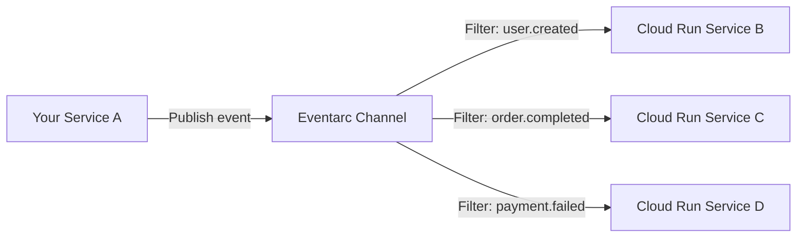

# How to Create Custom Events and Channels in Eventarc for Application-Level Events

Author: [nawazdhandala](https://www.github.com/nawazdhandala)

Tags: GCP, Eventarc, Custom Events, Event-Driven, Cloud Run

Description: Learn how to create custom event types and channels in Google Cloud Eventarc to publish and route application-level events between your own services.

---

Eventarc is not just for Google Cloud service events. You can define your own custom event types and use Eventarc channels to publish and route events between your own application services. This gives you a managed event bus for your application without having to build routing, delivery, and retry logic yourself.

In this post, I will show you how to create custom events, set up channels, publish events from your application, and create triggers that route those events to Cloud Run services.

## Custom Events vs. Google Cloud Events

Google Cloud events (like Cloud Storage or Pub/Sub events) are generated by Google Cloud services. Custom events are generated by your application code. Both flow through Eventarc, but custom events use a different mechanism:

- **Google Cloud events**: Triggered automatically by service activity
- **Custom events**: Published explicitly by your code to an Eventarc channel

A channel is an intermediary that receives your custom events and routes them to triggers based on event type filtering.



## Prerequisites

```bash
# Enable required APIs
gcloud services enable \
  run.googleapis.com \
  eventarc.googleapis.com \
  eventarcpublishing.googleapis.com
```

## Step 1: Create an Eventarc Channel

A channel is the endpoint where your application publishes events.

```bash
# Create a channel for your application events
gcloud eventarc channels create my-app-events \
  --location=us-central1
```

Verify the channel was created.

```bash
# View channel details
gcloud eventarc channels describe my-app-events \
  --location=us-central1
```

## Step 2: Define Your Custom Event Types

While Eventarc does not require you to formally register event types, it is good practice to define a naming convention. The standard format follows reverse domain notation:

```
# Event type naming convention
custom.my-company.user.created
custom.my-company.user.updated
custom.my-company.order.completed
custom.my-company.order.cancelled
custom.my-company.payment.processed
custom.my-company.payment.failed
```

## Step 3: Create Cloud Run Event Handlers

Deploy Cloud Run services that handle your custom events.

```javascript
// user-events-handler/server.js
// Handles custom user-related events from Eventarc
const express = require("express");
const app = express();
app.use(express.json());

app.post("/", async (req, res) => {
  // CloudEvents headers
  const eventType = req.headers["ce-type"];
  const eventSource = req.headers["ce-source"];
  const eventId = req.headers["ce-id"];
  const eventTime = req.headers["ce-time"];

  console.log(`Received custom event: ${eventType}`);
  console.log(`Source: ${eventSource}`);
  console.log(`Event ID: ${eventId}`);

  // The event payload is in the request body
  const eventData = req.body;
  console.log("Event data:", eventData);

  try {
    switch (eventType) {
      case "custom.myapp.user.created":
        await handleUserCreated(eventData);
        break;
      case "custom.myapp.user.updated":
        await handleUserUpdated(eventData);
        break;
      case "custom.myapp.user.deleted":
        await handleUserDeleted(eventData);
        break;
      default:
        console.log(`Unhandled event type: ${eventType}`);
    }

    res.status(200).json({ status: "processed" });
  } catch (error) {
    console.error(`Failed to process event: ${error.message}`);
    res.status(500).json({ error: error.message });
  }
});

async function handleUserCreated(data) {
  console.log(`New user created: ${data.userId}`);
  // Send welcome email, set up default preferences, create analytics profile
  console.log(`Setting up onboarding for ${data.email}`);
}

async function handleUserUpdated(data) {
  console.log(`User updated: ${data.userId}`);
  // Sync changes to downstream systems
  console.log(`Updated fields: ${data.updatedFields.join(", ")}`);
}

async function handleUserDeleted(data) {
  console.log(`User deleted: ${data.userId}`);
  // Clean up associated data, send farewell email
}

const PORT = process.env.PORT || 8080;
app.listen(PORT, () => {
  console.log(`User events handler on port ${PORT}`);
});
```

Deploy the handlers.

```bash
# Deploy the user events handler
gcloud run deploy user-events-handler \
  --source=./user-events-handler \
  --region=us-central1 \
  --no-allow-unauthenticated \
  --memory=256Mi \
  --timeout=60s

# Deploy the order events handler
gcloud run deploy order-events-handler \
  --source=./order-events-handler \
  --region=us-central1 \
  --no-allow-unauthenticated \
  --memory=256Mi \
  --timeout=60s
```

## Step 4: Create Eventarc Triggers

Create triggers that route specific event types to the appropriate Cloud Run services.

```bash
# Create a service account for triggers
gcloud iam service-accounts create eventarc-custom-sa \
  --display-name="Eventarc Custom Events SA"

# Grant Cloud Run invoker role
gcloud run services add-iam-policy-binding user-events-handler \
  --region=us-central1 \
  --member="serviceAccount:eventarc-custom-sa@YOUR_PROJECT.iam.gserviceaccount.com" \
  --role="roles/run.invoker"

gcloud run services add-iam-policy-binding order-events-handler \
  --region=us-central1 \
  --member="serviceAccount:eventarc-custom-sa@YOUR_PROJECT.iam.gserviceaccount.com" \
  --role="roles/run.invoker"

# Trigger for user.created events
gcloud eventarc triggers create user-created-trigger \
  --location=us-central1 \
  --destination-run-service=user-events-handler \
  --destination-run-region=us-central1 \
  --event-filters="type=custom.myapp.user.created" \
  --channel=my-app-events \
  --service-account=eventarc-custom-sa@YOUR_PROJECT.iam.gserviceaccount.com

# Trigger for user.updated events
gcloud eventarc triggers create user-updated-trigger \
  --location=us-central1 \
  --destination-run-service=user-events-handler \
  --destination-run-region=us-central1 \
  --event-filters="type=custom.myapp.user.updated" \
  --channel=my-app-events \
  --service-account=eventarc-custom-sa@YOUR_PROJECT.iam.gserviceaccount.com

# Trigger for order.completed events - routes to a different service
gcloud eventarc triggers create order-completed-trigger \
  --location=us-central1 \
  --destination-run-service=order-events-handler \
  --destination-run-region=us-central1 \
  --event-filters="type=custom.myapp.order.completed" \
  --channel=my-app-events \
  --service-account=eventarc-custom-sa@YOUR_PROJECT.iam.gserviceaccount.com
```

## Step 5: Publish Custom Events

Publish events from your application using the Eventarc Publishing API.

### Using the gcloud CLI for Testing

```bash
# Publish a test custom event
gcloud eventarc channels publish my-app-events \
  --location=us-central1 \
  --event-id="evt-$(date +%s)" \
  --event-type="custom.myapp.user.created" \
  --event-source="//my-app/user-service" \
  --event-data='{"userId": "USR-001", "email": "jane@example.com", "name": "Jane Doe", "plan": "premium"}'
```

### Using the Node.js Client Library

```javascript
// event-publisher.js
// Publishes custom events to an Eventarc channel
const { EventarcPublisherClient } = require("@google-cloud/eventarc-publishing");
const { v4: uuidv4 } = require("uuid");

const client = new EventarcPublisherClient();

const PROJECT = process.env.GOOGLE_CLOUD_PROJECT;
const LOCATION = "us-central1";
const CHANNEL = "my-app-events";

async function publishEvent(eventType, source, data) {
  const channelName = `projects/${PROJECT}/locations/${LOCATION}/channels/${CHANNEL}`;

  const event = {
    id: uuidv4(),
    type: eventType,
    source: source,
    specVersion: "1.0",
    data: data,
    // Timestamp in RFC3339 format
    time: new Date().toISOString(),
  };

  // Convert the event data to a CloudEvent proto
  const cloudEvent = {
    id: event.id,
    type: event.type,
    source: event.source,
    specVersion: event.specVersion,
    textData: JSON.stringify(event.data),
  };

  await client.publishEvents({
    channel: channelName,
    events: [cloudEvent],
  });

  console.log(`Published event: ${event.type}, ID: ${event.id}`);
  return event.id;
}

// Convenience functions for specific event types
async function emitUserCreated(userId, userData) {
  return publishEvent(
    "custom.myapp.user.created",
    "//my-app/user-service",
    { userId, ...userData }
  );
}

async function emitUserUpdated(userId, updatedFields) {
  return publishEvent(
    "custom.myapp.user.updated",
    "//my-app/user-service",
    { userId, updatedFields }
  );
}

async function emitOrderCompleted(orderId, orderData) {
  return publishEvent(
    "custom.myapp.order.completed",
    "//my-app/order-service",
    { orderId, ...orderData }
  );
}

module.exports = { emitUserCreated, emitUserUpdated, emitOrderCompleted };
```

### Using the Publisher in Your Application

```javascript
// user-service.js
// User service that emits events on state changes
const express = require("express");
const { emitUserCreated, emitUserUpdated } = require("./event-publisher");
const { Firestore } = require("@google-cloud/firestore");

const app = express();
app.use(express.json());
const firestore = new Firestore();

app.post("/api/users", async (req, res) => {
  const { email, name, plan } = req.body;

  // Create the user in the database
  const userId = `USR-${Date.now()}`;
  await firestore.collection("users").doc(userId).set({
    email,
    name,
    plan,
    createdAt: new Date().toISOString(),
  });

  // Emit a custom event (non-blocking)
  emitUserCreated(userId, { email, name, plan }).catch((err) =>
    console.error("Failed to emit event:", err)
  );

  res.status(201).json({ userId, email, name });
});

app.patch("/api/users/:userId", async (req, res) => {
  const { userId } = req.params;
  const updates = req.body;

  // Update the user
  await firestore.collection("users").doc(userId).update(updates);

  // Emit update event
  emitUserUpdated(userId, Object.keys(updates)).catch((err) =>
    console.error("Failed to emit event:", err)
  );

  res.status(200).json({ userId, updated: Object.keys(updates) });
});
```

## Managing Channels and Triggers

```bash
# List channels
gcloud eventarc channels list --location=us-central1

# List triggers for a channel
gcloud eventarc triggers list --location=us-central1

# View trigger details
gcloud eventarc triggers describe user-created-trigger \
  --location=us-central1

# Delete a trigger
gcloud eventarc triggers delete user-created-trigger \
  --location=us-central1

# Delete a channel (must delete all triggers first)
gcloud eventarc channels delete my-app-events \
  --location=us-central1
```

## Wrapping Up

Custom events and channels in Eventarc give your application a managed event bus. Instead of services calling each other directly, they publish events to a channel, and Eventarc routes those events to the right handlers based on type filters. This decouples your services, makes it easy to add new event consumers, and gives you consistent event delivery semantics across your application. Define clear event type conventions, publish events from your services, create triggers for each consumer, and let Eventarc handle the routing.
