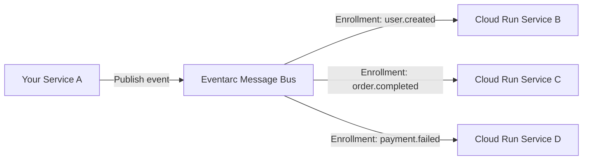

# Create Custom Events and Channels in Eventarc for Application-Level Events

Author: [nawazdhandala](https://www.github.com/nawazdhandala)

Tags: GCP, Eventarc, Custom Events, Event-Driven, Cloud Run

Description: Learn how to create custom event types and channels in Google Cloud Eventarc to publish and route application-level events between your own services.

---

Eventarc is not just for Google Cloud service events. You can define your own custom event types and use Eventarc Advanced message buses to publish and route events between your own application services. This gives you a managed event bus for your application without having to build routing, delivery, and retry logic yourself.

In this post, I will show you how to create custom events, set up a message bus, publish events from your application, and create enrollments that route those events to Cloud Run services.

## Custom Events vs. Google Cloud Events

Google Cloud events (like Cloud Storage or Pub/Sub events) are generated by Google Cloud services. Custom events are generated by your application code. Both flow through Eventarc, but custom events use a different mechanism:

- **Google Cloud events**: Triggered automatically by service activity
- **Custom events**: Published explicitly by your code to an Eventarc Advanced message bus

A message bus is an intermediary that receives your custom events and routes them to enrollments based on event type filtering.


```mermaid
flowchart LR
    A[Your Service A] -->|Publish event| BUS[Eventarc Message Bus]
    BUS -->|Enrollment: user.created| CR1[Cloud Run Service B]
    BUS -->|Enrollment: order.completed| CR2[Cloud Run Service C]
    BUS -->|Enrollment: payment.failed| CR3[Cloud Run Service D]
```

## Prerequisites

```bash
# Enable required APIs

gcloud services enable \
  run.googleapis.com \
  eventarc.googleapis.com \
  eventarcpublishing.googleapis.com
```

## Step 1: Create an Eventarc Message Bus

A message bus is the endpoint where your application publishes events.

```bash
# Create a message bus for your application events
gcloud eventarc message-buses create my-app-events \
  --location=us-central1
```

Verify the message bus was created.

```bash
# View message bus details
gcloud eventarc message-buses describe my-app-events \
  --location=us-central1
```

## Step 2: Define Your Custom Event Types

While Eventarc does not require you to formally register event types, it is good practice to define a naming convention. The standard format follows reverse domain notation:

```text
# Event type naming convention
custom.my-company.user.created
custom.my-company.user.updated
custom.my-company.order.completed
custom.my-company.order.cancelled
custom.my-company.payment.processed
custom.my-company.payment.failed
```

## Step 3: Create Cloud Run Event Handlers

Deploy Cloud Run services that handle your custom events.

```javascript
// user-events-handler/server.js
// Handles custom user-related events from Eventarc
const express = require("express");
const app = express();
app.use(express.json());

app.post("/", async (req, res) => {
  // CloudEvents headers
  const eventType = req.headers["ce-type"];
  const eventSource = req.headers["ce-source"];
  const eventId = req.headers["ce-id"];
  const eventTime = req.headers["ce-time"];

  console.log(`Received custom event: ${eventType}`);
  console.log(`Source: ${eventSource}`);
  console.log(`Event ID: ${eventId}`);

  // The event payload is in the request body
  const eventData = req.body;
  console.log("Event data:", eventData);

  try {
    switch (eventType) {
      case "custom.myapp.user.created":
        await handleUserCreated(eventData);
        break;
      case "custom.myapp.user.updated":
        await handleUserUpdated(eventData);
        break;
      case "custom.myapp.user.deleted":
        await handleUserDeleted(eventData);
        break;
      default:
        console.log(`Unhandled event type: ${eventType}`);
    }

    res.status(200).json({ status: "processed" });
  } catch (error) {
    console.error(`Failed to process event: ${error.message}`);
    res.status(500).json({ error: error.message });
  }
});

async function handleUserCreated(data) {
  console.log(`New user created: ${data.userId}`);
  // Send welcome email, set up default preferences, create analytics profile
  console.log(`Setting up onboarding for ${data.email}`);
}

async function handleUserUpdated(data) {
  console.log(`User updated: ${data.userId}`);
  // Sync changes to downstream systems
  console.log(`Updated fields: ${data.updatedFields.join(", ")}`);
}

async function handleUserDeleted(data) {
  console.log(`User deleted: ${data.userId}`);
  // Clean up associated data, send farewell email
}

const PORT = process.env.PORT || 8080;
app.listen(PORT, () => {
  console.log(`User events handler on port ${PORT}`);
});
```

Deploy the handlers.

```bash
# Deploy the user events handler
gcloud run deploy user-events-handler \
  --source=./user-events-handler \
  --region=us-central1 \
  --no-allow-unauthenticated \
  --memory=256Mi \
  --timeout=60s

# Deploy the order events handler
gcloud run deploy order-events-handler \
  --source=./order-events-handler \
  --region=us-central1 \
  --no-allow-unauthenticated \
  --memory=256Mi \
  --timeout=60s
```

## Step 4: Create Eventarc Pipelines and Enrollments

Create pipelines and enrollments that route specific event types to the appropriate Cloud Run services.

```bash
# Create a service account for pipelines
gcloud iam service-accounts create eventarc-custom-sa \
  --display-name="Eventarc Custom Events SA"

# Grant Cloud Run invoker role
gcloud run services add-iam-policy-binding user-events-handler \
  --region=us-central1 \
  --member="serviceAccount:eventarc-custom-sa@YOUR_PROJECT.iam.gserviceaccount.com" \
  --role="roles/run.invoker"

gcloud run services add-iam-policy-binding order-events-handler \
  --region=us-central1 \
  --member="serviceAccount:eventarc-custom-sa@YOUR_PROJECT.iam.gserviceaccount.com" \
  --role="roles/run.invoker"

# Grant the publisher service account access to publish to the message bus
gcloud projects add-iam-policy-binding YOUR_PROJECT \
  --member="serviceAccount:YOUR_PUBLISHER_SERVICE_ACCOUNT@YOUR_PROJECT.iam.gserviceaccount.com" \
  --role="roles/eventarc.messageBusUser"

# Get Cloud Run service URLs for HTTP destinations
USER_EVENTS_URL=$(gcloud run services describe user-events-handler \
  --region=us-central1 \
  --format='value(status.url)')

ORDER_EVENTS_URL=$(gcloud run services describe order-events-handler \
  --region=us-central1 \
  --format='value(status.url)')

# Pipeline for user events
gcloud eventarc pipelines create user-events-pipeline \
  --location=us-central1 \
  --destinations=http_endpoint_uri="${USER_EVENTS_URL}",google_oidc_authentication_service_account=eventarc-custom-sa@YOUR_PROJECT.iam.gserviceaccount.com

# Pipeline for order events
gcloud eventarc pipelines create order-events-pipeline \
  --location=us-central1 \
  --destinations=http_endpoint_uri="${ORDER_EVENTS_URL}",google_oidc_authentication_service_account=eventarc-custom-sa@YOUR_PROJECT.iam.gserviceaccount.com

# Enrollment for user.created events
gcloud eventarc enrollments create user-created-enrollment \
  --location=us-central1 \
  --cel-match="message.type == 'custom.myapp.user.created'" \
  --destination-pipeline=user-events-pipeline \
  --message-bus=my-app-events \
  --message-bus-project=YOUR_PROJECT

# Enrollment for user.updated events
gcloud eventarc enrollments create user-updated-enrollment \
  --location=us-central1 \
  --cel-match="message.type == 'custom.myapp.user.updated'" \
  --destination-pipeline=user-events-pipeline \
  --message-bus=my-app-events \
  --message-bus-project=YOUR_PROJECT

# Enrollment for order.completed events - routes to a different service
gcloud eventarc enrollments create order-completed-enrollment \
  --location=us-central1 \
  --cel-match="message.type == 'custom.myapp.order.completed'" \
  --destination-pipeline=order-events-pipeline \
  --message-bus=my-app-events \
  --message-bus-project=YOUR_PROJECT
```

## Step 5: Publish Custom Events

Publish events from your application using the Eventarc Publishing API.

### Using the gcloud CLI for Testing

```bash
# Publish a test custom event
gcloud eventarc message-buses publish my-app-events \
  --location=us-central1 \
  --event-id="evt-$(date +%s)" \
  --event-type="custom.myapp.user.created" \
  --event-source="//my-app/user-service" \
  --event-data='{"userId": "USR-001", "email": "jane@example.com", "name": "Jane Doe", "plan": "premium"}' \
  --event-attributes="datacontenttype=application/json"
```

### Using the Node.js Client Library

```javascript
// event-publisher.js
// Publishes custom events to an Eventarc message bus
const { PublisherClient } = require("@google-cloud/eventarc-publishing").v1;
const { v4: uuidv4 } = require("uuid");

const client = new PublisherClient();

const PROJECT = process.env.GOOGLE_CLOUD_PROJECT;
const LOCATION = "us-central1";
const MESSAGE_BUS = "my-app-events";

async function publishEvent(eventType, source, data) {
  const messageBus = `projects/${PROJECT}/locations/${LOCATION}/messageBuses/${MESSAGE_BUS}`;

  const event = {
    id: uuidv4(),
    type: eventType,
    source: source,
    specversion: "1.0",
    data: data,
    datacontenttype: "application/json",
    time: new Date().toISOString(),
  };

  await client.publish({
    messageBus,
    jsonMessage: JSON.stringify(event),
  });

  console.log(`Published event: ${event.type}, ID: ${event.id}`);
  return event.id;
}

// Convenience functions for specific event types
async function emitUserCreated(userId, userData) {
  return publishEvent(
    "custom.myapp.user.created",
    "//my-app/user-service",
    { userId, ...userData }
  );
}

async function emitUserUpdated(userId, updatedFields) {
  return publishEvent(
    "custom.myapp.user.updated",
    "//my-app/user-service",
    { userId, updatedFields }
  );
}

async function emitOrderCompleted(orderId, orderData) {
  return publishEvent(
    "custom.myapp.order.completed",
    "//my-app/order-service",
    { orderId, ...orderData }
  );
}

module.exports = { emitUserCreated, emitUserUpdated, emitOrderCompleted };
```

### Using the Publisher in Your Application

```javascript
// user-service.js
// User service that emits events on state changes
const express = require("express");
const { emitUserCreated, emitUserUpdated } = require("./event-publisher");
const { Firestore } = require("@google-cloud/firestore");

const app = express();
app.use(express.json());
const firestore = new Firestore();

app.post("/api/users", async (req, res) => {
  const { email, name, plan } = req.body;

  // Create the user in the database
  const userId = `USR-${Date.now()}`;
  await firestore.collection("users").doc(userId).set({
    email,
    name,
    plan,
    createdAt: new Date().toISOString(),
  });

  // Emit a custom event (non-blocking)
  emitUserCreated(userId, { email, name, plan }).catch((err) =>
    console.error("Failed to emit event:", err)
  );

  res.status(201).json({ userId, email, name });
});

app.patch("/api/users/:userId", async (req, res) => {
  const { userId } = req.params;
  const updates = req.body;

  // Update the user
  await firestore.collection("users").doc(userId).update(updates);

  // Emit update event
  emitUserUpdated(userId, Object.keys(updates)).catch((err) =>
    console.error("Failed to emit event:", err)
  );

  res.status(200).json({ userId, updated: Object.keys(updates) });
});
```

## Managing Message Buses, Pipelines, and Enrollments

```bash
# List message buses
gcloud eventarc message-buses list --location=us-central1

# List enrollments
gcloud eventarc enrollments list --location=us-central1

# View enrollment details
gcloud eventarc enrollments describe user-created-enrollment \
  --location=us-central1

# Delete an enrollment
gcloud eventarc enrollments delete user-created-enrollment \
  --location=us-central1

# Delete a pipeline
gcloud eventarc pipelines delete user-events-pipeline \
  --location=us-central1

# Delete a message bus (delete related enrollments first)
gcloud eventarc message-buses delete my-app-events \
  --location=us-central1
```

## Wrapping Up

Custom events and message buses in Eventarc give your application a managed event bus. Instead of services calling each other directly, they publish events to a message bus, and Eventarc routes those events to the right handlers based on type filters. This decouples your services, makes it easy to add new event consumers, and gives you consistent event delivery semantics across your application. Define clear event type conventions, publish events from your services, create enrollments for each consumer, and let Eventarc handle the routing.
