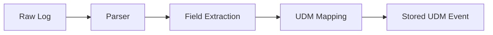

# How to Create Custom Log Parsers for Chronicle SIEM

Author: [nawazdhandala](https://www.github.com/nawazdhandala)

Tags: GCP, Chronicle SIEM, Log Parsing, UDM, Security Operations

Description: Learn how to create custom log parsers in Google Chronicle SIEM to normalize proprietary or unsupported log formats into the Unified Data Model for detection and investigation.

---

Chronicle SIEM comes with built-in parsers for hundreds of log sources, but you will inevitably run into a log format it does not support out of the box. Maybe it is a custom application, a niche security appliance, or an internal tool that generates its own log format. That is where custom parsers come in. They let you transform raw log data into Chronicle's Unified Data Model (UDM), making it searchable and usable in detection rules just like any other data source.

In this guide, I will walk through the process of building custom parsers from scratch.

## How Chronicle Parsing Works

When logs arrive in Chronicle, they go through a parsing pipeline:

1. Raw log data arrives via a data feed
2. The parser extracts fields from the raw data
3. Extracted fields get mapped to UDM schema fields
4. The normalized UDM event gets stored and indexed



Parsers are written using a combination of Grok patterns, regex, and field mapping instructions in a specific format that Chronicle understands.

## Understanding the UDM Schema

Before writing a parser, you need to understand where your log fields map in the UDM. The key UDM entities are:

- **metadata** - Event metadata (timestamps, product info, event type)
- **principal** - The entity that initiated the action (user, IP, hostname)
- **target** - The entity that was acted upon
- **src** - Network source
- **observer** - The device or service that observed the event
- **security_result** - Security-specific outcomes (allow, block, severity)

The event type field (`metadata.event_type`) is particularly important. Chronicle uses it to categorize events for correlation. Common types include USER_LOGIN, NETWORK_CONNECTION, FILE_CREATION, PROCESS_LAUNCH, and many more.

## Building a Parser: Step by Step

Let me walk through building a parser for a custom web application that produces JSON-formatted audit logs.

Here is a sample log line from the application:

```json
{
    "timestamp": "2026-02-17T10:30:00Z",
    "user": "admin@example.com",
    "action": "file_download",
    "resource": "/documents/financial-report-q4.pdf",
    "source_ip": "192.168.1.100",
    "user_agent": "Mozilla/5.0",
    "status": "success",
    "bytes_transferred": 2048576
}
```

### Step 1: Create the Parser Configuration

Chronicle parsers use a configuration that combines extraction logic with UDM mapping. Here is the parser for our custom application.

```conf
filter {
    # Parse the raw JSON log entry
    json {
        source => "message"
        on_error => "_json_parse_error"
    }

    # Skip entries that failed to parse
    if [_json_parse_error] {
        drop {}
    }

    # Map the timestamp
    date {
        source => "timestamp"
        target => "event.idm.read_only_udm.metadata.event_timestamp"
        formats => ["ISO8601"]
    }

    # Set the event type based on the action field
    if [action] == "file_download" {
        mutate {
            replace => {
                "event.idm.read_only_udm.metadata.event_type" => "USER_RESOURCE_ACCESS"
            }
        }
    } else if [action] == "file_upload" {
        mutate {
            replace => {
                "event.idm.read_only_udm.metadata.event_type" => "USER_RESOURCE_CREATION"
            }
        }
    } else if [action] == "login" {
        mutate {
            replace => {
                "event.idm.read_only_udm.metadata.event_type" => "USER_LOGIN"
            }
        }
    } else if [action] == "logout" {
        mutate {
            replace => {
                "event.idm.read_only_udm.metadata.event_type" => "USER_LOGOUT"
            }
        }
    } else {
        mutate {
            replace => {
                "event.idm.read_only_udm.metadata.event_type" => "GENERIC_EVENT"
            }
        }
    }

    # Set product metadata
    mutate {
        replace => {
            "event.idm.read_only_udm.metadata.vendor_name" => "CustomApp"
            "event.idm.read_only_udm.metadata.product_name" => "CustomAuditLog"
            "event.idm.read_only_udm.metadata.product_event_type" => "%{action}"
        }
    }

    # Map the principal (who did the action)
    mutate {
        replace => {
            "event.idm.read_only_udm.principal.user.email_addresses" => "%{user}"
            "event.idm.read_only_udm.principal.ip" => "%{source_ip}"
        }
    }

    # Map the target (what was acted upon)
    mutate {
        replace => {
            "event.idm.read_only_udm.target.resource.name" => "%{resource}"
        }
    }

    # Map security result
    if [status] == "success" {
        mutate {
            replace => {
                "event.idm.read_only_udm.security_result.action" => "ALLOW"
            }
        }
    } else {
        mutate {
            replace => {
                "event.idm.read_only_udm.security_result.action" => "BLOCK"
            }
        }
    }

    # Map network bytes if present
    if [bytes_transferred] {
        mutate {
            replace => {
                "event.idm.read_only_udm.network.sent_bytes" => "%{bytes_transferred}"
            }
        }
    }
}
```

### Step 2: Handle Syslog-Format Logs

Not everything comes in JSON. Here is how to parse a syslog-formatted log from a network device.

Sample log line:

```
Feb 17 10:30:00 fw01 FIREWALL: DENY TCP 10.0.0.5:43210 -> 192.168.1.100:443 rule=block-external
```

The parser uses Grok patterns to extract fields from the unstructured text.

```conf
filter {
    # Extract fields from the syslog message using Grok
    grok {
        match => {
            "message" => [
                "%{SYSLOGTIMESTAMP:syslog_timestamp} %{HOSTNAME:device} FIREWALL: %{WORD:action} %{WORD:protocol} %{IP:src_ip}:%{INT:src_port} -> %{IP:dst_ip}:%{INT:dst_port} rule=%{GREEDYDATA:rule_name}"
            ]
        }
        on_error => "_grok_parse_error"
    }

    if [_grok_parse_error] {
        drop {}
    }

    # Parse the syslog timestamp
    date {
        source => "syslog_timestamp"
        target => "event.idm.read_only_udm.metadata.event_timestamp"
        formats => ["MMM dd HH:mm:ss", "MMM  d HH:mm:ss"]
    }

    # Set event type for firewall events
    mutate {
        replace => {
            "event.idm.read_only_udm.metadata.event_type" => "NETWORK_CONNECTION"
            "event.idm.read_only_udm.metadata.vendor_name" => "CustomFirewall"
            "event.idm.read_only_udm.metadata.product_name" => "FW01"
        }
    }

    # Map network source
    mutate {
        replace => {
            "event.idm.read_only_udm.principal.ip" => "%{src_ip}"
            "event.idm.read_only_udm.principal.port" => "%{src_port}"
            "event.idm.read_only_udm.target.ip" => "%{dst_ip}"
            "event.idm.read_only_udm.target.port" => "%{dst_port}"
            "event.idm.read_only_udm.network.ip_protocol" => "%{protocol}"
        }
    }

    # Map the firewall action
    if [action] == "DENY" {
        mutate {
            replace => {
                "event.idm.read_only_udm.security_result.action" => "BLOCK"
            }
        }
    } else {
        mutate {
            replace => {
                "event.idm.read_only_udm.security_result.action" => "ALLOW"
            }
        }
    }

    # Store the rule name
    mutate {
        replace => {
            "event.idm.read_only_udm.security_result.rule_name" => "%{rule_name}"
        }
    }

    # Set the observer (the firewall device itself)
    mutate {
        replace => {
            "event.idm.read_only_udm.observer.hostname" => "%{device}"
        }
    }
}
```

## Deploying and Testing Custom Parsers

### Upload the Parser

In the Chronicle console, go to Settings, then SIEM Settings, then Parsers. Click "Create Parser" and upload your configuration.

You can also use the Chronicle API for automated deployments.

```bash
# Upload a custom parser using the Chronicle API
curl -X POST \
    "https://backstory.googleapis.com/v2/parsers" \
    -H "Authorization: Bearer $(gcloud auth print-access-token)" \
    -H "Content-Type: application/json" \
    -d '{
        "log_type": "CUSTOM_APP_AUDIT",
        "config": "BASE64_ENCODED_PARSER_CONFIG",
        "state": "LIVE"
    }'
```

### Test with Sample Logs

Before going live, test your parser against sample log data. Chronicle provides a parser testing tool that shows you exactly how each log line gets mapped to UDM.

Upload a file with 10-20 representative log lines covering different event types and edge cases. The testing tool will show:

- Which lines parsed successfully
- Which lines failed and why
- The resulting UDM fields for each line

### Validate UDM Mapping

After parsing, verify your UDM events look correct by running a search.

```
metadata.product_name = "CustomAuditLog" AND metadata.event_timestamp.seconds > timestamp("2026-02-17T00:00:00Z")
```

Check that event types are mapped correctly, timestamps are accurate, and the principal/target fields contain the right data.

## Common Parsing Pitfalls

**Multiline logs.** Some applications produce log entries that span multiple lines (like Java stack traces). You need to configure multiline handling in your data feed to concatenate these before parsing.

**Timestamp ambiguity.** Log formats like "02/03/2026" could be February 3rd or March 2nd depending on the locale. Always verify the timestamp format matches what your source actually produces.

**Missing fields.** Not every log line has every field. Use conditional checks before mapping optional fields to avoid parse errors.

**Character encoding.** Some sources produce logs in non-UTF-8 encodings. Handle encoding conversion before parsing.

**Performance at scale.** Complex regex patterns can be expensive at high log volumes. Prefer exact matches and simple patterns over complex regex when possible.

Custom parsers are the bridge between your unique log sources and Chronicle's powerful detection and investigation capabilities. Once your logs are properly normalized into UDM, you can write YARA-L rules against them, correlate them with other data sources, and include them in your investigation workflows just like any built-in log type.
