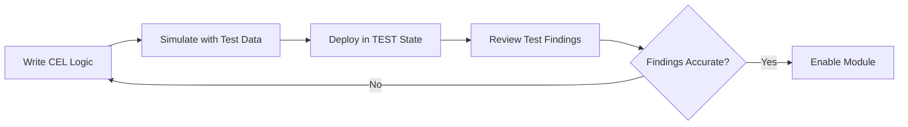

# How to Create Custom Security Health Analytics Modules in Security Command Center

Author: [nawazdhandala](https://www.github.com/nawazdhandala)

Tags: GCP, Security Command Center, Security Health Analytics, Cloud Security, Custom Modules

Description: Learn how to build custom Security Health Analytics modules in Google Cloud Security Command Center to detect organization-specific misconfigurations and compliance violations.

---

Google Cloud's Security Command Center (SCC) comes with a solid set of built-in detectors, but every organization has unique security requirements that off-the-shelf rules simply cannot cover. That is where custom Security Health Analytics (SHA) modules come in. They let you write your own detection logic to scan Google Cloud resources and generate findings when something violates your internal policies.

In this guide, I will walk through the process of creating, testing, and deploying custom SHA modules so you can extend SCC to match your specific security posture.

## What Are Custom SHA Modules?

Security Health Analytics is the managed vulnerability assessment service within SCC. It continuously scans your Google Cloud resources and reports misconfigurations as findings. The built-in detectors cover common issues like public buckets, open firewall rules, and disabled logging.

Custom modules let you add your own detection logic on top of those built-in detectors. You define the resource type to scan, the evaluation logic using Common Expression Language (CEL), and the finding details to generate when a violation is detected.

Each custom module has these components:

- **Resource type** - which Google Cloud resource to evaluate (e.g., compute.googleapis.com/Instance)
- **Predicate expression** - a CEL expression that returns true when a violation exists
- **Custom finding category** - the name shown in SCC findings
- **Severity** - CRITICAL, HIGH, MEDIUM, or LOW
- **Description and remediation** - guidance for responders

## Prerequisites

Before creating custom modules, make sure you have:

1. Security Command Center Premium or Enterprise tier enabled at the organization level
2. The `securitycentermanagement.securityHealthAnalyticsCustomModules.create` permission
3. Familiarity with CEL (Common Expression Language)

## Creating Your First Custom Module

Let's start with a practical example. Suppose your organization requires all Compute Engine instances to have a specific label called `cost-center`. Here is how to create a custom module that detects instances missing that label.

This gcloud command creates a custom module that checks for the required label on all Compute Engine instances.

```bash
# Create a custom SHA module to detect instances without cost-center label
gcloud scc custom-modules sha create \
  --organization=123456789 \
  --display-name="missing-cost-center-label" \
  --enablement-state="ENABLED" \
  --custom-config-from-file=missing-label-module.yaml
```

The YAML configuration file defines the detection logic and finding details.

```yaml
# missing-label-module.yaml
# Detects Compute Engine instances missing the cost-center label
predicate:
  expression: "!has(resource.labels.cost-center)"
resourceSelector:
  resourceTypes:
    - compute.googleapis.com/Instance
severity: MEDIUM
description: "Compute Engine instance is missing the required cost-center label."
recommendation: "Add a cost-center label to this instance for proper cost tracking."
customOutput:
  properties:
    - name: "instance_name"
      valueExpression:
        expression: "resource.name"
    - name: "project_id"
      valueExpression:
        expression: "resource.project"
```

## Writing CEL Expressions for Detection Logic

CEL is the backbone of custom modules. Here are some patterns that come up frequently.

This expression checks whether a specific field exists and has an acceptable value.

```cel
// Check if a Compute Engine instance uses an approved machine type
// Returns true (violation) if the machine type is not in the approved list
!(resource.machineType.endsWith("n2-standard-2") ||
  resource.machineType.endsWith("n2-standard-4") ||
  resource.machineType.endsWith("n2-standard-8"))
```

For checking nested fields and lists, CEL provides the `has()` macro and list operations.

```cel
// Check if a Cloud SQL instance has backup disabled
// Returns true when automated backups are not configured
!has(resource.settings.backupConfiguration) ||
  resource.settings.backupConfiguration.enabled == false
```

You can also use `exists()` to evaluate list items.

```cel
// Detect firewall rules that allow traffic from 0.0.0.0/0
resource.sourceRanges.exists(range, range == "0.0.0.0/0") &&
  resource.direction == "INGRESS"
```

## Creating Modules via Terraform

If you manage infrastructure as code, Terraform is the better path for deploying custom modules. Here is an example resource definition.

```hcl
# Terraform resource for a custom SHA module
# Detects Cloud Storage buckets without uniform bucket-level access
resource "google_scc_management_organization_security_health_analytics_custom_module" "uniform_access" {
  organization = "123456789"
  display_name = "bucket-missing-uniform-access"
  enablement_state = "ENABLED"

  custom_config {
    predicate {
      expression = "!resource.iamConfiguration.uniformBucketLevelAccess.enabled"
    }

    resource_selector {
      resource_types = ["storage.googleapis.com/Bucket"]
    }

    severity = "HIGH"
    description = "Cloud Storage bucket does not have uniform bucket-level access enabled."
    recommendation = "Enable uniform bucket-level access on this bucket to simplify permissions management."

    custom_output {
      properties {
        name = "bucket_name"
        value_expression {
          expression = "resource.name"
        }
      }
    }
  }
}
```

## Testing Custom Modules Before Deployment

You do not want untested detection logic producing noisy findings across your organization. SCC provides a test mechanism that lets you simulate the module against sample resource data.

This command runs a test against a specific module using sample resource data.

```bash
# Test a custom module against a simulated resource
gcloud scc custom-modules sha simulate \
  --organization=123456789 \
  --custom-config-from-file=missing-label-module.yaml \
  --resource-from-file=test-resource.json
```

The test resource file contains a mock version of the resource you want to evaluate.

```json
{
  "resourceType": "compute.googleapis.com/Instance",
  "resourceData": {
    "name": "projects/my-project/zones/us-central1-a/instances/test-vm",
    "machineType": "projects/my-project/zones/us-central1-a/machineTypes/n2-standard-2",
    "labels": {}
  }
}
```

Since this test instance has an empty labels map and no `cost-center` key, the module should trigger a finding.

## Managing Module Lifecycle

Custom modules have three enablement states: ENABLED, DISABLED, and TEST. The TEST state is useful during development because findings generated in test mode are marked with a test indicator and do not show up in normal SCC dashboards.

Here is the flow I recommend:



To update a module's state, use this command.

```bash
# Move a module from TEST to ENABLED after validating findings
gcloud scc custom-modules sha update MODULE_ID \
  --organization=123456789 \
  --enablement-state="ENABLED"
```

## Practical Module Examples

Here are a few more modules that cover common organizational policies.

This module detects GKE clusters that do not have Workload Identity enabled.

```yaml
# detect-gke-without-workload-identity.yaml
predicate:
  expression: "!has(resource.workloadIdentityConfig) || resource.workloadIdentityConfig.workloadPool == ''"
resourceSelector:
  resourceTypes:
    - container.googleapis.com/Cluster
severity: HIGH
description: "GKE cluster does not have Workload Identity enabled."
recommendation: "Enable Workload Identity to avoid using node service accounts for workload authentication."
```

This module detects Cloud SQL instances without SSL enforcement.

```yaml
# detect-sql-without-ssl.yaml
predicate:
  expression: "!has(resource.settings.ipConfiguration.requireSsl) || resource.settings.ipConfiguration.requireSsl == false"
resourceSelector:
  resourceTypes:
    - sqladmin.googleapis.com/Instance
severity: HIGH
description: "Cloud SQL instance does not require SSL for connections."
recommendation: "Enable the requireSsl setting to enforce encrypted connections."
```

## Monitoring Custom Module Performance

After deploying custom modules, keep an eye on their behavior. You can list all findings from your custom modules using this command.

```bash
# List findings generated by custom SHA modules in the last 24 hours
gcloud scc findings list 123456789 \
  --source=SECURITY_HEALTH_ANALYTICS \
  --filter="category=\"missing-cost-center-label\" AND state=\"ACTIVE\"" \
  --format="table(resourceName, category, severity, createTime)"
```

If a module generates too many findings, consider refining the CEL expression or adjusting the scope with folder or project-level deployments rather than organization-wide.

## Tips for Writing Effective Modules

After building several dozen custom modules across different organizations, here are the patterns that work well:

1. **Start narrow** - target a specific resource type and expand later
2. **Use descriptive category names** - they show up in dashboards and exports
3. **Include custom output properties** - they make triage faster by surfacing relevant context
4. **Test with both passing and failing resources** - verify the CEL expression catches violations without false positives
5. **Version control your module definitions** - treat them like any other infrastructure code

Custom SHA modules are one of the most practical features in Security Command Center for teams that need security scanning tailored to their own policies. Combined with SCC notifications and Pub/Sub integration, you can build a fully automated detection and response pipeline that goes well beyond what the built-in detectors provide.
