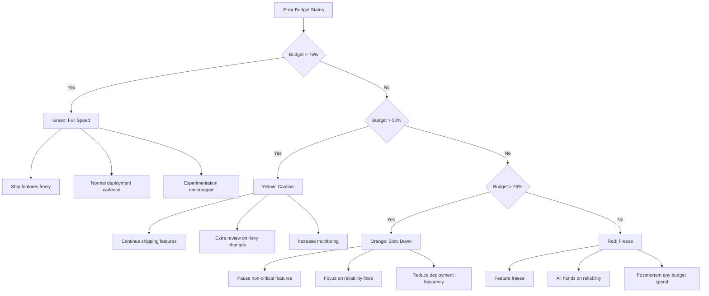

# How to Create Error Budget Policies and Track Consumption on Google Cloud Monitoring

Author: [nawazdhandala](https://www.github.com/nawazdhandala)

Tags: GCP, Error Budget, SLO, SRE, Cloud Monitoring, Google Cloud

Description: Learn how to create error budget policies and track budget consumption on Google Cloud Monitoring to balance reliability with feature velocity.

---

Error budgets are the mechanism that makes SLOs actionable. Without an error budget policy, an SLO is just a number on a dashboard. With a policy, it becomes a decision framework - when the budget is healthy, teams ship features aggressively. When the budget is low, they slow down and focus on reliability. On Google Cloud Monitoring, you can track error budget consumption in real time and automate responses based on budget status. Let me walk through how to set this up.

## What Is an Error Budget?

If your SLO is 99.9% availability over 30 days, your error budget is the 0.1% of requests that are allowed to fail. For a service handling 1 million requests per day, that is roughly 30,000 failed requests per month, or about 1,000 per day. The error budget policy defines what happens as this budget gets consumed.

## Error Budget Math

Here is a quick reference for common SLO targets and their error budgets over a 30-day period.

| SLO Target | Error Budget (%) | Downtime Equivalent | Failed Requests (1M/day) |
|------------|-----------------|---------------------|--------------------------|
| 99.0% | 1.0% | 7.2 hours | 300,000/month |
| 99.5% | 0.5% | 3.6 hours | 150,000/month |
| 99.9% | 0.1% | 43.2 minutes | 30,000/month |
| 99.95% | 0.05% | 21.6 minutes | 15,000/month |
| 99.99% | 0.01% | 4.3 minutes | 3,000/month |

## Step 1: Create the SLO with Budget Tracking

First, set up an SLO that serves as the basis for error budget tracking.

```bash
# Create an availability SLO with 30-day rolling window
gcloud monitoring slos create \
    --service=my-api-service \
    --slo-id=main-availability-slo \
    --display-name="API Availability - 99.9%" \
    --request-based-sli \
    --good-total-ratio-threshold \
    --good-service-filter='metric.type="loadbalancing.googleapis.com/https/request_count" AND metric.labels.response_code_class="200"' \
    --total-service-filter='metric.type="loadbalancing.googleapis.com/https/request_count"' \
    --goal=0.999 \
    --rolling-period=30d \
    --project=my-gcp-project
```

## Step 2: Track Error Budget Remaining

Google Cloud Monitoring provides a built-in function to query the remaining error budget.

```
# MQL query to show error budget remaining as a percentage
fetch cloud_monitoring_slo::monitoring.googleapis.com/service/slo/error_budget_remaining
| filter resource.service = "my-api-service"
| filter resource.slo = "main-availability-slo"
| every 5m
```

You can also query the budget consumption rate.

```
# MQL query to show how fast the error budget is being consumed
fetch cloud_monitoring_slo::monitoring.googleapis.com/service/slo/burn_rate
| filter resource.service = "my-api-service"
| filter resource.slo = "main-availability-slo"
| every 5m
```

## Step 3: Define Error Budget Policy Tiers

An error budget policy typically defines actions at different budget consumption levels. Here is a practical policy structure.



## Step 4: Create Alerts for Budget Thresholds

Set up alerts at each budget threshold so the right response is triggered automatically.

```bash
# Alert when error budget drops below 50%
cat > budget-50-alert.json << 'EOF'
{
  "displayName": "Error Budget Below 50% - Caution",
  "conditions": [{
    "displayName": "Error budget remaining < 50%",
    "conditionThreshold": {
      "filter": "select_slo_budget_fraction(\"projects/my-gcp-project/services/my-api-service/serviceLevelObjectives/main-availability-slo\")",
      "comparison": "COMPARISON_LT",
      "thresholdValue": 0.5,
      "duration": "0s",
      "trigger": { "count": 1 }
    }
  }],
  "combiner": "OR",
  "notificationChannels": [
    "projects/my-gcp-project/notificationChannels/TEAM_CHANNEL"
  ],
  "documentation": {
    "content": "## Error Budget at 50%\n\nThe error budget has been half consumed. Per our error budget policy:\n- Continue shipping features with extra caution\n- Add additional review for risky deployments\n- Investigate the top sources of budget consumption"
  }
}
EOF

gcloud monitoring policies create --policy-from-file=budget-50-alert.json

# Alert when error budget drops below 25% - more serious
cat > budget-25-alert.json << 'EOF'
{
  "displayName": "Error Budget Below 25% - Slow Down",
  "conditions": [{
    "displayName": "Error budget remaining < 25%",
    "conditionThreshold": {
      "filter": "select_slo_budget_fraction(\"projects/my-gcp-project/services/my-api-service/serviceLevelObjectives/main-availability-slo\")",
      "comparison": "COMPARISON_LT",
      "thresholdValue": 0.25,
      "duration": "0s",
      "trigger": { "count": 1 }
    }
  }],
  "combiner": "OR",
  "notificationChannels": [
    "projects/my-gcp-project/notificationChannels/ENGINEERING_LEADS"
  ],
  "documentation": {
    "content": "## Error Budget at 25%\n\nThe error budget is critically low. Per our error budget policy:\n- Pause non-critical feature development\n- Focus engineering effort on reliability improvements\n- Reduce deployment frequency\n- Conduct review of recent budget consumption"
  }
}
EOF

gcloud monitoring policies create --policy-from-file=budget-25-alert.json

# Alert when error budget is exhausted
cat > budget-exhausted-alert.json << 'EOF'
{
  "displayName": "Error Budget Exhausted - Feature Freeze",
  "conditions": [{
    "displayName": "Error budget remaining <= 0%",
    "conditionThreshold": {
      "filter": "select_slo_budget_fraction(\"projects/my-gcp-project/services/my-api-service/serviceLevelObjectives/main-availability-slo\")",
      "comparison": "COMPARISON_LT",
      "thresholdValue": 0,
      "duration": "0s",
      "trigger": { "count": 1 }
    }
  }],
  "combiner": "OR",
  "notificationChannels": [
    "projects/my-gcp-project/notificationChannels/ENGINEERING_LEADS",
    "projects/my-gcp-project/notificationChannels/MANAGEMENT"
  ],
  "documentation": {
    "content": "## Error Budget Exhausted\n\nThe error budget has been fully consumed. Per our error budget policy:\n- Immediate feature freeze\n- All engineering effort on reliability\n- Mandatory postmortem for each budget-consuming event\n- Leadership review before resuming feature work"
  }
}
EOF

gcloud monitoring policies create --policy-from-file=budget-exhausted-alert.json
```

## Step 5: Build an Error Budget Dashboard

Create a dashboard that gives leadership and engineering a clear view of budget status.

```bash
# Create an error budget tracking dashboard
cat > budget-dashboard.json << 'EOF'
{
  "displayName": "Error Budget Tracking",
  "mosaicLayout": {
    "columns": 12,
    "tiles": [
      {
        "width": 4,
        "height": 4,
        "widget": {
          "title": "Error Budget Remaining (%)",
          "scorecard": {
            "timeSeriesQuery": {
              "timeSeriesQueryLanguage": "fetch cloud_monitoring_slo::monitoring.googleapis.com/service/slo/error_budget_remaining | filter resource.service='my-api-service' AND resource.slo='main-availability-slo'"
            },
            "thresholds": [
              { "value": 0.75, "color": "GREEN", "direction": "ABOVE" },
              { "value": 0.50, "color": "YELLOW", "direction": "ABOVE" },
              { "value": 0.25, "color": "YELLOW", "direction": "ABOVE" },
              { "value": 0, "color": "RED", "direction": "ABOVE" }
            ]
          }
        }
      },
      {
        "xPos": 4,
        "width": 8,
        "height": 4,
        "widget": {
          "title": "Error Budget Consumption Over Time",
          "xyChart": {
            "dataSets": [{
              "timeSeriesQuery": {
                "timeSeriesQueryLanguage": "fetch cloud_monitoring_slo::monitoring.googleapis.com/service/slo/error_budget_remaining | filter resource.service='my-api-service' AND resource.slo='main-availability-slo' | every 1h"
              },
              "plotType": "LINE"
            }]
          }
        }
      },
      {
        "yPos": 4,
        "width": 12,
        "height": 4,
        "widget": {
          "title": "SLI Performance vs SLO Target",
          "xyChart": {
            "dataSets": [{
              "timeSeriesQuery": {
                "timeSeriesQueryLanguage": "{ fetch cloud_monitoring_slo::monitoring.googleapis.com/service/slo/sli_value | filter resource.service='my-api-service' AND resource.slo='main-availability-slo' | every 5m ; fetch cloud_monitoring_slo::monitoring.googleapis.com/service/slo/sli_value | filter resource.service='my-api-service' AND resource.slo='main-availability-slo' | every 5m | value [target: cast_double(0.999)] } | union"
              },
              "plotType": "LINE"
            }]
          }
        }
      }
    ]
  }
}
EOF

gcloud monitoring dashboards create --config-from-file=budget-dashboard.json
```

## Automating Policy Enforcement

Beyond manual responses, you can automate parts of the error budget policy using Cloud Functions triggered by alert notifications.

```python
# cloud_function/main.py
# Automatically restrict deployments when error budget is low

import functions_framework
from google.cloud import deploy_v1
import json

@functions_framework.cloud_event
def handle_budget_alert(cloud_event):
    """Triggered by an error budget alert notification."""
    payload = json.loads(cloud_event.data["message"]["data"])

    policy_name = payload.get("incident", {}).get("policy_name", "")
    state = payload.get("incident", {}).get("state", "")

    if "Below 25%" in policy_name and state == "open":
        # When budget drops below 25%, add a deployment gate
        print("Error budget below 25% - adding deployment restrictions")
        # Notify the CI/CD system to require manual approval
        add_deployment_gate()

    elif "Below 25%" in policy_name and state == "closed":
        # When budget recovers, remove the gate
        print("Error budget recovered - removing deployment restrictions")
        remove_deployment_gate()

def add_deployment_gate():
    # Implementation depends on your CI/CD system
    # For example, update a Cloud Deploy pipeline to require approval
    pass

def remove_deployment_gate():
    pass
```

## Running Effective Budget Reviews

The dashboard and alerts are the operational layer. The strategic layer is regular budget reviews. Hold a weekly review where the team looks at budget consumption, identifies the top sources of budget spend, and decides on actions. This review should answer three questions: How much budget is left? What consumed the most budget this week? Is the trend improving or worsening?

## Wrapping Up

Error budget policies turn SLOs from passive measurements into active governance tools. By defining clear actions at different budget levels - from green (ship freely) to red (feature freeze) - you create a self-regulating system where reliability and velocity are balanced automatically. Google Cloud Monitoring gives you the building blocks: SLO definitions for tracking, budget fraction queries for dashboards, and alert policies for automated notifications. The technical setup takes an afternoon; the cultural adoption of error budgets as a decision framework takes longer but pays off enormously in reduced arguments about reliability priorities.
